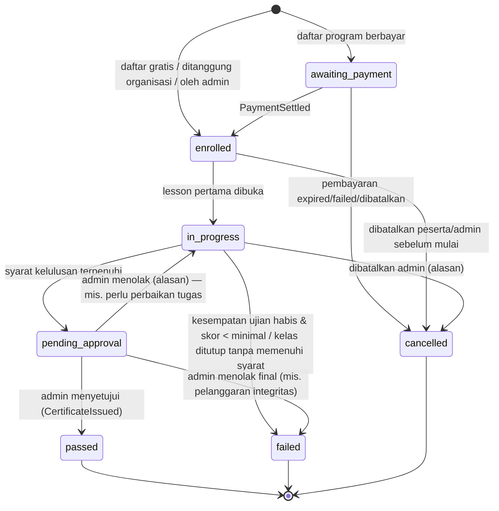
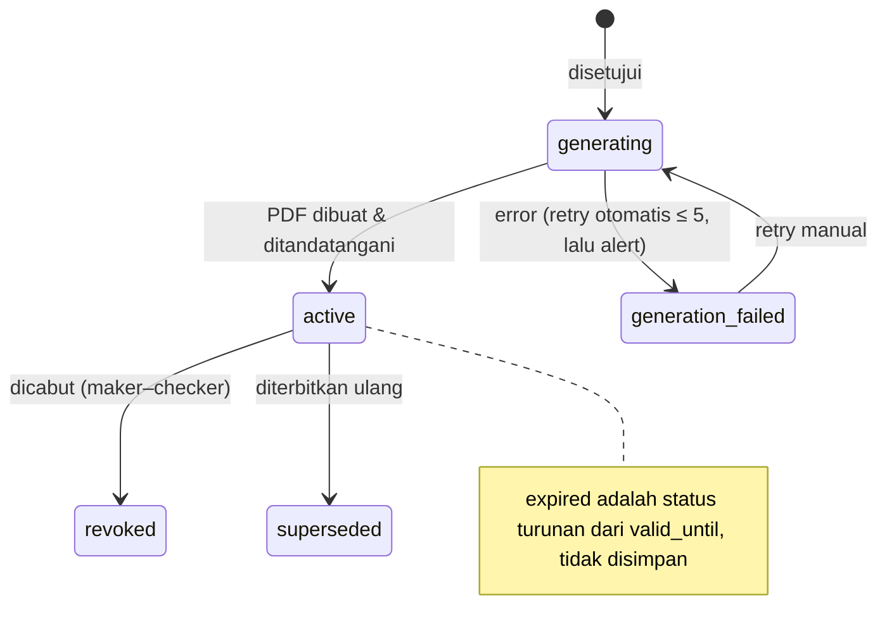
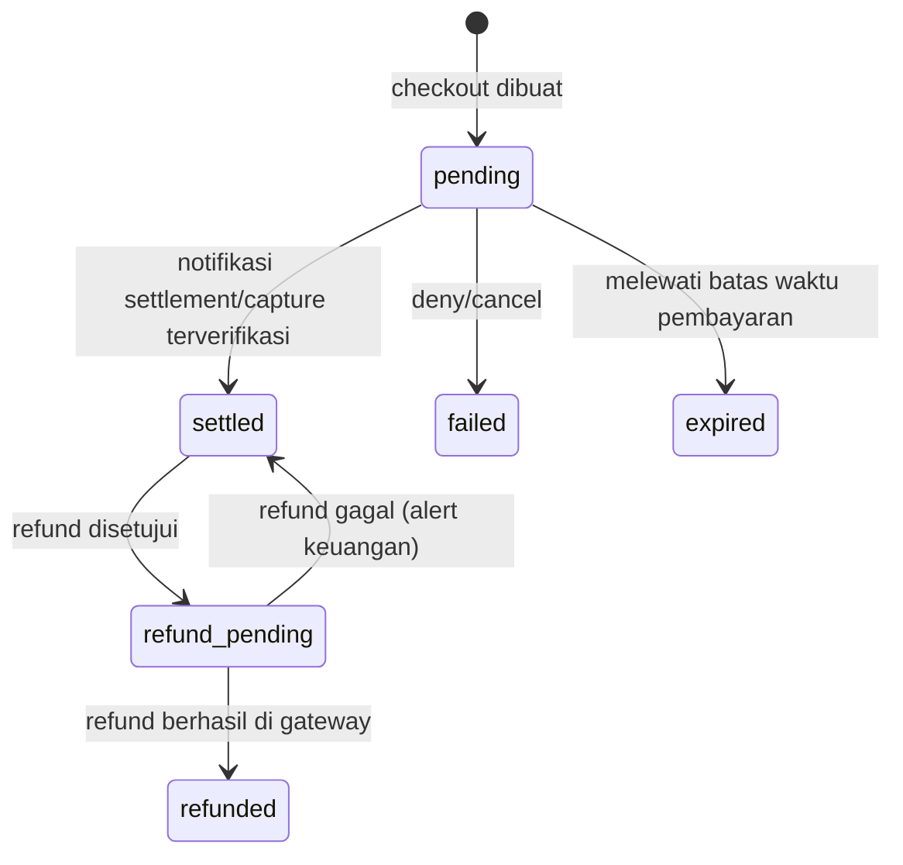

# 02 — Kebutuhan Fungsional

> Status: **Disetujui untuk development** · Versi 1.0 · Pemilik: Product Owner
>
> Prioritas memakai MoSCoW: **M** = Must (rilis 1.0), **S** = Should (rilis 1.0 bila kapasitas
> cukup, paling lambat 1.1), **C** = Could (backlog), **W** = Won't (tidak sekarang).
> Kolom **Fase** merujuk roadmap di [`12-rencana-proyek-dan-roadmap.md`](12-rencana-proyek-dan-roadmap.md).
> Setiap kebutuhan yang menyentuh keamanan memiliki rujukan `SEC-*` di dokumen keamanan.

## 0. Aturan Umum Lintas Modul

| ID | Aturan |
|---|---|
| FR-GEN-001 | Semua halaman selain yang ditandai **Publik** memerlukan login. |
| FR-GEN-002 | Setiap aksi yang mengubah data diotorisasi di server (izin + scope tenant + policy) — lihat [`07-rbac-dan-multi-tenant.md`](07-rbac-dan-multi-tenant.md). |
| FR-GEN-003 | Setiap aksi penting tercatat di jejak audit (daftar event di [`keamanan/11-logging-audit-dan-monitoring.md`](keamanan/11-logging-audit-dan-monitoring.md)). |
| FR-GEN-004 | Waktu disimpan UTC, ditampilkan sesuai zona waktu pengguna (default Asia/Jakarta). |
| FR-GEN-005 | Mata uang IDR tanpa desimal, disimpan sebagai bilangan bulat (rupiah). |
| FR-GEN-006 | Daftar/tabel mendukung paginasi (default 25, maks. 100), pencarian, dan filter; pencarian tidak boleh menampilkan data di luar scope. |
| FR-GEN-007 | Penghapusan data master memakai *soft delete* bila direferensikan data historis (sertifikat, transaksi). |
| FR-GEN-008 | Semua formulir memiliki validasi server; validasi klien hanya kenyamanan. |
| FR-GEN-009 | Pesan ke pengguna dalam Bahasa Indonesia yang jelas, tanpa detail teknis internal. |

---

## 1. AUTH — Autentikasi & Akun

| ID | Kebutuhan | Prio | Fase |
|---|---|---|---|
| FR-AUTH-001 | Peserta dapat mendaftar mandiri dengan nama lengkap, email, nomor HP (opsional), organisasi (opsional), kata sandi, dan persetujuan S&K + Kebijakan Privasi. | M | 1 |
| FR-AUTH-002 | Registrasi diverifikasi dengan OTP 6 digit via email (dan/atau WhatsApp/SMS bila nomor HP diisi). OTP berlaku 10 menit, maks. 5 percobaan, kirim ulang maks. 3 kali/jam. | M | 1 |
| FR-AUTH-003 | Bila peserta memilih organisasi, keanggotaan berstatus *pending* sampai: domain email cocok dengan domain terverifikasi organisasi, **atau** disetujui Admin Organisasi. | M | 1 |
| FR-AUTH-004 | Login dengan email + kata sandi. **Peran tidak dipilih pengguna**; sistem menentukan peran dari akun. Bila akun memiliki >1 peran, pengguna memilih *workspace* setelah login. | M | 1 |
| FR-AUTH-005 | MFA TOTP wajib untuk semua peran selain peserta; opsional untuk peserta. Tersedia 10 kode pemulihan sekali pakai. | M | 1 |
| FR-AUTH-006 | Dukungan WebAuthn/Passkey sebagai faktor kedua (disarankan untuk Super Admin). | S | 3 |
| FR-AUTH-007 | Lupa kata sandi: tautan reset sekali pakai berlaku 60 menit, dikirim ke email terdaftar; respons UI identik untuk email terdaftar/tidak. | M | 1 |
| FR-AUTH-008 | Ganti kata sandi memerlukan kata sandi lama; seluruh sesi lain dicabut setelah berhasil. | M | 1 |
| FR-AUTH-009 | Halaman "Sesi & Perangkat": daftar sesi aktif (perangkat, browser, lokasi kira-kira, waktu), cabut satu/semua sesi. | M | 1 |
| FR-AUTH-010 | Notifikasi email saat login dari perangkat/lokasi baru, perubahan kata sandi, MFA diaktifkan/dinonaktifkan, email diubah. | M | 1 |
| FR-AUTH-011 | Login SSO Google/Microsoft (OIDC) yang dapat diaktifkan per organisasi; akun dicocokkan berdasarkan email terverifikasi IdP + domain organisasi. | S | 3 |
| FR-AUTH-012 | SAML 2.0 untuk institusi yang memiliki IdP sendiri. | C | 4 |
| FR-AUTH-013 | Sesi berakhir setelah idle (default 30 menit admin/trainer, 2 jam peserta) dan absolut (12 jam); nilai dapat diatur Super Admin dalam batas aman. | M | 1 |
| FR-AUTH-014 | Re-autentikasi (kata sandi/MFA) sebelum aksi sensitif bila autentikasi terakhir > 15 menit: ubah email, nonaktifkan MFA, setujui/cabut sertifikat, refund, buat API key, ubah peran, ekspor data massal. | M | 1 |
| FR-AUTH-015 | Pengguna dapat mengubah email dengan verifikasi ke email baru **dan** notifikasi ke email lama (dengan tautan pembatalan 72 jam). | M | 2 |

**Kriteria penerimaan contoh (FR-AUTH-004):**
- *Given* akun peserta aktif, *when* login dengan kredensial benar, *then* diarahkan ke dashboard peserta dan tidak ada parameter peran di URL/form yang memengaruhi hasil.
- *Given* mengirim `role=admin` dalam request login, *then* diabaikan dan tercatat sebagai *security event* `suspicious_parameter`.
- *Given* 5 percobaan gagal dalam 15 menit untuk akun yang sama, *then* percobaan berikutnya ditunda progresif dan pengguna menerima email peringatan.

## 2. USER — Manajemen Pengguna

| ID | Kebutuhan | Prio | Fase |
|---|---|---|---|
| FR-USER-001 | Admin (sesuai izin) dapat membuat, melihat, mengubah, menonaktifkan pengguna. Tidak ada *hard delete* dari UI (hapus melalui alur privasi). | M | 1 |
| FR-USER-002 | Penetapan & pencabutan peran sesuai matriks dokumen 07; penetapan `super_admin` memerlukan persetujuan Super Admin kedua. | M | 1 |
| FR-USER-003 | Pengguna baru yang dibuat admin menerima undangan (tautan set kata sandi, 72 jam). Admin tidak pernah menetapkan/melihat kata sandi pengguna. | M | 1 |
| FR-USER-004 | Impor pengguna massal via CSV/XLSX (maks. 5.000 baris) dengan pratinjau, validasi per baris, laporan kesalahan, dan eksekusi asinkron. | M | 2 |
| FR-USER-005 | Profil peserta: nama, nomor induk (NIM/NIK karyawan/nomor peserta), organisasi, program studi/departemen, semester, email, HP, foto (opsional). Field yang disinkronkan dari sistem organisasi bersifat baca-saja. | M | 1 |
| FR-USER-006 | Reset MFA pengguna oleh Super Admin/`support_admin` hanya setelah verifikasi identitas terdokumentasi (tiket + panggilan/verifikasi dokumen), dan tercatat di audit. | M | 1 |
| FR-USER-007 | Tampilan daftar pengguna menyamarkan sebagian email/HP (mis. `ra***@stu.ac.id`) kecuali saat detail dibuka oleh peran berizin. | S | 2 |

## 3. ORG — Organisasi

| ID | Kebutuhan | Prio | Fase |
|---|---|---|---|
| FR-ORG-001 | CRUD organisasi: nama, singkatan (kode unik 2–8 huruf, dipakai di nomor sertifikat), tipe (institusi/korporat), kota, akreditasi (institusi), industri (korporat), PIC, logo. | M | 1 |
| FR-ORG-002 | Verifikasi kepemilikan domain email organisasi (token DNS TXT atau email ke `admin@domain`) untuk auto-approve keanggotaan. | S | 2 |
| FR-ORG-003 | Unit organisasi (fakultas/prodi atau departemen) hierarkis 2 tingkat. | S | 2 |
| FR-ORG-004 | Admin Organisasi melihat dashboard anggota, progres, kelulusan, sertifikat anggota organisasinya saja. | M | 2 |
| FR-ORG-005 | Admin Organisasi menyetujui/menolak permintaan keanggotaan. | M | 2 |
| FR-ORG-006 | Fitur *Access Review* triwulanan untuk Admin Organisasi. | S | 3 |
| FR-ORG-007 | Kontrak/perjanjian organisasi (tanggal mulai-berakhir, kuota peserta, program yang ditanggung) — enrollment gratis hanya berlaku bila kontrak aktif. | S | 2 |

## 4. CAT — Katalog Program

| ID | Kebutuhan | Prio | Fase |
|---|---|---|---|
| FR-CAT-001 | CRUD program: nama, kategori (`international`/`bnsp`), penyelenggara/LSP, kode skema, level, durasi (jam), bahasa, mode default, deskripsi (rich text tersanitasi), tag, skor minimal kelulusan (0–100), masa berlaku sertifikat (bulan, default 36), harga (IDR, 0 = gratis). | M | 1 |
| FR-CAT-002 | Lifecycle: `draft → in_review → published → archived`; transisi `in_review → published` oleh pengguna berbeda dari pembuat (review). Program `archived` tidak menerima pendaftaran baru, tetapi data historis tetap. | M | 1 |
| FR-CAT-003 | Katalog publik & peserta: filter kategori, level, mode, harga (gratis/berbayar), pencarian teks; hanya program `published`. | M | 1 |
| FR-CAT-004 | Halaman detail program: deskripsi, silabus ringkas, trainer, jadwal batch terbuka, syarat kelulusan, harga. | M | 1 |
| FR-CAT-005 | Harga khusus per organisasi (mis. gratis untuk institusi mitra). | S | 2 |
| FR-CAT-006 | Prasyarat program (mis. harus lulus program X). | C | 4 |

## 5. CLS — Kelas & Jadwal

| ID | Kebutuhan | Prio | Fase |
|---|---|---|---|
| FR-CLS-001 | CRUD kelas/batch per program: nama batch, periode (mulai–selesai), periode pendaftaran, kuota, mode, lokasi (offline), trainer pengampu (1..n), organisasi terbatas (opsional: kelas eksklusif organisasi tertentu). | M | 1 |
| FR-CLS-002 | Kuota ditegakkan secara atomik (tidak boleh terlampaui oleh pendaftaran bersamaan). | M | 1 |
| FR-CLS-003 | Kalender/jadwal peserta menampilkan sesi presensi, live class, tenggat tugas, ujian. Ekspor iCal pribadi dengan token rahasia yang dapat di-*rotate*. | S | 2 |
| FR-CLS-004 | Kelas dapat disalin (clone) beserta struktur konten & asesmen ke batch baru. | S | 2 |
| FR-CLS-005 | Kelas ditutup otomatis pada tanggal selesai + masa tenggang; setelah ditutup konten tetap dapat diakses baca-saja oleh peserta lulus selama N hari (konfigurasi). | S | 2 |

## 6. CNT — Konten Pembelajaran

| ID | Kebutuhan | Prio | Fase |
|---|---|---|---|
| FR-CNT-001 | Struktur konten hierarkis Modul → Bab → Lesson dengan urutan yang dapat diatur (drag & drop). | M | 1 |
| FR-CNT-002 | Tipe lesson: video (unggah → transcoding HLS), PDF (ditampilkan di viewer dalam aplikasi), teks kaya (tersanitasi), tautan eksternal (allowlist domain), kuis. | M | 1 |
| FR-CNT-003 | Unggahan media: video ≤ 2 GB (mp4/mov/webm), PDF ≤ 50 MB; divalidasi jenis sebenarnya (magic bytes), dipindai malware, dikarantina hingga lolos. | M | 1 |
| FR-CNT-004 | Media disajikan hanya kepada peserta yang terdaftar aktif, via URL/cookie bertanda tangan berumur pendek (≤ 10 menit untuk manifest, diperbarui otomatis). | M | 1 |
| FR-CNT-005 | Progres lesson: video dianggap selesai bila ditonton ≥ 90% durasi (dilaporkan klien, divalidasi kewajaran di server — lihat SEC-EXAM), PDF/teks via tombol "Tandai selesai". Progres enrollment = lesson wajib selesai / total lesson wajib. | M | 1 |
| FR-CNT-006 | Penguncian berurutan (opsional per kelas): lesson berikutnya terbuka setelah sebelumnya selesai. | S | 2 |
| FR-CNT-007 | Watermark dinamis pada PDF & video (nama + email tersamar peserta) untuk menghalangi kebocoran materi. | S | 3 |
| FR-CNT-008 | Versi konten: perubahan lesson yang sudah dipublikasikan membuat versi baru; progres peserta tidak hilang. | S | 2 |
| FR-CNT-009 | Unduhan PDF oleh peserta dapat diaktifkan/nonaktifkan per lesson. | S | 2 |

## 7. ASM — Asesmen (Kuis & Ujian Akhir)

| ID | Kebutuhan | Prio | Fase |
|---|---|---|---|
| FR-ASM-001 | Bank soal per program dengan tipe: pilihan ganda (1 jawaban), pilihan ganda (multi jawaban), benar/salah, isian singkat (pencocokan normalisasi), esai (dinilai manual). Setiap soal punya tingkat kesulitan, tag kompetensi, pembahasan. | M | 1 |
| FR-ASM-002 | Kuis per modul/bab (formatif) dan **Ujian Akhir** (sumatif) per kelas; ujian akhir dapat mengambil N soal acak dari bank per tag/kesulitan. | M | 1 |
| FR-ASM-003 | Pengaturan asesmen: durasi (menit), jumlah kesempatan (default ujian akhir 2), jeda antar kesempatan, jendela waktu buka–tutup, acak urutan soal & opsi, tampilkan pembahasan (tidak/sesudah submit/sesudah jendela ditutup), skor minimal (default = skor minimal program). | M | 1 |
| FR-ASM-004 | Ujian akhir terkunci sampai semua lesson wajib & kuis wajib selesai (dan presensi minimal terpenuhi bila dipersyaratkan). | M | 1 |
| FR-ASM-005 | Kunci jawaban **tidak pernah** dikirim ke klien sebelum attempt disubmit & diizinkan; penilaian dilakukan di server. | M | 1 |
| FR-ASM-006 | Batas waktu ditegakkan server (`deadline_at`); jawaban autosave; attempt otomatis disubmit saat waktu habis (job terjadwal). Koneksi putus tidak mereset timer. | M | 1 |
| FR-ASM-007 | Hanya satu attempt aktif per peserta per asesmen; membuka di tab/perangkat lain menampilkan peringatan dan attempt yang sama (bukan attempt baru). | M | 1 |
| FR-ASM-008 | Trainer dapat melihat hasil per peserta, analisis butir soal (tingkat kesukaran, daya beda), dan menilai esai. | S | 2 |
| FR-ASM-009 | Trainer/admin dapat memberi kesempatan tambahan (reset attempt) dengan alasan wajib (tercatat di audit). | M | 1 |
| FR-ASM-010 | Deteksi indikasi kecurangan ringan: pencatatan pindah tab/kehilangan fokus, salin-tempel, IP/perangkat berubah selama attempt — sebagai **indikator** untuk ditinjau manusia, bukan sanksi otomatis. | S | 3 |
| FR-ASM-011 | Impor soal dari template XLSX (divalidasi, tanpa makro). | S | 2 |

## 8. ENR — Enrollment & Kelulusan

| ID | Kebutuhan | Prio | Fase |
|---|---|---|---|
| FR-ENR-001 | Peserta mendaftar mandiri ke kelas yang terbuka. Program gratis/ditanggung organisasi → enrollment `enrolled` langsung; program berbayar → setelah pembayaran `settled`. | M | 1 |
| FR-ENR-002 | Satu peserta hanya boleh punya satu enrollment aktif per program (kecuali mengulang setelah `failed`/`cancelled`). | M | 1 |
| FR-ENR-003 | Admin Akademik dapat mendaftarkan peserta secara manual; Admin Organisasi dapat mendaftarkan anggota organisasinya secara massal (daftar/CSV) ke kelas yang tersedia untuk organisasi itu. | M | 2 |
| FR-ENR-004 | Status enrollment mengikuti mesin status di §21.1; transisi hanya melalui aksi sistem yang sah. | M | 1 |
| FR-ENR-005 | Syarat kelulusan per kelas (dapat dikonfigurasi): semua lesson wajib selesai, skor ujian akhir ≥ skor minimal, presensi ≥ X% (offline/hybrid), semua tugas wajib `approved`. | M | 1 |
| FR-ENR-006 | Ketika syarat terpenuhi → `pending_approval` dan masuk antrean approval sertifikat. | M | 1 |
| FR-ENR-007 | Pembatalan enrollment oleh peserta sebelum kelas mulai (refund mengikuti kebijakan PAY) atau oleh admin dengan alasan. | M | 2 |
| FR-ENR-008 | Riwayat pembelajaran peserta ("Pembelajaran Saya") menampilkan status, progres, skor, tanggal. | M | 1 |

## 9. ASG — Tugas

| ID | Kebutuhan | Prio | Fase |
|---|---|---|---|
| FR-ASG-001 | Trainer membuat tugas: judul, deskripsi, lampiran contoh, tenggat, wajib/tidak, bobot, tipe berkas yang diterima (mis. `zip,pdf,docx`), ukuran maks. (≤ 100 MB). | M | 2 |
| FR-ASG-002 | Peserta mengunggah berkas (1..5 berkas) + catatan; berkas divalidasi & dipindai malware sebelum dapat diunduh trainer. | M | 2 |
| FR-ASG-003 | Pengumpulan setelah tenggat ditandai terlambat; dapat ditolak otomatis bila kebijakan "tolak terlambat" aktif. | M | 2 |
| FR-ASG-004 | Trainer menilai (0–100), memberi umpan balik, meminta revisi, atau menolak; riwayat revisi tersimpan. | M | 2 |
| FR-ASG-005 | Peserta hanya melihat pengumpulan miliknya; trainer hanya pada kelas yang diampu. | M | 2 |
| FR-ASG-006 | Deteksi berkas identik antar peserta (hash SHA-256) sebagai indikator plagiarisme. | C | 4 |

## 10. ATT — Presensi

| ID | Kebutuhan | Prio | Fase |
|---|---|---|---|
| FR-ATT-001 | Trainer membuat sesi presensi (judul, tanggal, jam mulai-selesai, tipe offline/hybrid/live, lokasi). | M | 2 |
| FR-ATT-002 | Check-in QR **dinamis**: QR ditampilkan trainer berganti setiap 30 detik (token bertanda tangan, berlaku 60 detik), hanya valid selama jendela sesi, satu kali per peserta. | M | 2 |
| FR-ATT-003 | Opsional: validasi lokasi (geofence) untuk sesi offline — dengan persetujuan peserta, hanya jarak yang disimpan, bukan koordinat mentah. | C | 4 |
| FR-ATT-004 | Presensi manual oleh trainer (hadir, terlambat, tidak hadir, izin) dengan catatan. Perubahan setelah sesi ditutup tercatat di audit. | M | 2 |
| FR-ATT-005 | Rekap kehadiran per peserta & per sesi; ekspor. | M | 2 |

## 11. LIVE — Live Class

| ID | Kebutuhan | Prio | Fase |
|---|---|---|---|
| FR-LIVE-001 | Trainer menjadwalkan live session: judul, waktu, platform (Zoom/Meet/Teams), tautan rapat (validasi domain allowlist platform), kode sandi rapat (disimpan terenkripsi). | M | 2 |
| FR-LIVE-002 | Tautan & kode sandi hanya ditampilkan kepada peserta terdaftar aktif, mulai 30 menit sebelum sesi. | M | 2 |
| FR-LIVE-003 | Tautan rekaman ditambahkan setelah sesi (hosting di object storage/penyedia) dengan akses terbatas peserta kelas. | S | 2 |
| FR-LIVE-004 | Integrasi API Zoom/Teams untuk membuat rapat & menarik kehadiran otomatis. | C | 4 |
| FR-LIVE-005 | Pengingat otomatis H-1 dan 1 jam sebelum sesi. | S | 2 |

## 12. CERT — Sertifikat

| ID | Kebutuhan | Prio | Fase |
|---|---|---|---|
| FR-CERT-001 | Template sertifikat berversi per kategori/program: tata letak (HTML/CSS terbatas), elemen dinamis (nama, program, nomor, tanggal, QR, penandatangan), status aktif. Satu template aktif per kategori/program. | M | 1 |
| FR-CERT-002 | Antrean approval: daftar enrollment `pending_approval` dengan ringkasan bukti (progres, skor, presensi, tugas). Admin Akademik menyetujui atau menolak (alasan wajib). Berlaku aturan SoD. | M | 1 |
| FR-CERT-003 | Persetujuan massal (bulk approve) maks. 100 per aksi dengan re-autentikasi. | S | 2 |
| FR-CERT-004 | Saat disetujui: sistem membuat nomor sertifikat unik `{KAT}/{KODE_PROGRAM}/{KODE_ORG}/{TAHUN}/{URUT5}` (urut per program per tahun, atomik), `verification_code` acak 12 karakter, tanggal terbit, berlaku hingga (terbit + masa berlaku program). | M | 1 |
| FR-CERT-005 | PDF sertifikat dibuat di server dari template versi aktif saat terbit, ditandatangani digital (PAdES), hash SHA-256 disimpan; QR berisi URL verifikasi dengan `verification_code`. | M | 1 |
| FR-CERT-006 | Peserta mengunduh PDF dari "Sertifikat Saya" (URL bertanda tangan, berlaku 5 menit). | M | 1 |
| FR-CERT-007 | Halaman verifikasi publik: input nomor sertifikat **atau** pindai QR. Menampilkan: status (Valid / Kedaluwarsa / Dicabut / Tidak ditemukan), nama pemegang, program, penyelenggara, tanggal terbit & berlaku. Pencarian via nomor saja menampilkan nama tersamar sebagian; via QR/kode verifikasi menampilkan nama lengkap. | M | 1 |
| FR-CERT-008 | Verifikasi unggah PDF: verifikator dapat mengunggah PDF untuk dicek tanda tangan & kecocokan hash. | S | 3 |
| FR-CERT-009 | Pencabutan sertifikat dengan alasan wajib + persetujuan kedua (maker–checker); status berubah seketika di verifikasi publik; peserta dinotifikasi. | M | 1 |
| FR-CERT-010 | Penerbitan ulang (reissue) untuk koreksi data (mis. salah ejaan nama): sertifikat lama berstatus `superseded` → verifikasi menunjukkan sertifikat pengganti. | S | 2 |
| FR-CERT-011 | Basis data sertifikat untuk admin: pencarian, filter status/program/organisasi/tahun, ekspor. | M | 1 |
| FR-CERT-012 | Status kedaluwarsa diturunkan otomatis (`valid_until < hari ini`); pengingat ke peserta 60 hari sebelum kedaluwarsa. | M | 1 |
| FR-CERT-013 | Tautan berbagi ke LinkedIn ("Add to profile") memakai URL verifikasi. | C | 3 |
| FR-CERT-014 | Log verifikasi (waktu, kanal web/API, hasil, hash IP) untuk statistik & deteksi penyalahgunaan; peserta dapat melihat jumlah verifikasi sertifikatnya. | S | 2 |

## 13. PAY — Pembayaran & E-Commerce

| ID | Kebutuhan | Prio | Fase |
|---|---|---|---|
| FR-PAY-001 | Checkout program berbayar via Midtrans Snap: Virtual Account (BCA, BNI, BRI, Mandiri, Permata), QRIS, e-wallet (GoPay, ShopeePay, OVO via QRIS). Harga & diskon dihitung server. | M | 2 |
| FR-PAY-002 | Kupon: persentase atau nominal, masa berlaku, kuota total, batas per pengguna (default 1), program/organisasi yang berlaku, minimal transaksi. Validasi & pemakaian atomik (reservasi saat checkout, konsumsi saat `settled`, dilepas saat `expired/failed`). | M | 2 |
| FR-PAY-003 | Status transaksi hanya berubah berdasarkan notifikasi gateway yang terverifikasi + konfirmasi status API, atau rekonsiliasi terjadwal. Tidak ada tombol "tandai lunas" manual kecuali oleh Admin Keuangan dengan bukti & maker–checker. | M | 2 |
| FR-PAY-004 | Nomor invoice unik `INV/{TAHUN}/{BULAN}/{URUT5}`; invoice PDF dapat diunduh peserta; data faktur (NPWP opsional) untuk korporat. | M | 2 |
| FR-PAY-005 | Refund: diajukan peserta sesuai kebijakan (mis. sebelum kelas mulai & progres < 10%), disetujui Admin Keuangan (maker–checker > Rp1.000.000), dieksekusi via API refund gateway atau transfer manual tercatat. Enrollment terkait dibatalkan. | M | 2 |
| FR-PAY-006 | Rekonsiliasi harian: laporan transaksi vs settlement gateway; selisih ditandai. | M | 2 |
| FR-PAY-007 | Tagihan korporat (invoice B2B, pembayaran transfer, termin) untuk bulk enrollment. | S | 3 |
| FR-PAY-008 | Riwayat transaksi peserta & unduh invoice. | M | 2 |

## 14. GAM — Gamifikasi

| ID | Kebutuhan | Prio | Fase |
|---|---|---|---|
| FR-GAM-001 | Poin diberikan otomatis oleh sistem untuk event (lesson selesai, kuis lulus, presensi, tugas approved, lulus kelas) melalui buku besar poin *append-only* dengan kunci idempoten per event. | S | 3 |
| FR-GAM-002 | Lencana berdasarkan aturan (mis. skor ≥ 90, presensi 100%, lulus < 45 hari, ≥ 2 sertifikat aktif). | S | 3 |
| FR-GAM-003 | Leaderboard per kelas/organisasi; peserta dapat memilih tampil anonim (opt-out) — default: nama depan + inisial. | S | 3 |
| FR-GAM-004 | Gamifikasi dapat dinonaktifkan per organisasi. | S | 3 |

## 15. DSC — Diskusi

| ID | Kebutuhan | Prio | Fase |
|---|---|---|---|
| FR-DSC-001 | Forum per kelas: buat thread, balas, suka (1 per pengguna per komentar), sunting milik sendiri ≤ 15 menit, hapus milik sendiri. | S | 2 |
| FR-DSC-002 | Format teks terbatas (Markdown subset tersanitasi; tanpa HTML mentah; tautan `rel="nofollow ugc noopener"`); lampiran gambar ≤ 5 MB (di-*re-encode*). | S | 2 |
| FR-DSC-003 | Laporkan konten; trainer kelas & admin memoderasi (sembunyikan, hapus, kunci thread, peringatkan pengguna). | S | 2 |
| FR-DSC-004 | Rate limit posting (mis. 10 posting/10 menit) & filter kata terlarang yang dapat dikonfigurasi. | S | 2 |
| FR-DSC-005 | Hanya anggota kelas (peserta aktif, trainer) yang dapat membaca/menulis. | S | 2 |

## 16. NTF — Notifikasi

| ID | Kebutuhan | Prio | Fase |
|---|---|---|---|
| FR-NTF-001 | Pusat notifikasi in-app per pengguna (belum dibaca/semua, tandai dibaca, tandai semua). | M | 1 |
| FR-NTF-002 | Kategori: registrasi, enrollment, jadwal/materi baru, pengingat tugas, pengingat ujian, live class, hasil penilaian, sertifikat terbit/dicabut, pembayaran, keamanan akun, pencapaian. | M | 1 |
| FR-NTF-003 | Kanal email (semua kategori) dan WhatsApp (kategori terpilih, dengan opt-in eksplisit). Notifikasi keamanan akun tidak dapat dimatikan. | M | 2 |
| FR-NTF-004 | Preferensi per pengguna per kategori per kanal; pengaturan default per organisasi oleh Super Admin. | S | 2 |
| FR-NTF-005 | Email tidak memuat data sensitif (skor detail, token) melebihi yang diperlukan; tautan menuju aplikasi (login wajib). | M | 1 |

## 17. RPT — Laporan & Dashboard

| ID | Kebutuhan | Prio | Fase |
|---|---|---|---|
| FR-RPT-001 | Dashboard peserta: pelatihan berjalan, progres, jadwal terdekat, sertifikat, notifikasi. | M | 1 |
| FR-RPT-002 | Dashboard trainer: kelas diampu, peserta, tugas menunggu penilaian, sesi terdekat. | M | 1 |
| FR-RPT-003 | Dashboard admin platform: total peserta/organisasi/kelas, pendaftaran per bulan, tingkat kelulusan, sertifikat terbit, pendapatan (untuk izin keuangan), antrean approval. | M | 1 |
| FR-RPT-004 | Laporan pengguna per organisasi; laporan program per organisasi; laporan operasional (completion, presensi, tugas, sertifikat & verifikasi). | M | 2 |
| FR-RPT-005 | Laporan trainer per kelas: progres, nilai, butir soal. | S | 2 |
| FR-RPT-006 | Ekspor CSV/XLSX asinkron dengan tautan unduh bertanda tangan (15 menit), dilindungi dari *formula injection*, tercatat di audit. | M | 2 |
| FR-RPT-007 | Laporan keuangan: transaksi, pendapatan per program/metode, refund, rekonsiliasi. | M | 2 |

## 18. API — API & Integrasi

| ID | Kebutuhan | Prio | Fase |
|---|---|---|---|
| FR-API-001 | API publik verifikasi sertifikat `GET /api/v1/certificates/verify/{code}` (tanpa kunci: rate limit ketat; dengan API key: kuota lebih tinggi). | M | 1 |
| FR-API-002 | API mitra (HRIS korporat) dengan API key ber-scope per organisasi: baca daftar anggota, enrollment, progres, sertifikat; buat enrollment. Detail di [`06-spesifikasi-api.md`](06-spesifikasi-api.md). | S | 3 |
| FR-API-003 | Manajemen API key oleh Super Admin (maker–checker): label, organisasi, scope, IP allowlist, kedaluwarsa (maks. 1 tahun). Kunci penuh ditampilkan **sekali** saat dibuat; disimpan sebagai hash. | M | 3 |
| FR-API-004 | Webhook keluar ke mitra (mis. `enrollment.completed`, `certificate.issued`) dengan tanda tangan HMAC-SHA256 + timestamp, retry eksponensial, log pengiriman. | C | 4 |
| FR-API-005 | Dokumentasi API (OpenAPI 3.1) dipublikasikan di halaman pengembang. | M | 3 |

## 19. CMS — Konten Beranda

| ID | Kebutuhan | Prio | Fase |
|---|---|---|---|
| FR-CMS-001 | Admin mengubah hero (badge, judul, subjudul, gambar slider), FAQ, testimoni, logo mitra. Input berupa teks + **penekanan terbatas** (mis. `**tebal**`, sorotan warna aksen) — **bukan HTML mentah**. | M | 2 |
| FR-CMS-002 | Draft → pratinjau → terbitkan; riwayat versi & rollback. | S | 2 |
| FR-CMS-003 | Halaman Kebijakan Privasi dan Syarat & Ketentuan berversi; perubahan material memicu permintaan persetujuan ulang (lihat PRV). | M | 1 |
| FR-CMS-004 | Testimoni yang memuat nama/foto orang memerlukan catatan persetujuan pemilik data. | M | 2 |

## 20. PRV — Privasi Data

| ID | Kebutuhan | Prio | Fase |
|---|---|---|---|
| FR-PRV-001 | Pencatatan persetujuan (consent) berversi: S&K, Kebijakan Privasi, notifikasi WhatsApp, pemasaran, leaderboard publik. Pengguna dapat menarik persetujuan opsional kapan saja. | M | 1 |
| FR-PRV-002 | Permintaan subjek data dari menu Profil: akses/ekspor data (JSON + PDF ringkas), koreksi, penghapusan/anonimisasi akun, pembatasan pemrosesan. | M | 2 |
| FR-PRV-003 | Admin memproses permintaan dengan SLA (target ≤ 3×24 jam untuk konfirmasi penerimaan, penyelesaian sesuai ketentuan UU PDP); verifikasi identitas sebelum ekspor/hapus. | M | 2 |
| FR-PRV-004 | Penghapusan akun menganonimkan data pribadi, tetapi mempertahankan catatan minimal sertifikat yang diperlukan untuk verifikasi & kewajiban hukum (dengan dasar hukum terdokumentasi); sertifikat aktif dapat dicabut atas permintaan. | M | 2 |
| FR-PRV-005 | Kebijakan retensi otomatis per kategori data (lihat [`keamanan/12-privasi-data-dan-kepatuhan-uu-pdp.md`](keamanan/12-privasi-data-dan-kepatuhan-uu-pdp.md)). | M | 2 |
| FR-PRV-006 | Ekspor data pribadi oleh pengguna tersedia sebagai tautan unduh berumur 24 jam, dilindungi re-autentikasi. | M | 2 |

## 21. AUD — Jejak Audit & SET — Pengaturan

| ID | Kebutuhan | Prio | Fase |
|---|---|---|---|
| FR-AUD-001 | Jejak audit append-only untuk event di daftar audit (login, perubahan peran, approval/cabut sertifikat, perubahan nilai, transaksi, pengaturan, ekspor, akses data pribadi massal, dsb.) memuat: waktu, aktor, peran, organisasi, aksi, objek, nilai sebelum/sesudah (tanpa rahasia), IP, user agent, request ID. | M | 1 |
| FR-AUD-002 | Tampilan audit dengan filter (aktor, aksi, objek, rentang waktu) sesuai scope peran; ekspor dengan audit. | M | 1 |
| FR-AUD-003 | Integritas audit: rantai hash per baris + verifikasi harian + salinan ke penyimpanan log eksternal. | M | 2 |
| FR-SET-001 | Pengaturan branding (nama, logo, warna), zona waktu default, kontak dukungan. | M | 1 |
| FR-SET-002 | Pengaturan keamanan (Super Admin): kebijakan kata sandi (dalam batas minimum yang tidak dapat diturunkan), MFA wajib per peran, durasi sesi, IP allowlist admin (opsional), CAPTCHA adaptif. | M | 1 |
| FR-SET-003 | Pengaturan notifikasi global & template email (variabel ter-escape). | S | 2 |
| FR-SET-004 | Pengaturan integrasi (payment, email, WA, SSO, video conference): kredensial disimpan terenkripsi, tidak pernah ditampilkan ulang (hanya 4 karakter terakhir). | M | 2 |
| FR-SET-005 | Semua perubahan pengaturan tercatat di audit dengan nilai sebelum/sesudah (kredensial disamarkan). | M | 1 |

---

## 22. Aturan Bisnis & Mesin Status

### 22.1 Enrollment

Aturan:
- Transisi hanya lewat *domain service* `EnrollmentStateMachine`; pembaruan kolom `status` langsung dilarang (diuji dengan arch test).
- `passed` bersifat final; koreksi dilakukan lewat pencabutan/penerbitan ulang sertifikat.
- Setiap transisi mencatat `enrollment_status_histories` (dari, ke, aktor, alasan, waktu).

### 22.2 Sertifikat

### 22.3 Transaksi Pembayaran

### 22.4 Pengumpulan Tugas

`submitted → (approved | revision_requested | rejected)`; `revision_requested → submitted`
(maks. revisi dapat dikonfigurasi, default 2).

### 22.5 Format Nomor

| Objek | Format | Contoh | Catatan |
|---|---|---|---|
| Nomor sertifikat | `{INTL\|BNSP}/{KODE_PROGRAM}/{KODE_ORG}/{YYYY}/{NNNNN}` | `INTL/AWS-CCP/USTU/2026/00001` | Urut per program per tahun, sequence DB atomik; `KODE_ORG` = singkatan organisasi peserta, `STU` bila peserta mandiri. |
| Kode verifikasi | 12 karakter Crockford Base32 (60 bit acak CSPRNG) | `7KQ2-M9XD-4TRA` (ditampilkan dengan tanda hubung) | Unik; tidak berurutan; di-QR. |
| Nomor invoice | `INV/{YYYY}/{MM}/{NNNNN}` | `INV/2026/09/00018` | Urut per bulan. |
| Order ID gateway | `STU-{ULID}` | `STU-01J8...` | Tidak dapat ditebak; idempoten. |

### 22.6 Perhitungan Progres & Skor

- Progres enrollment (%) = `floor(100 × lesson_wajib_selesai / total_lesson_wajib)`; kuis dihitung sebagai lesson.
- Skor asesmen = `round(100 × Σ poin benar / Σ poin maksimal, 2)`; untuk multi-jawaban, poin parsial opsional (default: semua-atau-tidak).
- Skor akhir kelas = skor attempt **tertinggi** ujian akhir (dapat dikonfigurasi: tertinggi / terakhir).
- Tugas & presensi bersifat syarat (lulus/tidak), kecuali kelas mengaktifkan bobot nilai akhir (C).

## 23. Pemetaan Purwarupa → Kebutuhan

Pemetaan halaman purwarupa ke rute produksi, peran, dan izin ada di
[`08-spesifikasi-ui-dan-pemetaan-halaman.md`](08-spesifikasi-ui-dan-pemetaan-halaman.md).
