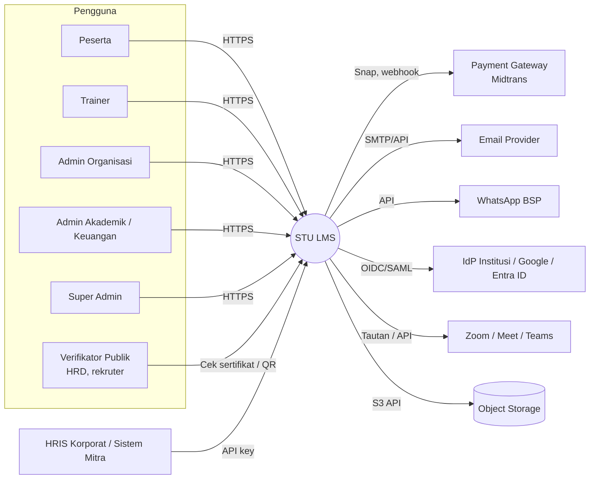
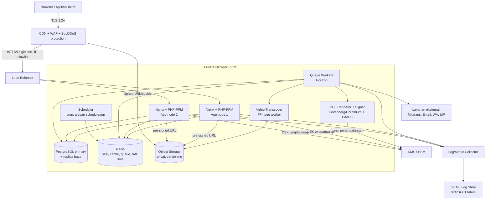
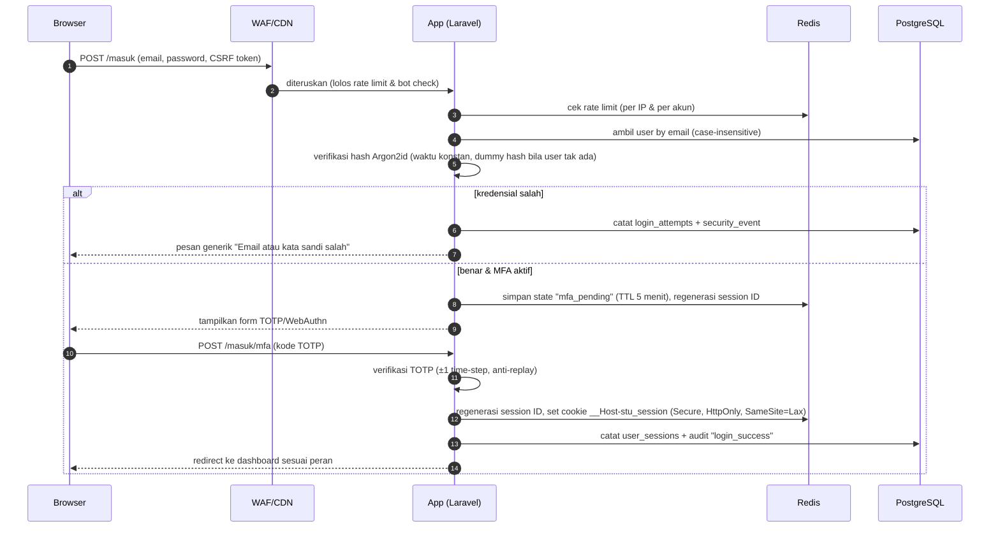
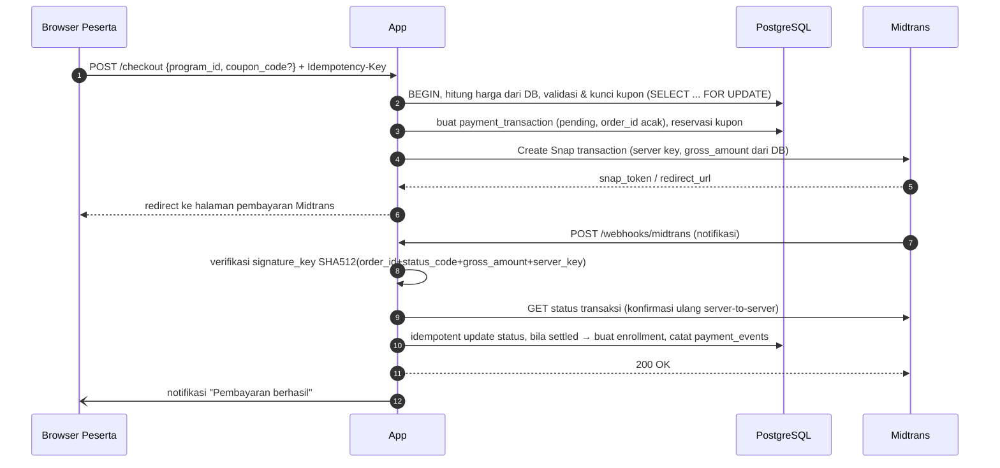
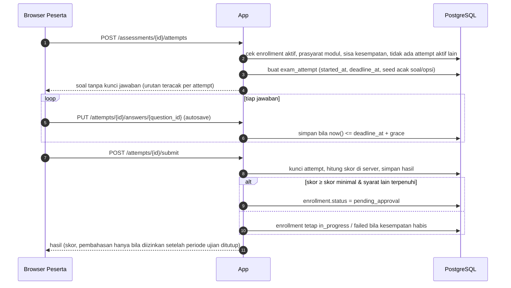
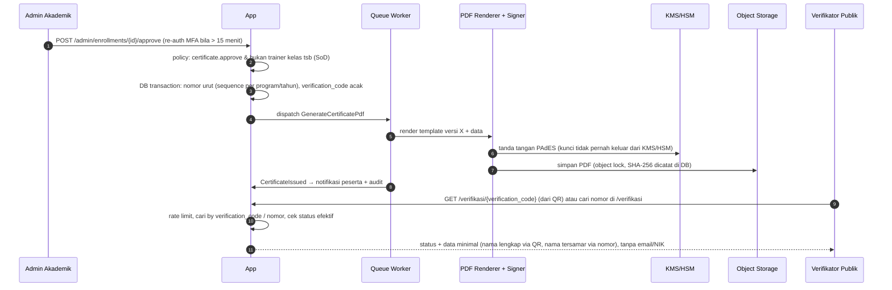

# 04 — Arsitektur Sistem

> Status: **Disetujui untuk development** · Versi 1.0 · Pemilik: Tech Lead
>
> Dokumen ini adalah sumber kebenaran untuk keputusan teknologi dan struktur sistem. Perubahan
> keputusan besar wajib melalui ADR baru (lihat §10).

## 1. Ringkasan

STU LMS dibangun sebagai **modular monolith** berbasis **Laravel (PHP)** dengan rendering sisi
server (Blade + Livewire + Alpine.js + Tailwind CSS), basis data **PostgreSQL**, **Redis** untuk
cache/antrian/sesi, dan **object storage kompatibel S3** untuk berkas (video, PDF, tugas,
sertifikat). Pekerjaan berat (transcoding video, pembuatan & penandatanganan PDF sertifikat,
email/WhatsApp, laporan) dijalankan **asinkron** oleh *queue worker*. Semua lalu lintas publik
melewati **CDN + WAF** lalu **reverse proxy Nginx**.

Purwarupa statis di repositori ini (`*.html`, `assets/js/*`) adalah **acuan UI/UX dan alur**,
bukan kode produksi. Markup & kelas Tailwind boleh dipakai ulang di template Blade, tetapi
**seluruh logika bisnis, penyimpanan, dan validasi dipindahkan ke server** (lihat
[`keamanan/16-temuan-keamanan-purwarupa.md`](keamanan/16-temuan-keamanan-purwarupa.md)).

## 2. Prinsip Arsitektur

1. **Server adalah satu-satunya sumber kebenaran.** Klien tidak pernah menentukan peran, skor,
   status kelulusan, harga, atau status pembayaran.
2. **Secure by default & deny by default.** Setiap rute butuh autentikasi & otorisasi kecuali
   dideklarasikan publik secara eksplisit.
3. **Isolasi tenant berlapis.** *Scope* di aplikasi **dan** Row-Level Security (RLS) di PostgreSQL.
4. **Modular.** Setiap modul domain punya batas jelas (model, service, policy, event). Modul lain
   berkomunikasi melalui *service interface* atau *domain event*, bukan query langsung ke tabel
   modul lain.
5. **Asinkron untuk pekerjaan berat & integrasi eksternal.** Permintaan HTTP pengguna tidak
   menunggu layanan pihak ketiga (kecuali redirect pembayaran).
6. **Idempoten & dapat diaudit.** Operasi finansial, penerbitan sertifikat, dan webhook bersifat
   idempoten dan tercatat di jejak audit.
7. **Sederhana dulu, skala kemudian.** Mulai dari monolith yang dapat diskalakan horizontal;
   pecah menjadi layanan terpisah hanya bila ada kebutuhan terukur (lihat ADR-001).
8. **Twelve-Factor.** Konfigurasi lewat environment/secret manager, proses stateless, log ke stdout.

## 3. Tumpukan Teknologi (Tech Stack)

| Lapisan | Pilihan | Versi minimum | Alasan |
|---|---|---|---|
| Bahasa & framework | PHP + **Laravel** | PHP 8.4, **Laravel 13.x** (terpasang di Fase 0) | Ekosistem matang di Indonesia, fitur keamanan bawaan (CSRF, hashing Argon2id, enkripsi, rate limiter, policy/gate, signed URL), produktif untuk tim kecil–menengah. |
| UI server-side | Blade + **Livewire 4** (mode `csp_safe`) + **Alpine.js** | Livewire 4.x | Mempertahankan markup purwarupa; tidak ada token di `localStorage`; permukaan serangan lebih kecil daripada SPA. |
| CSS | **Tailwind CSS** di-*build* via Vite | Tailwind 4.x, Vite 8 | Purwarupa memakai Tailwind CDN — di produksi **wajib build** (CSP ketat, tanpa script pihak ketiga). |
| Basis data | **PostgreSQL** | 16 | RLS untuk isolasi tenant, `jsonb`, full-text search, `pgcrypto`, partisi tabel audit. |
| Cache, sesi, antrian, rate limit | **Redis** (atau Valkey) | 7.x | Performa, dukungan Laravel Horizon. |
| Queue monitoring | **Laravel Horizon** | — | Visibilitas antrian & retry. Dashboard hanya untuk Super Admin + IP allowlist. |
| Object storage | S3-compatible (AWS S3 Jakarta `ap-southeast-3`, GCS Jakarta, atau penyedia lokal) | — | Berkas besar, *pre-signed URL* berumur pendek, versioning & object lock. |
| CDN + WAF | Cloudflare (atau setara: AWS CloudFront + AWS WAF) | — | TLS edge, DDoS protection, managed WAF ruleset OWASP, bot management. |
| Reverse proxy / web server | **Nginx** + PHP-FPM (atau Laravel Octane/FrankenPHP bila dibutuhkan) | Nginx 1.26+ | Stabil, konfigurasi header keamanan. |
| Video | Transcoding **FFmpeg** → **HLS (AES-128)**; penyajian via CDN dengan *signed cookie/URL* | — | Streaming adaptif, menyulitkan pengunduhan langsung. |
| PDF sertifikat | Render HTML→PDF di server (Chromium headless via Browsershot/Gotenberg) + **tanda tangan digital PAdES** | — | Sertifikat tidak dapat dipalsukan/diubah tanpa terdeteksi. |
| Email | SMTP transaksional (Amazon SES / SendGrid / Mailgun) dengan SPF, DKIM, DMARC | — | Deliverability & anti-spoofing. |
| WhatsApp | Penyedia resmi WhatsApp Business Platform (BSP) | — | Notifikasi opsional. |
| Pembayaran | **Midtrans** (Snap / Core API) — kandidat alternatif Xendit | — | VA, QRIS, e-wallet; data kartu tidak pernah menyentuh server kita (PCI DSS SAQ-A). |
| Video conference | Zoom / Google Meet / MS Teams (tautan per sesi; integrasi API tahap lanjut) | — | Sesuai kebutuhan live class. |
| SSO | OIDC/OAuth2 (Google Workspace, Microsoft Entra ID) & SAML 2.0 untuk institusi (tahap 3) | — | Login institusi/korporat. |
| MFA | TOTP (RFC 6238) + WebAuthn/Passkey | — | Wajib untuk peran admin & trainer. |
| Pencarian | PostgreSQL full-text (`tsvector`) | — | Cukup untuk katalog; Meilisearch/OpenSearch hanya bila perlu. |
| Observabilitas | Log JSON → Loki/ELK/OpenSearch; metrik Prometheus + Grafana; error tracking Sentry (self-host/region sesuai), uptime monitor | — | Deteksi dini & forensik. |
| Kontainer & deploy | Docker (image non-root, distroless/alpine) di VM cloud / Kubernetes terkelola | — | Reproducible, rollback cepat. |
| CI/CD | GitHub Actions | — | Repositori di GitHub; pipeline keamanan (SAST, SCA, secret scan, DAST). |
| Secret management | Cloud Secret Manager / HashiCorp Vault / Doppler | — | Tidak ada secret di repositori atau image. |

> Catatan hosting: **shared hosting (cPanel) tidak direkomendasikan untuk produksi** karena
> tidak mendukung worker antrian persisten, isolasi proses, kontrol WAF/header, dan
> penyimpanan secret yang memadai. Gunakan VPS/cloud VM atau layanan kontainer terkelola
> (lihat ADR-004). Region **Indonesia (Jakarta)** diutamakan untuk latensi dan kemudahan
> kepatuhan UU PDP.

## 4. Diagram Konteks (C4 Level 1)



## 5. Diagram Kontainer (C4 Level 2)



Ketentuan jaringan:

- Hanya **CDN/WAF** yang dapat menjangkau load balancer (allowlist IP CDN + *authenticated
  origin pulls*).
- PostgreSQL, Redis, worker, renderer PDF, dan transcoder **tidak memiliki IP publik**.
- Egress dari app/worker dibatasi ke daftar domain yang diperlukan (payment gateway, email, WA,
  IdP, KMS, object storage) untuk memitigasi SSRF & eksfiltrasi data.
- Akses administratif server hanya melalui **bastion/SSM/Tailscale** dengan MFA; tidak ada SSH
  terbuka ke internet.

## 6. Modul Domain (Modular Monolith)

| Modul | Tanggung jawab | Entitas utama | Event yang diterbitkan |
|---|---|---|---|
| `Identity` | Registrasi, login, MFA, SSO, sesi, reset kata sandi, verifikasi email/HP | `users`, `user_mfa_methods`, `user_sessions`, `login_attempts` | `UserRegistered`, `UserLoggedIn`, `MfaEnabled`, `PasswordChanged` |
| `Access` | Peran, izin, penugasan peran per organisasi, policy | `roles`, `permissions`, `role_user` | `RoleAssigned`, `RoleRevoked` |
| `Organization` | Organisasi (institusi/korporat), unit/departemen, PIC | `organizations`, `organization_units`, `organization_members` | `OrganizationCreated` |
| `Catalog` | Program pelatihan, kategori, harga, status lifecycle | `programs`, `program_tags` | `ProgramPublished`, `ProgramArchived` |
| `Learning` | Kelas/batch, struktur konten (modul→bab→lesson), progres | `course_classes`, `modules`, `chapters`, `lessons`, `lesson_progress`, `media_assets` | `LessonCompleted` |
| `Assessment` | Bank soal, kuis, ujian akhir, attempt, penilaian otomatis | `question_banks`, `questions`, `question_options`, `assessments`, `exam_attempts`, `attempt_answers` | `AttemptSubmitted`, `AssessmentPassed`, `AssessmentFailed` |
| `Enrollment` | Pendaftaran peserta ke kelas, bulk enroll korporat, status kelulusan | `enrollments`, `bulk_enrollment_jobs` | `EnrollmentCreated`, `EnrollmentCompleted`, `EnrollmentPendingApproval` |
| `Assignment` | Tugas & pengumpulan, penilaian, revisi | `assignments`, `submissions`, `submission_files`, `submission_reviews` | `SubmissionReceived`, `SubmissionReviewed` |
| `Attendance` | Sesi presensi, check-in QR dinamis, presensi manual | `attendance_sessions`, `attendance_records` | `AttendanceRecorded` |
| `LiveClass` | Jadwal live session, tautan, rekaman | `live_sessions` | `LiveSessionScheduled` |
| `Certification` | Template, penerbitan, penandatanganan, pencabutan, verifikasi publik | `certificate_templates`, `certificates`, `certificate_revocations`, `certificate_verification_logs` | `CertificateIssued`, `CertificateRevoked` |
| `Payment` | Checkout, transaksi, webhook, kupon, refund, invoice | `payment_transactions`, `payment_events`, `coupons`, `coupon_redemptions`, `refunds`, `invoices` | `PaymentSettled`, `PaymentFailed`, `RefundProcessed` |
| `Engagement` | Gamifikasi (poin, lencana, leaderboard), diskusi | `point_ledger`, `badges`, `user_badges`, `discussion_threads`, `discussion_comments`, `content_reports` | `BadgeAwarded`, `ContentReported` |
| `Notification` | Notifikasi in-app, email, WhatsApp, preferensi | `notifications`, `notification_preferences`, `notification_deliveries` | — (konsumen event) |
| `Reporting` | Dashboard, laporan per organisasi/program, ekspor | *materialized views*, `report_exports` | `ReportExported` |
| `Integration` | API key mitra, webhook keluar, integrasi pihak ketiga | `api_clients`, `api_keys`, `webhook_endpoints`, `webhook_deliveries`, `integration_settings` | — |
| `Cms` | Konten beranda (hero, FAQ, testimoni), halaman statis | `cms_blocks`, `cms_block_versions` | `CmsPublished` |
| `Privacy` | Permintaan subjek data, persetujuan (consent), retensi | `privacy_requests`, `consents`, `consent_versions`, `data_retention_runs` | `PrivacyRequestCompleted` |
| `Audit` | Jejak audit tamper-evident, log keamanan | `audit_logs` (append-only, berantai hash), `security_events` | — |

### Aturan dependensi antar modul

- Modul **tidak boleh** meng-*query* tabel milik modul lain secara langsung; gunakan *service
  contract* (`app/Modules/{Modul}/Contracts`).
- `Audit`, `Notification`, `Reporting` hanya **mendengarkan event**; mereka tidak memanggil balik.
- Aturan ini diuji otomatis dengan *architecture test* (Pest Arch) di CI.

## 7. Struktur Direktori Kode (target)

```
app/
  Modules/
    Identity/        {Models, Http/Controllers, Livewire, Policies, Services, Events, Listeners, Jobs, Contracts}
    Access/
    Organization/
    Catalog/
    Learning/
    Assessment/
    Enrollment/
    Assignment/
    Attendance/
    LiveClass/
    Certification/
    Payment/
    Engagement/
    Notification/
    Reporting/
    Integration/
    Cms/
    Privacy/
    Audit/
  Support/           {Security (CSP nonce, sanitizer, IdGenerator), Tenancy, Money, Pdf}
config/
database/
  migrations/  seeders/  factories/
resources/
  views/ {layouts, components, public, participant, trainer, organization, admin}
  css/ js/
routes/
  web.php  api.php  webhooks.php  console.php
tests/
  Unit/  Feature/  Arch/  Security/  Browser/
docker/
  nginx/ php/ worker/
.github/workflows/
docs/
```

## 8. Alur Utama (Sequence)

### 8.1 Login dengan MFA



### 8.2 Checkout Program Berbayar



### 8.3 Ujian Akhir



### 8.4 Penerbitan & Verifikasi Sertifikat



## 9. Pekerjaan Asinkron & Terjadwal

| Job / jadwal | Antrian | Frekuensi / pemicu | Catatan keamanan |
|---|---|---|---|
| Kirim email/WA notifikasi | `notifications` | Event | Rate limit per penerima; template di-escape. |
| Transcode video → HLS | `media` (worker terpisah, CPU tinggi) | Unggah materi | Jalankan FFmpeg di kontainer terisolasi tanpa akses jaringan kecuali storage; batas ukuran & durasi. |
| Scan malware berkas unggahan | `security` | Unggah berkas | ClamAV/penyedia; berkas dikarantina sampai lolos. |
| Generate & tanda tangan PDF sertifikat | `certificates` | Approval | Idempoten per `certificate_id`. |
| Rekonsiliasi pembayaran | `payments` | Setiap 15 menit | Tarik status transaksi `pending` > 15 menit dari gateway. |
| Kedaluwarsakan transaksi | `payments` | Setiap 5 menit | Lepas reservasi kupon. |
| Pengingat tenggat tugas/ujian/live class | `notifications` | Harian 07.00 WIB & H-1 jam | — |
| Bulk enrollment korporat (CSV) | `imports` | Unggah admin | Validasi baris, batas 5.000 baris/berkas, anti CSV injection. |
| Ekspor laporan (CSV/XLSX) | `reports` | Permintaan admin | Tautan unduh bertanda tangan, kedaluwarsa 15 menit, audit. |
| Eksekusi permintaan privasi (ekspor/hapus) | `privacy` | Persetujuan admin | Lihat `keamanan/12`. |
| Retensi & pembersihan data | `maintenance` | Harian 02.00 WIB | Hapus sesi kedaluwarsa, token, berkas sementara; anonimisasi sesuai kebijakan. |
| Verifikasi rantai hash audit log | `security` | Harian | Alarm bila rantai putus. |
| Backup DB & uji restore | infra | Harian / bulanan | Lihat `11-devops-dan-deployment.md`. |

## 10. Architecture Decision Records (ADR)

Format setiap ADR: Konteks → Keputusan → Alternatif → Konsekuensi. ADR baru disimpan sebagai
bagian baru di bawah ini (atau berkas `docs/adr/NNNN-judul.md` bila jumlahnya sudah banyak).

### ADR-001 — Modular monolith, bukan microservices
- **Konteks:** Tim kecil–menengah, domain saling terkait erat (enrollment ↔ assessment ↔ sertifikat), belum ada kebutuhan skala ekstrem.
- **Keputusan:** Satu aplikasi Laravel dengan modul domain terpisah dan aturan dependensi yang diuji otomatis.
- **Alternatif:** Microservices (kompleksitas operasional & keamanan antar-layanan tinggi); monolith tanpa batas modul (sulit dipecah nanti).
- **Konsekuensi:** Deploy sederhana, transaksi DB lokal. Worker berat (video, PDF) dipisah sebagai proses/kontainer tersendiri sejak awal.

### ADR-002 — Laravel + Livewire (SSR), bukan SPA + API token
- **Konteks:** Purwarupa berbasis HTML + Tailwind; keamanan sesi adalah prioritas.
- **Keputusan:** Rendering sisi server dengan sesi cookie `HttpOnly`, CSRF bawaan, Livewire untuk interaktivitas.
- **Alternatif:** Next.js/React + REST API dengan JWT (risiko token di `localStorage`, permukaan API lebih luas).
- **Konsekuensi:** API publik tetap disediakan (`/api/v1`) khusus untuk verifikasi sertifikat, mitra, dan aplikasi mobile di masa depan.

### ADR-003 — PostgreSQL dengan Row-Level Security untuk multi-tenant
- **Konteks:** Data banyak organisasi dalam satu basis data; kebocoran lintas tenant = insiden serius.
- **Keputusan:** Skema bersama + kolom `organization_id` + *global scope* Eloquent + **RLS** PostgreSQL sebagai pertahanan kedua.
- **Alternatif:** Database per tenant (biaya & operasional tinggi), hanya scope aplikasi (satu bug = bocor).
- **Konsekuensi:** Setiap transaksi menyetel `SET LOCAL app.user_id`, `app.org_ids`, `app.trainer_class_ids`, dan `app.is_platform_staff` (lihat `05-desain-database.md` §5); bila tidak disetel, kebijakan menolak. Peran DB aplikasi **bukan** superuser/owner tabel dan tanpa `BYPASSRLS` (RLS tidak dapat di-bypass).

### ADR-004 — Hosting VM/kontainer di region Indonesia, bukan shared hosting
- **Keputusan:** Produksi pada cloud VM/kontainer terkelola di region Jakarta dengan DB terkelola, private network, dan CDN/WAF.
- **Konsekuensi:** Biaya lebih tinggi daripada shared hosting, tetapi memenuhi kebutuhan worker, isolasi, backup PITR, dan kontrol keamanan.

### ADR-005 — Sertifikat PDF dibuat & ditandatangani di server (PAdES) + kode verifikasi acak
- **Konteks:** Purwarupa membuat PDF di browser (jsPDF) — mudah dipalsukan; nomor sertifikat berurutan mudah ditebak.
- **Keputusan:** PDF dibuat server, ditandatangani digital dengan kunci di KMS/HSM, hash disimpan; QR berisi URL verifikasi dengan `verification_code` acak 60-bit.
- **Konsekuensi:** Perlu sertifikat penandatangan (idealnya dari PSrE tersertifikasi Kominfo/Komdigi, mis. untuk tanda tangan elektronik tersertifikasi), antrian khusus, dan prosedur rotasi kunci.

### ADR-006 — Identifier UUIDv7 untuk semua entitas
- **Keputusan:** Primary key UUIDv7 (terurut waktu, tidak berurutan sederhana) untuk mencegah enumerasi dan memudahkan merge data.
- **Konsekuensi:** Ukuran indeks lebih besar daripada bigint; diterima. Nomor bisnis yang terbaca manusia (nomor invoice, nomor sertifikat) tetap dibuat terpisah.

### ADR-007 — Pembayaran melalui payment gateway ber-hosted page
- **Keputusan:** Midtrans Snap (hosted/redirect). Server tidak pernah menerima/menyimpan data kartu.
- **Konsekuensi:** Lingkup PCI DSS minimal (SAQ-A); webhook wajib diverifikasi tanda tangan + konfirmasi status server-to-server.


### ADR-008 — Konteks tenant RLS via `set_config` per request (bukan `SET LOCAL`)
- **Konteks:** RLS membaca variabel `app.*` (lihat `05-desain-database.md` §5). `SET LOCAL` mengharuskan setiap query berada di dalam transaksi eksplisit.
- **Keputusan:** Aplikasi memakai koneksi PostgreSQL **non-persisten** (satu koneksi per request PHP-FPM). Middleware `ApplyTenantContext` memanggil `set_config(..., false)` di awal setiap request dan mengosongkannya di akhir (`terminate`). Tamu/tanpa konteks → variabel kosong → kebijakan menolak semua baris. Worker antrian wajib memanggil `TenantContext::applyFor()/applySystem()` di awal job dan `clear()` di akhir.
- **Konsekuensi:** Tidak boleh memakai PgBouncer mode *transaction* (gunakan mode *session* atau tanpa pooler); bila kelak diperlukan pooler transaksi atau Octane, mekanisme diganti ke `SET LOCAL` di dalam transaksi per request (ADR baru). Diuji otomatis (`tests/Security/TenantIsolationTest.php`).

## 11. Lingkungan (Environments)

| Lingkungan | Tujuan | Data | Akses |
|---|---|---|---|
| `local` | Pengembangan di laptop (Docker Compose / Laravel Sail) | Seeder sintetis (tidak pernah data produksi) | Developer |
| `ci` | Pengujian otomatis per PR | Sintetis, dibuat ulang tiap run | Pipeline |
| `staging` | UAT, uji keamanan (DAST/pentest), demo | Sintetis/anonim; **dilarang** salinan produksi mentah | Tim internal, IP allowlist + SSO |
| `production` | Layanan nyata | Data nyata | Operasional terbatas (least privilege, JIT access) |

## 12. Kapasitas & Skalabilitas Awal

Asumsi tahun pertama, dikonfirmasi pemilik produk: **± 5.000 pengguna**. Uji beban memakai
target **2× puncak** sebagai cadangan, dan arsitektur tetap dapat tumbuh hingga 50.000 pengguna
tanpa desain ulang.

| Parameter | Perkiraan tahun 1 | Target uji beban |
|---|---|---|
| Pengguna terdaftar | 5.000 | — |
| Pengguna aktif harian | ± 1.000 | — |
| Konkurensi puncak (ujian serentak) | ± 500 peserta | 1.000 peserta |
| Penyimpanan media | ± 500 GB (video HLS) | — |
| Sertifikat terbit / tahun | ± 3.000 | — |
| Permintaan verifikasi publik | ± 10.000 / bulan | 50 rps |

**Mengapa stack ini ringan untuk skala tersebut:** Laravel + PHP-FPM dengan OPcache/JIT, rendering
sisi server (Livewire mengirim HTML parsial, bukan bundel SPA besar — JS awal < 50 KB), PostgreSQL
dengan indeks yang tepat, Redis untuk sesi/cache/antrian, dan CDN untuk aset & video. Untuk
5.000 pengguna, **opsi anggaran minimal** di [`11-devops-dan-deployment.md`](11-devops-dan-deployment.md) §1.8
(1–2 VM aplikasi + PostgreSQL terkelola + Redis + object storage + CDN/WAF) sudah memadai; topologi
penuh dipakai bila beban tumbuh. Laravel Octane (FrankenPHP) dapat diaktifkan kemudian bila perlu
throughput lebih tinggi, tanpa mengubah kode domain.

Skala horizontal: tambah node aplikasi (stateless), pisahkan worker per antrian, replika baca
PostgreSQL untuk laporan, CDN untuk media. Detail NFR di
[`03-kebutuhan-non-fungsional.md`](03-kebutuhan-non-fungsional.md).
