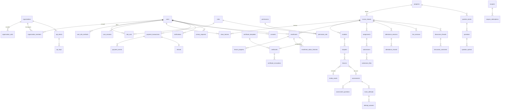

# 05 — Desain Basis Data

> Status: **Disetujui untuk development** · Versi 1.0 · Pemilik: Tech Lead
>
> DBMS: **PostgreSQL 16**. Semua nama mengikuti konvensi di
> [`00-glosarium.md`](00-glosarium.md) §3. Kontrol keamanan data dirinci di
> [`keamanan/06-kriptografi-dan-manajemen-kunci.md`](keamanan/06-kriptografi-dan-manajemen-kunci.md)
> dan [`keamanan/03-otorisasi-dan-isolasi-tenant.md`](keamanan/03-otorisasi-dan-isolasi-tenant.md).

## 1. Prinsip Desain

1. **Primary key UUIDv7** (`uuid`) di semua tabel; dibuat oleh aplikasi.
2. **`timestamptz`** untuk semua waktu (UTC). Kolom standar: `created_at`, `updated_at`; `deleted_at` untuk *soft delete* bila perlu.
3. **Tabel ber-tenant** memiliki `organization_id uuid NOT NULL` dan **RLS aktif**.
4. **Integritas di DB**: foreign key, `CHECK`, `UNIQUE`, `NOT NULL` — jangan hanya mengandalkan aplikasi.
5. **Enum** sebagai `text` + `CHECK (status IN (...))` (lebih mudah dimigrasi daripada tipe `ENUM`).
6. **Uang** sebagai `bigint` (rupiah).
7. **Kolom sensitif** dienkripsi tingkat aplikasi (Laravel `encrypted` cast / envelope encryption) + kolom *blind index* (HMAC) bila perlu dicari.
8. **Append-only** untuk `audit_logs`, `payment_events`, `point_ledger`, `enrollment_status_histories`: peran DB aplikasi hanya punya `INSERT, SELECT`.
9. Tidak ada data biner besar di DB — berkas di object storage; DB menyimpan metadata + hash.

## 2. Klasifikasi Data

| Kelas | Contoh | Perlakuan |
|---|---|---|
| **K1 – Publik** | Katalog program, konten CMS terbit, status verifikasi sertifikat | Boleh publik |
| **K2 – Internal** | Struktur kelas, jadwal, statistik agregat | Hanya pengguna login sesuai scope |
| **K3 – Rahasia** | Nama, email, HP, nomor induk, nilai, jawaban ujian, berkas tugas, transaksi, IP | Scope ketat, disamarkan di log, dienkripsi at-rest (disk) |
| **K4 – Sangat Rahasia** | Hash kata sandi, secret TOTP, kode pemulihan, token, kredensial integrasi, kunci API (hash), bank soal & kunci jawaban, NIK/NPWP (bila dikumpulkan), kode sandi rapat | Enkripsi tingkat aplikasi atau hash; tidak pernah dikirim ke klien/log; akses dibatasi izin khusus |

> **Minimisasi data:** NIK (KTP) **tidak dikumpulkan** kecuali diwajibkan skema (mis. data asesi BNSP). Bila diwajibkan, simpan terenkripsi (K4), tampilkan tersamar, dan catat dasar hukumnya.

## 3. ERD Ringkas



## 4. Definisi Tabel

Notasi kolom: `nama tipe [constraint] — keterangan (Kelas data)`.

### 4.1 Identity & Access

**`users`**
- `id uuid PK`
- `name text NOT NULL` — (K3)
- `email varchar(254) NOT NULL UNIQUE CHECK (email = lower(email))` — dinormalisasi huruf kecil oleh aplikasi (K3). Tidak memakai `citext` agar portabel ke hosting tanpa ekstensi contrib
- `email_verified_at timestamptz`
- `phone text` — format E.164, terenkripsi (K3)
- `phone_bidx text` — HMAC-SHA256 untuk pencarian/unik (K3)
- `password text` — hash **Argon2id** (K4); `NULL` untuk akun SSO-only
- `password_changed_at timestamptz`
- `status text NOT NULL CHECK (status IN ('pending_verification','active','suspended','deactivated','anonymized'))`
- `primary_organization_id uuid FK organizations NULL`
- `locale text DEFAULT 'id'`, `timezone text DEFAULT 'Asia/Jakarta'`
- `last_login_at timestamptz`, `last_login_ip inet` (K3)
- `mfa_enforced boolean NOT NULL DEFAULT false`
- `birth_year smallint NULL` — hanya untuk validasi usia ≥ 18 (minimisasi: bukan tanggal lahir lengkap)
- `created_at`, `updated_at`, `deactivated_at`
- Indeks: `UNIQUE(email)`, `UNIQUE(phone_bidx) WHERE phone_bidx IS NOT NULL`, `(primary_organization_id)`

**`participant_profiles`** (1:1 users, ber-tenant)
- `user_id uuid PK FK users`, `organization_id uuid NOT NULL`
- `participant_number text` — NIM / nomor karyawan (K3), `UNIQUE(organization_id, participant_number)`
- `study_program text`, `semester smallint CHECK (semester BETWEEN 1 AND 14)`, `department text`
- `organization_unit_id uuid FK NULL`
- `source text CHECK (source IN ('self','admin','import','sso','api'))` — field dari sumber eksternal bersifat baca-saja di UI

**`user_mfa_methods`**
- `id`, `user_id FK`, `type text CHECK (type IN ('totp','webauthn'))`
- `secret_encrypted text` — secret TOTP terenkripsi (K4)
- `webauthn_credential_id bytea`, `webauthn_public_key bytea`, `sign_count bigint`
- `label text`, `last_used_at`, `confirmed_at`, `created_at`
- `last_totp_step bigint` — anti-replay TOTP

**`mfa_recovery_codes`**: `id`, `user_id`, `code_hash text` (Argon2id/SHA-256+pepper, K4), `used_at`.

**`user_sessions`**: `id` (hash dari session ID, bukan ID mentah), `user_id`, `ip inet`, `user_agent text`, `device_label text`, `created_at`, `last_activity_at`, `mfa_verified_at`, `revoked_at`, `revoke_reason`.

**`login_attempts`**: `id`, `email_hash text` (HMAC), `user_id NULL`, `ip inet`, `succeeded boolean`, `failure_reason text`, `created_at`. Retensi 90 hari.

**`one_time_tokens`** (verifikasi email/HP, reset kata sandi, undangan, ubah email)
- `id`, `user_id`, `purpose text CHECK (...)`, `token_hash text` (SHA-256, K4), `expires_at`, `consumed_at`, `attempts smallint DEFAULT 0`, `metadata jsonb`
- Indeks unik `(token_hash)`.

**`roles`**: `id`, `code text UNIQUE`, `name`, `is_platform boolean`, `is_system boolean` (tidak dapat dihapus).
**`permissions`**: `id`, `code text UNIQUE` (mis. `certificate.approve`), `description`.
**`permission_role`**: `role_id`, `permission_id`, PK gabungan.
**`role_user`**: `id`, `user_id`, `role_id`, `organization_id uuid NULL` (NULL = peran platform), `granted_by`, `granted_at`, `expires_at NULL`, `UNIQUE(user_id, role_id, organization_id)`.
**`approval_requests`** (maker–checker generik): `id`, `action text` (mis. `certificate.revoke`, `refund.approve`, `api_key.create`, `role.assign_super_admin`), `subject_type`, `subject_id`, `payload jsonb`, `requested_by`, `requested_at`, `decided_by`, `decided_at`, `decision CHECK (decision IN ('approved','rejected'))`, `reason`, `expires_at`, `CHECK (decided_by IS NULL OR decided_by <> requested_by)`.

### 4.2 Organization

**`organizations`**: `id`, `name`, `code text UNIQUE CHECK (code ~ '^[A-Z]{2,8}$')`, `type CHECK (type IN ('institution','corporate'))`, `city`, `accreditation`, `industry`, `logo_path`, `status CHECK (status IN ('active','inactive'))`, `settings jsonb` (mis. gamifikasi aktif, SSO), timestamps.
**`organization_domains`**: `id`, `organization_id`, `domain varchar(253) UNIQUE CHECK (domain = lower(domain))`, `verified_at`, `verification_token_hash`, `method`.
**`organization_units`**: `id`, `organization_id`, `parent_id NULL`, `name`, `type` (faculty/program/department).
**`organization_members`**: `id`, `organization_id`, `user_id`, `status CHECK (status IN ('pending','active','rejected','removed'))`, `approved_by`, `approved_at`, `UNIQUE(organization_id, user_id)`.
**`organization_contracts`**: `id`, `organization_id`, `starts_on date`, `ends_on date`, `participant_quota int`, `covered_program_ids uuid[]`, `billing_mode CHECK (...)`, `notes`.

### 4.3 Catalog & Learning

**`programs`**: `id`, `category CHECK (category IN ('international','bnsp'))`, `name`, `slug UNIQUE`, `provider_name`, `scheme_code`, `short_code text` (dipakai di nomor sertifikat, mis. `AWS-CCP`), `level`, `duration_hours smallint`, `language`, `default_mode CHECK (...)`, `description_html text` (sudah disanitasi saat simpan), `passing_score numeric(5,2) CHECK (passing_score BETWEEN 0 AND 100)`, `certificate_validity_months smallint DEFAULT 36`, `price bigint NOT NULL DEFAULT 0 CHECK (price >= 0)`, `status CHECK (status IN ('draft','in_review','published','archived'))`, `created_by`, `reviewed_by`, `published_at`, `search_vector tsvector` (generated), timestamps. `CHECK (reviewed_by IS NULL OR reviewed_by <> created_by)`.
**`program_tags`**: `program_id`, `tag`.
**`program_organization_prices`**: `program_id`, `organization_id`, `price bigint`, `valid_from`, `valid_until`.

**`course_classes`**: `id`, `program_id`, `batch_name`, `starts_on`, `ends_on`, `enroll_opens_at`, `enroll_closes_at`, `quota int CHECK (quota > 0)`, `enrolled_count int NOT NULL DEFAULT 0 CHECK (enrolled_count <= quota)`, `mode`, `location`, `restricted_organization_ids uuid[] NULL`, `completion_rules jsonb` (min presensi %, tugas wajib, skor), `status CHECK (status IN ('draft','open','running','closed','archived'))`, timestamps.
**`class_trainers`**: `course_class_id`, `user_id`, `role CHECK (role IN ('lead','assistant'))`, PK gabungan.
**`modules`**, **`chapters`**: `id`, parent FK, `title`, `position int`, `UNIQUE(parent_id, position) DEFERRABLE`.
**`lessons`**: `id`, `chapter_id`, `type CHECK (type IN ('video','pdf','text','link','quiz'))`, `title`, `position`, `is_required boolean DEFAULT true`, `media_asset_id NULL`, `assessment_id NULL`, `body_html text NULL` (tersanitasi), `external_url text NULL`, `allow_download boolean DEFAULT false`, `duration_seconds int`, `version int`, `published_at`.
**`media_assets`**: `id`, `owner_id`, `organization_id NULL`, `kind CHECK (kind IN ('video','pdf','image','attachment'))`, `storage_key text` (path privat, tidak pernah diekspos langsung), `original_filename text` (disanitasi; hanya tampilan), `mime_type` (hasil deteksi), `size_bytes bigint`, `sha256 char(64)`, `scan_status CHECK (scan_status IN ('pending','clean','infected','error'))`, `scanned_at`, `processing_status` (transcoding), `hls_manifest_key`, `hls_key_id` (kunci AES-128 HLS disimpan terpisah terenkripsi), timestamps.
**`lesson_progress`** (ber-tenant): `id`, `organization_id`, `enrollment_id`, `lesson_id`, `status CHECK (status IN ('started','completed'))`, `watched_seconds int`, `max_position_seconds int`, `completed_at`, `UNIQUE(enrollment_id, lesson_id)`.

### 4.4 Assessment

**`question_banks`**: `id`, `program_id`, `name`, `created_by`.
**`questions`** (K4 — bersama kuncinya): `id`, `question_bank_id`, `type CHECK (type IN ('single_choice','multiple_choice','true_false','short_answer','essay'))`, `stem_html` (tersanitasi), `explanation_html`, `difficulty CHECK (difficulty BETWEEN 1 AND 5)`, `competency_tags text[]`, `points numeric(6,2) DEFAULT 1`, `accepted_answers_encrypted text NULL` (isian singkat), `is_active`, `version int`, timestamps.
**`question_options`**: `id`, `question_id`, `body_html`, `is_correct boolean` (K4), `position`.
**`assessments`**: `id`, `course_class_id`, `kind CHECK (kind IN ('quiz','final_exam'))`, `title`, `duration_minutes`, `max_attempts smallint`, `cooldown_minutes`, `opens_at`, `closes_at`, `shuffle_questions boolean`, `shuffle_options boolean`, `question_count smallint`, `selection_rules jsonb` (ambil N per tag/kesulitan), `passing_score numeric(5,2)`, `review_policy CHECK (review_policy IN ('never','after_submit','after_close'))`, `requires_prerequisites boolean`.
**`assessment_questions`**: `assessment_id`, `question_id`, `position` (untuk set soal tetap).
**`exam_attempts`** (ber-tenant): `id`, `organization_id`, `assessment_id`, `enrollment_id`, `user_id`, `attempt_no smallint`, `status CHECK (status IN ('in_progress','submitted','auto_submitted','graded','voided'))`, `started_at`, `deadline_at`, `submitted_at`, `score numeric(5,2)`, `passed boolean`, `question_order uuid[]` (snapshot soal & urutan), `option_order jsonb`, `question_versions jsonb`, `client_fingerprint_hash`, `ip inet`, `integrity_flags jsonb` (pindah tab, dsb.), `voided_reason`, `UNIQUE(assessment_id, enrollment_id, attempt_no)`.
- Indeks unik parsial: `UNIQUE(assessment_id, enrollment_id) WHERE status = 'in_progress'` → mencegah dua attempt aktif.
**`attempt_answers`**: `id`, `exam_attempt_id`, `question_id`, `selected_option_ids uuid[]`, `text_answer text`, `is_correct boolean`, `points_awarded numeric(6,2)`, `graded_by NULL`, `answered_at`, `UNIQUE(exam_attempt_id, question_id)`.

### 4.5 Enrollment

**`enrollments`** (ber-tenant): `id`, `organization_id` (organisasi peserta saat mendaftar; immutable), `user_id`, `course_class_id`, `program_id` (denormalisasi), `status CHECK (status IN ('awaiting_payment','enrolled','in_progress','pending_approval','passed','failed','cancelled'))`, `source CHECK (source IN ('self','admin','bulk','api','payment'))`, `progress_percent smallint CHECK (progress_percent BETWEEN 0 AND 100)`, `final_score numeric(5,2)`, `enrolled_at`, `completed_at`, `approved_by`, `approved_at`, `rejection_reason`, `payment_transaction_id NULL`, timestamps.
- Indeks unik parsial: `UNIQUE(user_id, program_id) WHERE status NOT IN ('failed','cancelled')`.
- `CHECK (approved_by IS NULL OR approved_by <> user_id)`.
**`enrollment_status_histories`** (append-only): `id`, `enrollment_id`, `from_status`, `to_status`, `actor_id`, `reason`, `created_at`.
**`bulk_enrollment_jobs`**: `id`, `organization_id`, `course_class_id`, `requested_by`, `source_file_key`, `total_rows`, `succeeded_rows`, `failed_rows`, `error_report_key`, `status`, timestamps.

### 4.6 Assignment, Attendance, Live

**`assignments`**: `id`, `course_class_id`, `title`, `description_html`, `due_at`, `is_required`, `weight`, `allowed_extensions text[]`, `max_file_size_mb smallint CHECK (max_file_size_mb <= 100)`, `max_files smallint CHECK (max_files <= 5)`, `late_policy CHECK (late_policy IN ('accept','flag','reject'))`, `max_revisions smallint`, `attachment_media_id NULL`.
**`submissions`** (ber-tenant): `id`, `organization_id`, `assignment_id`, `enrollment_id`, `user_id`, `status CHECK (status IN ('submitted','revision_requested','approved','rejected'))`, `note text`, `submitted_at`, `is_late boolean`, `score numeric(5,2) CHECK (score BETWEEN 0 AND 100)`, `feedback text`, `reviewed_by`, `reviewed_at`, `revision_count smallint`, `UNIQUE(assignment_id, enrollment_id)`.
**`submission_files`**: `id`, `submission_id`, `media_asset_id`, `revision_no`.
**`submission_reviews`** (riwayat, append-only): `id`, `submission_id`, `reviewer_id`, `status`, `score`, `feedback`, `created_at`.
**`attendance_sessions`**: `id`, `course_class_id`, `title`, `starts_at`, `ends_at`, `type CHECK (type IN ('offline','hybrid','live'))`, `location`, `qr_secret_encrypted text` (K4, untuk token QR dinamis), `checkin_opens_at`, `checkin_closes_at`, `closed_at`.
**`attendance_records`** (ber-tenant): `id`, `organization_id`, `attendance_session_id`, `enrollment_id`, `user_id`, `status CHECK (status IN ('present','late','absent','excused'))`, `method CHECK (method IN ('qr','manual','integration'))`, `checked_in_at`, `recorded_by`, `note`, `UNIQUE(attendance_session_id, enrollment_id)`.
**`live_sessions`**: `id`, `course_class_id`, `title`, `starts_at`, `ends_at`, `platform CHECK (platform IN ('zoom','google_meet','ms_teams'))`, `join_url_encrypted text` (K4), `passcode_encrypted text` (K4), `recording_media_id NULL`, `recording_url_encrypted`, `status`.

### 4.7 Certification

**`certificate_templates`**: `id`, `name`, `category`, `program_id NULL`, `version text`, `layout_html text` (hanya dapat diubah Super/Admin Akademik; dirender di sandbox renderer tanpa akses jaringan), `assets jsonb`, `is_active boolean`, `created_by`, `approved_by`, timestamps. Indeks unik parsial: satu template aktif per `(category, program_id)`.
**`certificate_sequences`**: `program_id`, `year smallint`, `last_value int`, PK `(program_id, year)` — diambil dengan `UPDATE ... RETURNING` dalam transaksi.
**`certificates`** (ber-tenant): `id`, `organization_id`, `enrollment_id UNIQUE`, `user_id`, `program_id`, `template_id`, `number text UNIQUE`, `verification_code char(12) UNIQUE`, `holder_name text` (snapshot nama saat terbit), `holder_name_masked text`, `issued_at`, `valid_until date`, `status CHECK (status IN ('generating','generation_failed','active','revoked','superseded'))`, `pdf_storage_key`, `pdf_sha256 char(64)`, `signature_cert_fingerprint text`, `signed_at`, `superseded_by uuid NULL`, `approved_by`, timestamps.
**`certificate_revocations`**: `id`, `certificate_id`, `reason_code CHECK (...)` (`integrity_violation`, `data_error`, `holder_request`, `other`), `reason_text`, `requested_by`, `approved_by`, `revoked_at`, `CHECK (approved_by <> requested_by)`.
**`certificate_verification_logs`**: `id`, `certificate_id NULL`, `lookup_type CHECK (lookup_type IN ('number','code','api','pdf_upload'))`, `result CHECK (result IN ('valid','expired','revoked','superseded','not_found'))`, `ip_hash text` (HMAC harian ber-salt), `api_client_id NULL`, `user_agent_family text`, `created_at`. Partisi bulanan, retensi 12 bulan.

### 4.8 Payment

**`payment_transactions`** (ber-tenant): `id`, `organization_id`, `user_id`, `program_id`, `course_class_id`, `order_id text UNIQUE` (`STU-{ULID}`), `invoice_number text UNIQUE NULL`, `gross_amount bigint CHECK (gross_amount >= 0)`, `list_price bigint`, `discount_amount bigint`, `coupon_id NULL`, `currency char(3) DEFAULT 'IDR'`, `status CHECK (status IN ('pending','settled','failed','expired','refund_pending','refunded'))`, `payment_method text`, `gateway text DEFAULT 'midtrans'`, `gateway_transaction_id text`, `expires_at`, `settled_at`, `idempotency_key text UNIQUE`, `needs_review boolean NOT NULL DEFAULT false` (mis. selisih jumlah/`fraud_status=challenge`), timestamps.
**`payment_events`** (append-only): `id`, `payment_transaction_id NULL`, `source CHECK (source IN ('webhook','status_api','reconciliation','admin'))`, `gateway_status`, `raw_payload jsonb` (tanpa data sensitif; disaring), `signature_valid boolean`, `processed_at`, `dedup_key text UNIQUE` (mis. `order_id + transaction_status + status_code + settlement_time`), `created_at`.
**`coupons`**: `id`, `code varchar UNIQUE CHECK (code = upper(code))`, `type CHECK (type IN ('percent','amount'))`, `value bigint CHECK (value > 0)`, `max_discount bigint NULL`, `min_amount bigint`, `valid_from`, `valid_until`, `total_quota int`, `used_count int DEFAULT 0 CHECK (used_count <= total_quota)`, `reserved_count int DEFAULT 0`, `per_user_limit smallint DEFAULT 1`, `program_ids uuid[] NULL`, `organization_ids uuid[] NULL`, `is_active`, `created_by`. `CHECK (type <> 'percent' OR value <= 100)`.
**`coupon_redemptions`**: `id`, `coupon_id`, `user_id`, `payment_transaction_id UNIQUE`, `status CHECK (status IN ('reserved','consumed','released'))`, timestamps.
**`refunds`**: `id`, `payment_transaction_id`, `amount bigint CHECK (amount > 0)`, `reason`, `requested_by`, `approved_by`, `approval_request_id NULL`, `status CHECK (...)`, `gateway_refund_id`, timestamps.
**`invoices`**: `id`, `payment_transaction_id UNIQUE`, `number`, `billing_name`, `billing_tax_id_encrypted` (NPWP, K4), `billing_address_encrypted`, `pdf_storage_key`, `issued_at`.

### 4.9 Engagement, Notification, CMS

**`point_ledger`** (append-only): `id`, `organization_id`, `user_id`, `points int`, `reason_code`, `source_type`, `source_id`, `idempotency_key text UNIQUE`, `created_at`.
**`badges`**, **`user_badges`** (`UNIQUE(user_id, badge_id)`).
**`discussion_threads`**: `id`, `course_class_id`, `author_id`, `title`, `body_md text`, `body_html_sanitized text`, `is_locked`, `is_hidden`, `last_activity_at`, timestamps, `deleted_at`.
**`discussion_comments`**: `id`, `thread_id`, `author_id`, `body_md`, `body_html_sanitized`, `is_hidden`, `edited_at`, timestamps, `deleted_at`.
**`discussion_reactions`**: `comment_id`, `user_id`, PK gabungan.
**`content_reports`**: `id`, `reportable_type`, `reportable_id`, `reporter_id`, `reason`, `status`, `handled_by`, `handled_at`, `UNIQUE(reportable_type, reportable_id, reporter_id)`.
**`notifications`**: `id`, `user_id`, `category`, `title`, `body`, `action_url` (path relatif internal saja), `read_at`, `created_at`.
**`notification_preferences`**: `user_id`, `category`, `channel`, `enabled`, PK gabungan.
**`notification_deliveries`**: `id`, `notification_id`, `channel`, `provider_message_id`, `status`, `error`, `attempts`, timestamps.
**`cms_blocks`**: `id`, `key UNIQUE` (mis. `home.hero`), `published_version_id`.
**`cms_block_versions`**: `id`, `cms_block_id`, `content jsonb` (teks + markup terbatas tervalidasi skema), `status CHECK (status IN ('draft','published','archived'))`, `created_by`, `published_by`, timestamps.
**`legal_documents`**: `id`, `type CHECK (type IN ('privacy_policy','terms'))`, `version`, `content_md`, `effective_at`, `requires_reconsent boolean`.

### 4.10 Privacy, Integration, Audit, Settings

**`consents`**: `id`, `user_id`, `purpose CHECK (purpose IN ('terms','privacy_policy','whatsapp','marketing','public_leaderboard','guardian'))`, `legal_document_id NULL`, `granted boolean`, `granted_at`, `withdrawn_at`, `ip_hash`, `user_agent_family`, `evidence jsonb`.
**`privacy_requests`**: `id`, `user_id`, `organization_id`, `type CHECK (type IN ('access_export','rectification','erasure','restriction','objection'))`, `status CHECK (status IN ('pending','in_progress','completed','rejected'))`, `identity_verified_at`, `verified_by`, `due_at`, `completed_at`, `result_file_key`, `rejection_reason`, timestamps.
**`api_clients`**: `id`, `organization_id NULL`, `name`, `contact_email`, `ip_allowlist cidr[]`, `status`, `created_by`, `approval_request_id`.
**`api_keys`**: `id`, `api_client_id`, `prefix text UNIQUE` (8 karakter tampil, mis. `stu_live_AB12CD34`), `key_hash text` (HMAC-SHA256 dengan pepper di KMS, K4), `scopes text[]`, `last_used_at`, `last_used_ip`, `expires_at NOT NULL`, `revoked_at`, `created_by`.
**`webhook_endpoints`**: `id`, `api_client_id`, `url` (https wajib, divalidasi anti-SSRF), `events text[]`, `secret_encrypted` (K4), `is_active`.
**`webhook_deliveries`**: `id`, `webhook_endpoint_id`, `event`, `payload_hash`, `status`, `response_code`, `attempts`, `next_attempt_at`, timestamps.
**`integration_settings`**: `id`, `key UNIQUE` (mis. `midtrans`, `smtp`, `whatsapp`), `config_encrypted text` (K4), `is_enabled`, `updated_by`, `updated_at`.
**`system_settings`**: `key text PK`, `value jsonb`, `updated_by`, `updated_at` — nilai keamanan divalidasi terhadap batas minimum di kode.
**`audit_logs`** (append-only, partisi bulanan):
- `id uuid`, `occurred_at timestamptz`, `actor_id uuid NULL`, `actor_type CHECK (actor_type IN ('user','system','api_client'))`, `actor_role text`, `organization_id uuid NULL`, `action text` (mis. `certificate.approved`), `subject_type text`, `subject_id uuid`, `changes jsonb` (before/after dengan field sensitif di-*redact*), `ip inet`, `user_agent text`, `request_id text`, `prev_hash char(64)`, `hash char(64)` — `hash = SHA256(prev_hash || canonical_json(row))`.
- Trigger menolak `UPDATE`/`DELETE`; peran DB aplikasi hanya `INSERT, SELECT`.
**`security_events`**: `id`, `occurred_at`, `type` (mis. `login_failed`, `mfa_failed`, `rate_limited`, `authz_denied`, `suspicious_parameter`, `webhook_signature_invalid`), `severity`, `user_id`, `ip`, `details jsonb`. Diteruskan ke SIEM.

## 5. Row-Level Security (RLS)

Tabel ber-tenant: `participant_profiles`, `organization_members`, `enrollments`, `lesson_progress`, `exam_attempts`, `attempt_answers`*, `submissions`, `submission_files`*, `attendance_records`, `certificates`, `payment_transactions`, `invoices`*, `point_ledger`, `privacy_requests`, `bulk_enrollment_jobs`, `api_clients`.
(*) memakai kebijakan via join/`EXISTS` ke tabel induk atau kolom `organization_id` terdenormalisasi (disarankan terdenormalisasi untuk performa).

Contoh:

```sql
ALTER TABLE enrollments ENABLE ROW LEVEL SECURITY;
ALTER TABLE enrollments FORCE ROW LEVEL SECURITY;

CREATE POLICY tenant_isolation ON enrollments
  USING (
    current_setting('app.is_platform_staff', true) = 'on'
    OR organization_id = ANY (string_to_array(current_setting('app.org_ids', true), ',')::uuid[])
    OR user_id = nullif(current_setting('app.user_id', true), '')::uuid
    OR course_class_id = ANY (string_to_array(current_setting('app.trainer_class_ids', true), ',')::uuid[])
  )
  WITH CHECK (
    current_setting('app.is_platform_staff', true) = 'on'
    OR organization_id = ANY (string_to_array(current_setting('app.org_ids', true), ',')::uuid[])
    OR user_id = nullif(current_setting('app.user_id', true), '')::uuid
  );
```

Ketentuan:
- Aplikasi menjalankan `SET LOCAL app.user_id = ..., app.org_ids = ..., app.trainer_class_ids = ..., app.is_platform_staff = ...` di awal setiap transaksi request/job (middleware + `DB::beforeExecuting` guard).
- Bila variabel tidak disetel, kebijakan **menolak** (`current_setting(..., true)` mengembalikan NULL → tidak ada baris).
- Endpoint publik verifikasi sertifikat memakai **fungsi `SECURITY DEFINER`** sempit `verify_certificate(code)` yang hanya mengembalikan kolom publik, bukan melewati RLS secara umum.
- Uji RLS otomatis per tabel (lihat `10-strategi-pengujian.md`).

## 6. Peran Basis Data

| Peran DB | Hak | Dipakai oleh |
|---|---|---|
| `stu_migrator` | Pemilik skema; DDL | Hanya job migrasi (kredensial terpisah, tidak ada di runtime app) |
| `stu_app` | `SELECT, INSERT, UPDATE, DELETE` pada tabel bisnis; `INSERT, SELECT` pada tabel append-only; **tidak** `BYPASSRLS`, bukan owner | Aplikasi web & worker |
| `stu_report` | `SELECT` pada *view* laporan (RLS tetap berlaku), koneksi ke replika baca | Modul Reporting |
| `stu_readonly_ops` | `SELECT` pada tabel non-K4, via break-glass | Investigasi insiden (terekam) |
| `stu_backup` | Hak replikasi/backup | Layanan backup terkelola |

## 7. Indeks & Performa Utama

| Tabel | Indeks | Tujuan |
|---|---|---|
| `enrollments` | `(course_class_id, status)`, `(user_id, status)`, `(organization_id, status)` | Daftar peserta, dashboard |
| `lesson_progress` | `(enrollment_id)` | Progres |
| `exam_attempts` | `(deadline_at) WHERE status='in_progress'` | Job auto-submit |
| `certificates` | `UNIQUE(number)`, `UNIQUE(verification_code)`, `(user_id)`, `(organization_id, issued_at)` | Verifikasi, laporan |
| `payment_transactions` | `(status, expires_at)`, `(user_id)` | Kedaluwarsa, riwayat |
| `audit_logs` | `(occurred_at)`, `(actor_id, occurred_at)`, `(subject_type, subject_id)` | Pencarian audit |
| `programs` | `GIN(search_vector)` | Pencarian katalog |
| `notifications` | `(user_id, read_at, created_at DESC)` | Pusat notifikasi |

## 8. Migrasi & Seeder

- Migrasi Laravel reversibel; pola *expand → migrate → contract* untuk perubahan tanpa downtime.
- Kebijakan RLS, trigger append-only, fungsi `SECURITY DEFINER`, dan hak peran DB **dibuat di migrasi** (bukan manual).
- Seeder **hanya data sintetis** (Faker locale `id_ID`); data demo purwarupa (`assets/js/data.js`) boleh dipakai sebagai referensi skenario, **bukan** sebagai data produksi.
- Seeder produksi hanya membuat: peran, izin, pengaturan default, Super Admin awal (email dari secret, undangan set kata sandi + MFA wajib pada login pertama).

## 9. Pemetaan Data Purwarupa → Skema

| Purwarupa (`assets/js/data.js`) | Tabel produksi | Catatan |
|---|---|---|
| `organisasi` | `organizations` (+ `organization_contracts`) | `singkatan` → `code` |
| `pelatihan` | `programs` | `skorMinimal` → `passing_score`; `harga` → `price`; `kodeSkema` → `scheme_code`; `KODE_SINGKAT` → `short_code` |
| `trainer` | `users` + `role_user(trainer)` + `class_trainers` | `mengampu` → `class_trainers` |
| `kelas` (+ `modul`, `strukturModul`) | `course_classes`, `modules`, `chapters`, `lessons` | |
| `kelas.kuis` (berisi `jawaban`) | `question_banks`, `questions`, `question_options`, `assessments` | **Kunci jawaban tidak pernah dikirim ke klien** |
| `kelas.ujianAkhir` | `assessments(kind='final_exam')` | |
| `peserta` | `users` + `participant_profiles` + `organization_members` | `npm` → `participant_number` |
| `pendaftaran` | `enrollments` (+ `lesson_progress`, `exam_attempts`) | `skorKuis` → `final_score`; status dipetakan (glosarium §4) |
| `sertifikat` | `certificates` (+ `certificate_revocations`) | tambahkan `verification_code`, `pdf_sha256` |
| `tugas`, `pengumpulanTugas` | `assignments`, `submissions`, `submission_files`, `submission_reviews` | |
| `sesiPresensi`, `presensi` | `attendance_sessions`, `attendance_records` | |
| `liveClass` | `live_sessions` | tautan terenkripsi |
| `lencana`, `pencapaianPeserta` | `badges`, `user_badges`, `point_ledger` | poin dari ledger, bukan angka tersimpan |
| `diskusiThread`, `diskusiKomentar` | `discussion_threads`, `discussion_comments`, `discussion_reactions`, `content_reports` | |
| `notifikasiPeserta` | `notifications` | |
| `kupon`, `transaksi` | `coupons`, `coupon_redemptions`, `payment_transactions`, `payment_events`, `invoices`, `refunds` | |
| `templateSertifikat` | `certificate_templates` | |
| `auditLog` | `audit_logs` | berantai hash |
| `permintaanPrivasi` | `privacy_requests` | |
| `apiKeys` (`keyMasked`) | `api_clients`, `api_keys` | hanya prefix + hash |
| `integrasi` | `integration_settings` | konfigurasi terenkripsi |
| `cmsKontenDefault` | `cms_blocks`, `cms_block_versions`, `legal_documents` | tanpa HTML mentah |
| `akunDemo` | — | **Dihapus.** Tidak ada akun demo di produksi |
