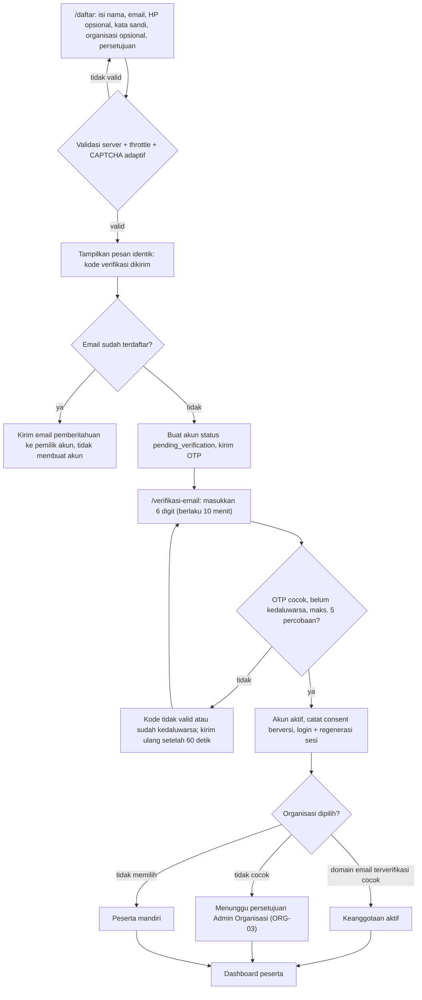
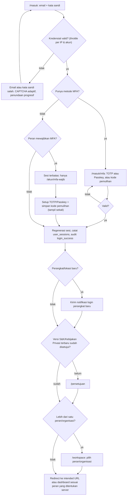
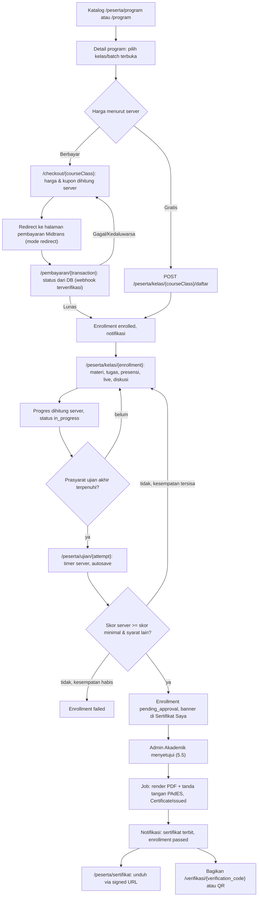
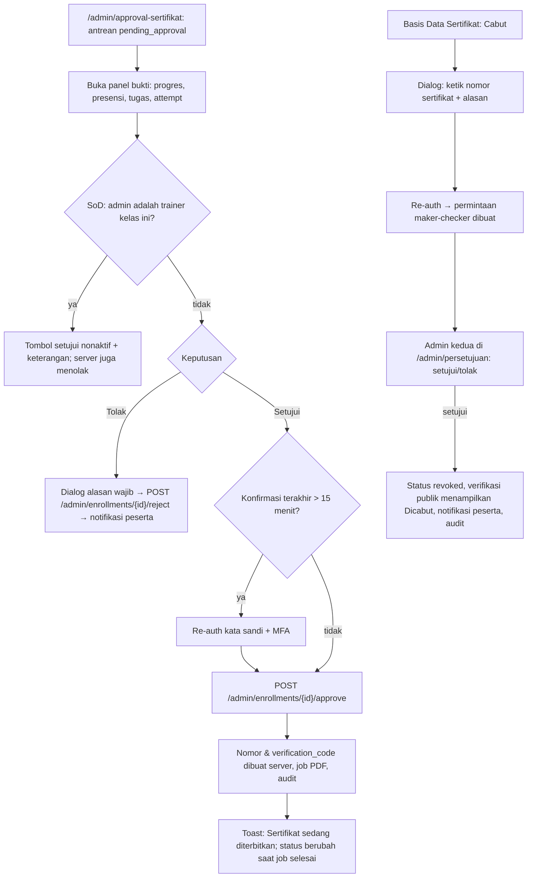
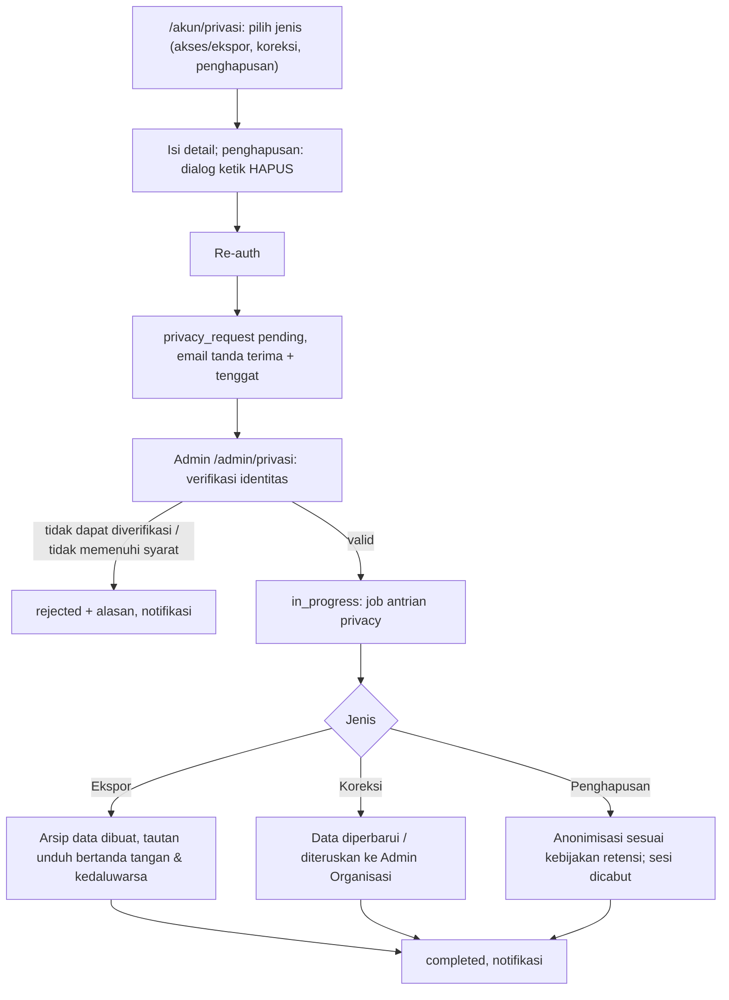

# 08 — Spesifikasi UI & Pemetaan Halaman

> Status: **Disetujui untuk development** · Versi 1.0 · Pemilik: Product Designer + Tech Lead
>
> Dokumen ini memetakan **setiap halaman purwarupa** (`*.html`, `peserta/`, `trainer/`, `admin/`)
> ke rute produksi Laravel + Livewire, peran & izin (sesuai
> [`07-rbac-dan-multi-tenant.md`](07-rbac-dan-multi-tenant.md)), aksi server, dan kontrol keamanan
> per halaman. Istilah mengikuti [`00-glosarium.md`](00-glosarium.md); keputusan teknologi mengikuti
> [`04-arsitektur-sistem.md`](04-arsitektur-sistem.md). Bila ada konflik, dokumen 00/04/07 yang berlaku.

---

## Daftar Isi

1. [Tujuan & Cara Memakai Purwarupa](#1-tujuan--cara-memakai-purwarupa)
2. [Design System Ringkas](#2-design-system-ringkas)
3. [Inventaris & Pemetaan Halaman](#3-inventaris--pemetaan-halaman)
4. [Navigasi per Peran](#4-navigasi-per-peran)
5. [Alur UX Utama](#5-alur-ux-utama)
6. [Pola UI Keamanan](#6-pola-ui-keamanan)
7. [Aksesibilitas, Responsif, Browser, Lokalisasi & State](#7-aksesibilitas-responsif-browser-lokalisasi--state)
8. [Temuan UI Purwarupa yang Wajib Diperbaiki](#8-temuan-ui-purwarupa-yang-wajib-diperbaiki)
9. [Dokumen Terkait & Keputusan Terbuka](#9-dokumen-terkait--keputusan-terbuka)

---

## 1. Tujuan & Cara Memakai Purwarupa

### 1.1 Tujuan dokumen

- Menjadi **kontrak antara desain dan development**: halaman apa yang dibangun, di rute mana, siapa
  yang boleh membukanya, izin apa yang dicek, aksi server apa yang dipanggil, dan kontrol keamanan
  khusus apa yang wajib ada.
- Menjadi daftar periksa **gap** antara purwarupa dan produksi (halaman baru yang belum ada di
  purwarupa, serta perilaku purwarupa yang tidak boleh ditiru).

### 1.2 Status purwarupa

Purwarupa di repositori (38 berkas HTML + `assets/js/{data,store,layout,certificate,ui}.js` +
`assets/css/style.css`) adalah **acuan visual dan alur**, **bukan kode produksi**. Seluruh "basis
data"-nya adalah `localStorage` (kunci `stu_lms_v2` di `assets/js/store.js`), sesi login hanyalah
objek `{userId, role}` di `localStorage`, dan semua aturan bisnis (skor, kelulusan, harga, status
pembayaran, penerbitan sertifikat) berjalan di browser.

### 1.3 Aturan memakai purwarupa sebagai acuan

| # | Aturan | Keterangan |
|---|---|---|
| 1 | **Yang boleh diambil:** tata letak, hierarki visual, kelas utilitas Tailwind, token warna, komponen (kartu, badge, tabel, tab, modal), urutan langkah alur, teks UI. | Markup disalin ke komponen Blade (`resources/views/components/...`), lalu data diganti variabel Blade. |
| 2 | **Yang tidak boleh diambil:** logika di `assets/js/store.js`, `data.js`, `certificate.js`, dan seluruh `` di Blade, tidak ada atribut `on*=`/`javascript:`, tidak ada `<style>` inline (purwarupa punya di `index.html`, `api-verifikasi.html`, `peserta/kelas-detail.html`, `peserta/profil.html`, `admin/pengaturan.html`), dan tidak ada atribut `style="…"` di markup (purwarupa memakainya berulang, mis. `style="background:var(--brand-800)"`) — ganti dengan kelas Tailwind. Nilai dinamis (lebar progress bar) memakai elemen `<progress>` atau di-set lewat Alpine (CSSOM). Logika Alpine didaftarkan sebagai `Alpine.data('nama', …)` di `resources/js/components/*.js` dan `x-data` hanya menyebut nama komponen (09 FE-04); skrip Livewire & Vite dimuat dengan nonce yang sama. |
| 5 | **Tidak membangun HTML dari string berisi data pengguna.** | Purwarupa memakai `innerHTML`/`insertAdjacentHTML` + penggabungan string di 35 berkas (mis. isi diskusi, CMS, hasil cek sertifikat). Di produksi seluruh keluaran lewat Blade `{{ }}` (auto-escape). `{!! !!}` dan `x-html` untuk data pengguna **dilarang**; konten kaya (CMS, deskripsi program, lesson teks, kebijakan) dirender lewat komponen `<x-safe-html :html="…" profile="…">` yang memanggil `HtmlSanitizer` (allowlist per konteks) — 09 SC-06 & FE-05, dicek Semgrep di CI. |
| 6 | **Tidak ada state keamanan/bisnis di `localStorage`/`sessionStorage`.** | Sesi = cookie `__Host-stu_session` `HttpOnly; Secure; SameSite=Lax` (04 §8.1). `localStorage` hanya untuk preferensi UI non-sensitif (mis. sidebar diciutkan) — 09 FE-09. |
| 7 | **Pustaka pihak ketiga dibundel, bukan CDN.** | Chart.js (3 halaman admin), jsPDF & qrcodejs (sertifikat) dari `cdnjs` di purwarupa. Di produksi: Chart.js dipasang via npm & dibundel Vite (09 FE-06); **jsPDF & qrcodejs dihapus** (PDF & QR dibuat server, ADR-005); Snap.js Midtrans tidak disematkan — pembayaran mode redirect. |
| 8 | **Font di-*self-host*.** | Purwarupa memuat Plus Jakarta Sans dari Google Fonts. Di produksi dipakai paket `@fontsource/plus-jakarta-sans` (subset Latin, `woff2`) yang dibundel Vite (09 FE-08) → CSP `font-src 'self'`, tanpa kebocoran IP pengguna ke pihak ketiga (UU PDP), dan tanpa ketergantungan eksternal. |
| 9 | **Teks UI mengikuti glosarium.** | Purwarupa masih memakai "Sertifikasi/Skema/Mahasiswa/Universitas/NPM" di beberapa tempat; lihat §8. |

---

## 2. Design System Ringkas

Diekstrak dari `assets/css/style.css`, blok `tailwind.config` di `<head>` tiap halaman,
`assets/js/layout.js`, dan `assets/js/ui.js`. Di produksi token ini menjadi satu sumber di
`tailwind.config.js` + variabel CSS di `resources/css/app.css`.

### 2.1 Warna (token)

| Token | Nilai | Sumber | Pemakaian |
|---|---|---|---|
| `brand-50 … 900` | `50 #eef5fb` · `100 #d7e8f4` · `200 #b0d1e9` · `300 #83b6db` · `400 #4f93c6` · `500 #2f78ad` · `600 #1a5c97` · `700 #124a7d` · `800 #0e3a63` · `900 #0b2f52` | `tailwind.config` di tiap `<head>` | Warna utama: tombol primer (`brand-800`), teks tautan (`brand-700`), latar sidebar (gradien `brand-900 → brand-800`). |
| `accent-50 … 900` | `50 #effcfa` · `100 #c9f6ee` · `200 #94ecdc` · `300 #5fdfca` · `400 #2ecdb3` · `500 #14b8a6` · `600 #0e9488` · `700 #0c766e` · `800 #0b5f59` · `900 #0a4d49` | idem | Aksen: menu aktif sidebar, CTA beranda, gradien progress bar. |
| `--brand-900/800/700/600` | sama dengan skala Tailwind | `style.css :root` | Dipakai via `var(--…)`. |
| `--brand-500` | **`#2470b3`** | `style.css :root` | **Tidak sama** dengan Tailwind `brand-500` (`#2f78ad`) → satukan ke `#2f78ad` (lihat TUI-44). |
| `--accent-500` | `#14b8a6` | `style.css` | Menu aktif, CTA. |
| `--gold-500` | `#d4a017` | `style.css` | Tidak dipakai di mana pun → hapus atau cadangkan untuk lencana. |
| Netral | Tailwind `slate-*`; latar aplikasi `bg-slate-50`, kartu `#fff`, border `#e6ebf1` | kelas utilitas | Teks utama `slate-800`, sekunder `slate-500`. |
| Status | hijau `#dcfce7/#166534`, biru `#dbeafe/#1e40af`, kuning `#fef3c7/#92400e`, merah `#fee2e2/#991b1b`, abu `#f1f5f9/#475569`, ungu `#ede9fe/#5b21b6` | `.badge-*` | Lihat §2.4. |
| Kategori program | `international`: `#eef2ff/#3730a3` border `#c7d2fe`; `bnsp`: `#fff7ed/#9a3412` border `#fed7aa` | `.tag-internasional`, `.tag-bnsp` | Label kategori (`program.category`). |

**Koreksi kontras wajib (WCAG AA, dihitung dari nilai heksadesimal):**

| Kombinasi di purwarupa | Rasio | Ganti dengan | Rasio baru |
|---|---|---|---|
| Teks `slate-400` (#94a3b8) di putih — dipakai ±230 kali untuk teks keterangan | 2,56:1 | `slate-500` (#64748b) | 4,76:1 |
| Toast peringatan: teks putih di `amber-500` | 2,15:1 | latar `amber-700` (#b45309) | 5,02:1 |
| Toast sukses & label "GRATIS": `emerald-600` | 3,77:1 | `emerald-700` (#047857) | 5,48:1 |
| Tombol "Setujui & Terbitkan": putih di `#0e9488` (`accent-600`) | 3,74:1 | `accent-700` (#0c766e) | 5,48:1 |
| Label grup sidebar `#7c93ad` di `brand-900` | 4,30:1 | `slate-400` (#94a3b8) di atas `brand-900` | 5,31:1 |
| Teks `slate-300` untuk tanda "—" / angka 0 | 1,48:1 | `slate-500` + teks alternatif | ≥ 4,5:1 |

Kombinasi yang sudah lolos: putih di `brand-800` (11,64:1), teks `#06251f` di `accent-500` (menu
aktif, 6,53:1), `brand-900` di `accent-500` (CTA, 5,47:1), putih di `rose-600` (4,70:1).

### 2.2 Tipografi

| Elemen | Purwarupa | Produksi |
|---|---|---|
| Keluarga huruf | "Plus Jakarta Sans" 400/500/600/700/800 via Google Fonts, fallback `Inter, ui-sans-serif, system-ui` | Sama, **self-host** `woff2` + `font-display: swap`, preload bobot 400 & 700 saja. |
| Judul halaman | `text-xl font-extrabold text-slate-800` | Satu `<h1>` per halaman. |
| Judul bagian | `font-bold text-slate-800` (`<h2>`) | Hierarki `h1 → h2 → h3` tanpa loncat. |
| Isi | `text-sm` (14px) | Minimal 14px untuk isi; **minimal 12px** untuk keterangan. Purwarupa memakai `text-[10px]`/`text-[11px]` 61 kali → naikkan ke `text-xs` (12px). |
| Label form | `text-xs font-bold text-slate-500` | Tetap, wajib terhubung ke input (`for`/`id`). |
| Angka/kode | `font-mono` (nomor sertifikat, invoice, OTP) | Tetap. |

### 2.3 Tata letak (shell aplikasi)

Dibangun oleh `renderShell()` di `assets/js/layout.js`; di produksi menjadi
`resources/views/layouts/app.blade.php` + komponen `<x-layout.sidebar>` dan `<x-layout.topbar>`.

| Bagian | Spesifikasi purwarupa | Catatan produksi |
|---|---|---|
| Sidebar desktop | `fixed w-64`, tampil mulai `lg` (≥1024px), gradien `brand-900 → brand-800 → #0a2440`, logo "STU" (kotak `accent-500`) + "STU LMS", menu `.nav-link` (aktif: latar `accent-500`, teks `#06251f`), label grup `.nav-group-label`, footer: "Cek Sertifikat" + "Keluar". | Menu dirender server berdasarkan izin (`@can`), bukan per "role" string. "Keluar" = `<form method="POST" action="/keluar">` + CSRF. |
| Sidebar seluler | Drawer `w-72` + backdrop `bg-slate-900/50`, dibuka tombol menu di topbar. | Tambah `aria-expanded`, `aria-controls`, fokus terkunci di drawer, tutup dengan `Esc`. |
| Topbar | `fixed h-16` putih, kolom pencarian (≥`md`), pil peran (admin `indigo`, trainer `teal`, peserta `blue`), tombol notifikasi + panel, menu pengguna (avatar inisial, nama, sub-judul). | Pencarian dan lencana notifikasi harus fungsional (TUI-06, TUI-07). Menu pengguna memuat *switcher workspace* (BARU-29) bila pengguna punya >1 peran/organisasi. |
| Area konten | `main.lg:pl-64.pt-16`, kontainer `max-w-{3xl…7xl} mx-auto px-4 sm:px-6 py-8`. | Tambah tautan "Lewati ke konten" (*skip link*) dan landmark `<nav>`, `<main>`. |
| Halaman publik | Header `sticky h-16` putih/blur, kontainer `max-w-7xl`, footer `bg-slate-900`. | Tetap. |
| Halaman auth | Dua kolom (`lg:grid-cols-2`): panel brand gradien + form `max-w-sm`. | Tetap. |

### 2.4 Komponen

| Komponen (Blade) | Asal purwarupa | Varian & aturan |
|---|---|---|
| `<x-ui.card>` | `.card` — putih, `border-radius:1rem`, border `#e6ebf1`, bayangan tipis; `.stat-card` menambah gradien radial aksen. | `p-5`/`p-6`; varian `stat`. |
| `<x-ui.badge>` | `.badge` + `.badge-dot` — pil `.72rem` tebal dengan titik warna. Varian `hijau`, `biru`, `kuning`, `merah`, `abu`, `ungu`. | **Selalu ada teks label** (warna tidak boleh jadi satu-satunya penanda). Pemetaan status wajib memakai kode di glosarium §4 (tabel di bawah). |
| `<x-ui.tag-kategori>` | `.tag-internasional`, `.tag-bnsp` | Nilai dari `program.category` (`international`/`bnsp`). |
| `<x-ui.button>` | Primer: `bg-brand-800 text-white font-bold rounded-lg py-2.5`; sekunder: `border border-slate-200 hover:bg-slate-50`; bahaya: `text-rose-600 border-rose-200 hover:bg-rose-50`; CTA publik: `bg-accent-500 text-brand-900 font-extrabold rounded-xl`; tautan: `text-brand-700 font-bold`. | Tambah state `disabled`, `loading` (`wire:loading.attr="disabled"` + spinner), fokus terlihat `ring-2 ring-brand-500/40`. Aksi berisiko memakai varian bahaya + dialog konfirmasi (§6). |
| `<x-ui.input>`, `<x-ui.select>`, `<x-ui.textarea>` | `border border-slate-200 rounded-lg px-3.5 py-2.5 text-sm focus:ring-2 focus:ring-brand-500/40` | Label terhubung, teks bantuan (`aria-describedby`), pesan galat per field (`aria-invalid`), `autocomplete` benar. |
| `<x-ui.table>` | `.table-clean` — header huruf kapital `.72rem` `slate-500`, sel `.875rem`, pembungkus `card overflow-x-auto` + `min-w-[…]`. | Paginasi server-side, sortir, filter di query string, `<caption>` (boleh `sr-only`), `scope="col"`. Kolom PII di-*mask* (§6). |
| `<x-ui.tabs>` | Segmented control `bg-slate-100 rounded-lg p-1`, tab aktif `bg-white shadow text-brand-800`. | Pola ARIA `tablist`/`tab`/`tabpanel` atau — bila tiap tab adalah URL — `<nav>` dengan `aria-current="page"`. |
| `<x-ui.modal>` | `fixed inset-0 z-[70] bg-slate-900/50`, panel `bg-white rounded-2xl max-w-md p-6`, tombol tutup ikon ✕. | `role="dialog"`, `aria-modal="true"`, `aria-labelledby`, fokus terkunci, `Esc` menutup, fokus kembali ke pemicu. Menggantikan `window.confirm()`/`window.prompt()` purwarupa. |
| `<x-ui.toast>` | `UI.toast()` — kanan atas, `z-[100]`, hilang otomatis 2,6 detik; warna sukses `emerald-600`, info `brand-700`, error `rose-600`, peringatan `amber-500`. | Region `aria-live="polite"` (error: `assertive`), durasi ≥ 5 detik + tombol tutup, warna dikoreksi (§2.1). Pesan sukses/galat dari server (flash / event Livewire). |
| `<x-ui.toggle>` | `.toggle-switch` + `.toggle-knob` (`profil.html`, `pengaturan.html`) | `<button role="switch" aria-checked>`; perubahan disimpan ke server (purwarupa tidak menyimpan). |
| `<x-ui.progress>` | `.progress-track` + `.progress-fill` (gradien `brand-600 → accent-500`) | Elemen `<progress>` atau `role="progressbar"` + `aria-valuenow`; nilai dari server. |
| `<x-ui.avatar>` | `.avatar` — lingkaran `brand-700`, inisial (`UI.inisial`). | Foto profil opsional (unggahan tervalidasi); inisial sebagai fallback, `aria-hidden` bila nama sudah tertulis. |
| `<x-learning.module-item>` | `.modul-item` (+ `.selesai`) | Status selesai dari `lesson_progress` server. |
| `<x-assessment.option>` | `.quiz-opsi` (+ `.dipilih`, `.benar`, `.salah`) | `.benar/.salah` **hanya** dirender server setelah periode ujian ditutup & pembahasan diizinkan (04 §8.3). |
| `<x-certification.frame>` | `.certificate-frame` (gradien `#0b2f52 → #124a7d → #14b8a6`) | Hanya pratinjau kartu di UI; PDF resmi dari server. |
| `<x-ui.empty-state>`, `<x-ui.skeleton>`, `<x-ui.error-state>` | Kartu teks abu-abu "Belum ada …" | Lihat §7.5. |
| Ikon | `UI.Icon` — SVG garis (gaya heroicons outline) | Jadikan komponen Blade SVG (`<x-icon name="…">`), `aria-hidden="true"` bila dekoratif; tombol ikon-saja wajib `aria-label`. |

**Pemetaan badge status (kode glosarium §4 → label UI → varian):**

| Konteks | `kode` → Label → varian |
|---|---|
| Enrollment | `enrolled` → Terdaftar → abu · `in_progress` → Berjalan → biru · `pending_approval` → Menunggu Approval → kuning · `passed` → Lulus → hijau · `failed` → Tidak Lulus → merah · `cancelled` → Dibatalkan → abu |
| Sertifikat | `active` → Aktif → hijau · `expired` → Kedaluwarsa → kuning · `revoked` → Dicabut → merah |
| Pengumpulan tugas | `submitted` → Dikumpulkan → biru · `revision_requested` → Revisi → kuning · `approved` → Disetujui → hijau · `rejected` → Ditolak → merah |
| Presensi | `present` → Hadir → hijau · `late` → Terlambat → kuning · `absent` → Tidak Hadir → merah · `excused` → Izin → biru |
| Transaksi | `pending` → Menunggu → kuning · `settled` → Lunas → hijau · `failed` → Gagal → merah · `expired` → Kedaluwarsa → abu · `refunded` → Refund → ungu |
| Permintaan privasi | `pending` → Menunggu → kuning · `in_progress` → Diproses → biru · `completed` → Selesai → hijau · `rejected` → Ditolak → merah |
| Program | `draft` → Draft → abu · `in_review` → Review → kuning · `published` → Published → hijau · `archived` → Archived → abu |

Label dan varian didefinisikan sekali (enum PHP + method `label()`/`badgeVariant()`), tidak
di-*hardcode* per halaman.

---

## 3. Inventaris & Pemetaan Halaman

### 3.1 Konvensi

- **Path halaman** memakai Bahasa Indonesia sesuai pola rute web di
  [`06-spesifikasi-api.md`](06-spesifikasi-api.md) §5: publik `/`, `/program/{slug}`,
  `/verifikasi`, `/verifikasi/{code}`, `/kebijakan-privasi`, `/syarat-ketentuan`, `/developer/api`;
  auth `/masuk`, `/daftar`, `/lupa-kata-sandi`, `/reset-kata-sandi/{token}`, `/masuk/mfa`,
  `/verifikasi-email`; area `/peserta/...`, `/trainer/...`, `/organisasi/...`, `/admin/...`.
  Login = `POST /masuk`, langkah MFA = `POST /masuk/mfa` (04 §8.1).
- **Endpoint aksi internal** (nama resource berbahasa Inggris, konvensi di 06 §5) mengikuti 04 §8: `POST /checkout`,
  `POST /webhooks/midtrans`, `POST /assessments/{id}/attempts`,
  `PUT /attempts/{id}/answers/{question_id}`, `POST /attempts/{id}/submit`,
  `POST /admin/enrollments/{id}/approve`, `GET /verifikasi/{verification_code}`.
  Keluar = `POST /keluar` (CSRF).
- **Parameter rute** = UUIDv7 (ADR-006) via *route model binding*; tidak ada ID berurutan di URL.
  Objek di luar scope → **404** (07 §1).
- **Middleware** mengikuti 06 §5: peserta `auth, verified, active, role:participant, tenant`;
  trainer `auth, mfa, role:trainer, tenant`; Admin Organisasi `auth, mfa, role:org_admin, tenant`;
  admin platform `auth, mfa, role:super_admin|academic_admin|finance_admin|support_admin`
  (+ `admin.ip_allowlist` opsional). Ditambah pemeriksaan versi persetujuan (BARU-10), lalu
  `can:<izin>` + Policy; aksi sensitif memakai `password.confirm` (re-auth, BARU-03).
- Kolom **Izin** memakai kode `resource.action` dari 07 §4; simbol lingkup dari 07 §5
  (✅ semua · 🏢 organisasi · 📚 kelas yang diampu · 👤 milik sendiri · ⚠️ persetujuan kedua).
- "Livewire `X`" = komponen Livewire di `app/Modules/{Modul}/Livewire/X`; setiap *action* Livewire
  memanggil `$this->authorize()` ulang (komponen Livewire adalah endpoint publik).
- ID halaman (PUB-, PST-, TRN-, ADM-, ORG-, BARU-) hanya pengenal lokal dokumen ini.

### 3.2 Publik (anonim)

| ID | Purwarupa | Rute produksi | Peran | Izin | Data & aksi utama | Endpoint / aksi server | Catatan keamanan khusus |
|---|---|---|---|---|---|---|---|
| PUB-01 | `index.html` | `GET /` | Publik | — | Hero slider (4 slide), statistik ringkas, katalog 8 program, cara kerja, mitra, testimoni, FAQ, CTA cek sertifikat. Konten hero/FAQ/testimoni dari `cms_blocks` versi terbit. | `Cms\Http\Controllers\HomeController@show` (Blade, di-*cache* per versi CMS). | Konten CMS dirender dari **field terstruktur** + *markup* terbatas yang disanitasi server (allowlist `<strong> <em>   `) — **tidak ada HTML mentah** (purwarupa: `innerHTML = cms.heroJudul`). Katalog & statistik hanya program `published` (purwarupa ikut menampilkan `draft`/`in_review`). Harga dari DB (purwarupa menulis "GRATIS" untuk semua). Statistik = agregat ter-*cache*, tanpa PII. |
| PUB-02 | `login.html` (panel **Masuk**) | `GET /masuk`, `POST /masuk` | Publik (tamu) | — | Email + kata sandi, tautan lupa kata sandi, (tahap 3, FR-AUTH-011) tombol SSO. **Tanpa pemilih peran** (FR-AUTH-004): peran & tujuan redirect ditentukan server dari akun; akun ber->1 peran memilih *workspace* setelah login (BARU-29). | `Identity` — alur 04 §8.1 (Fortify/aksi sendiri); throttle per akun (5 gagal/15 menit → penundaan progresif) & per IP (30/menit) — 06 §6. | Pesan galat **generik** "Email atau kata sandi salah." (keamanan/02 §10) untuk akun tidak ada/terkunci/salah sandi; waktu respons diseragamkan; CAPTCHA adaptif; regenerasi session ID; `autocomplete="username"`/`"current-password"`; tombol "Masuk dengan Google" **tidak ditampilkan** sampai SSO OIDC aktif. Parameter `?peran=` purwarupa dihapus. Redirect pasca-login hanya ke URL internal (`intended`), cegah *open redirect*. |
| PUB-03 | `login.html` (panel **Daftar**, langkah 1) | `GET /daftar`, `POST /daftar` | Publik (tamu) | — | Nama lengkap, email, nomor HP (opsional), kata sandi + konfirmasi + indikator kekuatan, organisasi (opsional, lihat catatan), persetujuan S&K & Kebijakan Privasi (terpisah, tidak dicentang otomatis) — FR-AUTH-001. | `Identity\Actions\RegisterParticipant` → status `pending_verification` → kirim OTP. | Anti-enumerasi (SEC-AUTH-06): email yang sudah terdaftar mendapat respons **identik** dan pemilik akun menerima email "akun sudah ada". Organisasi **tidak** berupa dropdown semua mitra: pengguna mengetik nama/kode organisasi atau sistem mencocokkan domain email; keanggotaan *pending* sampai domain terverifikasi cocok atau disetujui Admin Organisasi (FR-AUTH-003, 07 §7). Consent dicatat dengan versi (`consents`, `consent_versions`). Throttle + CAPTCHA adaptif. |
| PUB-04 | `login.html` (panel **Daftar**, langkah 2–3: OTP) | `GET /verifikasi-email`, `POST /verifikasi-email`, `POST /verifikasi-email/kirim-ulang` | Tamu dengan registrasi tertunda | — | Input 6 digit (`inputmode="numeric"`, `autocomplete="one-time-code"`, boleh tempel), hitung mundur kirim ulang 60 detik, ubah alamat tujuan. | `Identity\Actions\VerifyRegistrationOtp`. | **Tidak ada petunjuk kode uji** ("gunakan 123456"). OTP CSPRNG, ter-*hash*, berlaku **10 menit**, **maks. 5 percobaan** per kode, kirim ulang maks. 3/jam per tujuan (FR-AUTH-002, SEC-AUTH-09). Pesan salah: "Kode tidak valid atau sudah kedaluwarsa." Setelah sukses: login + regenerasi sesi. |
| PUB-05 | `forgot-password.html` | `GET /lupa-kata-sandi`, `POST /lupa-kata-sandi` → email berisi tautan `GET /reset-kata-sandi/{token}` (BARU-04) | Publik (tamu) | — | Langkah 1: email. Langkah 2 purwarupa (OTP + kata sandi baru di halaman yang sama) diganti tautan token sekali pakai (FR-AUTH-007). | `Identity` — kirim tautan reset via antrian. | Respons selalu: "Jika email tersebut terdaftar, kami telah mengirimkan tautan untuk mengatur ulang kata sandi." Throttle 3/jam per email & 10/jam per IP (06 §6). Tidak menampilkan kembali email yang diketik. |
| PUB-06 | `cek-sertifikat.html` | `GET /verifikasi` (form + pemindai QR), `POST /verifikasi` → hasil; `GET /verifikasi/{code}` (target QR, BARU-19). `/cek-sertifikat` → 301 ke `/verifikasi`. | Publik | — | Input **nomor sertifikat atau kode verifikasi**, atau pindai QR (FR-CERT-007). Hasil: status (Valid/Kedaluwarsa/Dicabut/Tidak ditemukan), nama pemegang, program, penyelenggara, tanggal terbit, berlaku hingga. | `Certification\Http\Controllers\PublicVerificationController` (04 §8.4) — logika sama dengan `GET /api/v1/certificates/verify/{code}` (06 §4.1); log ke `certificate_verification_logs`. | **Rate limit 10/menit & 100/hari per IP** + **CAPTCHA adaptif** setelah 5 pencarian gagal, respons & waktu seragam untuk "tidak ditemukan" (06 §4.1, SEC-CERT-12). Pencarian via **nomor saja** → nama **disamarkan** (mis. "R*** P*******") kecuali verifikator mengetik nama lengkap yang cocok; via QR/kode verifikasi → nama lengkap. **Data minimal** (SEC-CERT-11): tanpa email, HP, No. Peserta/nomor induk, skor, foto; organisasi pemegang hanya bila organisasi mengizinkan (default: institusi ya, korporat tidak). Dicabut → tanggal + kategori alasan umum, **bukan** teks alasan internal (purwarupa menampilkan catatan verbatim). Pesan "tidak ditemukan" generik. **Hapus "Coba nomor contoh"** (membocorkan nomor asli). Header `noindex, nofollow`, `Cache-Control: private, max-age=60`, `Referrer-Policy: no-referrer` (SEC-CERT-13). |
| PUB-07 | `api-verifikasi.html` | `GET /developer/api` | Publik | — | **Halaman dokumentasi saja**: endpoint `GET /api/v1/certificates/verify/{code}`, mode tanpa kunci (kuota rendah) vs API key `certificates:verify` (kuota tinggi), contoh `curl` & respons sesuai 06 §4.1, kode status (`valid`, `expired`, `revoked`, `superseded`, 404 `not_found`), batas laju, CORS. | Blade statis; konten mengikuti kontrak OpenAPI `docs/api/openapi.yaml`. | Panel "Coba Sekarang" **dihapus** atau diganti *sandbox* berdata fiktif (tidak memanggil data produksi). Contoh utama memakai `verification_code`; contoh via nomor menunjukkan nama tersamar. Teks disamakan: purwarupa menyebut "tanpa perlu login" tetapi contohnya mewajibkan `Bearer <API_KEY>` — jelaskan kedua mode. Tidak ada contoh kunci yang tampak asli. |
| PUB-08 | `privasi.html` | `GET /kebijakan-privasi` | Publik | — | Teks Kebijakan Privasi versi berlaku + tanggal efektif + riwayat versi. | Konten dari `consent_versions`/CMS berversi. | Disunting lewat CMS dengan *markup* terbatas tersanitasi (Markdown → HTML allowlist); perubahan material memicu layar persetujuan ulang (BARU-10). Catatan "contoh ilustratif" purwarupa diganti dokumen final dari tim legal. |
| PUB-09 | `syarat-ketentuan.html` | `GET /syarat-ketentuan` | Publik | — | Teks S&K versi berlaku. | Sama seperti PUB-08. | Sama seperti PUB-08. |

### 3.3 Peserta (`participant`)

Prefix `/peserta`, middleware `auth, verified, role:participant`. Semua query dibatasi ke data
milik sendiri (👤) oleh Policy + scope.

| ID | Purwarupa | Rute produksi | Peran | Izin | Data & aksi utama | Endpoint / aksi server | Catatan keamanan khusus |
|---|---|---|---|---|---|---|---|
| PST-01 | `peserta/dashboard.html` | `GET /peserta/dashboard` | Peserta | `enrollment.view` 👤, `certificate.view` 👤, `program.view_any` (published) | Kartu statistik (enrollment diikuti, berjalan, menunggu approval, sertifikat), pembelajaran berjalan (progres), sertifikat terbaru, rekomendasi program. | Livewire `Enrollment\ParticipantDashboard` (baca saja). | Query `where user_id = auth()->id()`; rekomendasi hanya `published`. Tanpa data peserta lain. |
| PST-02 | `peserta/sertifikasi.html` | `GET /peserta/program?kategori=&q=` | Peserta | `program.view_any` (published) | Filter kategori (`international`/`bnsp`), pencarian, kartu program (kategori, harga atau "Gratis" dari DB, durasi, level, mode), status enrollment sendiri, tombol "Lihat Detail". | Livewire `Catalog\ProgramCatalog` (paginasi server, FTS PostgreSQL). | Hanya `published`. Pencarian server-side dengan batas panjang input & throttle. Tidak ada tombol "Daftar" langsung di kartu untuk program berbayar (harus via detail → checkout). |
| PST-03 | `peserta/sertifikasi-detail.html` | `GET /peserta/program/{program:slug}` | Peserta | `program.view`, `enrollment.create` 👤 | Deskripsi, penyelenggara, kode program, silabus (judul modul/bab saja), skor minimal, **daftar kelas/batch terbuka** (jadwal, mode, kuota tersisa, trainer), tombol **Daftar** (gratis) atau **Lanjut ke Pembayaran** (berbayar), atau "Lanjutkan Belajar" bila sudah terdaftar. | Gratis: `POST /peserta/kelas/{courseClass}/daftar` → `Enrollment\Actions\SelfEnroll`. Berbayar: `GET /checkout/{courseClass}` (BARU-15). | Server memvalidasi: program `published`, kelas dibuka, kuota (kunci baris), belum terdaftar, **harga = 0 menurut DB** untuk jalur gratis; idempoten. Program `draft/in_review/archived` → 404. Silabus tidak memuat isi materi/soal. |
| PST-04 | `peserta/pembelajaran.html` | `GET /peserta/pembelajaran?status=` | Peserta | `enrollment.view` 👤 | Daftar enrollment + filter status (kode glosarium), progres, jumlah materi selesai. | Livewire `Enrollment\MyEnrollments`. | Scope milik sendiri. |
| PST-05 | `peserta/kelas-detail.html` | `GET /peserta/kelas/{enrollment}` dengan sub-rute tab: `/materi/{lesson?}`, `/ujian`, `/tugas`, `/presensi`, `/live`, `/diskusi` | Peserta (pemilik enrollment) | `enrollment.view` 👤, `content.view` 👤, `assignment.view`, `submission.create` (peserta), `attendance.check_in`, `live_session.view`, `discussion.view`/`post`/`report`; kerjakan kuis/ujian = matriks 07 §5 👤 (lihat §9 — kode izin belum ada) | Header kelas (program, trainer, batch, progres); **Materi**: modul → bab → lesson (video HLS, PDF, teks, tautan), daftar materi & status; **Kuis/Ujian Akhir**: info durasi, jumlah soal, sisa kesempatan, jadwal, tombol mulai; **Tugas**: instruksi, tenggat, unggah berkas, riwayat revisi & nilai; **Presensi**: rekap & check-in; **Live Class**: jadwal, gabung, rekaman; **Diskusi**: thread & balasan. | Progres: `POST /peserta/kelas/{enrollment}/materi/{lesson}/progres` (heartbeat pemutar tiap 15–30 detik, divalidasi server — SEC-EXAM-17). Ujian: `POST /assessments/{id}/attempts` → halaman BARU-17 → `PUT /attempts/{id}/answers/{question_id}` → `POST /attempts/{id}/submit` (04 §8.3). Tugas: `POST /peserta/tugas/{assignment}/pengumpulan` (multipart). Check-in: `POST /peserta/presensi/{attendanceSession}/check-in`. Live: `GET /peserta/live/{liveSession}/gabung`. Diskusi: Livewire `Engagement\ClassDiscussion` (`post`, `reply`, `report`). | Policy: enrollment milik pengguna & aktif, selain itu **404**. **Kunci jawaban tidak pernah dikirim ke klien**; soal & opsi diacak per attempt; skor dihitung server; timer dari `deadline_at` server; kesempatan terbatas. Status selesai materi **dihitung server** (bukan tombol "Tandai Selesai" bebas). Video via HLS AES-128 + URL/cookie bertanda tangan; PDF via URL bertanda tangan berumur pendek. Unggahan: allowlist jenis & ukuran, status pemindaian malware (§6). Check-in hanya dengan token QR dinamis (QR berganti tiap 30 detik, token berlaku 60 detik, satu kali per peserta, dalam jendela sesi — FR-ATT-002). Tautan meeting hanya dikeluarkan server untuk peserta terdaftar mulai 30 menit sebelum sesi (PROTO-18). Isi diskusi di-escape `{{ }}`, rate limit posting. |
| PST-06 | `peserta/jadwal.html` | `GET /peserta/jadwal` | Peserta | `live_session.view` 👤, `attendance.check_in` | Agenda gabungan live class & sesi presensi dari kelas yang diikuti, diurutkan waktu, ditampilkan di zona waktu pengguna; tombol gabung/rekaman; (opsional) unduh `.ics`. | Livewire `LiveClass\MySchedule`. | Hanya kelas dengan enrollment aktif. Tombol "Check-in" langsung dari daftar **dihapus**; check-in lewat pemindaian QR di lokasi/sesi. |
| PST-07 | `peserta/sertifikat-saya.html` | `GET /peserta/sertifikat` | Peserta | `certificate.view` 👤, `certificate.download` 👤 | Banner enrollment `pending_approval`, kartu sertifikat (program, nomor, terbit, berlaku hingga, status efektif), tombol **Unduh PDF**, **Salin tautan verifikasi** (`/verifikasi/{verification_code}`). | `GET /peserta/sertifikat/{certificate}/unduh` → Policy → 302 ke *pre-signed URL* berlaku 5 menit (FR-CERT-006; PDF bertanda tangan PAdES di object storage). | **PDF dibuat & ditandatangani server** (ADR-005), bukan jsPDF di browser. Sertifikat `revoked`: kartu menampilkan status Dicabut, alasan & jalur keberatan; berkas yang diunduh pemegang menampilkan status dicabut (SEC-CERT-17). Unduhan tercatat di audit. Tidak menampilkan skor detail sertifikat orang lain. |
| PST-08 | `peserta/pencapaian.html` | `GET /peserta/pencapaian` | Peserta | Policy milik sendiri (katalog 07 §4 belum punya izin gamifikasi — §9) | Total poin (`point_ledger`), lencana diraih/belum, papan peringkat. | Livewire `Engagement\Achievements` (baca saja). | Papan peringkat **per kelas/organisasi**, default nama depan + inisial, peserta dapat memilih anonim (FR-GAM-003); gamifikasi dapat dinonaktifkan per organisasi (FR-GAM-004) sehingga menu disembunyikan. Tidak menampilkan nama lengkap lintas organisasi (purwarupa menampilkan semua peserta semua organisasi). |
| PST-09 | `peserta/notifikasi.html` | `GET /notifikasi` (dipakai **semua peran**) | Semua pengguna terautentikasi | Milik sendiri; preferensi: `notification_setting.view`/`update` | Daftar notifikasi (ikon per kategori, judul, isi, waktu relatif + absolut), tandai dibaca, tandai semua dibaca, tautan ke objek. | Livewire `Notification\Inbox` (`markAsRead($id)`, `markAllAsRead()`). | Hanya `notifiable_id = auth()->id()`. Isi di-escape. Tautan hanya path internal (cegah *open redirect*). Lencana di topbar = jumlah belum dibaca dari server. |
| PST-10 | `peserta/profil.html` | `GET /akun/profil`, `GET /akun/keamanan` (BARU-06/07/08), `GET /akun/privasi` (BARU-21) — dipakai semua peran; bagian riwayat pelatihan khusus peserta | Semua pengguna terautentikasi | `user.update` 👤 (profil terbatas), `privacy_request.create` 👤 | Profil (nama, email, HP, zona waktu, bahasa); data yang dikelola organisasi (No. Peserta/karyawan, unit) **baca-saja** + tombol "Ajukan Koreksi"; riwayat enrollment & skor akhir; keamanan akun; preferensi notifikasi; permintaan privasi. | Livewire `Identity\Profile`, `Identity\SecuritySettings`, `Privacy\MyRequests`. | Ubah email/HP → verifikasi ke alamat baru + notifikasi ke alamat lama dengan tautan pembatalan 72 jam (FR-AUTH-015); ubah kata sandi wajib kata sandi lama dan mencabut sesi lain (FR-AUTH-008); toggle 2FA purwarupa diganti alur MFA sungguhan (BARU-06). Tampilan data akademik (Program Studi/Semester) hanya untuk organisasi bertipe `institution`. |

### 3.4 Trainer (`trainer`)

Prefix `/trainer`, middleware `auth, verified, mfa, role:trainer`. Semua data dibatasi ke kelas yang
diampu (📚) lewat Policy `CourseClassPolicy` (trainer pengampu) + scope.

| ID | Purwarupa | Rute produksi | Peran | Izin | Data & aksi utama | Endpoint / aksi server | Catatan keamanan khusus |
|---|---|---|---|---|---|---|---|
| TRN-01 | `trainer/dashboard.html` | `GET /trainer/dashboard` | Trainer | `course_class.view_any` 📚, `report.view_class` 📚 | Statistik (kelas diampu, total peserta, menunggu approval, tingkat kelulusan), kartu kelas. | Livewire `Learning\TrainerDashboard`. | Agregat hanya kelas diampu. Status "Menunggu Approval Admin" hanya informasi — trainer **tidak** punya aksi approval (SoD 07 §3). |
| TRN-02 | `trainer/kelas.html` | `GET /trainer/kelas` | Trainer | `course_class.view_any` 📚 | Kartu kelas: program, batch, jumlah materi, peserta, lulus; tombol "Kelola Konten" & "Lihat Peserta". | Livewire `Learning\TrainerClasses`. | Hanya kelas diampu. |
| TRN-03 | `trainer/kelas-kelola.html` | `GET /trainer/kelas/{courseClass}/konten` + tab `/tugas`, `/presensi`, `/live`, `/bank-soal`, `/jadwal` | Trainer pengampu | `content.view`/`create`/`update`/`delete`/`publish` 📚, `assessment.view`/`create`/`update`/`view_answer_key` 📚, `assignment.create`/`update`/`delete` 📚, `attendance.manage_session` 📚, `live_session.create`/`update`/`delete` 📚, `course_class.update` 📚 (ubah jadwal) | Struktur modul → bab → lesson (tambah/ubah/urutkan/terbitkan), unggah video/PDF, editor kuis & ujian akhir (bank soal, bobot, durasi, kesempatan, jadwal buka/tutup), tugas (instruksi, tenggat, jenis berkas), sesi presensi (buat, tampilkan **QR dinamis**), live class (platform, tautan, waktu dengan zona waktu). | Livewire `Learning\ContentEditor`, `Assessment\QuestionBankEditor`, `Assignment\AssignmentManager`, `Attendance\SessionManager` (+ `GET /trainer/presensi/{attendanceSession}/qr` layar QR berputar), `LiveClass\LiveSessionManager`. Unggahan media: *pre-signed multipart upload* langsung ke object storage → job transcoding & scan malware (04 §9). | Policy trainer pengampu; kelas lain → **404** (purwarupa: `?id=` bebas). Kunci jawaban hanya tampil untuk pemegang `assessment.view_answer_key`. Validasi tipe/ukuran berkas + status scan. Isi lesson teks memakai editor dengan HTML tersanitasi allowlist. Tautan meeting divalidasi (hanya domain platform VC yang diizinkan). Waktu input `datetime-local` + zona waktu eksplisit, disimpan UTC. |
| TRN-04 | `trainer/peserta.html` | `GET /trainer/peserta?kelas={courseClass}&status=` + tab `/trainer/pengumpulan` ; detail `GET /trainer/pengumpulan/{submission}` | Trainer pengampu | `enrollment.view_any` 📚, `submission.view_any` 📚, `submission.review` 📚, `assessment.grade_manual` 📚, `attendance.view_any` 📚, `attendance.record_manual` 📚 | Tab **Kuis & Ujian**: peserta, organisasi, progres, skor (dari server), status, detail attempt. Tab **Tugas**: pengumpulan, pratinjau/unduh berkas (signed URL), nilai + rubrik + umpan balik, minta revisi/setujui/tolak. Presensi manual dengan alasan. | Livewire `Assignment\ReviewQueue` (`review($id, $score, $feedback, $status)`), `Assessment\ManualGrading` (hanya soal esai), `Attendance\ManualRecord`. | **Hanya kelas yang diampu.** Trainer **tidak dapat mengubah skor otomatis** atau status enrollment (purwarupa: `window.prompt` → `Store.submitKuis` bisa meluluskan peserta); koreksi skor = `assessment.grade_manual` untuk soal esai atau `enrollment.override_status` oleh Admin Akademik dengan alasan (07 §5). Kolom email/HP peserta di-*mask*. Semua penilaian tercatat di audit. |
| TRN-05 | `trainer/diskusi.html` | `GET /trainer/diskusi?kelas=` | Trainer pengampu | `discussion.view` 📚, `discussion.post` 📚, `discussion.moderate` 📚 | Thread per kelas, balas sebagai trainer (label "Trainer"), sembunyikan/hapus konten (moderasi) dengan alasan, tinjau laporan konten. | Livewire `Engagement\TrainerDiscussion` (`reply`, `hide($commentId, $reason)`). | Hanya kelas diampu. Moderasi = *soft delete*/sembunyikan + alasan + audit (bukan hapus permanen dengan `confirm()`). Output di-escape. |
| TRN-06 | `trainer/laporan.html` | `GET /trainer/laporan`, `POST /trainer/laporan/ekspor` | Trainer | `report.view_class` 📚, `report.export` 📚 | Tabel per kelas: peserta, completion rate, rata-rata skor, kehadiran rata-rata, lulus; ekspor CSV/XLSX. | Livewire `Reporting\TrainerReport`; ekspor = job antrian `reports` → tautan unduh bertanda tangan 15 menit (04 §9). | Ekspor dibuat server dengan netralisasi *CSV injection* (awalan `= + - @` di-*escape*), tercatat di audit, hanya kelas diampu. |

### 3.5 Admin Platform (`super_admin`, `academic_admin`, `finance_admin`, `support_admin`)

Prefix `/admin`, middleware `auth, verified, mfa, platform_staff`. Purwarupa hanya mengenal satu
peran "admin" (akun demo "Super Admin LMS"); di produksi setiap menu & aksi dijaga izin masing-masing
sehingga pemisahan tugas (07 §3) tercermin di UI.

| ID | Purwarupa | Rute produksi | Peran | Izin | Data & aksi utama | Endpoint / aksi server | Catatan keamanan khusus |
|---|---|---|---|---|---|---|---|
| ADM-01 | `admin/dashboard.html` | `GET /admin/dashboard` | Super Admin, Admin Akademik, Admin Keuangan | `report.view_platform`; widget keuangan: `payment.view_any` | Kartu (organisasi, peserta, sertifikat terbit, menunggu approval, pendapatan lunas, tingkat kelulusan), grafik sertifikat/bulan, kategori, peserta/organisasi, antrean approval singkat. | Livewire `Reporting\PlatformDashboard` (data dari *materialized views*). | Widget ditampilkan per izin (Admin Akademik tidak melihat pendapatan bila tidak berizin; Admin Keuangan tidak melihat antrean approval). Chart.js dibundel. |
| ADM-02 | `admin/approval-sertifikat.html` | `GET /admin/approval-sertifikat` (+ panel detail `/{enrollment}`) | Super Admin, Admin Akademik | `certificate.approve`, `certificate.reject`, `certificate.view_any`; cabut: `certificate.revoke` ⚠️ | Antrean enrollment `pending_approval`: peserta, organisasi, program, skor akhir vs minimal, **bukti kelulusan** (progres materi, presensi, tugas, attempt, indikator integritas ujian — SEC-EXAM-15), tanggal selesai (FR-CERT-002); aksi **Setujui & Terbitkan**, **Tolak** (alasan wajib); tabel sertifikat terbit terbaru. | Setujui: `POST /admin/enrollments/{id}/approve` (04 §8.4) → job `GenerateCertificatePdf`. Tolak: `POST /admin/enrollments/{id}/reject`. Cabut: `POST /admin/sertifikat/{certificate}/cabut` → membuat permintaan maker–checker (BARU-24). | **SoD**: tombol setujui dinonaktifkan + keterangan bila admin tercatat sebagai trainer kelas tsb. (07 §3) — dan tetap ditolak server. **Re-auth MFA** bila konfirmasi terakhir > 15 menit. Setujui massal maks. 100 per aksi dengan pratinjau & re-auth (FR-CERT-003). Pencabutan memakai dialog **ketik nomor sertifikat** + alasan + persetujuan kedua. Idempoten per enrollment. |
| ADM-03 | `admin/basis-data-sertifikat.html` | `GET /admin/sertifikat?q=&status=`, `GET /admin/sertifikat/{certificate}`, `POST /admin/sertifikat/ekspor` | Super Admin, Admin Akademik | `certificate.view_any`, `certificate.view`, `certificate.download`, `certificate.reissue`, `report.export` | Pencarian by nomor/nama/kode verifikasi, filter status/program/organisasi, detail (riwayat versi PDF, hash SHA-256, log verifikasi, riwayat pencabutan), terbitkan ulang, ekspor. | Livewire `Certification\CertificateIndex`; ekspor via job antrian. | Kolom ID internal tidak ditampilkan (purwarupa menampilkan `c.id`). Ekspor dengan netralisasi CSV injection + audit. Terbit ulang meminta alasan + re-auth. |
| ADM-04 | `admin/master-sertifikasi.html` | `GET /admin/program`, `GET /admin/program/create`, `GET /admin/program/{program}/edit` | Super Admin, Admin Akademik (Admin Keuangan: lihat harga) | `program.view_any`, `program.create`, `program.update`, `program.submit_review`, `program.publish`, `program.archive` | Tabel program (nama, kode, kategori, mode, harga, status, skor minimal), form buat/ubah, alur status `draft → in_review → published → archived`. | Livewire `Catalog\ProgramIndex`, `Catalog\ProgramForm` (`save`, `submitForReview`, `publish`, `archive`). | **Tidak ada hapus permanen** (purwarupa: `Store.hapus` + `confirm()`) → arsipkan. Status tidak dapat langsung "Published" saat dibuat (purwarupa mengizinkan) — harus lewat review. Perubahan harga tercatat di audit & tidak memengaruhi transaksi `pending`. |
| ADM-05 | `admin/master-kelas.html` | `GET /admin/kelas`, `/admin/kelas/create`, `/admin/kelas/{courseClass}/edit` | Super Admin, Admin Akademik | `course_class.view_any`, `course_class.create`, `course_class.update`, `course_class.archive`, `course_class.assign_trainer` | Tabel kelas (program, trainer, batch, periode, mode, kuota terisi/total, status), form (program, trainer, batch, tanggal mulai/selesai, zona waktu, mode, kuota, lokasi). | Livewire `Learning\ClassIndex`, `Learning\ClassForm`. | Arsip, bukan hapus. Penugasan trainer tercatat di audit & memicu notifikasi. Pilihan trainer dicari (autocomplete) dari pengguna ber-peran `trainer`. |
| ADM-06 | `admin/master-organisasi.html` | `GET /admin/organisasi`, `/admin/organisasi/{organization}` | Super Admin, Admin Akademik | `organization.view_any`, `organization.view`, `organization.create`, `organization.update`, `organization.archive`, `organization.manage_members` | Tabel organisasi (nama, tipe `institution`/`corporate`, singkatan, kota, jumlah peserta), form (termasuk **domain email terverifikasi** untuk registrasi mandiri), unit/departemen, PIC & Admin Organisasi. | Livewire `Organization\OrganizationIndex`, `Organization\OrganizationForm`. | Arsip, bukan hapus. Menetapkan `org_admin` = `user.assign_role` (07 §5) + audit + notifikasi. |
| ADM-07 | `admin/master-user.html` | `GET /admin/pengguna?peran=`, `GET /admin/pengguna/{user}` | Super Admin, Admin Akademik (peserta & trainer), Admin Layanan (baca-saja) | `user.view_any`, `user.view`, `user.create`, `user.update`, `user.deactivate`, `user.assign_role` (⚠️ untuk `super_admin`), `user.reset_mfa`, `user.export` | Tab per peran, pencarian, detail pengguna (profil, peran per organisasi, status MFA, sesi aktif, riwayat login), undang pengguna (email undangan set kata sandi 72 jam, 07 §7), nonaktifkan, tetapkan/cabut peran, reset MFA. | Livewire `Identity\UserIndex`, `Identity\UserDetail`, `Access\RoleAssignment`. | Email/HP di-*mask* di tabel (§6). **Nonaktifkan, bukan hapus** — mencabut semua sesi & token seketika. Menetapkan `super_admin` → permintaan persetujuan kedua; peran admin platform tidak boleh digabung dengan `participant` (07 §2). Reset MFA wajib verifikasi identitas + re-auth + notifikasi pengguna. Tab "Admin" tidak lagi statis. |
| ADM-08 | `admin/master-template-sertifikat.html` | `GET /admin/template-sertifikat`, `/admin/template-sertifikat/{template}` | Super Admin, Admin Akademik | `certificate_template.view_any`, `certificate_template.create`, `certificate_template.update`, `certificate_template.activate` | Kartu template (kategori, versi, status aktif), unggah desain/latar, editor tata letak berbasis *placeholder*, **pratinjau PDF** dengan data contoh, aktivasi versi. | Livewire `Certification\TemplateManager`; pratinjau via job render. | Template berversi & tidak dapat diubah setelah dipakai menerbitkan (buat versi baru). Satu template aktif per kategori/program. Placeholder di-escape; tidak ada JS di template. Aktivasi tercatat audit. |
| ADM-09 | `admin/enrollment.html` | `GET /admin/enrollment?program=&kelas=&status=`, `POST /admin/enrollment` | Super Admin, Admin Akademik | `enrollment.view_any`, `enrollment.create`, `enrollment.bulk_create`, `enrollment.cancel`, `enrollment.override_status` | Tabel enrollment (peserta, organisasi, program/kelas, tanggal, status pembayaran, status belajar), daftarkan peserta (cari peserta, pilih **kelas**), batalkan, ubah status dengan alasan, impor massal (sama dengan ORG-04). | Livewire `Enrollment\EnrollmentIndex`, `Enrollment\ManualEnroll`, `Enrollment\BulkImport`. | Pemilihan peserta via pencarian (bukan dropdown semua peserta). Enroll manual ke program berbayar memerlukan alasan (mis. sponsor/voucher) & tercatat. `override_status` wajib alasan + audit + re-auth. |
| ADM-10 | `admin/pembayaran.html` | `GET /admin/pembayaran/transaksi`, `/admin/pembayaran/transaksi/{transaction}`, `/admin/pembayaran/kupon`, `/admin/pembayaran/refund` | Super Admin, Admin Keuangan (Admin Akademik: lihat) | `payment.view_any`, `payment.view`, `payment.refund_request`, `payment.refund_approve` (⚠️ > Rp1.000.000), `payment.reconcile`, `payment.export`, `coupon.view_any`, `coupon.create`, `coupon.update`, `coupon.deactivate` | Statistik, tabel transaksi (invoice, peserta, program, jumlah, metode, status, tanggal), detail transaksi (riwayat `payment_events`, status gateway), antrean refund, kupon (persen/nominal, kuota, masa berlaku, program, nonaktifkan), rekonsiliasi. | Livewire `Payment\TransactionIndex`, `Payment\RefundQueue`, `Payment\CouponManager`; rekonsiliasi = job terjadwal + tombol "Periksa status ke gateway". | Admin Keuangan tidak melihat/ubah status kelulusan; Admin Akademik tidak dapat menandai lunas/refund (07 §3). Refund > Rp1.000.000 → maker–checker (BARU-24). Status transaksi berubah hanya dari webhook terverifikasi + konfirmasi API atau rekonsiliasi; **tidak ada tombol "tandai lunas" bebas** — pengecualian hanya Admin Keuangan dengan unggah bukti + maker–checker (FR-PAY-003, BARU-24). Refund memakai dialog alasan + re-auth. |
| ADM-11 | `admin/korporat.html` | `GET /admin/korporat`, `GET /admin/korporat/{organization}` | Super Admin, Admin Akademik | `organization.view`, `report.view_organization`, `enrollment.bulk_create` | Pilih organisasi `corporate`, profil & PIC, statistik karyawan (terdaftar, rata-rata progres, lulus), tabel karyawan–program–progres–status, impor massal. | Livewire `Organization\CorporateOverview`; impor = `Enrollment\BulkImport` (lihat alur §5.6). | Impor via **templat CSV**/XLSX tervalidasi (bukan textarea nama dengan email rekaan). Data karyawan hanya organisasi terpilih. Admin Organisasi korporat memakai portal ORG-xx, bukan halaman ini. |
| ADM-12 | `admin/laporan-user.html` | `GET /admin/laporan/pengguna` | Super Admin, Admin Akademik | `report.view_platform`, `report.export` | Grafik & tabel per organisasi: peserta, trainer, enrollment, lulus, tingkat kelulusan; ekspor. | Livewire `Reporting\UsersByOrganization`; ekspor job. | Kolom "Akreditasi" hanya untuk `institution`. Ekspor server-side + audit + netralisasi CSV injection. |
| ADM-13 | `admin/laporan-pelatihan.html` | `GET /admin/laporan/pelatihan` | Super Admin, Admin Akademik | `report.view_platform`, `report.export` | Grafik Internasional vs BNSP per organisasi, matriks program × organisasi, rekap. | Livewire `Reporting\ProgramsByOrganization`. | Idem ADM-12. |
| ADM-14 | `admin/laporan-operasional.html` | `GET /admin/laporan/operasional?tab=` | Super Admin, Admin Akademik (tab keuangan: Admin Keuangan) | `report.view_platform`, `report.export`, `audit_log.view` (tab aktivitas) | Tab completion & nilai, presensi, tugas, sertifikat & verifikasi (jumlah aktif/kedaluwarsa/dicabut **berdasarkan status efektif**, log verifikasi publik dari `certificate_verification_logs`). | Livewire `Reporting\OperationalReport`. | "Aktivitas verifikasi" diambil dari log verifikasi, bukan audit log umum; IP verifikator di-*mask*. |
| ADM-15a | `admin/pengaturan.html` › tab **CMS Beranda** | `GET /admin/pengaturan/cms` | Super Admin, Admin Akademik | `cms.view`, `cms.update`, `cms.publish` | Field terstruktur hero (badge, judul dengan penanda sorotan, subjudul), FAQ, testimoni, mitra; **draf → pratinjau → terbitkan**; riwayat versi & rollback. | Livewire `Cms\HomeEditor` (`saveDraft`, `publish`, `rollback($version)`). | **Tanpa HTML mentah** (purwarupa: "Judul (boleh HTML sederhana)") — pakai *markup* terbatas yang disanitasi server (allowlist) atau Markdown terbatas; batas panjang field; audit setiap terbit (`CmsPublished`). |
| ADM-15b | `admin/pengaturan.html` › tab **Notifikasi** | `GET /admin/pengaturan/notifikasi` | Super Admin | `notification_setting.view`, `notification_setting.update` | Matriks jenis notifikasi × kanal (email, web, WhatsApp) sebagai **default platform**; templat pesan. | Livewire `Notification\PlatformSettings`. | Templat di-escape; WhatsApp hanya bila integrasi aktif; perubahan diaudit. |
| ADM-15c | `admin/pengaturan.html` › tab **Keamanan** | `GET /admin/pengaturan/keamanan` (BARU-26) | **Super Admin saja** | `system_setting.view`, `system_setting.update` | Lihat BARU-26. | — | Kontrol wajib (MFA admin/trainer, rate limit, enkripsi) **tidak dapat dimatikan dari UI** (purwarupa menyediakan toggle-nya). |
| ADM-15d | `admin/pengaturan.html` › tab **Privasi Data** | `GET /admin/privasi`, `GET /admin/privasi/{privacyRequest}` | Super Admin, Admin Akademik | `privacy_request.view_any`, `privacy_request.process` | Antrean permintaan (akses/ekspor, koreksi, penghapusan) dengan status, tenggat, verifikasi identitas, aksi proses/tolak (alasan), unduh hasil. | Livewire `Privacy\RequestQueue` (`startProcessing`, `complete`, `reject`) → job antrian `privacy`. | "Tandai Selesai" tanpa eksekusi (purwarupa) diganti eksekusi job + bukti. Tenggat & ketentuan mengikuti `keamanan/12`. Re-auth sebelum penghapusan. |
| ADM-15e | `admin/pengaturan.html` › tab **Integrasi & API** (integrasi) | `GET /admin/integrasi` | Super Admin | `integration.view`, `integration.update` | Daftar integrasi (payment gateway, email, WhatsApp, VC, SSO, HRIS), status, uji koneksi. | Livewire `Integration\IntegrationSettings`. | Secret tidak pernah ditampilkan ulang (hanya "tersimpan • diperbarui {tanggal}"); secret disimpan di secret manager; perubahan butuh re-auth + audit. |
| ADM-15f | `admin/pengaturan.html` › tab **Integrasi & API** (API keys) | `GET /admin/api-key`, `GET /admin/api-key/create` (BARU-27) | Super Admin | `api_key.view_any`, `api_key.create` ⚠️, `api_key.revoke` | Tabel kunci (label, organisasi, scope, prefix, dibuat, terakhir dipakai, kedaluwarsa, IP allowlist, status). | Livewire `Integration\ApiKeyIndex` (`revoke($id)`). | Kunci ditampilkan **sekali** (BARU-27); pencabutan **permanen** (purwarupa: toggle bisa mengaktifkan lagi); dibuat dengan persetujuan Super Admin kedua. |
| ADM-15g | `admin/pengaturan.html` › tab **Audit Trail** | `GET /admin/audit-log?aktor=&aksi=&objek=&dari=&sampai=` | Super Admin; Admin Akademik (akademik); Admin Keuangan (keuangan) | `audit_log.view`, `audit_log.export` | Tabel audit (waktu di zona pengguna, aktor, peran, aksi, objek, organisasi, IP ter-*mask*, detail), filter, ekspor, indikator integritas rantai hash. | Livewire `Audit\AuditLogIndex`. | **Baca-saja**, tidak ada tombol ubah/hapus (07 §3). Filter kategori sesuai peran. Ekspor tercatat di audit. |

### 3.6 Halaman baru yang wajib ada di produksi (tidak ada di purwarupa)

#### 3.6.1 Autentikasi, akun & sistem

| ID | Halaman | Rute produksi | Peran | Izin | Data & aksi utama | Endpoint / aksi server | Catatan keamanan khusus |
|---|---|---|---|---|---|---|---|
| BARU-01 | Tantangan MFA | `GET /masuk/mfa`, `POST /masuk/mfa` | Pengguna dengan state `mfa_pending` | — | Input TOTP 6 digit atau tombol Passkey/WebAuthn; tautan "Gunakan kode pemulihan". | `Identity` (04 §8.1): TOTP ±1 *time-step*, anti-replay; state `mfa_pending` TTL 5 menit. | Throttle 5 percobaan/5 menit (SEC-AUTH-13); pesan "Kode autentikasi tidak valid."; regenerasi session ID setelah sukses; kode pemulihan sekali pakai & pemakaiannya memicu email; halaman dashboard tidak dapat diakses langsung selama `mfa_pending` (SEC-AUTH-36). |
| BARU-02 | Penyiapan MFA (termasuk wajib) | `GET /akun/keamanan/mfa`, `POST /akun/keamanan/mfa/totp`, `POST /akun/keamanan/mfa/webauthn`; paksaan: `GET /akun/mfa-wajib` | Semua (wajib untuk `super_admin`, `academic_admin`, `finance_admin`, `support_admin`, `org_admin`, `trainer`) | Milik sendiri | QR TOTP (dibuat server, tidak di-*cache*) + kunci teks, konfirmasi kode pertama, daftarkan Passkey (FR-AUTH-006, tahap 3), **10 kode pemulihan ditampilkan sekali** (unduh/cetak/salin — FR-AUTH-005, SEC-AUTH-14), kelola metode. | `Identity\Livewire\MfaSetup`. | Middleware `mfa` mengarahkan peran wajib yang belum punya MFA ke `/akun/mfa-wajib` sebelum halaman lain. Menonaktifkan metode terakhir tidak diizinkan untuk peran wajib. Re-auth sebelum ubah MFA. Event `MfaEnabled` + notifikasi. |
| BARU-03 | Konfirmasi ulang (re-auth) | `GET /konfirmasi-ulang`, `POST /konfirmasi-ulang` (+ langkah MFA bila aktif) | Semua terautentikasi | — | Masukkan kata sandi (+ TOTP/Passkey) sebelum aksi sensitif. | Middleware `password.confirm` yang diperluas untuk MFA, jendela 15 menit (04 §8.4, FR-AUTH-014, SEC-AUTH-25). | Lihat daftar aksi di §6 #3. |
| BARU-04 | Atur ulang kata sandi | `GET /reset-kata-sandi/{token}`, `POST /reset-kata-sandi` | Tamu dengan token valid | — | Kata sandi baru + konfirmasi + indikator kekuatan. | `Identity\Actions\ResetPassword`. | Token 256-bit, ter-*hash*, sekali pakai, berlaku **60 menit** (SEC-AUTH-21); `Referrer-Policy: no-referrer`; setelah sukses **cabut semua sesi**, kirim notifikasi, dan **tanpa login otomatis** untuk peran wajib-MFA (SEC-AUTH-23); pesan token tidak valid generik. |
| BARU-05 | Verifikasi email/HP (ubah kontak) | `GET /akun/verifikasi-kontak`, `POST /akun/verifikasi-kontak` | Semua terautentikasi | Milik sendiri | OTP ke alamat baru saat pengguna mengubah email/HP. | `Identity\Actions\VerifyContactChange`. | Notifikasi ke alamat lama dengan tautan "Bukan saya"; throttle; OTP ter-*hash*. |
| BARU-06 | Keamanan akun | `GET /akun/keamanan` | Semua terautentikasi | Milik sendiri | Ubah kata sandi, status MFA & metode, kode pemulihan (buat ulang), riwayat login terakhir, tautan ke sesi aktif. | Livewire `Identity\SecuritySettings`. | Ubah kata sandi wajib kata sandi lama; buat ulang kode pemulihan wajib re-auth & menampilkan kode sekali. |
| BARU-07 | Sesi aktif & perangkat | `GET /akun/keamanan/sesi` | Semua terautentikasi | Milik sendiri | Daftar `user_sessions`: perangkat/browser, perkiraan lokasi (kota), IP ter-*mask*, terakhir aktif, penanda "sesi ini"; keluarkan satu sesi; keluar dari semua perangkat lain. | Livewire `Identity\ActiveSessions` (`revoke($sessionId)`, `revokeOthers()`) — FR-AUTH-009. | "Keluar dari semua perangkat lain" wajib re-auth; pencabutan berlaku seketika (sesi Redis dihapus). |
| BARU-08 | Undangan / set kata sandi pertama | `GET /undangan/{token}`, `POST /undangan/{token}` | Pengguna yang diundang admin/impor massal | — | Set kata sandi, (bila peran wajib) lanjut ke penyiapan MFA, persetujuan kebijakan. | `Identity\Actions\AcceptInvitation`. | Token sekali pakai, 72 jam (07 §7); pesan token tidak valid generik. |
| BARU-09 | Halaman galat | Tampilan `resources/views/errors/{403,404,419,429,500,503}.blade.php` | Semua | — | **403** "Anda tidak memiliki akses ke halaman ini" + tombol kembali; **404** "Halaman tidak ditemukan" (juga untuk objek di luar scope, 07 §1); **419** "Sesi formulir kedaluwarsa, muat ulang halaman" (CSRF); **429** "Terlalu banyak permintaan, coba lagi dalam {n} detik" (dari header `Retry-After`); **500** "Terjadi kesalahan" + **ID referensi** (request ID) untuk dukungan; **503** pemeliharaan. | Handler exception Laravel; `APP_DEBUG=false` di staging/produksi. | Tidak ada stack trace, nama kelas, query, path berkas, versi framework. 403 tidak menyebut izin yang kurang. Layout mandiri (tanpa data pengguna, tanpa query DB). |
| BARU-10 | Persetujuan (consent) | `GET /persetujuan`, `POST /persetujuan` | Semua terautentikasi | Milik sendiri | Ditampilkan setelah login bila versi S&K/Kebijakan Privasi berubah; ringkasan perubahan, tautan teks lengkap; persetujuan wajib vs opsional (mis. notifikasi WhatsApp, pemasaran) terpisah dan tidak tercentang otomatis. | `Privacy\Actions\RecordConsent` (middleware `EnsureConsentIsCurrent`). | Catat versi, waktu (UTC), kanal; penarikan persetujuan opsional tersedia di `/akun/privasi`. |
| BARU-11 | Preferensi notifikasi | `GET /akun/notifikasi` | Semua terautentikasi | `notification_setting.view`, `notification_setting.update` (👤) | Matriks kategori × kanal (email, web, WhatsApp), jam tenang. | Livewire `Notification\Preferences`. | Notifikasi keamanan (login perangkat baru, ubah kata sandi/MFA) **tidak dapat dimatikan**. |
| BARU-12 | Banner lingkungan | Komponen `<x-env-banner>` di semua layout | — | — | Pita tetap di atas: "LINGKUNGAN STAGING — data sintetis, bukan produksi". | Dirender bila `APP_ENV !== production`. | Tidak dapat ditutup; ditambah `noindex`; favicon berbeda. |
| BARU-29 | Pilih *workspace* (multi-peran) | `GET /workspace`, `POST /workspace` | Pengguna dengan >1 peran/organisasi (mis. trainer yang juga peserta, Admin Organisasi untuk >1 organisasi) | Milik sendiri | Kartu per peran/organisasi yang dimiliki; pilihan menentukan area (`/peserta`, `/trainer`, `/organisasi/{organization}`) dan dapat diganti dari menu pengguna di topbar (FR-AUTH-004). | `Access\Actions\SwitchWorkspace` (menyimpan konteks di sesi server). | Daftar peran berasal dari server; tidak ada parameter peran dari klien yang dipercaya; peran admin platform tidak pernah digabung dengan `participant` (07 §2); pergantian dicatat di audit. |

#### 3.6.2 Publik & Peserta

| ID | Halaman | Rute produksi | Peran | Izin | Data & aksi utama | Endpoint / aksi server | Catatan keamanan khusus |
|---|---|---|---|---|---|---|---|
| BARU-13 | Katalog program publik | `GET /program?kategori=&q=` | Publik | — | Sama dengan PST-02 tanpa status enrollment; CTA "Masuk untuk mendaftar". Menggantikan tautan "Lihat semua pelatihan" yang di purwarupa mengarah ke login. | `Catalog\Http\Controllers\PublicCatalogController`. | Hanya `published`; ter-*cache*; rate limit pencarian. |
| BARU-14 | Detail program publik | `GET /program/{program:slug}` | Publik | — | Sama dengan PST-03 (tanpa tombol daftar langsung). | idem | Tanpa data trainer pribadi selain nama & keahlian. |
| BARU-15 | Checkout | `GET /checkout/{courseClass}`, `POST /checkout` | Peserta | `enrollment.create` 👤 (kupon: 👤 pakai) | Ringkasan program & kelas, **harga dari server**, input kupon (divalidasi server, tampil potongan), total, persetujuan S&K pembelian & kebijakan refund, tombol "Bayar" → Midtrans Snap. | `POST /checkout` + header `Idempotency-Key` (04 §8.2) → redirect ke halaman Midtrans. | Klien **tidak** mengirim harga/total; kupon dikunci `SELECT … FOR UPDATE`; tombol dinonaktifkan setelah klik (cegah ganda); tidak ada data kartu di server (SAQ-A). Mode **redirect** (Snap.js tidak disematkan — 09 FE-06), sehingga CSP tidak perlu membuka domain Midtrans. Rate limit checkout 10/jam per pengguna (06 §6). |
| BARU-16 | Status pembayaran | `GET /pembayaran/{transaction}` (juga target *finish/unfinish/error redirect* Midtrans) | Peserta pemilik | `payment.view` 👤 | Status transaksi (Menunggu/Lunas/Gagal/Kedaluwarsa), instruksi pembayaran (VA/QRIS), batas waktu (zona pengguna), tombol "Mulai Belajar" saat Lunas. | Livewire `Payment\TransactionStatus` (polling ringan). | Status **hanya** dari DB (hasil webhook terverifikasi + konfirmasi server-to-server), **abaikan** parameter query redirect gateway (`transaction_status=…`). Transaksi milik orang lain → 404. |
| BARU-17 | Pengerjaan kuis/ujian | `GET /peserta/ujian/{attempt}` | Peserta pemilik attempt | kerjakan kuis/ujian 👤 (lihat §9) | Satu soal/halaman atau daftar soal, navigasi nomor, penanda ragu-ragu, **timer server**, autosave per jawaban, konfirmasi kumpulkan (menampilkan jumlah belum dijawab), halaman hasil (skor; pembahasan hanya bila diizinkan setelah periode ditutup). | `PUT /attempts/{id}/answers/{question_id}`, `POST /attempts/{id}/submit` (04 §8.3). | Tanpa kunci jawaban di HTML/JS; ID opsi berupa alias per attempt (SEC-EXAM-01/02); maks. satu attempt aktif — membuka di tab/perangkat lain melanjutkan attempt yang sama tanpa me-reset timer (SEC-EXAM-06); jawaban setelah `deadline_at + grace` ditolak; pembahasan mengikuti `review_policy` (default: setelah jendela ujian ditutup untuk semua peserta, SEC-EXAM-03); indikator integritas (pindah tab, salin/tempel) hanya dicatat, tidak otomatis menjatuhkan sanksi (SEC-EXAM-15); banner saat koneksi putus (`wire:offline`) + autosave 60/menit (06 §6). |
| BARU-18 | Riwayat transaksi & invoice peserta | `GET /peserta/transaksi`, `GET /peserta/transaksi/{transaction}`, `GET /peserta/transaksi/{transaction}/invoice` | Peserta | `payment.view` 👤, `payment.refund_request` 👤 | Tabel invoice (nomor, program, jumlah, metode, status, tanggal), unduh invoice PDF, ajukan refund (alasan, sesuai kebijakan). | Livewire `Payment\MyTransactions`; invoice via signed URL. | Milik sendiri saja; pengajuan refund idempoten & tercatat. |
| BARU-19 | Tampilan hasil verifikasi publik | `GET /verifikasi/{verification_code}` | Publik | — | Kartu hasil (lihat PUB-06). Target QR pada PDF. | 04 §8.4. | Rate limit; `noindex`; data minimal; kode tidak valid → pesan generik. |
| BARU-20 | Pemindai check-in presensi | `GET /peserta/presensi/pindai` | Peserta | `attendance.check_in` | Kamera untuk memindai QR dinamis trainer (fallback: input kode singkat). | `POST /peserta/presensi/{attendanceSession}/check-in` dengan token. | Token bertanda tangan berlaku 60 detik (QR berganti tiap 30 detik), terikat sesi, satu kali per peserta, ditolak di luar jendela sesi (FR-ATT-002); izin kamera diminta hanya di halaman ini (`Permissions-Policy` membatasi kamera ke halaman ini). |
| BARU-21 | Privasi saya | `GET /akun/privasi` | Semua terautentikasi (utama: peserta) | `privacy_request.create` 👤 | Ajukan **akses/ekspor** (JSON + PDF ringkas), **koreksi**, **penghapusan/anonimisasi**, **pembatasan pemrosesan** (FR-PRV-002); status (Menunggu/Diproses/Selesai/Ditolak) + alasan penolakan; unduh hasil ekspor (tautan bertanda tangan, kedaluwarsa); kelola persetujuan opsional. | Livewire `Privacy\MyRequests`. | Pengajuan penghapusan: re-auth + dialog ketik `HAPUS` + penjelasan dampak (sertifikat tetap dapat diverifikasi sesuai kebijakan retensi). |

#### 3.6.3 Admin Organisasi (`org_admin`)

Prefix `/organisasi/{organization}`, middleware `auth, verified, mfa, role:org_admin` +
`EnsureOrganizationInScope` (organisasi di luar `org_scope(user)` → 404). Semua data 🏢; pada
kelas lintas organisasi hanya baris peserta dari organisasinya yang tampil (07 §6.1). Blade di
`resources/views/organization/` (lihat §9).

| ID | Halaman | Rute produksi | Izin | Data & aksi utama | Endpoint / aksi server | Catatan keamanan khusus |
|---|---|---|---|---|---|---|
| ORG-01 | Dashboard Admin Organisasi | `GET /organisasi/{organization}/dashboard` | `report.view_organization` 🏢 | Anggota aktif, enrollment berjalan, rata-rata progres, lulus, sertifikat terbit, tagihan terbuka (korporat), pengingat Access Review. | Livewire `Organization\OrgDashboard`. | Agregat hanya organisasi ini; *switcher* organisasi bila mengelola >1. |
| ORG-02 | Anggota | `GET /organisasi/{organization}/anggota`, `/anggota/{user}` | `user.view_any` 🏢, `user.create` 🏢 (peserta), `user.update` 🏢, `user.deactivate` 🏢, `organization.manage_members` 🏢 | Daftar peserta (email/HP ter-*mask*), unit/departemen, status, undang anggota, nonaktifkan, pindah unit. | Livewire `Organization\MemberIndex`. | Tidak dapat menetapkan peran selain peserta; tidak melihat anggota organisasi lain. |
| ORG-03 | Persetujuan keanggotaan | `GET /organisasi/{organization}/persetujuan-anggota` | `organization.manage_members` 🏢 | Antrean registrasi mandiri yang memilih organisasi tetapi domain email tidak cocok (07 §7): setujui/tolak dengan alasan. | Livewire `Organization\MembershipApprovals`. | Mencegah orang mengaku anggota organisasi; keputusan diaudit & dinotifikasi. |
| ORG-04 | Enrollment & impor massal | `GET /organisasi/{organization}/enrollment`, `GET /organisasi/{organization}/enrollment/impor` | `enrollment.view_any` 🏢, `enrollment.bulk_create` 🏢 | Tabel enrollment anggota; unduh templat CSV/XLSX, unggah, pratinjau validasi per baris, konfirmasi, pantau job, laporan hasil. | `Enrollment\BulkImport` → job antrian `imports` (04 §9). | Batas 5.000 baris/berkas; netralisasi CSV injection; baris lintas organisasi ditolak; undangan akun baru via BARU-08. |
| ORG-05 | Progres & laporan | `GET /organisasi/{organization}/laporan`, `POST …/laporan/ekspor` | `report.view_organization` 🏢, `report.export` 🏢, `attendance.view_any` 🏢, `course_class.view_any` 🏢 (lihat) | Progres per anggota/program/kelas, presensi, kelulusan; ekspor. | Livewire `Reporting\OrganizationReport`. | Repositori laporan ber-scope (07 §6.2); ekspor audit + tautan 15 menit. |
| ORG-06 | Sertifikat anggota | `GET /organisasi/{organization}/sertifikat` | `certificate.view_any` 🏢, `certificate.download` 🏢 | Daftar sertifikat anggota, status efektif, unduh, tautan verifikasi. | `GET /organisasi/{organization}/sertifikat/{certificate}/unduh` → signed URL. | Hanya sertifikat dengan `organization_id` organisasi ini. |
| ORG-07 | Invoice korporat | `GET /organisasi/{organization}/invoice` | `payment.view_any` 🏢 (lihat) | Invoice & status pembayaran korporat, unduh PDF. | Livewire `Payment\OrgInvoices`. | Baca-saja. |
| ORG-08 | Access Review triwulanan | `GET /organisasi/{organization}/access-review`, `POST …/access-review/{review}/submit` | `organization.manage_members` 🏢 (lihat §9) | Daftar anggota & peran, terakhir aktif; tiap baris "Pertahankan / Cabut"; komentar; kirim. | Livewire `Access\OrgAccessReview`. | Hasil tercatat di audit (07 §8); pengingat otomatis tiap triwulan; re-auth sebelum kirim. |
| ORG-09 | Audit organisasi | `GET /organisasi/{organization}/audit` | `audit_log.view` 🏢 | Aksi yang terjadi di organisasinya. | Livewire `Audit\OrgAuditLog`. | Baca-saja, scope organisasi. |
| ORG-10 | Profil organisasi | `GET /organisasi/{organization}/profil` | `organization.update` 🏢 (profil & unit) | Nama tampilan, logo, unit/departemen, PIC. | Livewire `Organization\OrgProfile`. | Domain email terverifikasi & tipe organisasi hanya diubah admin platform. |

#### 3.6.4 Admin platform tambahan

| ID | Halaman | Rute produksi | Peran | Izin | Data & aksi utama | Endpoint / aksi server | Catatan keamanan khusus |
|---|---|---|---|---|---|---|---|
| BARU-24 | Antrean persetujuan kedua (maker–checker) | `GET /admin/persetujuan`, `GET /admin/persetujuan/{approvalRequest}` | Super Admin, Admin Akademik, Admin Keuangan (sesuai jenis) | Sama dengan izin aksi yang disetujui: `certificate.revoke`, `payment.refund_approve`, `payment.reconcile` (tandai lunas manual), `user.assign_role` (super_admin), `user.reset_mfa`, `api_key.create` | Daftar permintaan tertunda: jenis (cabut sertifikat, refund > Rp1.000.000, tandai lunas manual dengan bukti (FR-PAY-003), buat/hapus `super_admin`, buat API key, reset MFA akun admin (SEC-AUTH-26, efektif setelah jeda 24 jam)), pengaju, alasan, objek, waktu, kedaluwarsa permintaan; aksi **Setujui/Tolak** dengan catatan. | Livewire `Access\ApprovalQueue` (`approve($id)`, `reject($id, $note)`). | **Checker ≠ maker** (ditegakkan server, tombol dinonaktifkan untuk pengaju sendiri); re-auth MFA; permintaan kedaluwarsa otomatis; semua keputusan diaudit & dinotifikasi ke pengaju. |
| BARU-25 | Detail/riwayat transaksi & rekonsiliasi | `GET /admin/pembayaran/rekonsiliasi` | Super Admin, Admin Keuangan | `payment.reconcile`, `payment.export` | Selisih status lokal vs gateway, transaksi `pending` > 15 menit, hasil job rekonsiliasi, ekspor. | Job terjadwal `payments` (04 §9) + aksi "Periksa ulang". | "Tandai lunas" manual hanya dengan unggah bukti + maker–checker (FR-PAY-003); semua koreksi diaudit. |
| BARU-26 | Pengaturan keamanan Super Admin | `GET /admin/pengaturan/keamanan` | Super Admin | `system_setting.view`, `system_setting.update` | **Status (baca-saja)** kontrol wajib: MFA peran wajib, rate limit login, enkripsi data sensitif, CSP/HSTS. **Dapat diatur dalam batas aman**: batas waktu sesi idle/absolut per kelompok peran (default idle 30 menit admin/trainer, 2 jam peserta; absolut 12 jam, admin 8 jam — hanya dapat **diperpendek**, SEC-AUTH-18/FR-AUTH-013), ambang CAPTCHA adaptif, IP allowlist panel admin & Horizon, panjang minimum kata sandi (tidak di bawah 8 peserta / 12 trainer & admin, SEC-AUTH-02), daftar akun `super_admin` (maks. 3). | Livewire `Access\SecuritySettings`. | Setiap perubahan: re-auth, audit, notifikasi ke semua Super Admin; nilai di luar batas aman ditolak server (bukan hanya disembunyikan di UI). |
| BARU-27 | Buat API key (tampil sekali) | `GET /admin/api-key/create`, `POST /admin/api-key` → setelah disetujui: `GET /admin/api-key/{apiKey}/tampilkan` (sekali) | Super Admin | `api_key.create` ⚠️ | Form: label, organisasi mitra, scope (mis. `certificates:verify`, `enrollments:read`), IP allowlist, masa berlaku. Setelah persetujuan Super Admin kedua: layar **kunci tampil sekali** dengan tombol salin, peringatan "tidak akan ditampilkan lagi", centang "Saya sudah menyimpan kunci". | `Integration\Actions\CreateApiKey` (hanya hash yang disimpan; prefix untuk identifikasi). | Kunci dibangkitkan CSPRNG server (purwarupa: `Math.random()` dan hanya menampilkan versi ter-*mask*); halaman tampil-sekali ber-`Cache-Control: no-store`; tautan tampil kedaluwarsa singkat; pembuatan & pengambilan diaudit. |
| BARU-28 | Horizon (monitor antrian) | `GET /horizon` | Super Admin | `system_setting.view` | Dashboard bawaan Laravel Horizon. | Gate `viewHorizon`. | Hanya Super Admin + IP allowlist (04 §3). |

---

## 4. Navigasi per Peran

Menu dirender server dari satu definisi (`config/navigation.php`) — setiap item punya `route`,
`label`, `icon`, dan `can` (izin). Item tanpa izin tidak dirender (bukan sekadar disembunyikan
CSS). Status aktif ditandai `aria-current="page"`. Bagian bawah sidebar semua peran:
**Cek Sertifikat** (`/verifikasi`) dan **Keluar** (`POST /keluar`).

### 4.1 Peserta

| `key` purwarupa (`NAV.peserta`) | Label purwarupa | Label produksi | Rute | Izin tampil |
|---|---|---|---|---|
| `dashboard` | Dashboard | Dashboard | `/peserta/dashboard` | (peran `participant`) |
| `sertifikasi` | Pilih Pelatihan | Katalog Program | `/peserta/program` | `program.view_any` |
| `pembelajaran` | Pembelajaran Saya | Pembelajaran Saya | `/peserta/pembelajaran` | `enrollment.view` |
| `jadwal` | Jadwal | Jadwal | `/peserta/jadwal` | `live_session.view` |
| `sertifikat` | Sertifikat Saya | Sertifikat Saya | `/peserta/sertifikat` | `certificate.view` |
| — (baru) | — | Transaksi | `/peserta/transaksi` | `payment.view` |
| `pencapaian` | Pencapaian | Pencapaian | `/peserta/pencapaian` | (fitur gamifikasi aktif) |
| `notifikasi` | Notifikasi | Notifikasi (+ jumlah belum dibaca) | `/notifikasi` | — |
| `profil` | Profil | Akun (Profil · Keamanan · Privasi · Notifikasi) | `/akun/profil` | `user.update` 👤 |

### 4.2 Trainer

| `key` purwarupa (`NAV.trainer`) | Label purwarupa | Label produksi | Rute | Izin tampil |
|---|---|---|---|---|
| `dashboard` | Dashboard | Dashboard | `/trainer/dashboard` | `course_class.view_any` |
| `kelas` | Kelas Saya | Kelas Saya | `/trainer/kelas` | `course_class.view_any` |
| `peserta` | Peserta & Nilai | Peserta & Nilai | `/trainer/peserta` | `enrollment.view_any` |
| `diskusi` | Diskusi | Diskusi | `/trainer/diskusi` | `discussion.view` |
| `laporan` | Laporan | Laporan | `/trainer/laporan` | `report.view_class` |
| — (baru) | — | Notifikasi | `/notifikasi` | — |
| — (baru) | — | Akun (Keamanan & MFA) | `/akun/keamanan` | — |

### 4.3 Admin Platform

Label pil peran topbar menampilkan nama peran sebenarnya (Super Admin / Admin Akademik / Admin
Keuangan / Admin Layanan), bukan "Administrator" generik.

| Grup | `key` purwarupa (`NAV.admin`) | Label produksi | Rute | Izin tampil |
|---|---|---|---|---|
| — | `dashboard` | Dashboard | `/admin/dashboard` | `report.view_platform` |
| — | `approval` | Approval Sertifikat (+ jumlah antrean) | `/admin/approval-sertifikat` | `certificate.approve` |
| — | — (baru) | Persetujuan Kedua (+ jumlah) | `/admin/persetujuan` | salah satu: `certificate.revoke`, `payment.refund_approve`, `user.assign_role`, `api_key.create` |
| Master Data | `master-sertifikasi` | Program Pelatihan | `/admin/program` | `program.view_any` |
| Master Data | `master-kelas` | Kelas & Jadwal | `/admin/kelas` | `course_class.view_any` |
| Master Data | `master-organisasi` | Organisasi | `/admin/organisasi` | `organization.view_any` |
| Master Data | `master-user` | Pengguna | `/admin/pengguna` | `user.view_any` |
| Master Data | `master-template` | Template Sertifikat | `/admin/template-sertifikat` | `certificate_template.view_any` |
| Operasional | `enrollment` | Enrollment | `/admin/enrollment` | `enrollment.view_any` |
| Operasional | `pembayaran` | Pembayaran (Transaksi · Refund · Kupon · Rekonsiliasi) | `/admin/pembayaran/transaksi` | `payment.view_any` |
| Operasional | `korporat` | Corporate Training | `/admin/korporat` | `report.view_organization` |
| Operasional | `basis-data-sertifikat` | Basis Data Sertifikat | `/admin/sertifikat` | `certificate.view_any` |
| Laporan | `laporan-user` | Pengguna per Organisasi | `/admin/laporan/pengguna` | `report.view_platform` |
| Laporan | `laporan-pelatihan` | Pelatihan per Organisasi | `/admin/laporan/pelatihan` | `report.view_platform` |
| Laporan | `laporan-operasional` | Laporan Operasional | `/admin/laporan/operasional` | `report.view_platform` |
| Pengaturan | `pengaturan` (tab CMS) | CMS Beranda | `/admin/pengaturan/cms` | `cms.view` |
| Pengaturan | `pengaturan` (tab Notifikasi) | Notifikasi Platform | `/admin/pengaturan/notifikasi` | `notification_setting.update` |
| Pengaturan | `pengaturan` (tab Privasi) | Permintaan Privasi (+ jumlah) | `/admin/privasi` | `privacy_request.view_any` |
| Pengaturan | `pengaturan` (tab Integrasi) | Integrasi | `/admin/integrasi` | `integration.view` |
| Pengaturan | `pengaturan` (tab Integrasi) | API Key | `/admin/api-key` | `api_key.view_any` |
| Pengaturan | `pengaturan` (tab Audit) | Audit Log | `/admin/audit-log` | `audit_log.view` |
| Pengaturan | `pengaturan` (tab Keamanan) | Keamanan Sistem | `/admin/pengaturan/keamanan` | `system_setting.view` (Super Admin) |

### 4.4 Admin Organisasi (baru)

| Label | Rute | Izin tampil |
|---|---|---|
| Dashboard | `/organisasi/{organization}/dashboard` | `report.view_organization` |
| Anggota | `/organisasi/{organization}/anggota` | `user.view_any` 🏢 |
| Persetujuan Anggota (+ jumlah) | `/organisasi/{organization}/persetujuan-anggota` | `organization.manage_members` |
| Enrollment & Impor Massal | `/organisasi/{organization}/enrollment` | `enrollment.view_any` 🏢 |
| Progres & Laporan | `/organisasi/{organization}/laporan` | `report.view_organization` |
| Sertifikat | `/organisasi/{organization}/sertifikat` | `certificate.view_any` 🏢 |
| Invoice | `/organisasi/{organization}/invoice` | `payment.view_any` 🏢 |
| Access Review (+ penanda jatuh tempo) | `/organisasi/{organization}/access-review` | `organization.manage_members` |
| Audit Organisasi | `/organisasi/{organization}/audit` | `audit_log.view` 🏢 |
| Profil Organisasi | `/organisasi/{organization}/profil` | `organization.update` 🏢 |
| Notifikasi · Akun | `/notifikasi` · `/akun/keamanan` | — |

Warna pil peran Admin Organisasi: `amber` (`bg-amber-50 text-amber-800`) agar berbeda dari admin
platform (`indigo`), trainer (`teal`), peserta (`blue`).

---

## 5. Alur UX Utama

### 5.1 Registrasi peserta + OTP

### 5.2 Login + MFA

Detail teknis di 04 §8.1 dan `keamanan/02-autentikasi-dan-sesi.md`; alur UI:

### 5.3 Perjalanan peserta: pilih program → daftar → belajar → ujian → approval → sertifikat

### 5.4 Trainer: kelola konten & menilai

1. Trainer membuka **Kelas Saya** → pilih kelas yang diampu → **Kelola Konten** (TRN-03).
2. Menyusun modul → bab → lesson; mengunggah video/PDF (unggah langsung ke object storage via
   *pre-signed URL*) → status berkas "Mengunggah → Memindai → Memproses (transcoding) → Siap" atau
   "Ditolak (tidak lolos pemindaian)".
3. Menyusun bank soal & kuis/ujian (bobot, durasi, jumlah kesempatan, jendela buka/tutup,
   pengacakan) → **Pratinjau sebagai peserta** (tanpa kunci jawaban) → Terbitkan.
4. Membuat tugas (instruksi, tenggat + zona waktu, jenis & ukuran berkas yang diterima).
5. Menjadwalkan sesi presensi & live class; saat sesi berlangsung menampilkan **QR dinamis**
   di layar (BARU-20 untuk peserta).
6. Menilai di **Peserta & Nilai** → tab **Tugas**: buka pengumpulan (pratinjau aman / unduh signed
   URL) → isi nilai + rubrik + umpan balik → pilih *Setujui* / *Minta Revisi* / *Tolak* → peserta
   dinotifikasi.
7. Soal esai pada ujian dinilai lewat *Penilaian Manual* (`assessment.grade_manual`); skor pilihan
   ganda otomatis **tidak dapat diubah** trainer.
8. Trainer **tidak** menyetujui sertifikat; ia hanya melihat status "Menunggu Approval Admin".

### 5.5 Admin: approval & pencabutan sertifikat

### 5.6 Bulk enroll korporat

1. Admin Organisasi (ORG-04) atau Admin Akademik (ADM-09/11) membuka **Impor Massal**.
2. Unduh **templat CSV/XLSX** (kolom: nama, email, nomor karyawan, unit, kode kelas).
3. Unggah berkas → validasi server (maks. 5.000 baris, ukuran & jenis berkas, pemindaian malware).
4. **Pratinjau**: ringkasan (baris valid / galat / duplikat / sudah terdaftar / kuota tidak cukup)
   dan tabel galat per baris; nilai sel yang diawali `= + - @` ditandai dan dinetralkan.
5. Konfirmasi (ringkasan biaya bila berbayar dan ditagihkan ke invoice korporat) → job antrian
   `imports` dimulai; halaman menampilkan progres job.
6. Selesai: laporan hasil (unduh CSV hasil berisi status per baris), akun baru menerima email
   undangan (BARU-08), anggota lama menerima notifikasi enrollment. Semua tercatat di audit
   (`enrollment.bulk_create`).

### 5.7 Permintaan privasi (subjek data)

Konfirmasi penerimaan permintaan ditargetkan ≤ 3×24 jam dan penyelesaian sesuai ketentuan UU PDP
(FR-PRV-003); pengecualian retensi (mis. data sertifikat untuk verifikasi) mengikuti
`keamanan/12-privasi-data-dan-kepatuhan-uu-pdp.md`. Teks purwarupa "maksimal 30 hari kerja"
(`admin/pengaturan.html`) wajib diganti sesuai ketentuan tersebut. Jenis "pembatasan pemrosesan"
(FR-PRV-002) mengikuti alur yang sama.

---

## 6. Pola UI Keamanan

| # | Pola | Di mana | Spesifikasi UI |
|---|---|---|---|
| 1 | **Pesan galat generik** | Login, lupa kata sandi, registrasi (email terdaftar), OTP, MFA, cek sertifikat, 403/404 | Teks baku mengikuti `keamanan/02` §10: "Email atau kata sandi salah.", "Terlalu banyak percobaan. Coba lagi dalam beberapa menit.", "Jika email tersebut terdaftar, kami telah mengirimkan tautan untuk mengatur ulang kata sandi.", "Kode tidak valid atau sudah kedaluwarsa.", "Kode autentikasi tidak valid." Objek di luar scope = 404 biasa. Galat validasi field tetap spesifik (format email, panjang). |
| 2 | **Indikator kekuatan kata sandi** | Registrasi, atur ulang, ubah kata sandi, undangan | Meter 4 tingkat + saran teks (`aria-live`), pustaka estimasi kekuatan dibundel (bukan CDN); tombol tampilkan/sembunyikan; `autocomplete="new-password"`; boleh tempel (paste). Validasi final di server (SEC-AUTH-02/08): min. **8** karakter (peserta) / **12** (trainer & semua admin), maks. 128, tanpa aturan komposisi paksa, tolak kata sandi yang sama dengan email/nama, kata umum, dan yang pernah bocor (HIBP *k-anonymity*). Pesan galat menjelaskan alasan tanpa menampilkan ulang kata sandi. |
| 3 | **Konfirmasi ulang (re-auth)** | Daftar minimum FR-AUTH-014/SEC-AUTH-25: ubah email/kata sandi/MFA, setujui/cabut sertifikat, refund, buat/cabut API key, ubah peran, ubah pengaturan keamanan/integrasi, ekspor data massal, proses permintaan privasi. Ditambah di dokumen ini: buat ulang kode pemulihan, keluarkan semua sesi lain, override status enrollment, reset MFA pengguna lain, ajukan penghapusan akun sendiri. | Halaman `/konfirmasi-ulang` (kata sandi + MFA bila aktif) bila autentikasi terakhir > 15 menit; setelah sukses kembali ke aksi semula tanpa kehilangan isian. |
| 4 | **Dialog konfirmasi bertipe** | Cabut sertifikat (ketik **nomor sertifikat**), nonaktifkan pengguna (ketik email), cabut API key (ketik label), ajukan penghapusan akun (ketik `HAPUS`), arsip organisasi (ketik singkatan) | `<x-ui.modal>` varian bahaya: judul jelas, ringkasan dampak, input yang harus cocok persis sebelum tombol aktif, kolom alasan wajib. Menggantikan `window.confirm()`/`window.prompt()` (dipakai 10 kali di purwarupa). |
| 5 | **Rahasia tampil sekali** | API key (BARU-27), kode pemulihan MFA (BARU-02), kunci teks TOTP | Kotak `font-mono` + tombol salin (umpan balik "Tersalin" via `aria-live`), peringatan "tidak akan ditampilkan lagi", centang konfirmasi sebelum tombol "Selesai"; halaman `Cache-Control: no-store`; tidak pernah dikirim via email/notifikasi. |
| 6 | **Peringatan batas waktu sesi** | Semua halaman terautentikasi | Dialog 2 menit sebelum idle timeout: "Sesi Anda akan berakhir dalam 1:59 — Tetap masuk / Keluar"; setelah habis → redirect ke `/masuk` dengan pesan "Sesi berakhir" dan kembali ke URL semula setelah login. Default (SEC-AUTH-18): idle 30 menit admin/trainer, 2 jam peserta; absolut 12 jam (admin 8 jam); selama attempt ujian aktif sesi diperpanjang sampai `deadline_at` + 5 menit. Formulir panjang (editor konten, ujian) melakukan autosave. |
| 7 | **Banner lingkungan** | Staging, UAT, lokal | BARU-12. |
| 8 | **Masking data pribadi di tabel** | Semua tabel admin/trainer/org_admin yang memuat email, HP, NIK, nomor induk, IP | Email `ra•••@stu.ac.id`, HP `0812•••••890`, NIK hanya 4 digit terakhir, IP `203.0.113.•••`. Tombol "Tampilkan" per sel hanya untuk izin yang relevan, dicatat di audit. Ekspor mengikuti aturan yang sama kecuali pemegang `user.export`. |
| 9 | **Tanpa stack trace** | Semua galat | BARU-09: pesan ramah + ID referensi; galat Livewire ditampilkan sebagai toast generik, bukan modal debug; `APP_DEBUG=false` di luar `local`. |
| 10 | **UX unggah berkas** | Tugas, materi, templat sertifikat, impor massal, foto profil | Sebelum memilih: tampilkan jenis & ukuran yang diizinkan sesuai `keamanan/05` §1 — mis. tugas "PDF, DOCX, XLSX, PPTX, ZIP, JPG, PNG, TXT · maks. 100 MB/berkas, 5 berkas" (dipersempit per tugas), PDF materi 50 MB, gambar JPG/PNG/WebP 5 MB (**SVG ditolak**), impor CSV/XLSX 10 MB & 5.000 baris. Validasi klien hanya untuk kenyamanan; server memvalidasi ekstensi + *magic bytes* + ukuran (SEC-FILE-01). Progress bar unggah, lalu status: **Memindai…** → **Aman** / **Ditolak: terdeteksi berbahaya** (berkas dikarantina, 04 §9). Nama berkas ditampilkan ter-escape; berkas tidak dapat diunduh sebelum lolos pemindaian (SEC-FILE-05); gambar di-*re-encode* dan metadata (EXIF/GPS) dibuang. |
| 11 | **Notifikasi login perangkat baru** | Email + notifikasi in-app | Isi: waktu (zona pengguna), perangkat/browser, perkiraan lokasi, tautan "Bukan saya" yang mencabut semua sesi & memaksa reset kata sandi (FR-AUTH-010, SEC-AUTH-12). Tidak dapat dimatikan (BARU-11). |
| 12 | **Tombol aksi idempoten & anti klik ganda** | Checkout, approval, submit ujian, impor | `wire:loading.attr="disabled"`, label "Memproses…"; server tetap idempoten (Idempotency-Key / kunci unik). |
| 13 | **Tautan eksternal aman** | Live class, rekaman, materi tautan | `rel="noopener noreferrer"`, ikon "tautan eksternal", domain ditampilkan; hanya domain yang diizinkan. |
| 14 | **Indikator SoD & izin** | Approval, refund, persetujuan kedua | Tombol yang tidak boleh dipakai ditampilkan nonaktif + teks alasan singkat (mis. "Anda pengampu kelas ini"), bukan disembunyikan diam-diam, agar tidak membingungkan; server tetap menegakkan. |

---

## 7. Aksesibilitas, Responsif, Browser, Lokalisasi & State

### 7.1 Aksesibilitas

Target **WCAG 2.1 AA** sebagai syarat rilis (NFR-UX-01: skor Lighthouse Accessibility ≥ 95, axe-core tanpa pelanggaran serius), dengan target kriteria tambahan **WCAG 2.2 AA** (2.4.11
*Focus Not Obscured*, 2.5.7 *Dragging Movements*, 2.5.8 *Target Size (Minimum)* 24×24 px, 3.2.6
*Consistent Help*, 3.3.7 *Redundant Entry*, 3.3.8 *Accessible Authentication* — OTP/TOTP boleh
ditempel, tidak ada tes kognitif, Passkey didukung).

Daftar periksa per halaman (bagian dari *Definition of Done*):

- Semua input punya `<label for>` (purwarupa: **0** atribut `for=` di seluruh halaman).
- Tombol ikon-saja (menu, notifikasi, tutup modal, hapus baris "✕") punya `aria-label`.
- Modal, drawer, dropdown: peran ARIA, fokus terkunci, `Esc`, fokus kembali ke pemicu.
- Toast & pesan status di region `aria-live`; galat form diumumkan dan difokuskan.
- Satu `<h1>` per halaman (beranda purwarupa punya 4 `<h1>`, satu per slide).
- *Carousel* beranda: tombol **Jeda/Putar** yang terlihat (WCAG 2.2.2), menghormati
  `prefers-reduced-motion` (sudah ada), pola ARIA carousel.
- Kontras sesuai §2.1; ukuran teks minimum 12px; target sentuh ≥ 24×24 px (disarankan 44×44 di seluler).
- Tidak mengandalkan warna saja (badge berlabel teks, grafik diberi label data/tabel alternatif).
- Tabel data: `<caption>`, `scope="col"`, tidak memakai tabel untuk tata letak.
- Tautan "Lewati ke konten", landmark `header/nav/main/footer`, `lang="id"` (sudah ada di semua halaman).
- Pemutar video: takarir (*captions*) untuk materi video bila tersedia, kontrol keyboard.
- Ujian: timer diumumkan berkala tanpa mengganggu (mis. setiap 5 menit & 1 menit terakhir);
  opsi perpanjangan waktu sebagai akomodasi (diatur admin per peserta).
- Pengujian: axe-core otomatis di CI (tes Browser, 04 §7 `tests/Browser`) + uji manual keyboard
  & pembaca layar (NVDA + Chrome, VoiceOver + Safari) sebelum rilis.

### 7.2 Responsif

| Breakpoint (Tailwind) | Lebar | Perilaku |
|---|---|---|
| (dasar) | 360–639 px | Satu kolom; sidebar menjadi drawer; tabel menjadi kartu bertumpuk atau gulir horizontal dengan kolom pertama *sticky*; tombol aksi utama lebar penuh. Lebar minimum yang didukung **360 px**. |
| `sm` | ≥ 640 px | Grid 2 kolom untuk kartu; pil peran di topbar tampil. |
| `md` | ≥ 768 px | Kolom pencarian topbar tampil; navigasi publik tampil. |
| `lg` | ≥ 1024 px | Sidebar tetap `w-64`, konten `lg:pl-64`; layout 3 kolom (materi + daftar modul). |
| `xl` / `2xl` | ≥ 1280 / 1536 px | Kontainer maksimum `max-w-7xl`; tidak melebar tak terbatas. |

Sesuai NFR-UX-02, semua fitur dapat dipakai penuh dari 360 px hingga desktop. Halaman ujian dan pemindai QR dioptimalkan untuk seluler (orientasi potret). Zoom 200% dan
*reflow* 320 CSS px tidak boleh memotong konten.

### 7.3 Dukungan browser

- **Dua versi mayor terakhir** Chrome, Edge, Firefox, Safari (macOS) — NFR-UX-03.
- **Chrome Android** dua versi terakhir (perangkat Android kelas menengah sebagai acuan performa).
- **Safari iOS 16+** (NFR-UX-03).
- Tidak mendukung Internet Explorer maupun browser tanpa dukungan ES2020/CSS Grid.
- WebAuthn/Passkey mengikuti dukungan platform; TOTP selalu tersedia sebagai alternatif.
- Browser tidak didukung → banner informatif, bukan pemblokiran total untuk halaman publik.

### 7.4 Lokalisasi

| Aspek | Ketentuan |
|---|---|
| Bahasa & locale | `id-ID` (Bahasa Indonesia) default; semua teks UI melalui berkas terjemahan Laravel (`lang/id`), bukan di-*hardcode* — siap i18n (NFR-UX-04). Istilah mengikuti glosarium. |
| Tanggal | Panjang: `23 September 2026`; singkat: `23/09/2026`; nama hari & bulan Indonesia (Carbon `locale('id')`, `translatedFormat`). |
| Waktu | Format 24 jam dengan titik: `14.30 WIB`; selalu sertakan singkatan zona waktu pada jadwal, tenggat, dan live class. Waktu relatif ("2 hari lalu") disertai `title`/tooltip waktu absolut. |
| Zona waktu | Disimpan **UTC** (`timestamptz`, glosarium §3); ditampilkan di zona waktu pengguna (`users.timezone`, default `Asia/Jakarta`): **WIB** `Asia/Jakarta`, **WITA** `Asia/Makassar`, **WIT** `Asia/Jayapura`. Pengguna dapat mengubahnya di profil. Input tanggal-waktu (tenggat, jadwal) meminta/menampilkan zona waktu eksplisit (purwarupa memakai teks bebas "19:00 - 20:30 WIB"). Email & notifikasi memakai zona waktu penerima. Pekerjaan terjadwal (mis. pengingat 07.00 WIB, 04 §9) dihitung per zona pengguna bila relevan. |
| Mata uang | Rupiah tanpa desimal: `Rp350.000` (pemisah ribuan titik). Nilai 0 ditampilkan "Gratis" **hanya** pada label harga katalog; di tabel keuangan/invoice tetap `Rp0`. Nilai uang disimpan sebagai bilangan bulat (detail di `05-desain-database.md`). |
| Angka | Pemisah ribuan titik, desimal koma (`87,5`); persentase `87%`. |
| Nama & teks pengguna | Mendukung UTF-8 penuh (nama dengan gelar, tanda baca, aksara non-Latin); tidak memotong nama pada sertifikat. |

### 7.5 State kosong, memuat, dan galat

| State | Pola |
|---|---|
| **Kosong** | `<x-ui.empty-state>`: ikon, judul, penjelasan singkat, satu CTA relevan (mis. "Belum ada pembelajaran. **Jelajahi katalog**"). Bedakan "belum ada data" dan "tidak ada hasil untuk filter ini" (+ tombol reset filter). Contoh purwarupa yang dipertahankan: kartu "Belum ada …" di dashboard, katalog, diskusi. |
| **Memuat** | Skeleton untuk kartu/tabel pada muatan awal; `wire:loading` + spinner kecil di tombol; `wire:loading.delay` untuk menghindari kedip; paginasi server; *lazy loading* komponen berat (grafik) via `#[Lazy]`. |
| **Proses latar** | Untuk job antrian (PDF sertifikat, ekspor, impor, transcoding): status eksplisit "Diproses…" + notifikasi saat selesai; tidak memblokir UI. |
| **Galat** | Galat validasi: di bawah field + ringkasan di atas form yang difokuskan. Galat server/jaringan: toast generik + tombol coba lagi; `wire:offline` menampilkan banner "Koneksi terputus". Halaman galat penuh: BARU-09. |
| **Izin** | Aksi yang tidak diizinkan tidak dirender; bila dirender nonaktif karena SoD, sertakan alasan (§6 #14). |
| **Sukses** | Toast singkat + pembaruan data di tempat; untuk aksi berdampak (sertifikat terbit, refund) tampilkan juga ringkasan dan tautan ke objek. |

---

## 8. Temuan UI Purwarupa yang Wajib Diperbaiki

Semua temuan di bawah diverifikasi langsung dari kode purwarupa. Temuan keamanan terperinci ada di
[`keamanan/16-temuan-keamanan-purwarupa.md`](keamanan/16-temuan-keamanan-purwarupa.md); tabel ini
fokus pada dampaknya ke UI dan mencantumkan ID `PROTO-xx` terkait bila ada.

| ID | Lokasi | Temuan (terverifikasi) | Tindakan saat implementasi |
|---|---|---|---|
| TUI-01 | `login.html` | Tab pemilih peran **Peserta/Trainer/Admin** + tombol "Masuk sebagai {peran}"; submit memanggil `Store.login(currentRole)` tanpa memeriksa email/kata sandi; email terisi otomatis per peran; parameter `?peran=` memilih peran. | Hapus pemilih peran; peran ditentukan server dari akun (PUB-02). (PROTO-01) |
| TUI-02 | `login.html` | Tombol **"Masuk dengan Google"** hanya menampilkan toast "Autentikasi Google akan segera tersedia". | Jangan tampilkan sampai SSO OIDC aktif (tahap 3, 04 §3); SSO tidak boleh melewati MFA peran wajib. |
| TUI-03 | `login.html` (daftar langkah 2), `forgot-password.html` (langkah 2) | Petunjuk kode uji **"gunakan kode 123456"** di teks, placeholder `123456`, dan pesan galat "Gunakan 123456 untuk demo ini". | Hapus; OTP acak server (PUB-04). (PROTO-10, PROTO-27) |
| TUI-04 | `login.html` (daftar) | Satu field "Email atau Nomor HP"; dropdown organisasi berisi **semua** organisasi mitra (`Store.getUniversitas()`); kata sandi hanya placeholder "Minimal 8 karakter" tanpa konfirmasi/indikator; persetujuan S&K & privasi dalam satu centang. | Field terpisah, pencocokan organisasi via domain/persetujuan, indikator kekuatan, consent berversi (PUB-03). (PROTO-25) |
| TUI-05 | `forgot-password.html` | OTP & kata sandi baru di halaman yang sama; email yang diketik ditampilkan ulang; tidak ada konfirmasi kata sandi. | Tautan token + halaman BARU-04, pesan generik. |
| TUI-06 | `assets/js/layout.js` (topbar) | Titik merah notifikasi **selalu tampil** (statis); isi panel dari `LMS_DATA.notifikasi` yang sama untuk semua peran & pengguna; tidak tertaut ke halaman Notifikasi. | Jumlah belum dibaca dari server, panel = 5 notifikasi terbaru milik pengguna + tautan "Lihat semua". |
| TUI-07 | `assets/js/layout.js` (topbar) | Kotak pencarian "Cari kelas, sertifikasi, peserta..." **tidak berfungsi** (tanpa handler) dan placeholder sama untuk peserta. | Pencarian global per peran (hasil sesuai izin & scope) atau hapus dari rilis awal. |
| TUI-08 | `layout.js`, `data.js` (`akunDemo.admin`, `admin`) | Hanya satu peran "admin" (pil "Administrator", sub-judul "Super Admin LMS") yang melakukan semua aksi akademik & keuangan. | Menu & aksi per izin; pil menampilkan peran sebenarnya (§4.3). |
| TUI-09 | `layout.js` `renderShell()` | Penjaga akses di sisi klien berdasarkan `localStorage` (`session.role`); logout hanya menghapus `localStorage` (tombol, bukan POST). | Middleware server; logout `POST /keluar` + invalidasi sesi & regenerasi token CSRF (PROTO-02). |
| TUI-10 | `index.html`, `peserta/sertifikasi.html`, `peserta/sertifikasi-detail.html` | Label **"GRATIS"** di-*hardcode* untuk semua program padahal `data.js` memberi harga `capm` Rp350.000 dan `dm-bnsp` Rp250.000; teks "ditanggung kampus/organisasi"; tombol Daftar langsung. `Store.buatTransaksi` & `Store.validasiKupon` ada tetapi **tidak dipakai halaman mana pun** (tidak ada checkout). | Harga dari DB; jalur berbayar via BARU-15/16; salin teks netral. (PROTO-07) |
| TUI-11 | `index.html`, `peserta/sertifikasi.html` | Katalog menampilkan program non-publik karena `Store.getSkema()` tidak memfilter status: `az-900` (review), `jna-bnsp` (draft), `wp-arsip` (archived, masih ada tombol Daftar). | Hanya `published` (PUB-01, PST-02). |
| TUI-12 | `store.js` `kelasBySkemaId`, halaman peserta | Asumsi 1 program = 1 kelas (mengambil kelas pertama); peserta mendaftar ke program, bukan kelas/batch. | Detail program menampilkan pilihan kelas (PST-03). |
| TUI-13 | `peserta/kelas-detail.html` | **Kunci jawaban** (`kelas.kuis[].jawaban` di `data.js`) dimuat ke browser; skor dihitung klien (`submitFormKuis`); ulang kuis tanpa batas (`Store.ulangiKuis`); tab "Ujian Akhir" memakai kuis yang sama tanpa timer; gagal langsung `tidak_lulus`. | BARU-17 + 04 §8.3 (skor server, kesempatan terbatas, status `in_progress` sampai kesempatan habis). (PROTO-03, PROTO-04) |
| TUI-14 | `peserta/kelas-detail.html` | Selesai materi = tombol **"Tandai Selesai"** yang diklik peserta; video/PDF hanya placeholder ("Pratinjau dokumen akan segera tersedia"). | Progres dari pemutar/penampil (heartbeat) & dihitung server. |
| TUI-15 | `peserta/kelas-detail.html` (tab Tugas) | "Unggah" tugas = **input teks nama berkas** (`nama-file-tugas.zip`), tanpa berkas, jenis, atau batas ukuran. | Unggahan sungguhan + pola §6 #10. (PROTO-17) |
| TUI-16 | `peserta/kelas-detail.html`, `peserta/jadwal.html` | Tombol **Check-in** langsung mencatat hadir (`Store.checkInPresensi(…, 'qr')`) tanpa QR, waktu, atau lokasi. | BARU-20 (QR dinamis). |
| TUI-17 | `peserta/kelas-detail.html`, `peserta/jadwal.html` | Tautan meeting ditaruh di atribut `data-link`; tombol "Gabung" hanya menampilkan toast "Membuka …". | Redirect server dalam jendela sesi. (PROTO-18) |
| TUI-18 | 35 berkas (mis. `peserta/kelas-detail.html` diskusi `k.isi`, `trainer/diskusi.html`, `index.html` CMS, `cek-sertifikat.html`) | HTML dibangun dengan `innerHTML` + penggabungan string berisi data pengguna → XSS tersimpan; `cek-sertifikat.html` hanya membuang `<` (`nomor.replace(/</g,'')`). | Blade `{{ }}` (§1.3 #5). (PROTO-08, PROTO-21, PROTO-28) |
| TUI-19 | `assets/js/certificate.js`, `peserta/sertifikat-saya.html` | PDF dibuat di browser dengan jsPDF (penandatangan di-*hardcode* "Dewi Anggraini · Super Admin"); QR berisi URL dengan nomor berurutan; tombol **Unduh PDF tampil untuk semua status** termasuk Dicabut. | PDF server PAdES + signed URL; status `revoked` ditampilkan jelas pada kartu & unduhan (PST-07, SEC-CERT-17). (PROTO-05) |
| TUI-20 | `cek-sertifikat.html` | Pencarian by **nomor sertifikat** (berurutan, mudah ditebak) menampilkan nama lengkap tanpa penyamaran; daftar **"Coba nomor contoh"** membocorkan 3 nomor asli; menampilkan **No. Peserta** & organisasi; menampilkan catatan pencabutan verbatim; tanpa rate limit/CAPTCHA. | PUB-06: nama tersamar untuk pencarian via nomor, data minimal, rate limit + CAPTCHA (PROTO-12) |
| TUI-21 | `api-verifikasi.html` | Menyebut "tanpa perlu login" tetapi contoh memakai `Authorization: Bearer <API_KEY>`; parameter path berupa nomor sertifikat ter-*encode*; panel "Coba Sekarang" membaca data lokal; `verification_url` mengarah ke `cek-sertifikat.html?no=`. | PUB-07. |
| TUI-22 | `peserta/profil.html` | Toggle **2FA hanya visual** (tidak ada penyiapan); tidak ada ubah kata sandi & daftar sesi; kartu "Informasi Akademik" (Program Studi, Semester) juga untuk peserta korporat; klaim "disinkronkan otomatis dari Sistem Informasi Akademik" tidak benar; permintaan privasi hanya ekspor & hapus (tanpa koreksi); hapus akun memakai `confirm()`. | PST-10, BARU-02/06/07/21. |
| TUI-23 | `peserta/pencapaian.html` | Papan peringkat (`Store.getLeaderboard`) menampilkan **nama lengkap peserta semua organisasi**. | PST-08 (scope + alias + opt-out). (PROTO-15) |
| TUI-24 | Trainer & admin (`layout.js` menu pengguna) | Tautan "Profil Saya" hanya untuk peserta; trainer/admin tidak punya halaman akun (tidak ada tempat mengatur MFA/kata sandi). | `/akun/*` untuk semua peran. |
| TUI-25 | `trainer/kelas-kelola.html` | `?id=` menerima kelas mana pun tanpa cek pengampu; "Tambah Materi" hanya judul/tipe/durasi (tanpa unggah); tidak ada editor kuis/bank soal; tautan live dibuat `https://meet.example.com/…`; waktu live berupa teks bebas. | TRN-03. |
| TUI-26 | `trainer/peserta.html` | "Input/Ubah Nilai" via `window.prompt` menimpa skor kuis dan dapat mengubah status enrollment menjadi `menunggu_approval` (`Store.submitKuis`) — trainer praktis dapat meluluskan peserta; nilai tugas ≥ 70 otomatis "approved" tanpa rubrik; berkas tugas tidak dapat dibuka. | TRN-04. |
| TUI-27 | `admin/approval-sertifikat.html` | Setujui satu klik tanpa SoD, bukti, atau re-auth; alasan tolak opsional (`prompt`); **cabut** via `prompt` tanpa persetujuan kedua; aktor audit di-*hardcode* "Dewi Anggraini" (`store.js`). | ADM-02, BARU-24. (PROTO-06, PROTO-16) |
| TUI-28 | `admin/master-sertifikasi.html`, `master-kelas.html`, `master-organisasi.html`, `master-user.html` | **Hapus permanen** (`Store.hapus`) dengan `confirm()`; tidak ada form ubah sama sekali. | Arsip/nonaktifkan + form edit (ADM-04…07). (PROTO-19) |
| TUI-29 | `admin/master-sertifikasi.html` | Status "Terpublikasi" dapat dipilih langsung saat membuat program (melewati review). | Alur status `program.submit_review` → `program.publish`. |
| TUI-30 | `admin/master-user.html` | Tab Admin membaca `LMS_DATA.admin` statis; tidak ada undangan, penetapan peran, nonaktifkan, atau reset MFA; form peserta mewajibkan "Semester/Program Studi". | ADM-07. |
| TUI-31 | `admin/korporat.html` | Pendaftaran massal = textarea nama; email dikarang (`nama@perusahaan.co.id`) dan nomor `BULK-…`; tanpa templat, validasi, atau pratinjau; hanya admin platform (tidak ada portal Admin Organisasi). | §5.6, ORG-04. |
| TUI-32 | `admin/pembayaran.html` | Refund satu klik via `prompt` tanpa ambang maker–checker (> Rp1.000.000); tidak ada detail transaksi/riwayat webhook/rekonsiliasi; kupon tidak dapat diubah/dinonaktifkan dan form hanya diskon persen. | ADM-10, BARU-24/25. |
| TUI-33 | `admin/enrollment.html` | Dropdown berisi **semua** peserta; mendaftarkan ke program berbayar tanpa pembayaran/alasan. | ADM-09. |
| TUI-34 | `admin/pengaturan.html` (Keamanan) | Toggle untuk **mematikan** 2FA wajib, rate limiting, dan enkripsi data sensitif; batas sesi hingga 8 jam; toggle tidak disimpan. | BARU-26. (PROTO-26) |
| TUI-35 | `admin/pengaturan.html` (CMS) → `index.html` | Label "Judul (boleh HTML sederhana)"; nilai dirender `innerHTML` di beranda; terbit langsung tanpa draf/pratinjau/versi. | ADM-15a. (PROTO-09) |
| TUI-36 | `admin/pengaturan.html` (API Keys), `store.js` `tambahApiKey` | Kunci dibuat via `prompt` label saja, dibangkitkan `Math.random()`, **hanya versi ter-*mask* yang pernah ditampilkan** (kunci tidak bisa dipakai); tanpa scope, organisasi, IP allowlist, masa berlaku, persetujuan kedua; kunci nonaktif dapat diaktifkan lagi. | ADM-15f, BARU-27. (PROTO-13) |
| TUI-37 | `admin/pengaturan.html` (Privasi) | "Tandai Selesai" hanya mengubah status tanpa eksekusi, verifikasi identitas, tenggat, atau alasan penolakan. | ADM-15d, §5.7. |
| TUI-38 | `admin/pengaturan.html` (Audit) | Tanpa filter/pencarian/ekspor; entri ditulis dari klien ke `localStorage` (dapat diubah). | ADM-15g. (PROTO-16) |
| TUI-39 | `admin/laporan-operasional.html`, `admin/laporan-user.html` | Jumlah "Kedaluwarsa" dihitung dari `status === 'kedaluwarsa'` yang tidak pernah diset (status efektif dihitung turunan) → selalu 0; "Aktivitas Verifikasi Terbaru" sebenarnya audit log sertifikat/pembayaran; laporan pengguna menampilkan "Akreditasi -" untuk organisasi korporat. | ADM-12, ADM-14. |
| TUI-40 | `trainer/laporan.html`, `admin/basis-data-sertifikat.html`, `admin/laporan-user.html`, `admin/laporan-pelatihan.html` | Ekspor CSV dibuat di browser tanpa netralisasi *CSV injection* dan tanpa audit. | Ekspor server + audit (TRN-06, ADM-03/12/13). (PROTO-22) |
| TUI-41 | `assets/js/ui.js` | Label status tidak sesuai glosarium §4: "Sedang Berjalan" (seharusnya Berjalan), "Belum Lulus" (Tidak Lulus), sertifikat "Berlaku" (Aktif), transaksi "Menunggu Pembayaran" (Menunggu); status `reviewed`/"Ditinjau" tidak ada di glosarium; tidak ada Dibatalkan, Izin, transaksi Kedaluwarsa, privasi Diproses/Ditolak. | Enum + label tunggal (§2.4). |
| TUI-42 | Teks UI & kode purwarupa | Istilah lama: "Pilih Sertifikasi", "Master Pelatihan", "Kode Skema/Pelatihan", "Informasi Akademik", "No. Peserta" dari field `npm`; identifier `mahasiswa`, `universitas`, `skema`, `instruktur` di `store.js`/`data.js`. | Pakai istilah glosarium (Program Pelatihan, Peserta, Organisasi, Trainer) di UI dan kode. |
| TUI-43 | Semua halaman | Aksesibilitas: 0 `<label for>`; atribut ARIA hanya di `index.html`; tombol ikon tanpa nama aksesibel; modal tanpa `role="dialog"`/fokus terkunci/`Esc`; toggle tanpa `role="switch"`; toast tanpa `aria-live`; `text-slate-400` ±230 kali; teks 10–11px 61 kali; 4 `<h1>` di beranda; carousel otomatis 6 detik tanpa tombol jeda; tanpa *skip link*. | §7.1. |
| TUI-44 | `assets/css/style.css`, `<head>` tiap halaman | `--brand-500` (#2470b3) ≠ Tailwind `brand-500` (#2f78ad); `--gold-500` tidak dipakai; `tailwind.config` diduplikasi di 38 halaman; warna via atribut `style` inline berulang. | Satu sumber token (§2.1), kelas Tailwind. |
| TUI-45 | `<head>`/akhir `<body>` | Skrip & font pihak ketiga: `cdn.tailwindcss.com` (38 halaman), Chart.js 4.4.4 (3), jsPDF 2.5.2 (1), qrcodejs 1.0.0 (2) dari cdnjs, Google Fonts (semua). | Bundel Vite, self-host font, hapus jsPDF/qrcodejs (§1.3). (PROTO-20) |
| TUI-46 | `assets/js/ui.js`, `data.js` | `formatTanggal` mem-*parse* tanggal ISO sebagai waktu lokal tanpa zona waktu; waktu notifikasi berupa teks tetap ("2 hari lalu"); jam live class teks bebas. | §7.4. |
| TUI-47 | `assets/js/ui.js` `formatRupiah` | Mengembalikan "Gratis" untuk nilai 0/null di semua konteks (termasuk tabel transaksi & kartu pendapatan). | "Gratis" hanya label harga katalog (§7.4). |
| TUI-48 | `index.html` | Tidak ada CTA "Daftar" — registrasi hanya dapat diakses lewat tab di halaman login; "Lihat semua pelatihan" mengarah ke login. | Tambah CTA daftar + katalog publik (BARU-13). |
| TUI-49 | `admin/master-kelas.html` | Kolom "Kuota" berisi "peserta / kuota" dan kolom "Peserta" menduplikasi angka yang sama; kelas tidak punya tanggal, mode, atau jadwal. | ADM-05. |
| TUI-50 | `admin/master-template-sertifikat.html` | Template hanya nama/kategori/versi/deskripsi (tanpa desain, unggah, pratinjau); beberapa template dapat aktif bersamaan per kategori. | ADM-08. |

---

## 9. Dokumen Terkait & Keputusan Terbuka

### 9.1 Dokumen terkait

- [`00-glosarium.md`](00-glosarium.md) — istilah & status.
- [`02-kebutuhan-fungsional.md`](02-kebutuhan-fungsional.md) — kode `FR-*` yang dirujuk di tabel halaman.
- [`03-kebutuhan-non-fungsional.md`](03-kebutuhan-non-fungsional.md) — `NFR-UX-01…04` (aksesibilitas, responsif, browser, bahasa).
- [`04-arsitektur-sistem.md`](04-arsitektur-sistem.md) — tech stack, modul, alur sequence.
- [`06-spesifikasi-api.md`](06-spesifikasi-api.md) — pola rute web (§5), rate limit (§6), API verifikasi (§4.1).
- [`07-rbac-dan-multi-tenant.md`](07-rbac-dan-multi-tenant.md) — peran, izin, SoD, tenant.
- [`09-standar-pengembangan.md`](09-standar-pengembangan.md) — `SC-06` (output Blade), `FE-01…FE-11` (aturan frontend).
- [`10-strategi-pengujian.md`](10-strategi-pengujian.md) — uji lintas tenant & aksesibilitas.
- [`keamanan/02-autentikasi-dan-sesi.md`](keamanan/02-autentikasi-dan-sesi.md) — `SEC-AUTH-*` (kata sandi, OTP, MFA, sesi, pesan generik).
- [`keamanan/03-otorisasi-dan-isolasi-tenant.md`](keamanan/03-otorisasi-dan-isolasi-tenant.md) — implementasi otorisasi.
- [`keamanan/16-temuan-keamanan-purwarupa.md`](keamanan/16-temuan-keamanan-purwarupa.md) — `PROTO-*`.
- [`keamanan/05-keamanan-berkas-dan-media.md`](keamanan/05-keamanan-berkas-dan-media.md) — `SEC-FILE-*` (jenis & ukuran unggahan, pemindaian).
- [`keamanan/07-integritas-sertifikat.md`](keamanan/07-integritas-sertifikat.md) — `SEC-CERT-*` (verifikasi publik, pencabutan).
- [`keamanan/08-integritas-ujian-dan-penilaian.md`](keamanan/08-integritas-ujian-dan-penilaian.md) — `SEC-EXAM-*` (payload soal, attempt, heartbeat).
- [`keamanan/12-privasi-data-dan-kepatuhan-uu-pdp.md`](keamanan/12-privasi-data-dan-kepatuhan-uu-pdp.md) — `SEC-PRIV-*` (hak subjek data, tenggat, retensi, anonimisasi).

### 9.2 Keputusan yang Telah Diselesaikan di Dokumen Kanon

Isu konsistensi yang ditemukan saat menyusun dokumen ini sudah diselesaikan sebagai berikut:

| # | Isu | Keputusan |
|---|---|---|
| 1 | Izin untuk "Kerjakan kuis/ujian" | Ditambahkan `assessment.attempt` (07 §4–§5). |
| 2 | Izin gamifikasi | Ditambahkan `gamification.view_leaderboard` & `gamification.manage` (07 §4–§5). |
| 3 | Izin Access Review Admin Organisasi | Ditambahkan `organization.access_review` (07 §4–§5). |
| 4 | Posisi `support_admin` | Ditambahkan ke glosarium; hak dirinci di bawah matriks 07 §5 (baca tersamar + reset MFA dengan verifikasi & persetujuan kedua, sejalan SEC-AUTH-26). |
| 5 | Folder view Admin Organisasi | `resources/views/organization/` ditambahkan di 04 §7. |
| 6 | Konvensi path | 04 §8.1 memakai `/masuk` & `/masuk/mfa`. Konvensi ditetapkan di 06 §5: URL halaman berbahasa Indonesia; endpoint aksi internal & API berbahasa Inggris sesuai nama resource. |
| 7 | Jalur verifikasi via nomor | 04 §8.4 diperbarui: via QR (nama lengkap) atau nomor (nama tersamar), sesuai FR-CERT-007 & 06 §4.1. |
| 8 | "Tandai lunas manual" | Ditambahkan ke SoD 07 §3 & izin `payment.mark_paid_manual`; maker–checker di SEC-AUTHZ-15/SEC-PAY-15. |
| 9 | Format scope API | Glosarium 00 §3: scope API `resource:action` terpisah dari izin pengguna `resource.action`. |
| 10 | Status `superseded` | Ditambahkan ke glosarium 00 §4 ("Digantikan"); usulan badge ungu di §2.4. |
