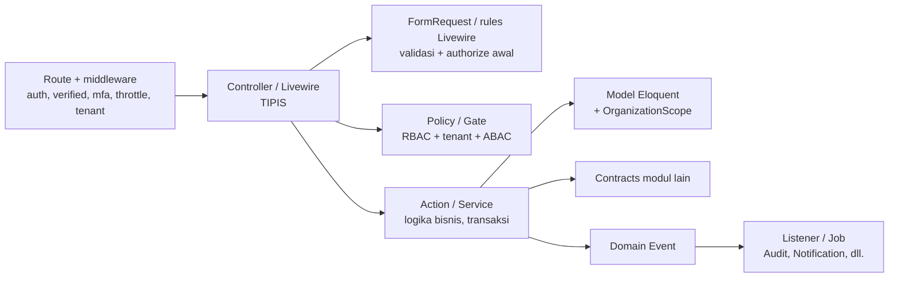

# 09 — Standar Pengembangan

> Status: **Disetujui untuk development** · Versi 1.0 · Pemilik: Tech Lead
>
> Dokumen ini adalah aturan kerja **wajib** bagi setiap orang yang menulis, meninjau, atau
> menggabungkan kode ke repositori STU LMS. Istilah mengikuti
> [`00-glosarium.md`](00-glosarium.md); struktur sistem mengikuti
> [`04-arsitektur-sistem.md`](04-arsitektur-sistem.md); model otorisasi & tenant mengikuti
> [`07-rbac-dan-multi-tenant.md`](07-rbac-dan-multi-tenant.md). Bila ada pertentangan, dokumen
> kanon tersebut yang berlaku dan dokumen ini wajib diperbaiki dalam PR terpisah.
>
> Kata kunci **WAJIB**, **DILARANG**, dan **SEBAIKNYA** dipakai seperti RFC 2119: WAJIB/DILARANG
> tidak boleh dilanggar tanpa pengecualian tertulis (ADR atau persetujuan Tech Lead + Security
> Lead yang dicatat di PR); SEBAIKNYA boleh disimpangi dengan alasan yang dijelaskan di PR.

## Daftar Isi

1. [Prinsip Kode](#1-prinsip-kode)
2. [Struktur Modul & Aturan Dependensi](#2-struktur-modul--aturan-dependensi)
3. [Lapisan (Layering) Aplikasi](#3-lapisan-layering-aplikasi)
4. [Standar PHP](#4-standar-php)
5. [Aturan Secure Coding Laravel (WAJIB)](#5-aturan-secure-coding-laravel-wajib)
6. [Aturan Frontend](#6-aturan-frontend)
7. [Aturan Migrasi Basis Data](#7-aturan-migrasi-basis-data)
8. [Penanganan Galat & Logging](#8-penanganan-galat--logging)
9. [Konvensi API](#9-konvensi-api)
10. [Alur Kerja Git](#10-alur-kerja-git)
11. [Checklist Code Review](#11-checklist-code-review)
12. [Definition of Ready & Definition of Done](#12-definition-of-ready--definition-of-done)
13. [Kebijakan Dependensi](#13-kebijakan-dependensi)
14. [Pengelolaan Secret](#14-pengelolaan-secret)
15. [Lingkungan Pengembangan Lokal](#15-lingkungan-pengembangan-lokal)
16. [Aturan Dokumentasi](#16-aturan-dokumentasi)
17. [Referensi](#17-referensi)

---

## 1. Prinsip Kode

| # | Prinsip | Artinya dalam praktik |
|---|---|---|
| P1 | **Server adalah sumber kebenaran** | Harga, skor, status kelulusan, peran, status pembayaran, dan `organization_id` selalu dihitung/ditentukan di server. Nilai dari klien (form, Livewire state, query string, header) hanya *masukan* yang divalidasi. |
| P2 | **Deny by default** | Setiap rute, aksi Livewire, job, dan perintah Artisan menolak kecuali otorisasi eksplisit lolos. Rute publik dideklarasikan dalam daftar yang ditinjau (lihat §5 SC-03). |
| P3 | **Eksplisit lebih baik daripada ajaib** | Hindari `$guarded = []`, *magic* string untuk izin, facade di lapisan domain bila dependency injection memungkinkan. Tipe dideklarasikan lengkap. |
| P4 | **Satu tanggung jawab per kelas** | Controller/Livewire hanya menerjemahkan HTTP ↔ domain. Logika bisnis ada di Action/Service. Satu Action = satu kasus penggunaan. |
| P5 | **Batas modul dihormati** | Modul hanya berbicara lewat `Contracts` dan `Events` (lihat §2). Pelanggaran gagal di CI. |
| P6 | **Idempoten & dapat diaudit** | Operasi finansial, penerbitan sertifikat, webhook, dan job dapat diulang tanpa efek ganda; aksi penting menerbitkan event yang dicatat modul `Audit`. |
| P7 | **Gagal tertutup (fail closed)** | Bila konteks tenant, izin, konfigurasi, atau layanan eksternal tidak tersedia, sistem menolak — bukan meloloskan. |
| P8 | **Kode dibaca lebih sering daripada ditulis** | Nama deskriptif, fungsi pendek (SEBAIKNYA ≤ 30 baris), tanpa komentar yang mengulang kode; komentar menjelaskan *mengapa*. |
| P9 | **Uji adalah bagian dari fitur** | Tidak ada fitur tanpa uji, termasuk uji negatif otorisasi & lintas tenant ([`10-strategi-pengujian.md`](10-strategi-pengujian.md)). |
| P10 | **Purwarupa hanyalah acuan UI** | Markup/kelas Tailwind dari `*.html` boleh dipakai ulang; logika di `assets/js/*` (mis. `store.js`, `certificate.js`) **tidak** di-*port* (lihat [`keamanan/16-temuan-keamanan-purwarupa.md`](keamanan/16-temuan-keamanan-purwarupa.md)). |

---

## 2. Struktur Modul & Aturan Dependensi

### 2.1 Struktur folder per modul

Daftar modul dan tanggung jawabnya ditetapkan di [`04-arsitektur-sistem.md` §6](04-arsitektur-sistem.md#6-modul-domain-modular-monolith).
Menambah modul baru **WAJIB** melalui ADR. Setiap modul memakai struktur berikut (subfolder
yang tidak dibutuhkan boleh tidak dibuat):

```
app/Modules/{Modul}/
  Actions/            # satu kelas = satu kasus penggunaan (write), mis. IssueCertificate
  Contracts/          # ANTARMUKA PUBLIK modul: interface layanan, DTO masukan/keluaran, enum publik
  Data/               # DTO internal (readonly class)
  Enums/              # enum internal (backed string enum sesuai glosarium)
  Events/             # ANTARMUKA PUBLIK modul: domain event (PastTense)
  Exceptions/         # exception domain dengan kode galat
  Http/
    Controllers/      # controller tipis (per area: Admin/, Trainer/, Participant/, Public/, Api/)
    Requests/         # FormRequest: validasi + otorisasi awal
    Resources/        # API Resource (transformasi keluaran JSON)
    Middleware/
  Jobs/               # job antrian (membawa actor & tenant context eksplisit)
  Listeners/          # konsumen event (dari modul sendiri atau modul lain)
  Livewire/           # komponen Livewire (tipis, sama seperti controller)
  Models/             # model Eloquent milik modul (hanya tabel milik modul ini)
  Policies/           # policy otorisasi (ABAC)
  Providers/          # {Modul}ServiceProvider: binding contract, event, rate limiter, gate
  Services/           # layanan domain yang dipakai beberapa Action / implementasi Contracts
app/Support/          # lintas modul, TANPA logika domain
  Security/           # CSP nonce, HtmlSanitizer, IdGenerator, SafeHttpClient, redaksi log
  Tenancy/            # TenantContext, ResolveTenantScope, OrganizationScope, BelongsToOrganization
  Money/              # Money value object (rupiah, integer)
  Pdf/                # abstraksi renderer/signer PDF
```

Migrasi tetap di `database/migrations/` (satu urutan global), view di `resources/views/{area}/...`,
rute di `routes/{web,api,webhooks,console}.php` — sesuai struktur target
[`04` §7](04-arsitektur-sistem.md#7-struktur-direktori-kode-target). Nama berkas migrasi
**WAJIB** memuat nama modul, mis. `2026_10_01_000000_certification_create_certificates_table.php`.

### 2.2 Aturan dependensi

| Aturan | Keterangan |
|---|---|
| D1 | Modul A **hanya boleh** memakai `App\Modules\B\Contracts\*` dan `App\Modules\B\Events\*` dari modul B. Semua namespace lain di B bersifat internal. |
| D2 | Modul **DILARANG** meng-*query* tabel milik modul lain (Eloquent, Query Builder, maupun SQL mentah). Data lintas modul diambil lewat interface di `Contracts` yang diimplementasikan modul pemilik. |
| D3 | Pengecualian tunggal: `App\Modules\Identity\Models\User` boleh dipakai modul lain **hanya** sebagai *type-hint* (pengguna terautentikasi, parameter Policy). Relasi Eloquent ke `User` dari modul lain dan query ke tabel Identity tetap dilarang. |
| D4 | `Audit`, `Notification`, `Reporting` hanya **mendengarkan event**; mereka tidak memanggil Action modul lain. Modul lain **DILARANG** bergantung pada ketiga modul ini (komunikasi satu arah melalui event). |
| D5 | `App\Support\*` **DILARANG** bergantung pada `App\Modules\*`. |
| D6 | Siklus dependensi antarmodul (A→B→A melalui `Contracts`) dilarang; pecah dengan event. |
| D7 | Event adalah kontrak publik: payload berisi ID (UUID) dan nilai skalar/DTO, **bukan** model Eloquent, agar pendengar di modul lain tidak memegang model milik modul pemilik. Perubahan payload yang tidak kompatibel = versi event baru. |

### 2.3 Penegakan dengan Pest Arch

Aturan di atas diuji otomatis di `tests/Arch/` dan **WAJIB** lulus di CI (job `test`). Contoh
inti:

```php
<?php

declare(strict_types=1);

// tests/Arch/ModuleBoundariesTest.php

const MODULES = [
    'Identity', 'Access', 'Organization', 'Catalog', 'Learning', 'Assessment', 'Enrollment',
    'Assignment', 'Attendance', 'LiveClass', 'Certification', 'Payment', 'Engagement',
    'Notification', 'Reporting', 'Integration', 'Cms', 'Privacy', 'Audit',
];

const INTERNAL_NAMESPACES = [
    'Actions', 'Data', 'Enums', 'Exceptions', 'Http', 'Jobs', 'Listeners', 'Livewire',
    'Models', 'Policies', 'Providers', 'Services',
];

foreach (MODULES as $module) {
    foreach (array_diff(MODULES, [$module]) as $other) {
        arch("{$module} hanya memakai Contracts/Events milik {$other}")
            ->expect("App\\Modules\\{$module}")
            ->not->toUse(array_map(
                fn (string $ns): string => "App\\Modules\\{$other}\\{$ns}",
                INTERNAL_NAMESPACES,
            ))
            ->ignoring('App\Modules\Identity\Models\User'); // aturan D3
    }
}

arch('modul lain tidak bergantung pada Audit/Notification/Reporting')
    ->expect(array_map(
        fn (string $m): string => "App\\Modules\\{$m}",
        array_diff(MODULES, ['Audit', 'Notification', 'Reporting']),
    ))
    ->not->toUse(['App\Modules\Audit', 'App\Modules\Notification', 'App\Modules\Reporting']);

arch('Support tidak bergantung pada Modules')
    ->expect('App\Support')->not->toUse('App\Modules');

arch('strict types di seluruh kode')->expect('App')->toUseStrictTypes();
arch('preset keamanan Pest')->preset()->security()->ignoring('App\Support\Security\IdGenerator');
arch('preset Laravel')->preset()->laravel();

arch('HTTP keluar hanya lewat SafeHttpClient')
    ->expect('Illuminate\Support\Facades\Http')
    ->toOnlyBeUsedIn('App\Support\Security');

arch('Process hanya di layanan yang disetujui')
    ->expect('Illuminate\Support\Facades\Process')
    ->toOnlyBeUsedIn(['App\Support\Pdf', 'App\Modules\Learning\Services\Transcoding']);

arch('env() hanya di config/')->expect('env')->not->toBeUsedIn('App');
arch('tanpa fungsi debug')->expect(['dd', 'dump', 'ddd', 'ray', 'var_dump', 'print_r'])->not->toBeUsed();

arch('Controller & Livewire tidak memakai DB facade')
    ->expect(array_merge(
        array_map(fn ($m) => "App\\Modules\\{$m}\\Http", MODULES),
        array_map(fn ($m) => "App\\Modules\\{$m}\\Livewire", MODULES),
    ))
    ->not->toUse('Illuminate\Support\Facades\DB');

arch('DTO adalah readonly')->expect('App\Modules\*\Data')->toBeReadonly();
arch('Action bersifat final')->expect('App\Modules\*\Actions')->toBeFinal();
```

> Bila Pest tidak mendukung *wildcard* namespace pada versi yang dipakai, ekspansi dilakukan
> dengan perulangan `MODULES` seperti contoh pertama. Aturan D2 (query tabel modul lain lewat
> Query Builder/SQL mentah) juga dicek dengan aturan Semgrep kustom di
> [`keamanan/14-secure-sdlc-dan-supply-chain.md`](keamanan/14-secure-sdlc-dan-supply-chain.md).

---

## 3. Lapisan (Layering) Aplikasi



| Lapisan | Boleh | Dilarang |
|---|---|---|
| **Route** | Middleware `auth`, `verified`, `mfa`, `throttle:*`, `signed`, `ResolveTenantScope`; `scopeBindings()` untuk rute bersarang. | Closure berisi logika bisnis. |
| **Controller / Livewire** | Menerima request, memanggil `authorize()`, memanggil satu Action, mengembalikan view/redirect/Resource. | Query Eloquent kompleks, `DB::`, perhitungan harga/skor, `Http::`, logika percabangan bisnis. |
| **FormRequest** | Aturan validasi, normalisasi input (`prepareForValidation`), `authorize()` yang mendelegasikan ke Policy, konversi ke DTO (`toData()`). | Menyimpan data, efek samping. |
| **Policy** | Pemeriksaan izin `resource.action` (via `Access\Contracts\PermissionChecker`), scope tenant, kepemilikan & kondisi bisnis (SoD). Mengembalikan `Response::denyAsNotFound()` untuk objek di luar scope. | Query berat, efek samping, `Gate::before` yang meloloskan `super_admin` (merusak SoD — lihat 07 §3). |
| **Action / Service** | Logika bisnis, `DB::transaction`, `lockForUpdate`, memanggil Contracts modul lain, menerbitkan event, dispatch job `afterCommit`. | Mengakses `request()`, `auth()`, `session()` secara global — actor & konteks **dioper sebagai parameter**. |
| **Model** | Relasi (dalam modul sendiri), casts, scope lokal, accessor sederhana. | Logika bisnis lintas entitas, pemanggilan layanan eksternal di *model event*. |

### 3.1 Contoh alur lengkap (controller)

Kasus: trainer mengubah jadwal kelas yang diampu (07 §5: "📚 lihat & ubah jadwal").

```php
<?php

declare(strict_types=1);

namespace App\Modules\Learning\Http\Requests\Trainer;

use App\Modules\Learning\Data\CourseClassScheduleData;
use App\Modules\Learning\Models\CourseClass;
use Illuminate\Foundation\Http\FormRequest;

final class UpdateCourseClassScheduleRequest extends FormRequest
{
    public function authorize(): bool
    {
        /** @var CourseClass $courseClass */
        $courseClass = $this->route('courseClass');

        return $this->user()->can('updateSchedule', $courseClass);
    }

    /** @return array<string, list<mixed>> */
    public function rules(): array
    {
        return [
            'starts_at' => ['required', 'date', 'after:now'],
            'ends_at'   => ['required', 'date', 'after:starts_at'],
            'note'      => ['nullable', 'string', 'max:500'],
        ];
    }

    public function toData(): CourseClassScheduleData
    {
        return CourseClassScheduleData::fromValidated($this->validated());
    }
}
```

```php
<?php

declare(strict_types=1);

namespace App\Modules\Learning\Http\Controllers\Trainer;

final class CourseClassScheduleController
{
    public function update(
        UpdateCourseClassScheduleRequest $request,
        CourseClass $courseClass,
        UpdateCourseClassSchedule $updateSchedule,
    ): RedirectResponse {
        $updateSchedule->handle($request->user(), $courseClass, $request->toData());

        return to_route('trainer.course-classes.show', $courseClass)
            ->with('status', __('learning.schedule.updated'));
    }
}
```

```php
<?php

declare(strict_types=1);

namespace App\Modules\Learning\Actions;

final class UpdateCourseClassSchedule
{
    public function handle(User $actor, CourseClass $courseClass, CourseClassScheduleData $data): CourseClass
    {
        return DB::transaction(function () use ($actor, $courseClass, $data): CourseClass {
            $courseClass = CourseClass::query()->lockForUpdate()->findOrFail($courseClass->id);

            if ($courseClass->isClosed()) {
                throw new CourseClassClosedException();
            }

            $previous = $courseClass->only(['starts_at', 'ends_at']);
            $courseClass->forceFill([
                'starts_at' => $data->startsAt,
                'ends_at'   => $data->endsAt,
            ])->save();

            CourseClassRescheduled::dispatch($courseClass->id, $actor->id, $previous, $data->toArray());

            return $courseClass;
        });
    }
}
```

```php
<?php

declare(strict_types=1);

namespace App\Modules\Learning\Policies;

use App\Modules\Access\Contracts\PermissionChecker;
use Illuminate\Auth\Access\Response;

final class CourseClassPolicy
{
    public function __construct(private readonly PermissionChecker $permissions) {}

    public function updateSchedule(User $user, CourseClass $courseClass): Response
    {
        if (! $this->permissions->has($user, 'course_class.update')) {
            return Response::deny();
        }
        if (! $courseClass->isTaughtBy($user->id)) {
            return Response::denyAsNotFound(); // jangan bocorkan keberadaan kelas
        }

        return $courseClass->isClosed()
            ? Response::deny(__('learning.class_closed'))
            : Response::allow();
    }
}
```

> Catatan: `forceFill` dipakai di Action karena kolom yang diisi ditentukan eksplisit oleh
> kode (bukan dari array request). `forceFill($request->all())` tetap **DILARANG**.

---

## 4. Standar PHP

### 4.1 Versi & gaya

- PHP **8.3** minimum, **8.4** direkomendasikan (sesuai 04 §3). Fitur baru yang hanya ada di 8.4
  (mis. *property hooks*, *asymmetric visibility*) baru boleh dipakai setelah seluruh lingkungan
  memakai 8.4 (ditetapkan via ADR).
- Gaya kode **PSR-12**, ditegakkan dengan **Laravel Pint**. CI menjalankan `pint --test`; PR
  gagal bila ada pelanggaran.

```json
// pint.json
{
  "preset": "psr12",
  "rules": {
    "declare_strict_types": true,
    "ordered_imports": { "sort_algorithm": "alpha" },
    "no_unused_imports": true,
    "fully_qualified_strict_types": true,
    "strict_comparison": true,
    "strict_param": true,
    "void_return": true,
    "single_quote": true,
    "trailing_comma_in_multiline": true,
    "array_syntax": { "syntax": "short" }
  },
  "exclude": ["bootstrap/cache", "storage"]
}
```

### 4.2 `declare(strict_types=1)`

**WAJIB** di setiap berkas PHP di `app/`, `database/`, `config/`, `routes/`, `tests/`
(ditegakkan oleh Pint `declare_strict_types` dan Pest `toUseStrictTypes()`). Pengecualian
hanya untuk *view* Blade.

### 4.3 Analisis statis — PHPStan/Larastan

- **Larastan** dengan `level: max` (setara ≥ 8 — tidak pernah diturunkan).
- Ekstensi wajib: `phpstan/phpstan-strict-rules`, `phpstan/phpstan-deprecation-rules`,
  `spaze/phpstan-disallowed-calls` (daftar fungsi terlarang §5 SC-07/SC-10).
- *Baseline* (`phpstan-baseline.neon`) **hanya boleh menyusut**. Menambah entri baseline untuk
  kode baru **DILARANG**; CI membandingkan jumlah entri dengan `main`.
- `@phpstan-ignore` wajib menyebut identifier galat dan alasan:
  `// @phpstan-ignore argument.type (Livewire mengisi properti via hydrator)`.

```neon
# phpstan.neon
includes:
    - vendor/larastan/larastan/extension.neon
    - vendor/phpstan/phpstan-strict-rules/rules.neon
    - vendor/phpstan/phpstan-deprecation-rules/rules.neon
    - vendor/spaze/phpstan-disallowed-calls/extension.neon
    - phpstan-disallowed.neon
    - phpstan-baseline.neon
parameters:
    level: max
    paths: [app, config, database, routes]
    checkMissingIterableValueType: true
    reportUnmatchedIgnoredErrors: true
```

### 4.4 Rector

- Rector (dengan `driftingly/rector-laravel`) dipakai untuk modernisasi & konsistensi: set
  `LevelSetList::UP_TO_PHP_83`, `SetList::TYPE_DECLARATION`, `SetList::DEAD_CODE`,
  `SetList::CODE_QUALITY`, `LaravelSetList::LARAVEL_CODE_QUALITY`.
- CI menjalankan `rector --dry-run`; perubahan diterapkan lokal dengan `composer rector`.

### 4.5 Konvensi penamaan

Identifier kode **selalu Bahasa Inggris** sesuai kolom "Istilah di kode" di
[`00-glosarium.md`](00-glosarium.md) (mis. `CourseClass`, bukan `Kelas`/`Batch`; `Participant`,
bukan `Mahasiswa`). Istilah baru ditambahkan ke glosarium **sebelum** dipakai di kode.

| Objek | Konvensi | Contoh |
|---|---|---|
| Namespace modul | `App\Modules\{Modul}` (PascalCase, nama sesuai 04 §6) | `App\Modules\Certification` |
| Model | PascalCase tunggal; tabel jamak `snake_case` | `ExamAttempt` → `exam_attempts` |
| Controller | `{Resource}Controller` atau *invokable* `{Verb}{Resource}Controller` | `CourseClassController`, `RevokeCertificateController` |
| FormRequest | `{Verb}{Resource}Request` | `StoreSubmissionRequest` |
| Action | `{Verb}{Noun}`, metode tunggal `handle()` | `IssueCertificate`, `RedeemCoupon` |
| Service | `{Noun}Service` / nama peran | `CertificateNumberService` |
| Contract | kata benda tanpa sufiks `Interface` | `Contracts\EnrollmentDirectory`, `Contracts\PermissionChecker` |
| DTO | `{Noun}Data` (`final readonly class`) | `CourseClassScheduleData` |
| Enum | PascalCase; *case* PascalCase, *value* `snake_case` sesuai glosarium §4 | `EnrollmentStatus::PendingApproval = 'pending_approval'` |
| Event | `PastTense` | `CertificateIssued`, `PaymentSettled` |
| Listener | `{Verb}{Noun}` (+ `On{Event}` bila ambigu) | `RecordAuditOnCertificateIssued` |
| Job | kalimat perintah | `GenerateCertificatePdf` |
| Exception | `{Reason}Exception` | `CouponQuotaExceededException` |
| Policy | `{Model}Policy`, metode = aksi | `CertificatePolicy::revoke()` |
| Livewire | `App\Modules\{Modul}\Livewire\{Area}\{Name}` | `Assessment\Livewire\Participant\AttemptRunner` |
| Izin | `resource.action` (07 §4) | `certificate.approve` |
| Nama rute | `{area}.{resource}.{action}` (Inggris) | `admin.certificates.revoke` |
| URL web | Area admin/trainer/peserta & API: Inggris `kebab-case` jamak; halaman publik yang dilihat masyarakat boleh Bahasa Indonesia | `/admin/course-classes/{id}`, `/verifikasi/{code}` |
| Metode & variabel | camelCase | `$verificationCode` |
| Konstanta | `UPPER_SNAKE_CASE` | `MAX_ATTEMPTS` |
| Kunci config / cache | `snake_case` / `org:{id}:...` | `services.midtrans.server_key`, `org:{uuid}:report:summary` |
| View Blade | `kebab-case` | `resources/views/trainer/learning/lesson-editor.blade.php` |

### 4.6 Teks UI & lokalisasi

- Semua teks yang dilihat pengguna (label, pesan validasi, flash, email, notifikasi, PDF) dalam
  **Bahasa Indonesia** melalui berkas bahasa di `lang/id/` — **DILARANG** menulis string UI
  langsung di PHP/Blade.
- Struktur: `lang/id/{modul}.php` (kunci bahasa Inggris `snake_case`), `lang/id/validation.php`
  (pesan validasi + `attributes`), `lang/id/auth.php`, `lang/id/passwords.php`.
  `APP_LOCALE=id`, `APP_FALLBACK_LOCALE=id`.
- Label status diambil dari enum: `EnrollmentStatus::PendingApproval->label()` →
  `__('enrollment.status.pending_approval')` → "Menunggu Approval" (glosarium §4).
- Format tanggal/angka/uang untuk tampilan: zona `Asia/Jakarta` (penyimpanan selalu UTC),
  `Number::currency($amount, 'IDR', 'id')`.

### 4.7 Praktik tipe & kelas

- Semua parameter, properti, dan nilai kembali diberi tipe; `mixed` hanya dengan alasan.
- Array ber-bentuk dijelaskan dengan PHPDoc generik (`array<string, int>`, `list<Uuid>`) atau
  diganti DTO.
- Kelas `final` secara default; `readonly` untuk DTO & *value object*.
- Perbandingan selalu `===`/`!==`; `in_array($x, $list, true)`.
- Uang **selalu integer rupiah** (`bigint`) melalui `App\Support\Money` — **DILARANG** `float`.
- Waktu melalui `CarbonImmutable` (`Date::use(CarbonImmutable::class)`), disimpan UTC.

---

## 5. Aturan Secure Coding Laravel (WAJIB)

Aturan berikut adalah minimum. Latar belakang ancaman ada di
[`keamanan/01-model-ancaman.md`](keamanan/01-model-ancaman.md); kontrol terperinci per area
ada di dokumen `keamanan/` yang ditautkan pada tiap aturan. Pelanggaran aturan bertanda
**[CI]** digagalkan otomatis; sisanya diperiksa pada code review (§11).

### SC-01 — Mass assignment: hanya data tervalidasi & `$fillable` eksplisit **[CI]**

```php
// SALAH
Enrollment::create($request->all());
$user->update($request->input());
protected $guarded = [];          // DILARANG
Model::unguard();                 // DILARANG

// BENAR
$enrollment = Enrollment::create($request->validated());          // atau $request->safe()->only([...])
$enrollment = $createEnrollment->handle($actor, $request->toData()); // lebih baik: DTO → Action

protected $fillable = ['title', 'description', 'starts_at', 'ends_at']; // eksplisit
```

- Kolom sensitif — `organization_id`, `role`, `status`, `score`, `price`, `gross_amount`,
  `is_*`, `*_verified_at`, `approved_by` — **tidak pernah** ada di `$fillable`; diisi Action
  secara eksplisit (`forceFill` dengan array literal) atau oleh trait tenancy.
- Validasi tanpa aturan = kolom tidak ikut di `validated()`. Jangan menambah `'field' => []`
  hanya agar lolos.

### SC-02 — Eloquent ketat di non-produksi

Di `AppServiceProvider::boot()`:

```php
Model::preventSilentlyDiscardingAttributes(! $this->app->isProduction());
Model::preventAccessingMissingAttributes(! $this->app->isProduction());
Model::preventLazyLoading();                       // semua lingkungan

if ($this->app->isProduction()) {
    Model::handleLazyLoadingViolationUsing(function (Model $model, string $relation): void {
        Log::warning('eloquent.lazy_loading_violation', [
            'model' => $model::class, 'relation' => $relation,
        ]);                                         // produksi: catat, jangan crash
    });
}

DB::prohibitDestructiveCommands($this->app->isProduction()); // migrate:fresh, db:wipe, dll.
if ($this->app->environment(['staging', 'production'])) {
    URL::forceScheme('https');
}
```

Aplikasi juga **WAJIB** menolak *boot* bila `APP_DEBUG=true` di `staging`/`production`.

### SC-03 — Otorisasi di setiap controller & aksi **[CI sebagian]**

- Setiap metode controller yang menyentuh data **WAJIB** memanggil `$this->authorize()` /
  `Gate::authorize()` / `FormRequest::authorize()` yang mendelegasikan ke Policy. Tidak cukup
  hanya middleware `auth`.
- Objek di luar scope tenant/kepemilikan → **404** (`Response::denyAsNotFound()`), sesuai
  07 §1.
- Rute bersarang memakai `->scopeBindings()` agar `{courseClass}/{lesson}` tidak dapat
  dikombinasikan silang.
- `Gate::before()` yang mengembalikan `true` untuk peran apa pun **DILARANG** (merusak SoD).
- Uji `tests/Security/RouteAuthorizationTest.php` memastikan setiap rute punya middleware
  `auth` kecuali yang tercantum di `config/security.php` → `public_routes` (daftar yang
  ditinjau CODEOWNERS).

```php
// SALAH — hanya mengandalkan ID dari URL
public function show(string $id) {
    return view('participant.certificates.show', ['certificate' => Certificate::findOrFail($id)]);
}

// BENAR
public function show(Certificate $certificate): View
{
    $this->authorize('view', $certificate);   // izin + tenant + pemilik (404 bila bukan)
    return view('participant.certificates.show', compact('certificate'));
}
```

### SC-04 — Livewire: state publik dapat dimanipulasi klien

Semua properti publik dan **semua metode publik** komponen Livewire dapat diubah/dipanggil
dari browser. Perlakukan setiap aksi Livewire seperti endpoint HTTP publik.

- ID/konteks yang tidak boleh berubah → `#[Locked]`.
- **Otorisasi ulang di setiap aksi**, bukan hanya di `mount()`.
- Muat ulang model dari DB (dengan scope) di setiap aksi; **jangan percaya** ID, harga, skor,
  status, atau peran dari state komponen.
- Validasi setiap aksi (`$this->validate()` / Form object). Parameter metode aksi juga masukan
  klien.
- Helper internal dibuat `protected`/`private` (tidak dapat dipanggil dari klien).
- Unggahan (`WithFileUploads`) divalidasi tipe & ukuran; berkas sementara dipindahkan lewat
  layanan berkas (SC-09).

```php
// SALAH
final class AttemptRunner extends Component
{
    public string $attemptId;          // dapat diganti ke attempt peserta lain
    public int $score = 0;             // dapat diubah klien

    public function submit(): void
    {
        ExamAttempt::find($this->attemptId)->update(['score' => $this->score]); // IDOR + manipulasi skor
    }
}

// BENAR
final class AttemptRunner extends Component
{
    #[Locked]
    public string $attemptId;

    /** @var array<string, string> questionId => optionId */
    public array $answers = [];

    public function mount(ExamAttempt $attempt): void
    {
        $this->authorize('continue', $attempt);
        $this->attemptId = $attempt->id;
    }

    public function saveAnswer(string $questionId): void
    {
        $attempt = $this->attempt();
        $this->authorize('answer', $attempt);            // otorisasi ulang tiap aksi

        $validated = $this->validate([
            "answers.{$questionId}" => ['required', 'uuid'],
        ]);

        resolve(SaveAttemptAnswer::class)->handle(
            actor: auth()->user(),
            attempt: $attempt,
            questionId: $questionId,                      // Action memverifikasi soal milik attempt
            optionId: $validated['answers'][$questionId],
        );
    }

    public function submit(): void
    {
        $attempt = $this->attempt();
        $this->authorize('submit', $attempt);
        resolve(SubmitAttempt::class)->handle(auth()->user(), $attempt); // skor dihitung di server
    }

    private function attempt(): ExamAttempt
    {
        return ExamAttempt::query()->findOrFail($this->attemptId); // scope tenant + RLS berlaku
    }
}
```

Lihat [`keamanan/08-integritas-ujian-dan-penilaian.md`](keamanan/08-integritas-ujian-dan-penilaian.md).

### SC-05 — SQL: selalu *binding*, tanpa konkatenasi **[CI]**

```php
// SALAH
DB::select("SELECT * FROM users WHERE email = '{$email}'");
$query->whereRaw("lower(name) like '%{$term}%'");
$query->orderBy($request->input('sort'));               // nama kolom dari klien

// BENAR
DB::select('SELECT id FROM users WHERE lower(email) = lower(?)', [$email]);
$query->whereRaw('lower(name) LIKE ?', ['%'.addcslashes(mb_strtolower($term), '%_\\').'%']);
$sort = match ($request->validated('sort')) {           // allowlist
    'name' => 'name', 'created' => 'created_at', default => 'created_at',
};
$query->orderBy($sort);
```

- `DB::raw()`, `selectRaw`, `whereRaw`, `orderByRaw`, `DB::statement`, `DB::unprepared` di luar
  `database/migrations/` **WAJIB** memakai *binding* dan diberi label review `sql-raw`
  (Semgrep menandai; reviewer kedua memeriksa).
- Nama tabel/kolom tidak pernah berasal dari input pengguna.

### SC-06 — Output Blade: `{{ }}` saja **[CI]**

- `{!! !!}` **DILARANG** (Semgrep/grep di CI), **kecuali** di dalam komponen
  `<x-safe-html>` yang memanggil `App\Support\Security\HtmlSanitizer` (HTMLPurifier dengan
  profil allowlist per konteks).
- Konten kaya (deskripsi program, isi lesson `text`, diskusi) disanitasi **saat disimpan** dan
  dirender lewat komponen yang sama (pertahanan berlapis).
- Data ke JavaScript melalui atribut `data-*` dengan `{{ }}` atau `@js()` — tidak pernah
  `{!! json_encode(...) !!}`.
- Ekspor CSV/XLSX: nilai yang diawali `=`, `+`, `-`, `@`, tab, atau CR diberi prefiks `'`
  (anti *CSV/formula injection*).

```blade
{{-- SALAH --}}
<div>{!! $lesson->body !!}</div>
<a href="{{ $user->website }}">situs</a>   {{-- javascript: URL tetap berbahaya --}}

{{-- BENAR --}}
<x-safe-html :html="$lesson->body" profile="lesson" />
<a href="{{ \App\Support\Security\SafeUrl::http($user->website) }}" rel="noopener noreferrer nofollow" target="_blank">situs</a>
```

Detail: [`keamanan/04-validasi-input-dan-output.md`](keamanan/04-validasi-input-dan-output.md).

### SC-07 — Fungsi berbahaya dilarang **[CI]**

| Dilarang | Alternatif |
|---|---|
| `eval`, `create_function`, `assert` dengan string, `preg_replace` modifier `/e` | Tidak ada — desain ulang. |
| `unserialize()` pada data yang dapat dipengaruhi pengguna (termasuk cookie, cache bersama, payload webhook) | `json_decode($json, true, 512, JSON_THROW_ON_ERROR)`; bila terpaksa `unserialize($x, ['allowed_classes' => false])` dengan review. |
| `exec`, `shell_exec`, `system`, `passthru`, `proc_open`, `popen`, backtick | `Process::run([...])` dengan **argumen array** (tanpa shell), hanya di namespace yang diizinkan (§2.3). |
| `extract`, `parse_str` tanpa argumen kedua, variabel variabel (`$$name`) | Akses eksplisit. |
| `include`/`require` dengan path dari input | Peta statis. |
| `md5`/`sha1` untuk keamanan | `hash('sha256')`, `hash_hmac('sha256', ...)`, `Hash::make()` (Argon2id) untuk kata sandi. |

```php
// SALAH
shell_exec("ffmpeg -i {$path} -f hls {$out}");
Process::run("ffmpeg -i {$path} ...");                     // string → dieksekusi via shell

// BENAR
Process::timeout(900)->run(['ffmpeg', '-nostdin', '-i', $path, '-f', 'hls', $out])->throw();
```

### SC-08 — HTTP keluar: SafeHttpClient, allowlist, timeout **[CI]**

- `Http::` hanya dipakai di `App\Support\Security\SafeHttpClient` (ditegakkan Pest Arch).
  Modul memakai klien ini melalui konfigurasi `config/egress.php` (allowlist host per integrasi:
  Midtrans, penyedia email, WhatsApp BSP, IdP, KMS).
- Wajib: hanya `https`, port 443, tanpa kredensial di URL, host di allowlist, IP hasil resolusi
  **bukan** privat/loopback/link-local/metadata (`169.254.169.254`), IP dipin (anti DNS
  rebinding), redirect dimatikan, `timeout` & `connectTimeout` eksplisit, batas ukuran respons.
- URL yang dimasukkan pengguna (mis. `webhook_endpoints` mitra) divalidasi saat disimpan
  **dan** setiap kali dikirim; allowlist diganti dengan penolakan IP privat + egress proxy.

```php
// SALAH
$response = Http::get($request->input('callback_url'));  // SSRF, tanpa timeout

// BENAR (ringkas — implementasi lengkap di App\Support\Security\SafeHttpClient)
final class SafeHttpClient
{
    public function get(string $integration, string $url, array $query = []): Response
    {
        $target = $this->resolveAllowed($integration, $url); // cek scheme, host allowlist, IP publik
        return Http::timeout(10)
            ->connectTimeout(3)
            ->withOptions([
                'allow_redirects' => false,
                'curl' => [CURLOPT_RESOLVE => ["{$target->host}:443:{$target->ip}"]],
            ])
            ->withHeaders(['X-Request-Id' => RequestId::current()])
            ->get($url, $query);
    }
}
```

Detail: [`keamanan/10-keamanan-api-dan-integrasi.md`](keamanan/10-keamanan-api-dan-integrasi.md).

### SC-09 — Berkas: Storage, nama acak, privat

```php
// SALAH
$name = $request->file('file')->getClientOriginalName();
$request->file('file')->move(public_path('uploads'), $name);        // path traversal, eksekusi, publik

// BENAR
$validated = $request->validate([
    'file' => ['required', File::types(['pdf', 'docx', 'zip'])->max(20 * 1024)],
]);
// organization_id diambil dari enrollment (server), bukan dari input
$path = $validated['file']->store("org/{$enrollment->organization_id}/submissions/quarantine", 's3');
// nama acak (hashName), disk privat; nama asli disimpan tersanitasi di DB hanya untuk tampilan
ScanUploadedFile::dispatch($path, $tenantContext)->onQueue('security');
```

- Disk untuk unggahan pengguna selalu **privat**; `public` disk hanya untuk aset statis.
- Berkas dikarantina sampai lolos pemindaian malware (04 §9); diakses hanya lewat
  `Storage::temporaryUrl()` berumur pendek setelah Policy lolos, dengan
  `ResponseContentDisposition=attachment`.
- SVG/HTML dari pengguna **DILARANG** disajikan inline; gambar di-*re-encode* (hapus EXIF).
- Detail: [`keamanan/05-keamanan-berkas-dan-media.md`](keamanan/05-keamanan-berkas-dan-media.md).

### SC-10 — Keacakan & perbandingan **[CI]**

```php
// SALAH
$token = md5(uniqid());               // dapat ditebak
$code  = (string) mt_rand(100000, 999999);
if ($request->token === $stored) {}   // timing attack

// BENAR
$token = Str::random(64);                              // CSPRNG (random_bytes)
$otp   = (string) random_int(100000, 999999);
$code  = IdGenerator::verificationCode();              // 12 char Crockford Base32, 60-bit
$tokenHash = hash('sha256', $token);                   // simpan hash, bukan token
if (! hash_equals($storedHash, hash('sha256', $provided))) { abort(404); }
if (! hash_equals($expectedSignature, (string) $request->input('signature_key'))) { /* tolak */ }
```

- `rand`, `mt_rand`, `uniqid`, `lcg_value`, `array_rand`, `shuffle`, `str_shuffle` untuk nilai
  keamanan **DILARANG** (disallowed-calls + Pest `preset()->security()`).
- Kata sandi hanya `Hash::make()`/`Hash::check()` (Argon2id) — bukan `hash_equals`.
- Primary key UUIDv7 (`HasUuids`); nomor bisnis terbaca manusia dibuat terpisah (ADR-006).

### SC-11 — Kolom sensitif terenkripsi

```php
protected function casts(): array
{
    return [
        'national_id'   => 'encrypted',            // NIK
        'mfa_secret'    => 'encrypted',
        'recovery_codes'=> AsEncryptedCollection::class,
        'issued_at'     => 'immutable_datetime',
    ];
}
protected $hidden = ['password', 'remember_token', 'mfa_secret', 'recovery_codes', 'national_id'];
```

- Pencarian pada kolom terenkripsi memakai *blind index* (`national_id_bidx` = HMAC-SHA256
  dengan kunci terpisah), bukan dekripsi massal.
- Rotasi `APP_KEY` memakai `APP_PREVIOUS_KEYS`; *envelope encryption* dengan KMS sesuai
  [`keamanan/06-kriptografi-dan-manajemen-kunci.md`](keamanan/06-kriptografi-dan-manajemen-kunci.md).

### SC-12 — Secret & logging tanpa PII **[CI sebagian]**

- Secret hanya dibaca via `config()`; `env()` hanya di `config/*.php` (Pest Arch). Secret tidak
  pernah di kode, test fixture, pesan exception, payload job/antrian, atau log.
- Parameter berisi secret/kata sandi ditandai `#[\SensitiveParameter]` agar tidak muncul di
  stack trace.
- Log memakai konteks terstruktur berisi **ID**, bukan data pribadi. Monolog processor
  `App\Support\Security\Logging\RedactSensitiveFields` menyamarkan kunci: `password*`,
  `*token*`, `*secret*`, `otp`, `authorization`, `cookie`, `email`, `phone`, `national_id`,
  `address`, `card*`, `signature_key`.

```php
// SALAH
Log::info("Login gagal untuk {$email} dengan password {$password}");
Log::debug('webhook', $request->all());

// BENAR
Log::warning('identity.login_failed', ['user_id' => $user?->id, 'reason' => 'invalid_credentials']);
Log::info('payment.webhook_received', ['order_id' => $orderId, 'transaction_status' => $status]);
```

Detail: [`keamanan/11-logging-audit-dan-monitoring.md`](keamanan/11-logging-audit-dan-monitoring.md),
[`keamanan/12-privasi-data-dan-kepatuhan-uu-pdp.md`](keamanan/12-privasi-data-dan-kepatuhan-uu-pdp.md).

### SC-13 — Scope tenant **[CI sebagian]**

- Model ber-tenant **WAJIB** memakai trait `App\Support\Tenancy\BelongsToOrganization`
  (menambah `OrganizationScope` dan mengisi `organization_id` dari `TenantContext` saat
  `creating`; kolom tidak dapat diubah setelahnya).
- `withoutGlobalScope(OrganizationScope::class)` / `withoutGlobalScopes()` **DILARANG** kecuali
  di kelas yang terdaftar di `config/security.php` → `tenant_scope_bypass` (ditinjau
  CODEOWNERS; dicek Semgrep).
- Aturan validasi `exists`/`unique` **tidak** menerapkan global scope Eloquent — selalu tambahkan
  batas tenant atau validasi lewat model ber-scope:

```php
// SALAH — ID kelas organisasi lain lolos validasi
'course_class_id' => ['required', 'exists:course_classes,id'],

// BENAR
'course_class_id' => ['required', 'uuid', Rule::exists('course_classes', 'id')
    ->where(fn ($q) => $q->whereIn('organization_id', $tenant->organizationIds()))],
// lalu tetap: $this->authorize('enroll', CourseClass::findOrFail($id));
```

- Kunci cache wajib memuat `organization_id`/`user_id` (`org:{id}:...`), path object storage
  `org/{organization_id}/...` (07 §6.2). RLS di basis data adalah lapis kedua, bukan pengganti.
- Detail: [`keamanan/03-otorisasi-dan-isolasi-tenant.md`](keamanan/03-otorisasi-dan-isolasi-tenant.md).

### SC-14 — Rate limiting

Setiap endpoint yang dapat disalahgunakan (login, OTP, reset kata sandi, verifikasi sertifikat,
checkout, kupon, unggah, ekspor, API mitra) **WAJIB** diberi limiter bernama yang didefinisikan
di ServiceProvider modul. Nilai batas mengikuti
[`03-kebutuhan-non-fungsional.md`](03-kebutuhan-non-fungsional.md) dan
[`keamanan/02-autentikasi-dan-sesi.md`](keamanan/02-autentikasi-dan-sesi.md); angka di bawah
hanya ilustrasi.

```php
RateLimiter::for('certificate-verification', fn (Request $request) => [
    Limit::perMinute(30)->by($request->ip()),
]);
Route::get('/verifikasi/{code}', ShowVerificationController::class)
    ->middleware('throttle:certificate-verification');

// Aksi Livewire (tidak melalui middleware rute per aksi)
$key = 'coupon-redeem:'.auth()->id();
if (RateLimiter::tooManyAttempts($key, maxAttempts: 5)) {
    throw ValidationException::withMessages(['code' => __('payment.coupon.too_many_attempts')]);
}
RateLimiter::hit($key, decaySeconds: 300);
```

### SC-15 — Signed URL

- Tautan unduhan/aksi tanpa sesi (undangan, unduh laporan, *unsubscribe*) memakai
  `URL::temporarySignedRoute()` + middleware `signed`, dengan masa berlaku sependek mungkin
  (unduh laporan: 15 menit — 04 §9).
- Berkas di object storage: `Storage::temporaryUrl($path, now()->addMinutes(5))`, diterbitkan
  **setelah** Policy lolos. Signed URL bukan pengganti otorisasi untuk data pribadi — rute yang
  menampilkan data pribadi tetap memerlukan `auth`.
- **DILARANG** `URL::signedRoute()` tanpa kedaluwarsa untuk sumber daya privat.

### SC-16 — Job antrian membawa actor & tenant eksplisit

Job tidak mewarisi konteks request (07 §6.2). Kirim **ID** (bukan model ber-tenant) dan
`TenantContext` eksplisit; middleware job menyetel variabel RLS sebelum model dimuat.

```php
// SALAH — memuat model di worker tanpa konteks tenant; actor tidak diketahui
GenerateCertificatePdf::dispatch($certificate);

// BENAR
final class GenerateCertificatePdf implements ShouldQueue, ShouldBeUnique
{
    use Queueable;

    public int $tries = 5;

    public function __construct(
        public readonly string $certificateId,
        public readonly TenantContext $tenant,    // actorId, organizationIds, isPlatformStaff
        public readonly string $requestId,
    ) {
        $this->onQueue('certificates');
        $this->afterCommit();
    }

    public function uniqueId(): string { return $this->certificateId; }

    /** @return list<object> */
    public function middleware(): array { return [new WithTenantContext($this->tenant, $this->requestId)]; }

    public function handle(CertificatePdfService $pdf): void
    {
        $certificate = Certificate::query()->findOrFail($this->certificateId);
        $pdf->generateIfMissing($certificate);    // idempoten
    }
}
```

- Payload job tidak berisi secret atau data pribadi mentah (payload tersimpan di Redis).
- Semua job idempoten; job finansial/sertifikat memakai `ShouldBeUnique` atau kunci idempotensi.

### SC-17 — Transaksi & penguncian untuk uang dan nomor urut

Operasi pada saldo/kuota/nomor urut (kupon, transaksi, refund, nomor sertifikat, poin) **WAJIB**
di dalam `DB::transaction` dengan `lockForUpdate()` (atau *unique constraint* + retry).

```php
// SALAH — race condition: dua permintaan bersamaan melewati kuota
$coupon = Coupon::where('code', $code)->first();
if ($coupon->redeemed_count < $coupon->quota) { $coupon->increment('redeemed_count'); }

// BENAR
DB::transaction(function () use ($code, $actor, $transaction): void {
    $coupon = Coupon::query()->where('code', $code)->lockForUpdate()->firstOrFail();
    if ($coupon->redeemed_count >= $coupon->quota || $coupon->isExpired()) {
        throw new CouponQuotaExceededException();
    }
    $coupon->increment('redeemed_count');
    CouponRedemption::create([...]);  // unique (coupon_id, payment_transaction_id)
}, attempts: 3);
```

- Harga & `gross_amount` selalu dihitung dari DB di server, tidak pernah dari request.
- **DILARANG** memanggil layanan eksternal (Midtrans, email) di dalam transaksi DB; lakukan
  setelah commit (`afterCommit()`, `ShouldDispatchAfterCommit`). `config/queue.php`:
  `'after_commit' => true`.
- Detail: [`keamanan/09-keamanan-pembayaran.md`](keamanan/09-keamanan-pembayaran.md),
  [`keamanan/07-integritas-sertifikat.md`](keamanan/07-integritas-sertifikat.md).

### SC-18 — Aturan tambahan

| Aturan | Ketentuan |
|---|---|
| CSRF | Tidak ada rute web yang dikecualikan dari verifikasi CSRF kecuali `routes/webhooks.php`, yang wajib memverifikasi tanda tangan (`hash_equals`) + konfirmasi server-to-server. |
| Open redirect | `redirect($request->input('next'))` **DILARANG**; gunakan `redirect()->intended()` atau validasi path relatif (`str_starts_with($next, '/') && ! str_starts_with($next, '//')`). |
| Timeout HTTP | Setiap panggilan keluar punya `timeout` & `connectTimeout` (SC-08). Default global `Http::globalOptions(['timeout' => 10, 'connect_timeout' => 3])`. |
| Header keamanan | Diterapkan middleware global (CSP, HSTS, `X-Content-Type-Options`, `Referrer-Policy`, `Permissions-Policy`); tidak dimatikan per rute tanpa review Security Lead. |
| Re-autentikasi | Aksi berdampak tinggi (approve/cabut sertifikat, refund, API key, ubah peran) memakai middleware `password.confirm`/re-MFA (04 §8.4). |
| Audit | Aksi penting menerbitkan domain event yang dicatat modul `Audit`; **tidak** menulis ke `audit_logs` langsung dari modul lain. |
| Kesalahan otentikasi | Pesan generik ("Email atau kata sandi salah"); tidak membocorkan keberadaan akun. |

### 5.1 Ringkasan penegakan otomatis

| Alat (di CI) | Aturan yang ditegakkan |
|---|---|
| Pest Arch (`tests/Arch`) | D1–D5, strict types, preset security (fungsi berbahaya & RNG lemah), `Http`/`Process`/`env()` hanya di tempat yang diizinkan, fungsi debug. |
| PHPStan + disallowed-calls | `eval`, `unserialize`, `exec`/`shell_exec`/`system`/`passthru`/`proc_open`/`popen`, `rand`/`mt_rand`/`uniqid`, `md5`/`sha1`, `Model::unguard`, `$guarded = []`, `withoutGlobalScope` di luar allowlist. |
| Semgrep (aturan kustom + `p/php`, `p/laravel`) | `{!! !!}` di luar komponen sanitizer, `$request->all()` ke `create/update/fill`, `DB::raw`/`*Raw` dengan interpolasi, `x-html`, `redirect($request->...)`, query lintas modul. |
| Gitleaks | Secret di diff & riwayat. |
| `composer audit` / `npm audit` | Dependensi rentan (§13). |
| Uji keamanan (`tests/Security`) | Semua rute non-publik ber-`auth`; uji lintas tenant 404; RLS aktif di setiap tabel ber-`organization_id`. |

---

## 6. Aturan Frontend

| # | Aturan |
|---|---|
| FE-01 | Interaktivitas memakai **Livewire 3 + Alpine.js**; CSS **Tailwind di-build via Vite**. Tailwind CDN dari purwarupa **DILARANG** di aplikasi. |
| FE-02 | **Tanpa skrip inline**: tidak ada `<script>...</script>` di Blade, atribut `on*=` (`onclick`), atau `javascript:` URL. Semua JS di `resources/js/` dan dimuat lewat `@vite`. |
| FE-03 | **CSP ber-nonce**: middleware membuat nonce per request, `Vite::useCspNonce($nonce)`, dan skrip Livewire dimuat dengan nonce yang sama. Kebijakan CSP (tanpa `unsafe-inline`/`unsafe-eval` untuk `script-src`) mengikuti [`keamanan/04`](keamanan/04-validasi-input-dan-output.md). |
| FE-04 | Logika Alpine didaftarkan sebagai komponen `Alpine.data('nama', () => ({...}))` di `resources/js/components/*.js`; atribut `x-data` di Blade hanya menyebut nama komponen. Ini syarat build Alpine yang aman-CSP. Bila versi Livewire/Alpine yang dipakai belum mendukung mode aman-CSP, `unsafe-eval` hanya boleh diaktifkan melalui ADR dan dicatat sebagai risiko terbuka. |
| FE-05 | `x-html` **DILARANG** untuk data yang berasal dari pengguna/basis data; gunakan `x-text`. Konten HTML kaya dirender server via `<x-safe-html>`. |
| FE-06 | **Tanpa skrip/stylesheet dari CDN pihak ketiga.** Semua pustaka dipasang via npm dan di-*bundle* Vite. Snap.js Midtrans tidak disematkan — pembayaran memakai mode redirect (ADR-007). |
| FE-07 | Bila aset eksternal tidak terhindarkan (disetujui via ADR), **WAJIB** memakai Subresource Integrity (`integrity="sha384-..."` + `crossorigin="anonymous"`) dan origin-nya dicantumkan eksplisit di CSP. |
| FE-08 | **Font di-host sendiri** (mis. paket `@fontsource/*` di-bundle Vite); Google Fonts/CDN font **DILARANG** (privasi & CSP). |
| FE-09 | Tidak menyimpan token, data pribadi, skor, atau status di `localStorage`/`sessionStorage` (temuan purwarupa). Preferensi UI non-sensitif (mis. sidebar terlipat) boleh. |
| FE-10 | Data server → JS via atribut `data-*` yang di-escape (`data-series="{{ json_encode($series) }}"`) atau `@js()`. |
| FE-11 | Tautan ke domain luar: `target="_blank"` selalu disertai `rel="noopener noreferrer"`; tautan dari konten pengguna ditambah `nofollow ugc`. |
| FE-12 | Form memakai `@csrf`, atribut `autocomplete` yang tepat (`one-time-code` untuk OTP, `current-password`/`new-password`), dan validasi server tetap otoritatif (validasi klien hanya UX). |
| FE-13 | Pemetaan halaman purwarupa → komponen Blade/Livewire mengikuti [`08-spesifikasi-ui-dan-pemetaan-halaman.md`](08-spesifikasi-ui-dan-pemetaan-halaman.md); aksesibilitas minimal WCAG 2.1 AA sesuai 03. |
| FE-14 | `npm run build` di CI tanpa peringatan; *source map* tidak dipublikasikan di produksi. |

---

## 7. Aturan Migrasi Basis Data

Desain skema mengikuti [`05-desain-database.md`](05-desain-database.md) dan konvensi glosarium §3.

### 7.1 Aturan umum

| # | Aturan |
|---|---|
| DB-01 | Setiap migrasi **WAJIB** dapat dibalik (`down()` terimplementasi dan diuji: CI menjalankan `migrate` → `migrate:rollback` → `migrate`). Migrasi yang secara hakiki tidak dapat dibalik (hapus data) diberi komentar alasan dan mengikuti DB-05. |
| DB-02 | **Zero-downtime**: migrasi harus kompatibel dengan versi kode sebelumnya yang masih berjalan selama deploy (pola *expand/contract*, §7.2). |
| DB-03 | Primary key `uuid` (UUIDv7, dibuat aplikasi via `HasUuids`); **DILARANG** `id()`/`bigIncrements` untuk entitas. |
| DB-04 | Waktu **selalu** `timestampTz`/`timestampsTz()`/`softDeletesTz()` (UTC). `timestamp` tanpa zona **DILARANG**. |
| DB-05 | Migrasi destruktif (`drop table/column`, `truncate`, ubah tipe yang memotong data, hapus massal) **WAJIB**: backup terverifikasi sebelum deploy, persetujuan Tech Lead + pemilik data di PR (label `db-destructive`), dan hanya dijalankan di fase *contract* ≥ 1 rilis setelah kode berhenti memakai kolom/tabel. |
| DB-06 | Tabel ber-tenant **WAJIB** punya `organization_id uuid NOT NULL` + indeks + FK, dan **policy RLS dibuat di migrasi yang sama** dengan pembuatan tabel (§7.3). |
| DB-07 | Setiap FK diberi indeks; kolom yang sering difilter/diurutkan diberi indeks (komposit dengan `organization_id` di depan untuk tabel ber-tenant). Indeks pada tabel besar dibuat `CONCURRENTLY` (migrasi dengan `public $withinTransaction = false;`). |
| DB-08 | Enum status disimpan `string` + `CHECK` constraint dengan nilai dari glosarium §4 (bukan tipe `ENUM` PostgreSQL, agar mudah diperluas). |
| DB-09 | Uang `bigInteger` (rupiah); kolom sensitif terenkripsi bertipe `text`; data semi-terstruktur `jsonb`. |
| DB-10 | FK default `restrictOnDelete()`; `cascadeOnDelete()` hanya untuk anak murni (mis. `question_options`) dengan alasan di PR. |
| DB-11 | Migrasi **tidak** berisi data pribadi atau data produksi. Data referensi (peran, izin) memakai seeder `ReferenceDataSeeder` yang idempoten. |
| DB-12 | Migrasi dijalankan oleh peran DB migrasi (pemilik skema); aplikasi memakai peran terpisah yang **bukan** pemilik tabel (ADR-003), sehingga RLS tidak dapat di-bypass. |
| DB-13 | Setel `lock_timeout` (mis. `SET LOCAL lock_timeout = '5s'`) pada migrasi yang mengubah tabel aktif; gagal cepat lebih baik daripada mengunci produksi. |
| DB-14 | `->change()` pada tabel besar dan penambahan `NOT NULL` langsung **DILARANG**; gunakan `CHECK ... NOT VALID` lalu `VALIDATE CONSTRAINT` di migrasi berikutnya. |

### 7.2 Pola expand/contract

Contoh: mengganti nama kolom `certificates.code` → `verification_code`.

| Rilis | Langkah |
|---|---|
| N (expand) | Tambah kolom baru *nullable*; kode menulis ke **keduanya**, membaca kolom lama. |
| N (job) | Backfill bertahap (`chunkById`, batch 1.000) via job antrian, bukan di dalam migrasi. |
| N+1 | Kode membaca kolom baru; tambah constraint `NOT VALID` → `VALIDATE`; indeks `CONCURRENTLY`. |
| N+2 (contract) | Hentikan penulisan kolom lama; drop kolom lama (mengikuti DB-05). |

### 7.3 Contoh migrasi tabel ber-tenant dengan RLS

```php
<?php

declare(strict_types=1);

use Illuminate\Database\Migrations\Migration;
use Illuminate\Database\Schema\Blueprint;
use Illuminate\Support\Facades\DB;
use Illuminate\Support\Facades\Schema;

return new class extends Migration
{
    public function up(): void
    {
        Schema::create('enrollments', function (Blueprint $table): void {
            $table->uuid('id')->primary();
            $table->foreignUuid('organization_id')->constrained()->restrictOnDelete();
            $table->foreignUuid('course_class_id')->constrained()->restrictOnDelete();
            $table->foreignUuid('user_id')->constrained()->restrictOnDelete();
            $table->string('status', 32);
            $table->timestampTz('completed_at')->nullable();
            $table->timestampsTz();

            $table->unique(['course_class_id', 'user_id']);
            $table->index(['organization_id', 'status']);
        });

        DB::statement("ALTER TABLE enrollments ADD CONSTRAINT enrollments_status_check CHECK (status IN
            ('enrolled','in_progress','pending_approval','passed','failed','cancelled'))");

        // RLS — ekspresi mengikuti 07 §6.2; current_setting(..., true) → NULL bila tidak disetel (gagal tertutup)
        DB::statement('ALTER TABLE enrollments ENABLE ROW LEVEL SECURITY');
        DB::statement('ALTER TABLE enrollments FORCE ROW LEVEL SECURITY');
        DB::statement(<<<'SQL'
            CREATE POLICY enrollments_tenant_isolation ON enrollments
                USING (
                    organization_id = ANY (current_setting('app.org_ids', true)::uuid[])
                    OR current_setting('app.is_platform_staff', true) = 'on'
                )
                WITH CHECK (
                    organization_id = ANY (current_setting('app.org_ids', true)::uuid[])
                    OR current_setting('app.is_platform_staff', true) = 'on'
                )
        SQL);
    }

    public function down(): void
    {
        DB::statement('DROP POLICY IF EXISTS enrollments_tenant_isolation ON enrollments');
        Schema::dropIfExists('enrollments');
    }
};
```

Uji `tests/Security/RowLevelSecurityTest.php` memeriksa `pg_class.relrowsecurity` dan
`pg_policies` untuk **setiap** tabel yang memiliki kolom `organization_id`, serta menjalankan
query sebagai peran DB aplikasi untuk membuktikan data organisasi lain tidak terlihat.

---

## 8. Penanganan Galat & Logging

### 8.1 Penanganan galat

- Exception ditangani terpusat di `bootstrap/app.php` (`withExceptions`). Controller tidak
  membungkus semuanya dengan `try/catch`; tangkap hanya exception yang benar-benar dapat
  ditangani.
- Exception domain di `App\Modules\{Modul}\Exceptions` mewarisi
  `App\Support\Exceptions\DomainException` dan memiliki **kode galat** stabil
  (`UPPER_SNAKE_CASE` berprefiks domain, mis. `CERTIFICATE_ALREADY_REVOKED`,
  `COUPON_QUOTA_EXCEEDED`) serta kunci pesan `lang/id`. Format respons & katalog kode galat API
  ditetapkan di [`06-spesifikasi-api.md`](06-spesifikasi-api.md) — bila berbeda, 06 yang berlaku.
- Pengguna **tidak pernah** melihat stack trace, pesan SQL, path server, atau nama kelas.
  Halaman galat menampilkan pesan umum Bahasa Indonesia + **kode referensi** (request ID).
- `APP_DEBUG=false` di `staging`/`production` (aplikasi menolak *boot* bila tidak).
- Respons 5xx dilaporkan ke Sentry (dengan `send_default_pii=false` dan *scrubber*); 4xx yang
  wajar (validasi, 404) tidak dilaporkan sebagai error.
- Exception yang ditelan diam-diam (`catch (\Throwable) {}`) **DILARANG**; minimal
  `report($e)`.

### 8.2 Logging

- Log **JSON terstruktur ke stdout** (Monolog `JsonFormatter`, 12-factor), dikumpulkan ke
  Loki/ELK sesuai 04 §3.
- Pesan log berupa **nama event stabil** `{modul}.{kejadian}` (`payment.webhook_rejected`),
  data di konteks — bukan kalimat berinterpolasi.
- Middleware `AssignRequestId` membuat `request_id` (UUIDv7) per request; `X-Request-Id` dari
  luar hanya diterima dari proxy tepercaya (CDN). ID dikembalikan di header respons, disetel ke
  `Log::withContext()`, diteruskan ke job (SC-16) dan ke panggilan HTTP keluar (SC-08).

| Field wajib | Contoh |
|---|---|
| `timestamp` (UTC, ISO-8601) | `2026-10-01T03:15:22.123Z` |
| `level` | `info` |
| `message` | `certification.certificate_issued` |
| `request_id` / `job_id` | `0192...` |
| `user_id`, `organization_id` (UUID, bila ada) | — |
| `module`, `route`/`job`, `duration_ms`, `status` | — |

| Level | Pemakaian |
|---|---|
| `debug` | Hanya lokal; dimatikan di staging/produksi. |
| `info` | Kejadian bisnis normal (transaksi settled, sertifikat terbit). |
| `notice`/`warning` | Anomali yang ditangani (retry, lazy loading, rate limit tercapai, tanda tangan webhook tidak valid). |
| `error` | Kegagalan yang memerlukan perhatian (job gagal final, integrasi mati). |
| `critical`/`alert` | Dampak luas / indikasi insiden keamanan (rantai hash audit putus, lonjakan login gagal) → memicu alarm. |

- **Log aplikasi ≠ jejak audit.** Jejak audit (siapa melakukan apa terhadap objek apa) ditulis
  oleh modul `Audit` dari domain event, append-only dan berantai hash. Detail di
  [`keamanan/11-logging-audit-dan-monitoring.md`](keamanan/11-logging-audit-dan-monitoring.md).

---

## 9. Konvensi API

API publik (`/api/v1`) mengikuti [`06-spesifikasi-api.md`](06-spesifikasi-api.md): versi di path,
endpoint `kebab-case` jamak, autentikasi API key berscope, idempotency key untuk operasi tulis,
format galat standar, paginasi kursor, dan rate limit per klien. Controller API berada di
`App\Modules\{Modul}\Http\Controllers\Api\V1` dan mengembalikan `JsonResource` — **DILARANG**
mengembalikan model Eloquent mentah (risiko bocor kolom). Keamanan API & webhook:
[`keamanan/10-keamanan-api-dan-integrasi.md`](keamanan/10-keamanan-api-dan-integrasi.md).

---

## 10. Alur Kerja Git

### 10.1 Model cabang: trunk-based

- Satu cabang utama **`main`** yang selalu dapat di-deploy ke staging.
- Cabang kerja berumur pendek (SEBAIKNYA ≤ 2 hari kerja, maksimum 5), dibuat dari `main`,
  di-*rebase* ke `main` terbaru sebelum merge.
- Fitur yang belum selesai digabung di balik *feature flag* (Laravel Pennant), bukan cabang
  panjang.
- Merge hanya **squash merge** melalui PR; cabang dihapus otomatis setelah merge.

| Prefiks cabang | Pemakaian | Contoh |
|---|---|---|
| `feat/` | Fitur baru | `feat/CERT-012-revoke-maker-checker` |
| `fix/` | Perbaikan bug | `fix/ENR-044-bulk-import-duplicate` |
| `sec/` | Perbaikan keamanan (lihat 10.4) | `sec/SEC-231-coupon-race` |
| `chore/` | Pemeliharaan, refaktor, CI, dependensi | `chore/bump-laravel-12-x` |
| `docs/` | Dokumentasi saja | `docs/update-api-webhook` |

Format: `{prefiks}/{KODE-TIKET}-{ringkas-kebab-case}` (kode tiket boleh dihilangkan untuk
`chore/`/`docs/` kecil).

### 10.2 Conventional Commits

Format: `type(scope): deskripsi` — `scope` = nama modul huruf kecil (`certification`,
`payment`, ...) atau area (`ci`, `docker`, `deps`, `docs`). Ditegakkan commitlint pada judul
PR (judul PR menjadi pesan squash commit).

| Type | Arti |
|---|---|
| `feat` | Fitur baru |
| `fix` | Perbaikan bug |
| `sec` | Perbaikan keamanan |
| `perf` | Peningkatan performa |
| `refactor` | Perubahan struktur tanpa perubahan perilaku |
| `test` | Penambahan/perbaikan uji |
| `docs` | Dokumentasi |
| `build` / `ci` | Build, dependensi, pipeline |
| `chore` | Lain-lain |
| `revert` | Pembatalan commit |

```
feat(certification): add maker-checker flow for certificate revocation

Refs: FR-CERT-009, SEC-CERT-04
BREAKING CHANGE: CertificateRevoked event payload now includes approver_id
```

- Pesan commit dan komentar kode dalam **bahasa Inggris** (selaras identifier); deskripsi PR
  boleh Bahasa Indonesia.
- Referensikan kode kebutuhan (`FR-*`, `NFR-*`, `SEC-*`) di badan commit/PR.

### 10.3 Commit bertanda tangan & proteksi cabang

Commit ke `main` **WAJIB** bertanda tangan (GPG atau SSH) dan terverifikasi GitHub. Setiap
developer mendaftarkan kunci penandatanganan di akun GitHub dan mengaktifkan
`git config commit.gpgsign true` (untuk SSH: `gpg.format ssh`, `user.signingkey`).

Pengaturan *branch protection / ruleset* untuk `main`:

| Pengaturan | Nilai |
|---|---|
| Require pull request before merging | Ya |
| Required approvals | **1** (umum); **2** bila PR menyentuh path sensitif (lihat bawah) |
| Require review from Code Owners | Ya |
| Dismiss stale approvals on new commits | Ya |
| Require approval of the most recent push (bukan oleh pendorong terakhir) | Ya |
| Require status checks to pass + branch up to date | Ya (daftar di §10.6) |
| Require conversation resolution | Ya |
| Require signed commits | Ya |
| Require linear history | Ya (squash merge) |
| Allow force pushes / deletions | **Tidak** (termasuk admin) |
| Bypass list | Kosong — tidak ada pengecualian untuk admin |

Karena GitHub tidak mendukung jumlah approval berbeda per path secara bawaan, aturan "2
approval untuk path sensitif" ditegakkan oleh **CODEOWNERS** (tim keamanan wajib menyetujui)
+ status check `required-approvals` (workflow yang menghitung ≥ 2 approval dari anggota
berbeda, minimal satu dari `@stu-lms/security`, bila diff menyentuh path di bawah).

```
# .github/CODEOWNERS (minimal)
*                                   @stu-lms/developers
/app/Modules/Identity/              @stu-lms/security @stu-lms/tech-leads
/app/Modules/Access/                @stu-lms/security @stu-lms/tech-leads
/app/Modules/Payment/               @stu-lms/security @stu-lms/tech-leads
/app/Modules/Certification/         @stu-lms/security @stu-lms/tech-leads
/app/Modules/Audit/                 @stu-lms/security @stu-lms/tech-leads
/app/Support/Security/              @stu-lms/security
/app/Support/Tenancy/               @stu-lms/security
/routes/webhooks.php                @stu-lms/security
/config/                            @stu-lms/security @stu-lms/tech-leads
/docker/                            @stu-lms/devops @stu-lms/security
/.github/                           @stu-lms/devops @stu-lms/security
/composer.json /composer.lock       @stu-lms/tech-leads
/package.json /package-lock.json    @stu-lms/tech-leads
/docs/keamanan/                     @stu-lms/security
/SECURITY.md                        @stu-lms/security
```

### 10.4 Perbaikan keamanan

- Kerentanan yang belum diperbaiki **tidak** dibahas di issue/PR publik. Perbaikan dikerjakan
  di cabang `sec/` (atau *private fork*/GitHub Security Advisory bila repositori publik) dengan
  judul netral sampai rilis, lalu dicatat lengkap di advisory setelah deploy.
- Alur pelaporan & penanganan: `SECURITY.md` dan
  [`keamanan/15-respons-insiden-dan-kontinuitas.md`](keamanan/15-respons-insiden-dan-kontinuitas.md).

### 10.5 Pull request

- **Ukuran**: SEBAIKNYA ≤ 400 baris berubah (di luar lockfile, berkas hasil generate, dan
  snapshot). > 800 baris wajib dipecah atau diberi alasan + persetujuan reviewer sebelum review.
  Satu PR = satu tujuan; refaktor dipisah dari perubahan perilaku.
- **Draft PR** untuk umpan balik dini; tandai *Ready for review* setelah semua check hijau.
- Reviewer merespons ≤ 1 hari kerja. Penulis PR tidak menyetujui PR sendiri.
- Template PR (`.github/pull_request_template.md`):

```markdown
## Ringkasan
<!-- Apa yang diubah dan mengapa. Tautkan tiket & kode kebutuhan (FR/NFR/SEC). -->

## Jenis perubahan
- [ ] feat  - [ ] fix  - [ ] sec  - [ ] refactor  - [ ] docs  - [ ] chore

## Cara menguji
<!-- Langkah verifikasi manual + uji otomatis yang ditambahkan. -->

## Checklist umum
- [ ] Uji unit/fitur ditambahkan/diperbarui dan lulus lokal
- [ ] Teks UI melalui `lang/id`, tanpa string hard-coded
- [ ] Migrasi dapat dibalik & aman zero-downtime (atau N/A)
- [ ] Dokumentasi diperbarui di PR ini (API/DB/glosarium/ADR/CHANGELOG) atau N/A

## Checklist keamanan
- [ ] Setiap aksi baru (controller/Livewire/API/job) memiliki otorisasi Policy + uji negatif (peran lain, organisasi lain → 404)
- [ ] Input divalidasi via FormRequest/rules; tidak ada `$request->all()` ke model
- [ ] Tidak ada `{!! !!}`, `x-html`, SQL berinterpolasi, fungsi terlarang, atau `withoutGlobalScope` baru
- [ ] Data sensitif: terenkripsi saat disimpan, tidak dicatat di log, tidak dikirim ke klien tanpa perlu
- [ ] Endpoint yang dapat disalahgunakan diberi rate limit
- [ ] Operasi uang/nomor urut memakai transaksi + lock; operasi idempoten
- [ ] Job membawa actor & TenantContext eksplisit
- [ ] Dependensi baru sudah disetujui (lisensi, pemeliharaan) — atau tidak ada
- [ ] Tidak ada secret di kode/konfigurasi/fixture
- [ ] Permukaan serangan baru? Jika ya, model ancaman (`docs/keamanan/01`) diperbarui
- [ ] Aksi penting menerbitkan event untuk jejak audit
```

### 10.6 Status check wajib

Rincian pipeline di [`11-devops-dan-deployment.md`](11-devops-dan-deployment.md) dan
[`keamanan/14-secure-sdlc-dan-supply-chain.md`](keamanan/14-secure-sdlc-dan-supply-chain.md).

| Check | Isi |
|---|---|
| `lint` | `pint --test`, `rector --dry-run`, lint JS/Blade, commitlint judul PR |
| `static-analysis` | PHPStan/Larastan level max, baseline tidak bertambah |
| `test` | Pest: Unit, Feature, Arch, Security (PostgreSQL 16 + Redis nyata, bukan SQLite) |
| `migrations` | `migrate:fresh` → `migrate:rollback` → `migrate`; uji RLS |
| `frontend-build` | `npm ci && npm run build` |
| `sast` | Semgrep (aturan kustom + ruleset PHP/Laravel) |
| `sca` | `composer audit`, `npm audit --audit-level=high`, pemeriksaan lisensi |
| `secrets` | Gitleaks pada diff |
| `container-scan` | Trivy (bila `docker/` atau `Dockerfile` berubah) |
| `required-approvals` | Aturan 2 approval untuk path sensitif |

---

## 11. Checklist Code Review

Reviewer memeriksa **kedua** bagian; komentar blokir diberi prefiks `blocker:`, saran
`nit:`/`suggestion:`.

### 11.1 Fungsional & kualitas

- [ ] Perubahan sesuai kriteria penerimaan tiket dan kebutuhan (FR/NFR) yang dirujuk.
- [ ] Lapisan dipatuhi: controller/Livewire tipis, logika di Action/Service, tidak ada query di view.
- [ ] Batas modul dipatuhi (hanya `Contracts`/`Events` modul lain).
- [ ] Penamaan sesuai glosarium & §4.5; tidak ada istilah purwarupa lama (mis. "mahasiswa" di kode).
- [ ] Kasus tepi & jalur galat ditangani; pesan galat berbahasa Indonesia melalui `lang/id`.
- [ ] Tidak ada N+1 (eager loading), query tanpa indeks pada tabel besar, atau paginasi yang hilang.
- [ ] Uji mencakup jalur sukses, gagal, dan otorisasi negatif; uji tidak rapuh (tanpa `sleep`, waktu dibekukan).
- [ ] Migrasi reversibel & zero-downtime; data backfill tidak di migrasi.
- [ ] Dokumentasi, CHANGELOG, dan ADR (bila keputusan arsitektur) diperbarui.
- [ ] Kode mati, `TODO` tanpa tiket, dan kode debug tidak ada.

### 11.2 Keamanan

- [ ] **AuthN/AuthZ**: setiap entry point baru memiliki middleware `auth` (kecuali publik yang terdaftar) dan Policy; objek di luar scope → 404; SoD dihormati.
- [ ] **Tenant**: model baru ber-tenant memakai `BelongsToOrganization`; RLS dibuat; aturan `exists`/`unique` dibatasi tenant; kunci cache & path berkas memuat organisasi.
- [ ] **Livewire**: properti identitas `#[Locked]`; otorisasi & validasi di setiap aksi; tidak ada helper publik yang tidak dimaksudkan.
- [ ] **Input**: FormRequest/rules lengkap (tipe, panjang, format, enum); `validated()`/DTO; tidak ada nama kolom dari input.
- [ ] **Output**: tanpa `{!! !!}`/`x-html` untuk data pengguna; ekspor CSV dinetralkan; API memakai Resource.
- [ ] **Injeksi**: SQL ber-binding; `Process` array; tanpa fungsi terlarang.
- [ ] **Berkas**: validasi tipe/ukuran, nama acak, disk privat, karantina + scan, URL bertanda tangan.
- [ ] **Kripto**: CSPRNG; `hash_equals`; kolom sensitif `encrypted`; tidak ada algoritme lemah.
- [ ] **Secret & log**: tidak ada secret; log tanpa PII; `#[\SensitiveParameter]` pada parameter rahasia.
- [ ] **Integritas bisnis**: harga/skor/status dihitung server; transaksi + lock; idempotensi; tidak ada panggilan eksternal di dalam transaksi.
- [ ] **Integrasi**: HTTP keluar lewat SafeHttpClient dengan timeout; webhook diverifikasi tanda tangan.
- [ ] **Abuse**: rate limit pada endpoint yang dapat disalahgunakan; enumerasi dicegah.
- [ ] **Audit**: aksi penting menghasilkan event audit.
- [ ] **Dependensi baru** melalui kebijakan §13.
- [ ] Temuan SAST/SCA/secret scan di PR sudah ditangani atau dijustifikasi.

---

## 12. Definition of Ready & Definition of Done

### 12.1 Definition of Ready (DoR) — sebelum item masuk sprint

- [ ] User story ditulis dengan peran pengguna yang jelas (sesuai 07) dan kriteria penerimaan
      *Given/When/Then*, merujuk kode kebutuhan `FR-*`/`NFR-*`/`SEC-*`.
- [ ] Izin (`resource.action`), scope tenant, dan aturan SoD yang terdampak sudah diidentifikasi.
- [ ] Dampak pada skema (05), API (06), dan halaman UI (08) diketahui; desain/purwarupa acuan tersedia.
- [ ] Klasifikasi data yang disentuh diketahui (umum / data pribadi / data pribadi spesifik).
- [ ] Dampak keamanan dinilai: apakah menambah permukaan serangan (endpoint publik, unggah berkas,
      integrasi baru, perubahan authn/authz, pembayaran, sertifikat)? Bila ya, tugas pembaruan model
      ancaman disertakan; *abuse case* ditulis.
- [ ] Ketergantungan eksternal siap (kredensial sandbox, akses API, keputusan bisnis).
- [ ] Diestimasi dan cukup kecil untuk selesai ≤ 1 sprint (idealnya dipecah menjadi PR ≤ 2 hari).

### 12.2 Definition of Done (DoD) — sebelum item dinyatakan selesai

- [ ] Kode di-merge ke `main` via PR dengan approval yang disyaratkan dan **semua status check hijau**.
- [ ] Uji otomatis ditambahkan: unit (logika), fitur (alur HTTP/Livewire), **uji otorisasi negatif**
      (peran lain → 403/404, organisasi lain → 404), Arch tetap lulus; cakupan tidak turun dari ambang
      di [`10-strategi-pengujian.md`](10-strategi-pengujian.md).
- [ ] Pint, PHPStan level max (tanpa entri baseline baru), dan Rector bersih.
- [ ] Checklist keamanan PR terisi; item relevan di
      [`keamanan/17-checklist-keamanan.md`](keamanan/17-checklist-keamanan.md) terpenuhi.
- [ ] **Tidak ada temuan baru tingkat High/Critical** dari SAST (Semgrep), SCA (`composer audit`,
      `npm audit`), secret scan, atau container scan. Temuan Medium dibuatkan tiket.
- [ ] Bila ada permukaan serangan baru: [`keamanan/01-model-ancaman.md`](keamanan/01-model-ancaman.md) diperbarui di PR yang sama.
- [ ] Aksi penting menerbitkan event audit; log tanpa PII; metrik/alert ditambahkan bila perlu.
- [ ] Migrasi reversibel teruji; RLS untuk tabel ber-tenant baru.
- [ ] Semua teks UI melalui `lang/id`; aksesibilitas dasar diperiksa.
- [ ] Dokumentasi diperbarui di PR yang sama (API, DB, glosarium, UI, ADR, CHANGELOG).
- [ ] Ter-deploy ke staging, diverifikasi terhadap kriteria penerimaan oleh PO/QA; status feature flag dicatat.

---

## 13. Kebijakan Dependensi

| # | Aturan |
|---|---|
| DEP-01 | `composer.lock` dan `package-lock.json` **WAJIB** di-commit. CI & build memakai `composer install --no-dev --prefer-dist --no-interaction` (produksi) dan `npm ci`. |
| DEP-02 | `composer.json`: `"minimum-stability": "stable"`, `"prefer-stable": true`, `config.allow-plugins` eksplisit, `config.audit.abandoned: "fail"`. Versi `dev-*`/cabang Git **DILARANG**. |
| DEP-03 | `composer audit` dan `npm audit --audit-level=high` dijalankan di setiap PR dan terjadwal harian di `main`; High/Critical menggagalkan build. SLA perbaikan mengikuti [`keamanan/14`](keamanan/14-secure-sdlc-dan-supply-chain.md). |
| DEP-04 | **Dependabot** (atau Renovate) aktif untuk Composer, npm, GitHub Actions, dan image Docker: pembaruan keamanan segera, pembaruan rutin mingguan dikelompokkan. PR bot melalui review & CI seperti PR lain. |
| DEP-05 | GitHub Actions dipin ke **commit SHA** (bukan tag), image Docker dipin ke digest. |
| DEP-06 | **Dependensi baru wajib disetujui** (Tech Lead; + Security Lead untuk paket yang menyentuh authn, kripto, berkas, pembayaran, atau berjalan saat instalasi). Kriteria di bawah dicatat di deskripsi PR. |
| DEP-07 | SBOM (CycloneDX) dibuat saat build rilis (lihat keamanan/14). |

Kriteria persetujuan dependensi baru:

| Kriteria | Syarat |
|---|---|
| Kebutuhan | Tidak dapat dipenuhi wajar dengan fitur Laravel/PHP bawaan atau dependensi yang sudah ada. |
| Lisensi | **Allowlist**: MIT, BSD-2-Clause, BSD-3-Clause, Apache-2.0, ISC. GPL/LGPL/MPL/lainnya → review Tech Lead + legal; AGPL & tanpa lisensi → ditolak. Diperiksa otomatis (`composer licenses`, `license-checker`). |
| Pemeliharaan | Rilis dalam 12 bulan terakhir, isu keamanan direspons, tidak ditandai *abandoned* di Packagist / *deprecated* di npm, lebih dari satu maintainer atau diadopsi luas. |
| Keamanan | Tidak ada CVE terbuka High/Critical; tidak ada *install script* mencurigakan; nama diperiksa terhadap *typosquatting*; riwayat rilis wajar. |
| Ukuran | Dampak ke ukuran bundle/vendor dan dependensi transitif dipertimbangkan. |

Paket yang ditinggalkan (*abandoned*) harus diganti dalam 1 sprint setelah terdeteksi.

---

## 14. Pengelolaan Secret

- `.env` **tidak pernah** di-commit (tercantum di `.gitignore`). Repositori hanya memuat
  `.env.example` dengan **nilai dummy** yang jelas palsu:

```dotenv
APP_ENV=local
APP_KEY=                       # isi dengan: php artisan key:generate
APP_DEBUG=true
DB_PASSWORD=password           # hanya untuk kontainer lokal
MIDTRANS_SERVER_KEY=SB-Mid-server-DUMMY-DO-NOT-USE
MIDTRANS_IS_PRODUCTION=false
AWS_ACCESS_KEY_ID=minio-local
AWS_SECRET_ACCESS_KEY=minio-local-secret
```

- Hook **pre-commit gitleaks** wajib dipasang setiap developer (via `pre-commit` framework atau
  `captainhook`; dipasang otomatis oleh `make setup`). Gitleaks juga berjalan di CI pada diff PR
  dan terjadwal pada seluruh riwayat.
- Secret staging/produksi hanya di secret manager (04 §3); tidak dibagikan lewat chat/email.
  Developer tidak memegang secret produksi.
- Kunci sandbox pihak ketiga (Midtrans sandbox, dsb.) per developer bila memungkinkan, disimpan
  di `.env` lokal.
- **Bila secret bocor** (ter-commit, ter-log, terkirim): **rotasi segera** — menghapus dari
  riwayat Git tidak cukup — lalu laporkan sesuai
  [`keamanan/15-respons-insiden-dan-kontinuitas.md`](keamanan/15-respons-insiden-dan-kontinuitas.md).

---

## 15. Lingkungan Pengembangan Lokal

> Repositori saat ini masih berisi purwarupa statis. Berkas `docker-compose.yml`/Sail,
> `Makefile`, dan skrip Composer di bawah dibuat pada tahap *bootstrap* proyek (lihat
> [`12-rencana-proyek-dan-roadmap.md`](12-rencana-proyek-dan-roadmap.md)); bagian ini adalah
> spesifikasinya.

### 15.1 Komponen

**Laravel Sail / Docker Compose** menyediakan layanan yang setara dengan produksi:

| Layanan | Image / versi | Port lokal | Catatan |
|---|---|---|---|
| `app` | PHP 8.4 (Sail) + Composer + Node LTS | 80 | Xdebug opsional (`SAIL_XDEBUG_MODE`) |
| `pgsql` | PostgreSQL 16 | 5432 | Dua peran: `stu_migrator` (pemilik skema) & `stu_app` (non-owner, RLS berlaku) |
| `redis` | Redis 7 / Valkey | 6379 | Sesi, cache, antrian |
| `mailpit` | Mailpit | 1025 (SMTP), 8025 (UI) | Semua email lokal tertangkap di sini |
| `minio` | MinIO | 9000 (API), 9001 (konsol) | Bucket privat dibuat otomatis oleh `minio-init` |
| `horizon` | sama dengan `app` | — | Worker antrian |
| `gotenberg` (opsional) | Gotenberg | 3000 | Render PDF sertifikat |
| `clamav` (opsional) | ClamAV | 3310 | Pemindaian berkas |

### 15.2 Aturan data lokal

- **Hanya data sintetis**: seeder memakai factory dengan `fake('id_ID')`. Menyalin data
  produksi/staging ke laptop **DILARANG** (04 §11).
- `DemoSeeder` (akun contoh per peran) menolak berjalan bila `app()->isProduction()`; kata sandi
  demo hanya untuk lokal.
- Email/WhatsApp tidak pernah dikirim ke penerima nyata dari lokal (Mailpit, driver WA `log`);
  pembayaran memakai sandbox.

### 15.3 Perintah yang tersedia

| Perintah | Fungsi |
|---|---|
| `make setup` | Salin `.env.example` → `.env`, `sail up -d`, `composer install`, `npm ci`, `key:generate`, `migrate --seed`, pasang hook pre-commit |
| `make up` / `make down` | Menyalakan / mematikan kontainer |
| `make fresh` | `migrate:fresh --seed` (lokal saja) |
| `make test` | `composer test` (seluruh suite Pest, paralel) |
| `make lint` / `make fix` | `composer lint` / `composer fix` |
| `make stan` | `composer stan` |
| `make audit` | `composer audit && npm audit` |
| `make ci` | Menjalankan semua check CI secara lokal |

| Skrip Composer | Isi |
|---|---|
| `composer lint` | `pint --test && rector --dry-run` |
| `composer fix` | `pint && rector` |
| `composer stan` | `phpstan analyse --memory-limit=1G` |
| `composer test` | `pest --parallel` |
| `composer test:arch` | `pest --testsuite=Arch` |
| `composer test:security` | `pest --testsuite=Security` |
| `composer ci` | `lint` + `stan` + `test` + `composer audit` |

| Skrip npm | Isi |
|---|---|
| `npm run dev` | Vite dev server (HMR) |
| `npm run build` | Build produksi |
| `npm run lint` | ESLint + Prettier (JS & Blade) |

---

## 16. Aturan Dokumentasi

- **Docs-as-code**: dokumentasi berada di `docs/` (Markdown, diagram Mermaid), ditinjau lewat
  PR seperti kode. Indeks: [`docs/README.md`](README.md).
- **Perubahan perilaku = pembaruan dokumen di PR yang sama** (API → 06, skema → 05, peran/izin
  → 07, UI → 08, operasional → 11, kontrol keamanan → `keamanan/`). Reviewer menolak PR yang
  mengubah perilaku tanpa pembaruan dokumen.
- **Istilah baru** ditambahkan ke [`00-glosarium.md`](00-glosarium.md) sebelum dipakai.
- **ADR** untuk setiap keputusan arsitektur yang signifikan atau penyimpangan dari standar ini:
  format Konteks → Keputusan → Alternatif → Konsekuensi, dicatat di
  [`04` §10](04-arsitektur-sistem.md#10-architecture-decision-records-adr) atau
  `docs/adr/NNNN-judul.md`. ADR tidak diedit setelah diterima; keputusan baru menggantikan
  (*superseded by*).
- **CHANGELOG.md** di root mengikuti *Keep a Changelog* + SemVer, diperbarui saat rilis dari
  Conventional Commits; entri `sec` ditulis netral sampai advisory dipublikasikan.
- Setiap dokumen memuat header status/versi/pemilik seperti dokumen ini; versi dinaikkan saat
  isi normatif berubah.
- Nama berkas `NN-kebab-case.md`; kode kebutuhan `FR-*`, `NFR-*`, `SEC-*` konsisten dengan
  glosarium §3.
- Komentar kode menjelaskan *mengapa*; PHPDoc hanya bila menambah informasi tipe/konteks.

---

## 17. Referensi

- [`00-glosarium.md`](00-glosarium.md) · [`04-arsitektur-sistem.md`](04-arsitektur-sistem.md) ·
  [`05-desain-database.md`](05-desain-database.md) · [`06-spesifikasi-api.md`](06-spesifikasi-api.md) ·
  [`07-rbac-dan-multi-tenant.md`](07-rbac-dan-multi-tenant.md) ·
  [`10-strategi-pengujian.md`](10-strategi-pengujian.md) ·
  [`11-devops-dan-deployment.md`](11-devops-dan-deployment.md)
- Keamanan: [`keamanan/README.md`](keamanan/README.md),
  [`keamanan/04-validasi-input-dan-output.md`](keamanan/04-validasi-input-dan-output.md),
  [`keamanan/14-secure-sdlc-dan-supply-chain.md`](keamanan/14-secure-sdlc-dan-supply-chain.md),
  [`keamanan/17-checklist-keamanan.md`](keamanan/17-checklist-keamanan.md)
- Panduan kontributor: [`../CONTRIBUTING.md`](../CONTRIBUTING.md) · Pelaporan kerentanan:
  [`../SECURITY.md`](../SECURITY.md)
- Eksternal: OWASP ASVS 4.0.3 / 5.0, OWASP Cheat Sheet Series (Laravel), PSR-12, Conventional
  Commits 1.0.0, Keep a Changelog 1.1.0.
