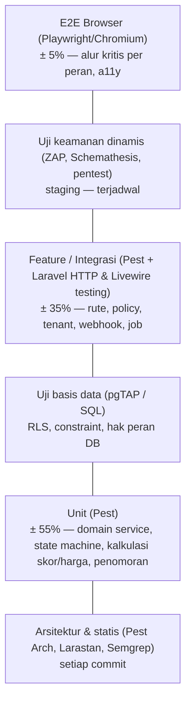
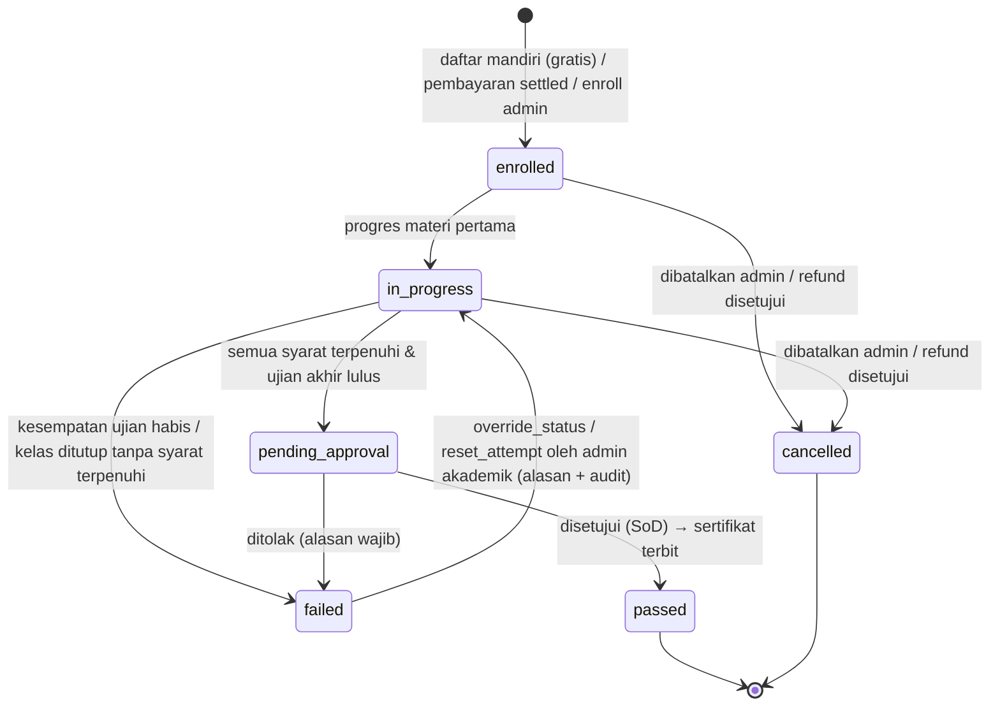

# 10 — Strategi Pengujian (Termasuk Pengujian Keamanan)

> Status: **Disetujui untuk development** · Versi 1.0 · Pemilik: QA Lead + Security Lead
>
> Dokumen ini menetapkan **bagaimana** STU LMS diuji: jenis uji, perangkat, target cakupan,
> skenario kunci per modul, pengujian keamanan, gerbang CI, UAT, keterlacakan, serta kriteria
> masuk/keluar. Istilah mengikuti [`00-glosarium.md`](00-glosarium.md); arsitektur mengikuti
> [`04-arsitektur-sistem.md`](04-arsitektur-sistem.md); matriks hak akses yang diuji otomatis
> bersumber dari [`07-rbac-dan-multi-tenant.md`](07-rbac-dan-multi-tenant.md). Kontrol keamanan
> yang diverifikasi di sini dirinci di folder [`keamanan/`](keamanan/README.md).
>
> Aturan emas: **setiap bug (terutama bug keamanan) yang diperbaiki wajib disertai uji regresi
> otomatis** yang gagal sebelum perbaikan dan lolos setelahnya.

---

## Daftar Isi

1. [Tujuan, Ruang Lingkup & Prinsip](#1-tujuan-ruang-lingkup--prinsip)
2. [Piramida Pengujian & Target Cakupan](#2-piramida-pengujian--target-cakupan)
3. [Perangkat Pengujian](#3-perangkat-pengujian)
4. [Lingkungan & Data Uji](#4-lingkungan--data-uji)
5. [Skenario Uji Fungsional per Modul](#5-skenario-uji-fungsional-per-modul)
6. [Pengujian Keamanan](#6-pengujian-keamanan)
7. [Pengujian Non-Fungsional](#7-pengujian-non-fungsional)
8. [Gerbang Pipeline CI](#8-gerbang-pipeline-ci)
9. [User Acceptance Test (UAT)](#9-user-acceptance-test-uat)
10. [Dokumentasi Uji & Matriks Keterlacakan](#10-dokumentasi-uji--matriks-keterlacakan)
11. [Kriteria Masuk & Keluar per Fase](#11-kriteria-masuk--keluar-per-fase)
12. [Peran & Tanggung Jawab](#12-peran--tanggung-jawab)
13. [Rujukan](#13-rujukan)

---

## 1. Tujuan, Ruang Lingkup & Prinsip

### 1.1 Tujuan

1. Membuktikan setiap kebutuhan fungsional (`FR-*`), non-fungsional (`NFR-*`), dan keamanan
   (`SEC-*`) terpenuhi, dengan bukti yang dapat ditelusuri (§10).
2. Menjamin **server sebagai satu-satunya sumber kebenaran**: skor, status kelulusan, harga,
   status pembayaran, dan peran tidak dapat dimanipulasi dari klien — kebalikan dari purwarupa
   yang menghitung skor kuis, membuat nomor sertifikat, dan "melunasi" transaksi di browser
   (lihat [`keamanan/16-temuan-keamanan-purwarupa.md`](keamanan/16-temuan-keamanan-purwarupa.md)).
3. Menjamin **isolasi tenant**: data organisasi A tidak pernah terlihat oleh pengguna
   organisasi B, baik lewat aplikasi, basis data (RLS), cache, berkas, laporan, maupun antrian.
4. Mendeteksi regresi sedini mungkin (*shift-left*) dengan gerbang otomatis di setiap PR.
5. Memberi keyakinan rilis yang terukur: kriteria keluar yang jelas, tanpa temuan
   Critical/High terbuka.

### 1.2 Ruang lingkup

| Termasuk | Tidak termasuk |
|---|---|
| Aplikasi Laravel (web Livewire, `/api/v1`, `/webhooks/*`), queue worker, scheduler, renderer & penanda tangan PDF, transcoder video | Pengujian internal layanan pihak ketiga (Midtrans, penyedia email/WA, Zoom/Meet/Teams) — hanya kontrak & perilaku integrasinya yang diuji |
| Skema PostgreSQL, kebijakan RLS, peran DB, migrasi | Uji penetrasi terhadap infrastruktur penyedia cloud di luar batas tanggung jawab bersama (*shared responsibility*) |
| Konfigurasi Nginx, header keamanan, CDN/WAF (di staging), image kontainer, IaC | Purwarupa HTML statis (hanya acuan UI; tidak dirilis ke produksi) |
| Proses operasional yang dapat diuji: backup/restore, DR drill, rotasi kunci | |

### 1.3 Prinsip

1. **Uji adalah bagian dari *Definition of Done*.** PR tanpa uji untuk perilaku baru tidak digabung.
2. **Deterministik.** Waktu dikendalikan (`$this->travelTo()`/`Carbon::setTestNow()`), angka acak
   di-*seed*, layanan eksternal di-*fake* (`Http::fake()`, `Queue::fake()`, `Storage::fake()`,
   `Notification::fake()`). Uji yang *flaky* dikarantina ≤ 24 jam dan wajib diperbaiki dalam satu
   sprint; **uji keamanan tidak boleh di-*retry* agar hijau.**
3. **Uji perilaku, bukan implementasi.** Uji fitur memanggil rute/komponen Livewire nyata, lengkap
   dengan middleware, policy, dan scope tenant.
4. **Negatif sama pentingnya dengan positif.** Untuk setiap aksi yang diizinkan, ada uji untuk
   peran/pemilik/tenant yang **tidak** diizinkan.
5. **Tidak ada data produksi** di luar lingkungan produksi (§4.2).
6. **Otomatiskan yang berulang, manusiakan yang kreatif.** Matriks otorisasi, IDOR, header, dan
   kebocoran lintas tenant dibangkitkan otomatis; logika bisnis dan eksplorasi ditangani penguji
   & pentester manusia.

---

## 2. Piramida Pengujian & Target Cakupan

### 2.1 Piramida



| Lapisan | Lokasi | Contoh | Waktu jalan target |
|---|---|---|---|
| Statis & arsitektur | `tests/Arch`, konfigurasi Larastan/Semgrep | Modul tidak meng-*query* model modul lain; fungsi berbahaya dilarang | < 2 menit |
| Unit | `tests/Unit` | `ScoreCalculator`, `EnrollmentStateMachine`, `PriceCalculator`, `CertificateNumberFormatter`, `VerificationCodeGenerator` | < 3 menit |
| Feature/Integrasi | `tests/Feature` | `POST /checkout`, komponen Livewire `TakeExam`, `POST /webhooks/midtrans`, job `GenerateCertificatePdf` | < 10 menit (paralel) |
| Keamanan otomatis | `tests/Security` | Matriks rute × peran, IDOR, lintas tenant, header, mass assignment, enumerasi | < 10 menit (paralel) |
| Basis data | `database/tests/pgtap` | Kebijakan RLS per tabel, `WITH CHECK`, hak `stu_app` | < 2 menit |
| E2E browser | `tests/Browser` | Peserta: daftar → belajar → ujian → sertifikat → verifikasi QR | < 15 menit (PR: *smoke*; nightly: penuh) |
| Kontrak API | `tests/Api` + OpenAPI | Schemathesis terhadap `/api/v1` | nightly |
| Non-fungsional | `tests/Performance` (k6), rencana DR | Ujian serentak 1.000 peserta | terjadwal |

### 2.2 Target cakupan (coverage)

Diukur dengan PCOV/Xdebug pada job CI; laporan diunggah sebagai artefak dan komentar PR.

| Area | Line coverage | Branch/path coverage | Mutation (Infection) MSI |
|---|---|---|---|
| Seluruh kode `app/` (rata-rata) | ≥ 80% | — | — |
| Modul domain (`app/Modules/*/Services`, `Models`, `Actions`, `Listeners`, `Jobs`) | **≥ 80%** per modul | ≥ 70% | — |
| **Policy & Gate otorisasi** (`app/Modules/*/Policies`, `Support/Tenancy`, middleware `ResolveTenantScope`) | **100%** | **100%** | ≥ 90% |
| **Pembayaran** (`Payment`: kalkulasi harga, kupon, webhook, refund, rekonsiliasi) | **100%** | ≥ 95% | ≥ 90% |
| **Sertifikat** (`Certification`: penomoran, kode verifikasi, penerbitan, pencabutan, status efektif, verifikasi publik) | **100%** | ≥ 95% | ≥ 90% |
| **Penilaian asesmen** (`Assessment`: skor, batas waktu, batas percobaan, submit) | **100%** | ≥ 95% | ≥ 90% |
| `Support/Security` (sanitizer, CSP nonce, SafeUrl/anti-SSRF, IdGenerator) | 100% | ≥ 95% | ≥ 85% |
| Controller/Livewire tipis, view composer | ≥ 70% | — | — |

Aturan:

- **Ratchet:** cakupan per modul tidak boleh turun dibandingkan `main` (toleransi 0,5 poin).
- Dikecualikan dari perhitungan: migrasi, seeder, factory, `config/`, kode yang dihasilkan
  otomatis. Pengecualian lain wajib diberi anotasi `@codeCoverageIgnore` **beserta alasan** dan
  disetujui reviewer.
- Cakupan 100% bukan bukti kebenaran — karena itu modul kritis juga wajib **mutation testing**.

### 2.3 Mutation testing (Infection)

- Dijalankan untuk modul kritis: `Access` (policy), `Payment`, `Certification`, `Assessment`,
  `Enrollment` (state machine), `Support/Security`, `Support/Tenancy`.
- **Pada PR:** hanya baris yang berubah —
  `infection --git-diff-lines --git-diff-base=origin/main --min-msi=85 --min-covered-msi=90 --threads=max`.
- **Nightly:** penuh untuk modul kritis; hasil (MSI, mutan yang lolos) diunggah ke dashboard.
- Mutan yang lolos pada policy/pembayaran/sertifikat/skor diperlakukan sebagai **defect uji**
  (tambah asersi), kecuali mutan ekuivalen yang dicatat di `infection.json5` beserta alasannya.

---

## 3. Perangkat Pengujian

| Kategori | Perangkat (dipin versinya) | Kegunaan | Dijalankan |
|---|---|---|---|
| Kerangka uji | **Pest** (di atas **PHPUnit**), `pest-plugin-laravel`, `pest-plugin-livewire`, `pest-plugin-type-coverage` | Unit, feature, Livewire, keamanan | Lokal, setiap PR |
| Uji arsitektur | **Pest Arch** (`arch()->preset()->security()`, `->laravel()`, aturan kustom) | Batas modul, fungsi terlarang, konvensi | Setiap PR |
| Analisis statis | **Larastan** (PHPStan) level ≥ 8 (target maks.), `phpstan-strict-rules`, aturan kustom | Tipe, *dead code*, pola berbahaya | Setiap PR |
| SAST | **Semgrep** (`p/php`, `p/laravel`, `p/secrets`, `p/owasp-top-ten` + aturan kustom STU di `.semgrep/`), aturan keamanan PHPStan kustom; opsional Psalm `--taint-analysis` (nightly) | Injeksi, XSS Blade `{!! !!}`, `whereRaw` berinterpolasi, `$request->all()` ke `create()`, bypass scope tenant | Setiap PR |
| E2E browser | **Playwright** (engine Chromium; harness: Playwright Test atau *Pest Browser Plugin* berbasis Playwright — dipilih via ADR saat kick-off). **Laravel Dusk** hanya bila tim memilih harness PHP murni. | Alur pengguna lintas halaman, uji XSS di browser nyata, a11y | PR (*smoke*), nightly (penuh) |
| Aksesibilitas | `@axe-core/playwright`, Lighthouse CI | WCAG 2.1 AA otomatis | PR (halaman kunci), nightly |
| Beban | **k6** (+ ekstensi `xk6-browser` bila perlu) | Load, stress, soak, spike | Terjadwal, pra-rilis |
| DAST | **OWASP ZAP** — *baseline* (pasif) & *full scan* terautentikasi (aktif) via Automation Framework; `zap-api-scan` terhadap OpenAPI | Kerentanan runtime, header, cookie | Nightly (baseline), mingguan & pra-rilis (full) di **staging** |
| Fuzzing API | **Schemathesis** terhadap spesifikasi OpenAPI `/api/v1` (alternatif: RESTler) | Konformitas skema, 5xx, bypass autentikasi | Nightly, pra-rilis |
| SCA | `composer audit`, `npm audit --omit=dev --audit-level=high`, **Trivy** `fs` | Kerentanan dependensi | Setiap PR + nightly |
| Kontainer & IaC | **Trivy** `image` & `config`, Hadolint, Syft (SBOM CycloneDX) | CVE image, miskonfigurasi Dockerfile/Terraform/K8s | Setiap build image |
| Rahasia | **gitleaks** (pre-commit + CI, *full history* nightly), GitHub secret scanning + push protection | Kebocoran secret | Setiap commit/PR |
| Uji basis data | **pgTAP** (`pg_prove`) — alternatif: uji SQL via Pest dengan koneksi peran `stu_app` | RLS, constraint, hak peran DB, immutabilitas audit | Setiap PR |
| TLS | `testssl.sh`, SSL Labs (staging/produksi) | Protokol & cipher | Pra-rilis, bulanan |
| Validasi tanda tangan PDF | `pyHanko validate` / `pdfsig` (poppler) / EU DSS validator | Validasi PAdES & deteksi tamper | Setiap PR (job sertifikat), nightly |
| Malware | ClamAV + berkas uji **EICAR** | Karantina unggahan | Setiap PR (kontainer ClamAV di CI) |
| Email | Mailpit (lokal/CI/staging) | Isi email, tautan, header | Feature/E2E |
| Pembayaran | Midtrans **Sandbox** + simulator webhook internal (`tests/Support/MidtransWebhookFactory`) | Alur pembayaran nyata & kasus tepi | Feature (simulator), staging (sandbox) |
| Resiliensi | Toxiproxy (latensi/putus Redis, S3, Midtrans) | Degradasi terkendali | Nightly (subset), pra-rilis |

### 3.1 Catatan Chromium di CI

- Runner CI (image kustom berbasis `ubuntu-latest`) **sudah menyediakan Chromium**. Playwright
  dikonfigurasi memakai biner tersebut — `PLAYWRIGHT_SKIP_BROWSER_DOWNLOAD=1` dan
  `launchOptions.executablePath = process.env.CHROMIUM_PATH` — sehingga pipeline **tidak
  mengunduh browser** tiap run (lebih cepat, lebih sedikit ketergantungan jaringan, mengurangi
  risiko rantai pasok). Versi Chromium dicetak di log job dan dipin di image runner.
- Bila memakai Dusk, ChromeDriver disesuaikan dengan versi Chromium terpasang
  (`php artisan dusk:chrome-driver --detect`).
- Firefox & WebKit dijalankan **nightly** (unduhan browser Playwright dengan verifikasi
  *checksum*) atau di layanan *device cloud* untuk matriks lintas browser (§7.5).
- Chromium untuk uji **terpisah** dari Chromium renderer PDF (Gotenberg/Browsershot) — uji
  renderer PDF memakai image renderer yang sama dengan produksi.

### 3.2 Contoh aturan arsitektur (Pest Arch)

```php
// tests/Arch/ModuleBoundariesTest.php
arch('preset keamanan Pest')->preset()->security()->ignoring([
    'App\Support\Http\ETag', // md5 untuk ETag non-kriptografis — disetujui Security Lead
]);

arch('preset Laravel')->preset()->laravel();

arch('modul tidak mengakses model milik modul lain secara langsung')
    ->expect('App\Modules\Payment')
    ->not->toUse([
        'App\Modules\Certification\Models',
        'App\Modules\Assessment\Models',
        'App\Modules\Enrollment\Models',
    ]);

arch('Audit, Notification, Reporting hanya mendengarkan event')
    ->expect(['App\Modules\Audit', 'App\Modules\Notification', 'App\Modules\Reporting'])
    ->not->toUse(['App\Modules\*\Services']);

arch('bilangan acak wajib CSPRNG')
    ->expect(['rand', 'mt_rand', 'uniqid', 'lcg_value', 'array_rand', 'shuffle'])
    ->not->toBeUsed();

arch('semua Policy final & terdaftar')
    ->expect('App\Modules\*\Policies')->toBeFinal()->toHaveSuffix('Policy');
```

### 3.3 Contoh aturan Semgrep kustom (ringkas)

| ID aturan | Pola yang dilarang | Alasan |
|---|---|---|
| `stu.blade-raw-echo` | `{!! $x !!}` di Blade kecuali komponen allowlist (`x-sanitized-html`) | XSS |
| `stu.raw-sql-interp` | `DB::raw("...$var...")`, `whereRaw/orderByRaw/selectRaw` dengan interpolasi/konkatenasi | SQLi |
| `stu.mass-assign-all` | `->create($request->all())`, `->fill($request->all())`, `->update($request->input())`, `Model::unguard()` | Mass assignment |
| `stu.tenant-scope-bypass` | `withoutGlobalScope(OrganizationScope::class)` / `withoutGlobalScopes()` di luar `App\Modules\*\Repositories\Platform*` | Kebocoran tenant |
| `stu.ssrf-http` | `Http::get/post($var)` tanpa `SafeUrl::assert()` | SSRF |
| `stu.token-compare` | `==`/`===` untuk membandingkan token/signature/HMAC | *Timing attack* — wajib `hash_equals()` |
| `stu.download-path` | `response()->download/file()` dengan argumen dari request | Path traversal |
| `stu.redirect-input` | `redirect($request->...)`/`redirect()->to($request->...)` tanpa `SafeRedirect` | Open redirect |
| `stu.route-without-mw` | `->withoutMiddleware([... 'auth' ...])` | Bypass autentikasi |

---

## 4. Lingkungan & Data Uji

### 4.1 Lingkungan

| Lingkungan | Tujuan pengujian | Data | Catatan |
|---|---|---|---|
| `local` | Unit, feature, pgTAP, E2E sebelum push | Seeder sintetis | Docker Compose/Sail identik versi CI (PHP, PostgreSQL 16, Redis 7, ClamAV, Mailpit, MinIO) |
| `ci` | Semua uji otomatis per PR/nightly | Sintetis, dibuat ulang tiap run | DB dimigrasi dengan peran **`stu_migrator`**, aplikasi terhubung sebagai **`stu_app`** (non-owner, `NOBYPASSRLS`) — identik produksi agar RLS benar-benar teruji |
| `staging` | UAT, DAST, Schemathesis, pentest, uji restore, demo | Sintetis/anonim; **dilarang** salinan produksi mentah | Topologi setara produksi (CDN/WAF, Nginx, worker, KMS terpisah); IP allowlist + SSO; Midtrans **sandbox**; KMS & sertifikat penanda tangan dari **CA uji** |
| `perf` | Load/stress/soak | Sintetis bervolume (≥ 50.000 pengguna, ≥ 500 kelas, ≥ 1 juta baris `lesson_progress`) | Ukuran node setara produksi; dihidupkan sesuai jadwal (IaC) untuk menghemat biaya |
| `production` | *Smoke test* pasca-deploy & *synthetic monitoring* | Nyata | Hanya akun sintetis khusus (ditandai `is_synthetic`), tidak masuk laporan bisnis; **tidak boleh** DAST aktif/pentest tanpa jendela & persetujuan tertulis |

### 4.2 Kebijakan data uji

1. **Hanya data sintetis** yang dibuat factory/seeder (Faker lokal `id_ID`). Data produksi
   **tidak pernah** disalin ke `local`, `ci`, `staging`, atau `perf`.
2. Nilai sintetis dirancang **tidak mungkin milik orang nyata**:
   - Email di domain cadangan `@example.test` / `@stu-lms.test`.
   - Nomor HP memakai blok fiktif yang ditetapkan tim (mis. `+62 800-0000-xxxx`), pengiriman
     WA/SMS di non-produksi selalu di-*fake*/diarahkan ke *sink*.
   - NIK/nomor induk dihasilkan dengan prefiks wilayah tidak valid (mis. `99`) sehingga gagal
     validasi Dukcapil bila bocor.
3. **Bila terpaksa** memakai turunan data produksi (mis. reproduksi masalah kinerja yang tidak
   dapat disimulasikan): wajib persetujuan tertulis **DPO + Security Lead**, pipeline
   **anonimisasi tak-terbalikkan** (nama/email/HP/NIK diganti, tanggal digeser acak, teks bebas
   dihapus, berkas unggahan tidak disalin), dijalankan di lingkungan produksi sebelum data keluar,
   diverifikasi dengan pemindai PII, disimpan di lingkungan terisolasi, dan **dihapus ≤ 30 hari**.
   Lihat [`keamanan/12-privasi-data-dan-kepatuhan-uu-pdp.md`](keamanan/12-privasi-data-dan-kepatuhan-uu-pdp.md).
4. Secret di non-produksi adalah secret **khusus lingkungan tersebut** (Midtrans sandbox, KMS
   staging). Sertifikat PDF non-produksi ditandatangani CA uji dan diberi *watermark*
   **"SPESIMEN — TIDAK SAH"**, sehingga tidak pernah lolos verifikasi sebagai asli.
5. Kata sandi persona diambil dari variabel lingkungan/secret CI, **tidak** ditulis di repositori.
6. Seeder persona dijaga: `TestPersonaSeeder` melempar exception bila `app()->isProduction()`.

### 4.3 Persona terseed (per peran & per organisasi)

Dibuat oleh `php artisan db:seed --class=TestPersonaSeeder` dan tersedia di uji via helper
`Personas::get('<kode>')`. Tiga organisasi dipakai untuk uji lintas tenant.

**Organisasi:**

| Kode | Nama sintetis | Tipe | Kegunaan |
|---|---|---|---|
| `ORG-A` | Universitas Uji Alfa | `institution` | Tenant utama |
| `ORG-B` | PT Uji Beta Sejahtera | `corporate` | Tenant pembanding (lintas tenant) |
| `ORG-C` | Politeknik Uji Gama | `institution` | Admin multi-organisasi, kelas lintas organisasi |

**Kelas:** `CLS-1` (program gratis, trainer `TRN-A`, peserta dari ORG-A **dan** ORG-B),
`CLS-2` (program berbayar Rp 350.000, trainer `TRN-B`), `CLS-3` (program BNSP, kuota 2,
ditutup), `CLS-4` (program `archived`).

**Persona:**

| Kode | Peran | Organisasi / lingkup | Kondisi khusus |
|---|---|---|---|
| `SA-1`, `SA-2` | `super_admin` | Platform | Dua akun untuk uji *four-eyes*; MFA WebAuthn |
| `AA-1` | `academic_admin` | Platform | MFA TOTP |
| `AA-TRN` | `academic_admin` + tercatat trainer `CLS-1` | Platform | Uji SoD (tidak boleh menyetujui sertifikat `CLS-1`) |
| `FA-1`, `FA-2` | `finance_admin` | Platform | Uji maker–checker refund > Rp 1 jt |
| `SUP-1` | `support_admin` | Platform | Baca-saja |
| `OA-A` | `org_admin` | ORG-A | — |
| `OA-B` | `org_admin` | ORG-B | — |
| `OA-AC` | `org_admin` | ORG-A & ORG-C | Uji scope multi-organisasi |
| `TRN-A` | `trainer` | Mengampu `CLS-1` | — |
| `TRN-B` | `trainer` | Mengampu `CLS-2` | — |
| `TRN-X` | `trainer` | Tidak mengampu kelas apa pun | Uji ABAC trainer |
| `PST-A1` | `participant` | ORG-A, terdaftar `CLS-1` (`in_progress`) | — |
| `PST-A2` | `participant` | ORG-A, `pending_approval` di `CLS-1` | Kandidat approval |
| `PST-B1` | `participant` | ORG-B, terdaftar `CLS-1` | Peserta lintas organisasi di kelas sama |
| `PST-MFA` | `participant` | ORG-A | MFA aktif + 10 kode pemulihan |
| `PST-LOCK` | `participant` | ORG-A | Akun terkunci sementara |
| `PST-UNV` | `participant` | ORG-B | `pending_verification` |
| `PST-OFF` | `participant` | ORG-A | Dinonaktifkan |
| `API-A`, `API-B` | Klien API | ORG-A / ORG-B | Scope `enrollments:read`, `certificates:verify`; IP allowlist CI |
| `GUEST` | Anonim | — | — |

### 4.4 Teknik data & isolasi uji

- `RefreshDatabase`/`LazilyRefreshDatabase` untuk feature test; `pest --parallel` dengan basis
  data per proses (`stu_test_{token}`).
- Uji konkurensi (kupon, penomoran sertifikat, attempt) **tidak** memakai transaksi pembungkus;
  memakai `DatabaseTruncation` dan beberapa proses/koneksi nyata (lihat §5.3 & §6.6).
- Waktu: `travelTo('2026-12-31 23:59:59', 'Asia/Jakarta')` untuk batas tahun/tenggat/kedaluwarsa.
- Factory menyediakan *state* bermakna: `->forOrganization($org)`, `->pendingApproval()`,
  `->withExhaustedAttempts()`, `->revoked()`, `->settled()`.

---

## 5. Skenario Uji Fungsional per Modul

Format ID: `TC-{MODUL}-{NNN}` (modul sama dengan kode FR). Kolom **Lv**: U = unit,
F = feature/integrasi, D = basis data, E = E2E. **Prio**: P0 = wajib lolos untuk setiap rilis
(juga *smoke*), P1 = wajib untuk rilis mayor, P2 = regresi terjadwal. Referensi FR bersifat
contoh dan disinkronkan dengan katalog FR (lihat §10).

> Tabel berikut memuat **kasus kunci**, bukan daftar lengkap. Setiap FR tetap wajib memiliki
> minimal satu TC positif dan satu TC negatif.

### 5.1 AUTH — Autentikasi

| ID | Skenario | Hasil yang diharapkan | Lv | Prio |
|---|---|---|---|---|
| TC-AUTH-001 | Registrasi mandiri → OTP email → aktif | Status `pending_verification` → aktif setelah OTP benar; audit `UserRegistered` | F, E | P0 |
| TC-AUTH-002 | Login peran berbeda | Diarahkan ke dashboard sesuai peran; peran admin/trainer wajib MFA | F, E | P0 |
| TC-AUTH-003 | Undangan dari admin/bulk import | Tautan set kata sandi sekali pakai, kedaluwarsa 72 jam | F | P1 |
| TC-AUTH-004 | Pendaftaran & login WebAuthn/Passkey | Berhasil di Chromium (virtual authenticator Playwright) | E | P1 |
| TC-AUTH-005 | SSO OIDC (tahap 3): `state`/`nonce` salah, `id_token` kedaluwarsa, email belum terverifikasi di IdP | Ditolak; tidak ada *account takeover* via email yang sama | F | P1 |
| (keamanan) | Lihat TC-SEC-AUTHN-*, TC-SEC-SESS-* | | | |

### 5.2 USER & ORG — Pengguna & Organisasi

| ID | Skenario | Hasil yang diharapkan | Lv | Prio |
|---|---|---|---|---|
| TC-USER-001 | Admin akademik membuat trainer; OA-A membuat peserta di ORG-A | Berhasil; OA-A tidak dapat membuat peserta di ORG-B atau peran selain `participant` | F | P0 |
| TC-USER-002 | Menonaktifkan pengguna | Semua sesi & token dicabut seketika; data sertifikat tetap | F | P0 |
| TC-USER-003 | Menggabungkan peran admin platform + `participant` pada satu akun | Ditolak | U, F | P1 |
| TC-USER-004 | Pindah organisasi | Enrollment historis tetap di organisasi lama (`organization_id` imutabel) | F | P1 |
| TC-USER-005 | Auto-nonaktif admin/trainer tidak aktif 180 hari | Scheduler menonaktifkan; audit tercatat | F | P2 |
| TC-ORG-001 | Registrasi mengaku anggota ORG-B tanpa domain email cocok | Menunggu persetujuan OA-B | F | P1 |
| TC-ORG-002 | Access Review triwulanan oleh OA-A | Hanya anggota ORG-A; hasil tercatat di audit | F | P2 |

### 5.3 ENR — Enrollment & state machine

State machine enrollment (kode status per glosarium). Tabel ini adalah **acuan uji**; bila
katalog FR mengubah aturan, tabel & uji diperbarui di PR yang sama.



| ID | Transisi | Pemicu & aktor | Valid? | Hasil yang diharapkan |
|---|---|---|---|---|
| TC-ENR-001 | ∅ → `enrolled` | Peserta daftar program gratis `published` | ✅ | Enrollment dibuat, `organization_id` = organisasi peserta |
| TC-ENR-002 | ∅ → `enrolled` | Webhook `settlement` terverifikasi | ✅ | Tepat satu enrollment (idempoten) |
| TC-ENR-003 | `enrolled` → `in_progress` | Progres lesson pertama | ✅ | Otomatis oleh server |
| TC-ENR-004 | `in_progress` → `pending_approval` | Semua modul wajib selesai + skor ujian ≥ skor minimal + syarat presensi/tugas (bila dikonfigurasi) | ✅ | Event `EnrollmentPendingApproval`; muncul di antrian approval |
| TC-ENR-005 | `in_progress` → `failed` | Kesempatan ujian habis tanpa lulus | ✅ | Notifikasi peserta |
| TC-ENR-006 | `pending_approval` → `passed` | `AA-1` menyetujui | ✅ | Sertifikat dibuat (lihat TC-CERT-*) |
| TC-ENR-007 | `pending_approval` → `failed` | Ditolak dengan alasan | ✅ | Alasan wajib (tanpa alasan → 422); notifikasi |
| TC-ENR-008 | `enrolled`/`in_progress` → `cancelled` | Admin / refund disetujui | ✅ | Akses materi dicabut |
| TC-ENR-009 | `failed` → `in_progress` | `AA-1` dengan `enrollment.override_status`, alasan | ✅ | Audit berisi status lama/baru + alasan |
| TC-ENR-020 | `enrolled` → `passed` / `pending_approval` | Request langsung/override tanpa izin | ❌ | 403/422; status tidak berubah |
| TC-ENR-021 | `in_progress` → `passed` | Melewati approval | ❌ | Ditolak di domain service (bukan hanya UI) |
| TC-ENR-022 | `passed` → status apa pun | Termasuk oleh `super_admin` via form | ❌ | Terminal; pencabutan dilakukan pada sertifikat |
| TC-ENR-023 | `cancelled` → status apa pun | — | ❌ | Terminal; daftar ulang membuat enrollment baru bila diizinkan FR |
| TC-ENR-024 | `failed` → `passed` | — | ❌ | Ditolak |
| TC-ENR-025 | `pending_approval` → `pending_approval` (submit ulang) | Double submit | ❌ | Idempoten, tidak ada duplikasi antrian |
| TC-ENR-026 | Perubahan status oleh peserta via request/Livewire | — | ❌ | Diabaikan/403 |
| TC-ENR-030 | Daftar kelas yang sama dua kali (paralel) | — | — | Satu enrollment (unique `user_id`+`course_class_id`) |
| TC-ENR-031 | Daftar program `draft`/`in_review`/`archived`, kelas penuh, kelas ditutup | — | — | Ditolak dengan pesan jelas |
| TC-ENR-032 | Daftar program berbayar tanpa pembayaran | — | — | Diarahkan ke checkout; tidak ada enrollment |
| TC-ENR-040 | **Bulk import CSV** valid (1.000 baris) oleh OA-A | — | — | Job `imports` selesai; laporan baris berhasil/gagal; semua peserta di ORG-A |
| TC-ENR-041 | CSV 5.001 baris | — | — | Ditolak sebelum diproses (batas 5.000) |
| TC-ENR-042 | CSV dengan email tidak valid, duplikat dalam berkas, duplikat dengan data ada, kolom hilang, header salah urut | — | — | Laporan per nomor baris; baris valid tetap diproses (atau *all-or-nothing* sesuai FR) |
| TC-ENR-043 | CSV berisi kolom `organization_id`/`role` | — | — | Kolom diabaikan; organisasi = milik OA-A |
| TC-ENR-044 | Encoding: UTF-8 BOM, UTF-16, CRLF, nama dengan diakritik, sel formula | — | — | Diproses benar; formula disimpan sebagai teks (TC-SEC-INP-021) |
| TC-ENR-045 | Unggah XLSX (bila didukung) dengan XXE | — | — | Lihat TC-SEC-INP-060 |

Uji data-driven transisi:

```php
dataset('transisi_enrollment', [
    // [dari, ke, aktor, harus_berhasil]
    ['enrolled',         'in_progress',      'system',         true],
    ['in_progress',      'pending_approval', 'system',         true],
    ['pending_approval', 'passed',           'academic_admin', true],
    ['pending_approval', 'failed',           'academic_admin', true],
    ['failed',           'in_progress',      'academic_admin', true],
    ['enrolled',         'passed',           'academic_admin', false],
    ['in_progress',      'passed',           'super_admin',    false],
    ['passed',           'failed',           'super_admin',    false],
    ['cancelled',        'in_progress',      'academic_admin', false],
    ['failed',           'passed',           'academic_admin', false],
    ['in_progress',      'pending_approval', 'participant',    false],
]);

it('menegakkan state machine enrollment', function ($from, $to, $actor, $ok) {
    $enrollment = Enrollment::factory()->state(['status' => $from])->create();
    $attempt = fn () => app(EnrollmentStateMachine::class)->transition($enrollment, $to, Actor::fake($actor), reason: 'uji');

    $ok ? expect($attempt())->status->toBe($to)
        : expect($attempt)->toThrow(InvalidEnrollmentTransition::class)
            ->and($enrollment->fresh()->status)->toBe($from);
})->with('transisi_enrollment');
```

### 5.4 ASM — Asesmen (kuis & ujian akhir)

| ID | Skenario | Hasil yang diharapkan | Lv | Prio |
|---|---|---|---|---|
| TC-ASM-001 | **Skor dihitung di server** dari `attempt_answers`; klien hanya mengirim ID opsi | Skor = hasil kalkulasi server; field `score` dari klien diabaikan | U, F | P0 |
| TC-ASM-002 | Batas kelulusan: skor = minimal − 1, = minimal, = minimal + 1 (mis. 69/70/71) | Tidak lulus / lulus / lulus; aturan pembulatan terdokumentasi (mis. 69,5 dibulatkan sesuai FR) diuji eksplisit | U | P0 |
| TC-ASM-003 | Tipe soal: pilihan tunggal, pilihan ganda (skor parsial sesuai FR), benar/salah, esai (penilaian manual → status `awaiting_grading`) | Skor sesuai aturan tiap tipe; esai tidak membuat lulus otomatis | U, F | P0 |
| TC-ASM-004 | Bobot soal & soal tanpa jawaban | Dihitung benar; tak dijawab = 0 | U | P1 |
| TC-ASM-005 | Acak soal/opsi per attempt dengan *seed* | Urutan konsisten saat reload attempt yang sama; berbeda antar attempt | U, F | P1 |
| TC-ASM-006 | Kunci jawaban tidak terkirim sebelum periode ujian ditutup | Lihat TC-SEC-BIZ-015; pembahasan muncul hanya setelah ditutup | F | P0 |
| TC-ASM-007 | Soal/bank soal diubah trainer saat attempt berjalan | Attempt memakai *snapshot* versi soal saat dimulai | F | P1 |
| TC-ASM-010 | **Batas waktu**: autosave pada `deadline_at` (lolos), `deadline_at + grace` (lolos), `+ grace + 1 s` (ditolak 409/422) | Sesuai; waktu server otoritatif, manipulasi jam klien tidak berpengaruh | F | P0 |
| TC-ASM-011 | **Pengumpulan terlambat**: peserta menutup browser sebelum submit | Scheduler auto-submit attempt kedaluwarsa dengan jawaban ≤ tenggat | F | P0 |
| TC-ASM-012 | Submit manual setelah tenggat + grace | Dinilai hanya dari jawaban tersimpan ≤ tenggat; ditandai `late` bila FR mengatur | F | P0 |
| TC-ASM-013 | Jadwal ujian: mulai sebelum jendela dibuka / setelah ditutup | Ditolak | F | P1 |
| TC-ASM-020 | **Batas percobaan**: N percobaan habis → mulai attempt ke-N+1 | Ditolak; enrollment → `failed` bila belum lulus | F | P0 |
| TC-ASM-021 | **Attempt bersamaan**: dua tab / dua request paralel `POST /assessments/{id}/attempts` | Tepat satu attempt aktif (unique partial index `WHERE status='in_progress'`); request kedua mendapat attempt yang sama atau 409 | F (konkurensi) | P0 |
| TC-ASM-022 | **Submit ganda paralel** attempt yang sama | Dinilai sekali; event `AttemptSubmitted` sekali; transisi enrollment sekali | F (konkurensi) | P0 |
| TC-ASM-023 | Reset attempt oleh `AA-1` (`assessment.reset_attempt`) | Butuh alasan; audit; kuota attempt bertambah sesuai FR | F | P1 |
| TC-ASM-024 | Ujian akhir terkunci sebelum prasyarat modul selesai | Server menolak (bukan hanya UI) | F | P0 |
| TC-ASM-025 | Autosave jawaban untuk soal di luar attempt / attempt orang lain | 404 (lihat TC-SEC-AUTHZ-002, Livewire tampering) | F | P0 |
| TC-ASM-026 | Koneksi putus saat ujian: autosave antre di klien lalu terkirim | Jawaban tersimpan bila masih dalam tenggat; UI menampilkan status sinkron | E | P1 |

### 5.5 CERT — Sertifikat

| ID | Skenario | Hasil yang diharapkan | Lv | Prio |
|---|---|---|---|---|
| TC-CERT-001 | Approval `PST-A2` oleh `AA-1` | Sertifikat `active`; nomor format `{KAT}/{KODE}/{ORG}/{TAHUN}/{URUT}`; `verification_code` 12 karakter; PDF bertanda tangan di storage dengan SHA-256 tercatat | F | P0 |
| TC-CERT-002 | Penomoran urut per program/tahun | Urutan bertambah 1 per penerbitan pada program & tahun sama | U, F | P0 |
| TC-CERT-003 | **Keunikan nomor di bawah konkurensi**: 50 approval paralel untuk program & tahun sama | 50 nomor unik (unique constraint), tanpa duplikat; tanpa celah bila desain counter per-transaksi di [`05-desain-database.md`](05-desain-database.md) dipakai | F (konkurensi) | P0 |
| TC-CERT-004 | Pergantian tahun: approval 31-12 23:59:59 WIB vs 01-01 00:00:00 WIB | `{TAHUN}` & urutan mengikuti zona `Asia/Jakarta`; urutan tahun baru mulai dari 00001 | U | P1 |
| TC-CERT-005 | Job `GenerateCertificatePdf` di-*retry* 3× (gagal setelah upload) | Tetap satu sertifikat, satu PDF (idempoten per `certificate_id`) | F | P0 |
| TC-CERT-006 | Template berubah setelah terbit | Sertifikat lama tetap merujuk versi template saat terbit | F | P1 |
| TC-CERT-007 | Isi PDF | Nama, program, tanggal, nomor, QR → URL verifikasi dengan `verification_code`; tidak memuat email/NIK | F | P0 |
| TC-CERT-010 | **Pencabutan** (maker–checker) lalu verifikasi | Setelah checker menyetujui: verifikasi publik **seketika** menampilkan `revoked` (cache dibersihkan), tanggal & alasan ringkas; unduhan peserta menampilkan status dicabut | F, E | P0 |
| TC-CERT-011 | Pencabutan tanpa alasan | 422 | F | P1 |
| TC-CERT-020 | **Status kedaluwarsa diturunkan**: `valid_until` = kemarin / hari ini / besok (WIB) | `expired` / `active` / `active`; tidak ada kolom status `expired` yang disimpan & basi | U | P0 |
| TC-CERT-021 | Sertifikat dicabut **dan** kedaluwarsa | Status efektif `revoked` (pencabutan menang) | U | P0 |
| TC-CERT-022 | Batas hari di zona waktu: 23:30 WIB (16:30 UTC) pada tanggal `valid_until` | Masih `active` | U | P1 |
| TC-CERT-030 | Verifikasi publik kode valid | Data minimal: nama, program, tanggal terbit, berlaku hingga, status; `certificate_verification_logs` tercatat | F | P0 |
| TC-CERT-031 | Kode tidak dikenal / format salah / huruf kecil / karakter ambigu Crockford (`O`→`0`, `I`/`L`→`1`) | Normalisasi sesuai Crockford; tak dikenal → pesan generik "tidak ditemukan" | U, F | P1 |
| TC-CERT-032 | Rate limit verifikasi | Lihat TC-SEC-BIZ-023 | F | P0 |
| TC-CERT-033 | Verifikasi via API mitra `certificates:verify` | Sama dengan publik; tanpa scope → 403 | F | P1 |
| TC-CERT-040 | Reissue (mis. koreksi nama) | Mengikuti aturan FR-CERT reissue: versi baru ditandatangani ulang, versi lama ditandai tidak berlaku di verifikasi, audit | F | P1 |

### 5.6 PAY — Pembayaran, kupon, refund

| ID | Skenario | Hasil yang diharapkan | Lv | Prio |
|---|---|---|---|---|
| TC-PAY-001 | Checkout `CLS-2` tanpa kupon | `payment_transaction` `pending`, `order_id` acak, `gross_amount` = harga DB; redirect Snap | F | P0 |
| TC-PAY-002 | Checkout dengan `Idempotency-Key` yang sama 2× | Satu transaksi; respons kedua sama dengan pertama | F | P0 |
| TC-PAY-003 | Total 0 setelah kupon 100% | Tidak memanggil Midtrans; enrollment langsung sesuai FR; tercatat sebagai transaksi Rp 0 | F | P1 |
| TC-PAY-004 | Nomor invoice unik di bawah konkurensi (50 settlement paralel) | Tanpa duplikat | F (konkurensi) | P0 |
| TC-PAY-010 | **Webhook valid** `settlement` | Signature & `GET status` server-to-server cocok → `settled`, enrollment dibuat, `payment_events` tercatat, 200 | F | P0 |
| TC-PAY-011 | **Idempotensi**: webhook `settlement` sama dikirim 2× (berurutan & paralel) | Satu perubahan status, satu enrollment, event kedua ditandai duplikat | F (konkurensi) | P0 |
| TC-PAY-012 | **Replay/urutan terbalik**: `settlement` lalu `pending` lama tiba belakangan | Status tetap `settled` (tidak mundur); transisi status transaksi hanya maju | F | P0 |
| TC-PAY-013 | **Signature invalid** / hilang | Ditolak (kode respons per keamanan/09); tidak ada perubahan; `security_event` `webhook.invalid_signature` | F | P0 |
| TC-PAY-014 | **Nominal tidak cocok** (`gross_amount` ≠ DB) meski signature valid | Tidak di-*settle*; status `needs_review`; alert ke `finance_admin` | F | P0 |
| TC-PAY-015 | `order_id` tidak dikenal | Tidak ada perubahan; dicatat; respons tidak membocorkan informasi | F | P1 |
| TC-PAY-016 | Webhook bilang `settlement` tetapi `GET status` Midtrans bilang `pending` | Tidak di-*settle*; dicoba ulang oleh rekonsiliasi | F | P0 |
| TC-PAY-017 | Midtrans timeout/5xx saat konfirmasi status | Webhook dijawab sesuai kebijakan retry; rekonsiliasi 15 menit menyelesaikan | F | P1 |
| TC-PAY-018 | Transaksi `pending` melewati masa berlaku | Job 5 menit → `expired`; reservasi kupon dilepas | F | P0 |
| TC-PAY-020 | **Race kuota kupon**: sisa kuota 1, 20 checkout paralel | Tepat 1 redemption (lihat §6.6) | F (konkurensi) | P0 |
| TC-PAY-021 | Kupon kedaluwarsa, belum berlaku, dinonaktifkan, khusus program lain, batas per pengguna terlampaui | Ditolak dengan pesan spesifik yang aman | U, F | P0 |
| TC-PAY-022 | Diskon nominal > harga | Total = 0, tidak negatif | U | P0 |
| TC-PAY-023 | Kode kupon beda huruf besar/kecil & spasi | Dinormalisasi | U | P2 |
| TC-PAY-024 | Brute force kode kupon | Rate limit per pengguna/IP | F | P1 |
| TC-PAY-030 | **Refund ≤ Rp 1 jt**: peserta ajukan → `FA-1` setujui → API refund (sandbox/mock) → `refunded` | Enrollment `cancelled`; audit; notifikasi | F | P0 |
| TC-PAY-031 | **Refund > Rp 1 jt** | Perlu `FA-1` + `FA-2` (berbeda); satu orang tidak dapat keduanya | F | P0 |
| TC-PAY-032 | Refund untuk transaksi belum `settled` / sudah `refunded` / melebihi nominal | Ditolak | F | P0 |
| TC-PAY-033 | Refund setelah sertifikat terbit | Mengikuti aturan FR (ditolak atau memerlukan pencabutan terlebih dahulu); tidak pernah meninggalkan sertifikat aktif tanpa keputusan eksplisit | F | P1 |
| TC-PAY-034 | Webhook `refund` dari Midtrans | Idempoten; status sinkron | F | P1 |
| TC-PAY-040 | Rekonsiliasi harian | Laporan selisih DB vs Midtrans = 0 untuk data uji; selisih disimulasikan → muncul di laporan | F | P1 |

### 5.7 ATT — Presensi

| ID | Skenario | Hasil yang diharapkan | Lv | Prio |
|---|---|---|---|---|
| TC-ATT-001 | Check-in QR dinamis dalam jendela sesi | Status `present` (atau `late` setelah ambang); metode `qr` | F, E | P0 |
| TC-ATT-002 | **Token QR kedaluwarsa** (TTL rotasi + 1 detik) | Ditolak; minta pindai ulang | F | P0 |
| TC-ATT-003 | **Replay token** oleh peserta yang sama | Idempoten, tidak ada catatan ganda | F | P0 |
| TC-ATT-004 | Token diteruskan ke peserta **tidak terdaftar** di kelas / peserta kelas lain | Ditolak (404/403) | F | P0 |
| TC-ATT-005 | Token sesi X dipakai untuk sesi Y; token dimodifikasi | Ditolak (tanda tangan/HMAC tidak cocok) | F | P0 |
| TC-ATT-006 | Check-in di luar jendela sesi | Ditolak | F | P1 |
| TC-ATT-007 | Presensi manual oleh `TRN-A` di `CLS-1` / oleh `TRN-X` | Berhasil / 404; `excused` wajib catatan | F | P0 |
| TC-ATT-008 | Rekap persentase kehadiran (present + late dihitung hadir, sesuai FR) | Benar untuk kasus 0 sesi, semua hadir, campuran | U | P1 |
| TC-ATT-009 | Syarat kelulusan presensi (bila dikonfigurasi) memengaruhi `pending_approval` | Tidak lulus syarat → tetap `in_progress` | F | P1 |

### 5.8 ASG — Tugas

| ID | Skenario | Hasil yang diharapkan | Lv | Prio |
|---|---|---|---|---|
| TC-ASG-001 | Unggah tugas tipe & ukuran valid | `submitted`; berkas dipindai malware sebelum dapat diunduh trainer | F | P0 |
| TC-ASG-002 | Validasi berkas | Lihat TC-SEC-FILE-001..009 | F | P0 |
| TC-ASG-003 | Pengumpulan setelah tenggat | Sesuai pengaturan tugas: ditolak, atau diterima bertanda `late` | F | P0 |
| TC-ASG-004 | Kumpul ulang saat `revision_requested` / saat `approved` | Diizinkan (riwayat revisi tersimpan) / ditolak | F | P1 |
| TC-ASG-005 | Penilaian oleh `TRN-A` (kelas sendiri) / `TRN-X` | Berhasil / 404; nilai 0–100, di luar rentang → 422 | F | P0 |
| TC-ASG-006 | Unduh berkas tugas | URL bertanda tangan berumur pendek; hanya pemilik, trainer pengampu, admin | F | P0 |

### 5.9 LIVE, CNT, CAT, CLS

| ID | Skenario | Hasil yang diharapkan | Lv | Prio |
|---|---|---|---|---|
| TC-LIVE-001 | Trainer membuat live session dengan URL Zoom/Meet/Teams valid | Tersimpan; pengingat H-1 jam terjadwal | F | P1 |
| TC-LIVE-002 | URL non-allowlist / `http:` / skema lain | 422 (TC-SEC-INP-030) | F | P0 |
| TC-LIVE-003 | Tautan gabung hanya untuk peserta terdaftar & dalam jendela waktu | Peserta lain/tamu tidak melihat URL | F | P0 |
| TC-LIVE-004 | Tampilan zona waktu WIB/WITA/WIT sesuai profil | Benar | U | P2 |
| TC-CNT-001 | Unggah video → transcode HLS AES-128 | Manifest & segmen hanya dengan signed cookie/URL | F | P1 |
| TC-CNT-002 | Akses lesson kelas yang tidak diikuti | 404 | F | P0 |
| TC-CNT-003 | Urutan modul → bab → lesson, publish/unpublish | Draft tidak terlihat peserta | F | P1 |
| TC-CAT-001 | Lifecycle program `draft → in_review → published → archived` | Transisi tidak valid ditolak; hanya yang berizin `program.publish` | U, F | P0 |
| TC-CAT-002 | Katalog publik | Hanya `published`; harga dari DB | F | P0 |
| TC-CLS-001 | Kelas: kuota, jadwal, mode, penugasan trainer | Penugasan trainer tercatat audit; trainer lama kehilangan akses | F | P1 |

### 5.10 NTF, GAM, DSC

| ID | Skenario | Hasil yang diharapkan | Lv | Prio |
|---|---|---|---|---|
| TC-NTF-001 | Preferensi: nonaktifkan WA & email untuk kategori "pengingat" | Hanya in-app yang dikirim untuk kategori tsb | F | P1 |
| TC-NTF-002 | Notifikasi keamanan wajib (login baru, ganti kata sandi, MFA dinonaktifkan) | Tetap terkirim walau preferensi dimatikan | F | P0 |
| TC-NTF-003 | WA tanpa persetujuan (opt-in) | Tidak terkirim | F | P1 |
| TC-NTF-004 | Event sama diproses dua kali | Satu notifikasi (idempoten) | F | P1 |
| TC-NTF-005 | Tautan berhenti berlangganan email | Bertanda tangan; tidak bisa dipakai untuk akun lain | F | P1 |
| TC-NTF-006 | Template email dengan nama berisi HTML | Ter-*escape* | F | P0 |
| TC-GAM-001 | Poin diberikan per event (lesson selesai, lulus) | Entri `point_ledger` append-only, idempoten | U, F | P1 |
| TC-GAM-002 | Leaderboard | Hanya nama tampilan; peserta yang *opt-out* tidak muncul; scope sesuai FR | F | P2 |
| TC-DSC-001 | Posting diskusi hanya oleh peserta/trainer kelas tsb | Lainnya 404 | F | P0 |
| TC-DSC-002 | Moderasi oleh `TRN-A` di `CLS-1`; laporan konten | Soft-delete + audit | F | P1 |
| TC-DSC-003 | Spam: 30 komentar/menit | Rate limit | F | P1 |

### 5.11 RPT, API, CMS, PRV, AUD, SET

| ID | Skenario | Hasil yang diharapkan | Lv | Prio |
|---|---|---|---|---|
| TC-RPT-001 | Laporan organisasi oleh OA-A | Hanya data ORG-A (TC-SEC-AUTHZ lintas tenant) | F | P0 |
| TC-RPT-002 | Ekspor CSV/XLSX | Tautan bertanda tangan kedaluwarsa 15 menit; audit `ReportExported`; formula injection dinetralkan | F | P0 |
| TC-RPT-003 | Angka dashboard = hitungan dari data sumber (uji rekonsiliasi *materialized view*) | Cocok setelah refresh | F | P1 |
| TC-API-001 | API key valid + scope + IP allowlist | 200; header rate limit | F | P0 |
| TC-API-002 | Kunci dicabut / scope kurang / IP tidak diizinkan / tanpa kunci | 401 / 403 / 403 / 401 | F | P0 |
| TC-API-003 | Paginasi: `per_page=100000` | Dibatasi maks. sesuai kontrak | F | P1 |
| TC-API-004 | Kontrak OpenAPI | Schemathesis lolos (§6.10) | Kontrak | P0 |
| TC-CMS-001 | Draft → publish → rollback versi | Publik hanya melihat versi terbit; setiap versi tercatat | F | P1 |
| TC-CMS-002 | Pratinjau draft tanpa login | 404 | F | P1 |
| TC-PRV-001 | **Ekspor data pribadi** oleh peserta | Berkas (JSON/CSV dalam ZIP) memuat seluruh kategori data milik peserta (profil, enrollment, attempt, presensi, sertifikat, transaksi, consent) **dan tidak memuat data orang lain**; tautan bertanda tangan kedaluwarsa; audit | F | P0 |
| TC-PRV-002 | **Penghapusan akun** | PII dianonimkan/dihapus sesuai kebijakan retensi; data yang wajib disimpan (mis. catatan sertifikat untuk verifikasi, transaksi untuk kewajiban pajak) dipertahankan dengan dasar hukum terdokumentasi; semua sesi & token dicabut; berkas di storage dihapus/ditandai | F | P0 |
| TC-PRV-003 | Permintaan privasi atas nama pengguna lain (ubah ID) | 404 | F | P0 |
| TC-PRV-004 | Pemrosesan oleh admin tanpa izin `privacy_request.process` | 403 | F | P0 |
| TC-PRV-005 | Tenggat pemrosesan (SLA di keamanan/12) | Pengingat & eskalasi otomatis sebelum tenggat | F | P1 |
| TC-PRV-006 | Penarikan persetujuan (consent) | Pemrosesan terkait berhenti; versi consent tercatat | F | P1 |
| TC-AUD-001 | Aksi penting menghasilkan audit | Lihat TC-SEC-LOG-001 | F | P0 |
| TC-AUD-002 | OA-A melihat audit hanya untuk aksi di organisasinya | Tidak melihat aksi ORG-B | F | P0 |
| TC-SET-001 | Ubah pengaturan keamanan (mis. kebijakan sesi) oleh `SA-1` | Re-auth; audit berisi nilai lama/baru; `AA-1` → 403 | F | P1 |

---

## 6. Pengujian Keamanan

> Gerbang keamanan otomatis harus hijau sebelum hasil pengujian fungsional lanjutan dianggap sah.
> Rincian kontrol yang diuji ada di [`keamanan/`](keamanan/README.md); target verifikasi
> **OWASP ASVS Level 2** dan metodologi **OWASP WSTG**.

Pengenal kasus uji keamanan: `TC-SEC-{AREA}-{NNN}` dengan area `AUTHZ`, `AUTHN`, `SESS`, `INP`,
`FILE`, `WEB` (CSRF/CORS/header/cookie), `BIZ`, `CRY`, `LOG`, `SUP` (rantai pasok), `API`.

### 6.1 Otorisasi & isolasi tenant

Rujukan kontrol: [`keamanan/03-otorisasi-dan-isolasi-tenant.md`](keamanan/03-otorisasi-dan-isolasi-tenant.md),
matriks peran × izin di [`07-rbac-dan-multi-tenant.md` §5](07-rbac-dan-multi-tenant.md#5-matriks-peran--izin).

#### 6.1.1 Matriks otorisasi rute × peran (dibangkitkan otomatis)

Mekanisme:

1. Berkas `tests/Security/Fixtures/route-matrix.php` memetakan **setiap rute bernama** ke
   ekspektasi per peran, diturunkan dari matriks dokumen 07. Nilai ekspektasi:
   `allow` (boleh), `own` (hanya objek milik sendiri), `org` (hanya organisasi yang dikelola),
   `class` (hanya kelas yang diampu), `deny` (403/404), `login` (tamu diarahkan ke login).
2. Uji **kelengkapan**: rute baru yang belum diklasifikasikan membuat CI **gagal** — tidak ada
   rute yang lolos tanpa keputusan otorisasi eksplisit (*deny by default*).
3. Uji **matriks**: dataset = semua rute × 10 peran/persona; untuk setiap sel, respons dicek
   terhadap ekspektasi. Untuk `own`/`org`/`class`, uji dijalankan dua kali: objek dalam lingkup
   (harus lolos) dan objek di luar lingkup (harus 404).
4. Perubahan matriks di dokumen 07 **wajib** disertai perubahan fixture di PR yang sama
   (di-review Security Lead via CODEOWNERS).

```php
// tests/Security/Fixtures/route-matrix.php (cuplikan)
return [
    'admin.enrollments.approve' => [ // POST /admin/enrollments/{enrollment}/approve
        'ref'   => ['FR-CERT-002', 'SEC-AUTHZ-14'],
        'roles' => [
            'super_admin' => 'allow', 'academic_admin' => 'allow',
            'finance_admin' => 'deny', 'org_admin' => 'deny', 'trainer' => 'deny',
            'participant' => 'deny', 'guest' => 'login',
        ],
    ],
    'participant.certificates.download' => [ // GET /peserta/sertifikat/{certificate}/unduh
        'ref'   => ['FR-CERT-006'],
        'roles' => [
            'super_admin' => 'allow', 'academic_admin' => 'allow', 'org_admin' => 'org',
            'participant' => 'own', 'trainer' => 'deny', 'finance_admin' => 'deny', 'guest' => 'login',
        ],
    ],
    'public.certificates.verify' => [ // GET /verifikasi/{code}
        'ref'   => ['FR-CERT-007'],
        'roles' => ['*' => 'allow'], // publik, tetapi rate limited (TC-SEC-BIZ-011)
    ],
    // ... setiap rute di routes/web.php, api.php, webhooks.php
];
```

```php
// tests/Security/Authorization/RouteMatrixTest.php
use Illuminate\Support\Facades\Route;
use Tests\Support\{Personas, RouteInvoker};

$matrix = require __DIR__.'/../Fixtures/route-matrix.php';

it('mengklasifikasikan SETIAP rute di matriks otorisasi', function () use ($matrix) {
    $unclassified = collect(Route::getRoutes()->getRoutes())
        ->reject(fn ($r) => in_array($r->getName(), config('testing.route_matrix_ignore'), true)) // mis. livewire.update, dianalisis terpisah
        ->map(fn ($r) => $r->getName() ?? implode('|', $r->methods()).' '.$r->uri())
        ->diff(array_keys($matrix))
        ->values();

    expect($unclassified)->toBeEmpty(); // gagal = ada rute tanpa keputusan otorisasi
})->group('security', 'authz-matrix');

dataset('rute_x_peran', function () use ($matrix) {
    foreach ($matrix as $route => $spec) {
        foreach (Personas::ROLES as $role) {
            $expected = $spec['roles'][$role] ?? $spec['roles']['*'] ?? 'deny';
            yield "{$route} × {$role}" => [$route, $role, $expected];
        }
    }
});

it('menegakkan matriks rute × peran', function (string $route, string $role, string $expected) {
    $ctx = Personas::context($role);                 // pengguna + objek dalam & luar lingkupnya
    $inScope  = RouteInvoker::for($route)->boundTo($ctx->ownedObjects())->withValidPayload();
    $outScope = RouteInvoker::for($route)->boundTo($ctx->foreignObjects())->withValidPayload();

    $send = fn ($inv) => $role === 'guest' ? $inv->send($this) : $inv->actingAs($ctx->user)->send($this);
    $snapshot = DbSnapshot::capture(); // checksum tabel domain sebelum request

    match ($expected) {
        'allow'               => expect($send($inScope)->status())->not->toBeIn([401, 403, 404, 419]),
        'own', 'org', 'class' => [
            expect($send($inScope)->status())->not->toBeIn([401, 403, 404]),
            expect($send($outScope)->status())->toBe(404),          // di luar lingkup = 404, bukan 403
        ],
        'deny'                => expect($send($inScope)->status())->toBeIn([403, 404]),
        'login'               => $send($inScope)->assertRedirect(route('login')),
    };

    if (in_array($expected, ['deny', 'login'], true)) {
        expect(DbSnapshot::capture())->toEqual($snapshot); // penolakan tidak pernah mengubah data
    }
})->with('rute_x_peran')->group('security', 'authz-matrix');
```

#### 6.1.2 IDOR/BOLA — setiap endpoint yang menerima ID

- Daftar dibangkitkan otomatis dari rute yang memiliki parameter *route model binding* atau
  parameter bernama `*_id`/`{id}` (termasuk payload JSON dan argumen aksi Livewire).
- Untuk setiap endpoint: pemilik sah → berhasil; pengguna lain **dengan peran sama** di
  organisasi sama → 404; pengguna di organisasi lain → 404.
- Varian ID yang diuji: UUIDv7 milik orang lain, UUID acak valid, ID dalam format lain
  (`1`, `-1`, `0`, `null`, `[]`, `{"$ne":null}`, string sangat panjang) → 404/422, **tidak pernah 500**.
- Endpoint yang mengambil ID di **body** (mis. `enrollment_id` pada pengajuan refund,
  `question_id` pada autosave jawaban, `submission_id` pada penilaian) diuji sama ketatnya.

| ID | Skenario | Hasil yang diharapkan |
|---|---|---|
| TC-SEC-AUTHZ-001 | `PST-A1` membuka `/pembelajaran/enrollments/{id milik PST-A2}` | 404; tidak ada data PST-A2 di respons |
| TC-SEC-AUTHZ-002 | `PST-A1` autosave `PUT /attempts/{attempt PST-A2}/answers/{q}` | 404; jawaban PST-A2 tidak berubah |
| TC-SEC-AUTHZ-003 | `PST-A1` unduh `/sertifikat-saya/{cert PST-B1}/unduh` | 404; tidak ada URL bertanda tangan diterbitkan |
| TC-SEC-AUTHZ-004 | `TRN-X` menilai submission di `CLS-1` | 404 |
| TC-SEC-AUTHZ-005 | `TRN-A` mengakses bank soal `CLS-2` / `view_answer_key` kelas lain | 404 |
| TC-SEC-AUTHZ-006 | `PST-A1` mengajukan refund dengan `payment_transaction_id` milik orang lain | 404; tidak ada `refunds` baru |
| TC-SEC-AUTHZ-007 | `OA-A` membuka invoice korporat ORG-B | 404 |
| TC-SEC-AUTHZ-008 | Klien `API-A` memanggil `GET /api/v1/enrollments/{id ORG-B}` | 404 |
| TC-SEC-AUTHZ-009 | `PST-A1` menandai notifikasi milik orang lain sebagai dibaca | 404 |
| TC-SEC-AUTHZ-010 | ID tidak valid (`-1`, `' OR 1=1`, 10 KB string) pada semua endpoint ber-ID | 404/422, tidak 500, tidak ada stack trace |

#### 6.1.3 Kebocoran lintas tenant (org A vs org B → 404)

Selain endpoint ber-ID, uji mencakup **daftar, pencarian, jumlah/agregat, laporan, ekspor,
notifikasi, cache, berkas, dan job antrian**.

```php
// tests/Security/Tenancy/CrossTenantTest.php
use Tests\Support\{Personas, TenantRoutes, RouteInvoker};

dataset('rute_objek_bertenant', fn () => TenantRoutes::withTenantBoundModels());
// menghasilkan pasangan [nama rute, kelas model] untuk semua model ber-organization_id

it('admin organisasi A menerima 404 untuk objek organisasi B', function (string $route, string $model) {
    $orgA   = Personas::org('ORG-A');
    $orgB   = Personas::org('ORG-B');
    $adminA = Personas::get('OA-A');
    $objB   = $model::factory()->forOrganization($orgB)->create();

    RouteInvoker::for($route)->boundTo([$objB])->withValidPayload()
        ->actingAs($adminA)->send($this)
        ->assertNotFound()
        ->assertDontSee($objB->getKey());

    // penolakan lintas tenant tercatat sebagai security event (tanpa membocorkan detail ke klien)
    expect(DB::table('security_events')
        ->where('type', 'authz.out_of_scope')
        ->where('actor_id', $adminA->id)->exists())->toBeTrue();
})->with('rute_objek_bertenant')->group('security', 'tenancy');

it('daftar, pencarian, dan ekspor tidak memuat baris organisasi lain', function () {
    $pesertaB = Personas::get('PST-B1');

    $this->actingAs(Personas::get('OA-A'))
        ->get(route('org.participants.index', ['q' => $pesertaB->name]))
        ->assertOk()
        ->assertDontSee($pesertaB->email);

    // kelas lintas organisasi: OA-A hanya melihat baris ORG-A di CLS-1
    $this->actingAs(Personas::get('OA-A'))
        ->get(route('org.classes.participants', Personas::class('CLS-1')))
        ->assertSee(Personas::get('PST-A1')->name)
        ->assertDontSee($pesertaB->name);

    // ekspor diproses di antrian: job harus membawa org_scope eksplisit
    Queue::fake();
    $this->actingAs(Personas::get('OA-A'))->post(route('org.reports.export'), ['type' => 'enrollments']);
    Queue::assertPushed(ExportReport::class, fn ($job) => $job->orgScope === [Personas::org('ORG-A')->id]);
})->group('security', 'tenancy');

it('agregat dashboard organisasi dihitung hanya dari tenant sendiri', function () {
    // seed 7 enrollment ORG-A, 13 ORG-B
    $this->actingAs(Personas::get('OA-A'))->get(route('org.dashboard'))
        ->assertSeeText('7 peserta')->assertDontSeeText('20 peserta');
});
```

Daftar periksa lintas tenant tambahan (masing-masing punya TC):

| ID | Permukaan | Uji |
|---|---|---|
| TC-SEC-AUTHZ-020 | Cache | Kunci cache laporan memuat `org:{id}`; mengisi cache sebagai OA-A lalu membaca sebagai OA-B → data OA-B sendiri |
| TC-SEC-AUTHZ-021 | Berkas | URL bertanda tangan S3 untuk objek `org/{ORG-B}/...` tidak dapat diterbitkan untuk pengguna ORG-A; tanda tangan URL yang diubah path-nya → 403 dari storage |
| TC-SEC-AUTHZ-022 | Antrian | Job yang dijalankan tanpa `org_scope` gagal (*fail closed*), bukan berjalan dengan scope kosong = semua |
| TC-SEC-AUTHZ-023 | Notifikasi/email | Email ringkasan OA-A tidak memuat nama peserta ORG-B |
| TC-SEC-AUTHZ-024 | API | `API-A` dengan scope ORG-A: daftar enrollment hanya ORG-A; parameter `?organization_id=ORG-B` diabaikan/ditolak |
| TC-SEC-AUTHZ-025 | Multi-org | `OA-AC` melihat ORG-A & ORG-C tetapi tidak ORG-B |
| TC-SEC-AUTHZ-026 | Pencarian | Full-text search katalog/peserta tidak mengembalikan baris tenant lain (termasuk *highlight/snippet*) |

#### 6.1.4 Uji RLS langsung di SQL (peran DB aplikasi)

Dijalankan dengan **pgTAP** sebagai peran `stu_app` (bukan owner, bukan superuser). Kebijakan
yang diuji: `USING (organization_id = ANY (current_setting('app.org_ids')::uuid[]) OR
current_setting('app.is_platform_staff') = 'on')` beserta `WITH CHECK`.

```sql
-- database/tests/pgtap/rls_enrollments_test.sql
BEGIN;
SELECT plan(8);

-- 0. Prasyarat peran DB
SELECT ok(NOT r.rolsuper AND NOT r.rolbypassrls, 'stu_app bukan superuser dan tidak BYPASSRLS')
  FROM pg_roles r WHERE r.rolname = 'stu_app';
SELECT isnt((SELECT tableowner FROM pg_tables WHERE tablename = 'enrollments'), 'stu_app',
  'stu_app bukan owner tabel enrollments');

-- 1. Semua tabel yang punya organization_id wajib RLS aktif + FORCE
SELECT is_empty($$
  SELECT c.relname
    FROM pg_class c
    JOIN pg_namespace n ON n.oid = c.relnamespace
    JOIN pg_attribute a ON a.attrelid = c.oid AND a.attname = 'organization_id' AND NOT a.attisdropped
   WHERE n.nspname = 'public' AND c.relkind IN ('r','p')
     AND (NOT c.relrowsecurity OR NOT c.relforcerowsecurity)
$$, 'semua tabel ber-tenant memakai RLS (ENABLE + FORCE)');

SET LOCAL ROLE stu_app;

-- 2. Konteks org A: tidak melihat baris org B
SELECT set_config('app.org_ids', '{00000000-0000-7000-8000-00000000000a}', true);
SELECT set_config('app.is_platform_staff', 'off', true);
SELECT is((SELECT count(*)::int FROM enrollments
            WHERE organization_id = '00000000-0000-7000-8000-00000000000b'), 0,
  'org A tidak melihat enrollment org B');
SELECT cmp_ok((SELECT count(*)::int FROM enrollments), '>', 0, 'org A melihat enrollment miliknya');

-- 3. WITH CHECK: tidak bisa menulis ke tenant lain
SELECT throws_ok($$
  INSERT INTO enrollments (id, organization_id, user_id, course_class_id, status)
  VALUES (gen_random_uuid(), '00000000-0000-7000-8000-00000000000b',
          '00000000-0000-7000-8000-0000000000b1', '00000000-0000-7000-8000-0000000000c1', 'enrolled')
$$, '42501', NULL, 'INSERT ke organisasi lain ditolak RLS');

SELECT is((WITH u AS (UPDATE enrollments SET status = 'passed'
                       WHERE organization_id = '00000000-0000-7000-8000-00000000000b' RETURNING 1)
           SELECT count(*)::int FROM u), 0, 'UPDATE baris org B tidak berdampak');

-- 4. Tanpa konteks tenant: fail closed (error atau 0 baris, tidak pernah data)
SELECT set_config('app.org_ids', '{}', true);
SELECT is((SELECT count(*)::int FROM enrollments), 0, 'konteks kosong = tidak ada baris');

SELECT * FROM finish();
ROLLBACK;
```

Uji SQL tambahan: `stu_app` tidak dapat `UPDATE`/`DELETE`/`TRUNCATE` `audit_logs`
(TC-SEC-LOG-004); `stu_app` tidak dapat `ALTER TABLE ... DISABLE ROW LEVEL SECURITY`;
`SET LOCAL` tidak bocor antar transaksi pada koneksi yang dipakai ulang (PgBouncer mode
*transaction*) — uji dua transaksi berurutan pada koneksi sama dengan konteks berbeda.

#### 6.1.5 Manipulasi Livewire (tampering)

Livewire menyimpan state komponen di klien (*snapshot* bertanda tangan checksum). Uji memastikan
state yang dimanipulasi atau argumen aksi palsu **selalu gagal**.

```php
// tests/Security/Livewire/TamperingTest.php
use Livewire\Livewire;
use Livewire\Features\SupportLockedProperties\CannotUpdateLockedPropertyException;

it('menolak perubahan ID attempt pada komponen ujian (#[Locked])', function () {
    $a = Personas::get('PST-A1');
    $attemptA = ExamAttempt::factory()->for($a)->inProgress()->create();
    $attemptB = ExamAttempt::factory()->for(Personas::get('PST-A2'))->inProgress()->create();

    Livewire::actingAs($a)
        ->test(TakeExam::class, ['attempt' => $attemptA])
        ->set('attemptId', $attemptB->id);
})->throws(CannotUpdateLockedPropertyException::class);

it('menolak argumen aksi yang menunjuk soal di luar attempt', function () {
    $a = Personas::get('PST-A1');
    $attempt = ExamAttempt::factory()->for($a)->inProgress()->create();
    $soalLain = Question::factory()->create(); // bukan bagian dari attempt ini

    Livewire::actingAs($a)
        ->test(TakeExam::class, ['attempt' => $attempt])
        ->call('saveAnswer', $soalLain->id, ['option_id' => $soalLain->options->first()->id])
        ->assertStatus(404);

    expect($attempt->answers()->count())->toBe(0);
});

it('tidak pernah mengirim kunci jawaban dalam snapshot Livewire', function () {
    $html = Livewire::actingAs(Personas::get('PST-A1'))
        ->test(TakeExam::class, ['attempt' => ExamAttempt::factory()->inProgress()->create()])
        ->html(); // termasuk wire:snapshot

    expect($html)->not->toContain('is_correct')->not->toContain('answer_key')->not->toContain('"correct"');
});

it('properti publik skor/status tidak dapat di-set dari klien', function () {
    Livewire::actingAs(Personas::get('PST-A1'))
        ->test(TakeExam::class, ['attempt' => ExamAttempt::factory()->inProgress()->create()])
        ->set('score', 100);
})->throws(CannotUpdateLockedPropertyException::class);
```

Tambahan: permintaan `POST /livewire/update` dengan *snapshot* yang checksum-nya diubah → 419/403
dan `security_event` `livewire.checksum_mismatch` (TC-SEC-AUTHZ-031); komponen admin tidak dapat
di-*mount* oleh peserta dengan memanggil endpoint Livewire langsung (TC-SEC-AUTHZ-032).

#### 6.1.6 SoD & mass assignment

| ID | Skenario | Hasil yang diharapkan |
|---|---|---|
| TC-SEC-AUTHZ-040 | `TRN-A` memanggil approve sertifikat (termasuk untuk kelasnya) | 403; tidak ada sertifikat |
| TC-SEC-AUTHZ-041 | `AA-TRN` menyetujui sertifikat `CLS-1` (ia trainer di sana) | 403 dengan alasan SoD; audit `sod.violation_blocked` |
| TC-SEC-AUTHZ-042 | `FA-1` membuat & menyetujui refund Rp 1,5 jt miliknya sendiri | Persetujuan pertama tercatat; persetujuan kedua oleh `FA-1` ditolak; `FA-2` berhasil |
| TC-SEC-AUTHZ-043 | Pencabutan sertifikat oleh `AA-1` tanpa checker kedua | Status `revocation_pending`; sertifikat tetap `active` sampai checker menyetujui |
| TC-SEC-AUTHZ-044 | `SA-1` membuat API key / akun `super_admin` tanpa `SA-2` | Tertunda sampai `SA-2` menyetujui; `SA-1` tidak bisa menyetujui permintaannya sendiri |
| TC-SEC-AUTHZ-045 | `AA-1` menandai transaksi lunas; `FA-1` mengubah status kelulusan | 403 keduanya |
| TC-SEC-AUTHZ-046 | Menambah akun `super_admin` ke-4 | Ditolak (maks. 3) |
| TC-SEC-AUTHZ-050 | Update profil dengan `role=super_admin`, `is_admin=1`, `organization_id=ORG-B`, `status=active`, `email_verified_at=...` | Field diabaikan (tidak ada di `$fillable`/FormRequest `validated()`); nilai DB tidak berubah |
| TC-SEC-AUTHZ-051 | Pendaftaran kelas dengan `status=passed`, `score=100`, `price=0`, `organization_id` lain | Diabaikan; status awal `enrolled`, harga dari DB |
| TC-SEC-AUTHZ-052 | Nested mass assignment (`user[roles][]=super_admin`, `enrollment[certificate][status]=active`) | Diabaikan |
| TC-SEC-AUTHZ-053 | Arch test: tidak ada model dengan `$guarded = []` | Lolos |

### 6.2 Autentikasi & sesi

Rujukan: [`keamanan/02-autentikasi-dan-sesi.md`](keamanan/02-autentikasi-dan-sesi.md). Ambang
angka (batas percobaan, durasi kunci, TTL token) mengikuti dokumen tersebut; angka di bawah adalah
nilai acuan uji dan diperbarui bila dokumen 02 berubah.

| ID | Skenario | Hasil yang diharapkan | Level |
|---|---|---|---|
| TC-SEC-AUTHN-001 | 5 login gagal per akun dalam 15 menit | Percobaan berikutnya dibatasi (429 atau penundaan progresif); `security_event` `auth.throttled`; pesan tetap generik | Feature |
| TC-SEC-AUTHN-002 | *Credential stuffing*: 100 email berbeda dari 1 IP | Rate limit per IP aktif; CAPTCHA/tantangan bot muncul setelah ambang | Feature + DAST |
| TC-SEC-AUTHN-003 | Penguncian akun setelah ambang; login benar saat terkunci | Tetap ditolak dengan pesan generik; notifikasi email ke pemilik; buka kunci otomatis sesuai TTL / oleh admin | Feature |
| TC-SEC-AUTHN-004 | **Enumerasi pengguna — login**: email terdaftar vs tidak | Status, body, header identik (kecuali token CSRF); median waktu respons berbeda < 10% (N=50, nightly) — dummy hash Argon2id untuk email tak dikenal | Feature + nightly timing |
| TC-SEC-AUTHN-005 | **Enumerasi — registrasi** dengan email yang sudah ada | Respons identik "Jika email valid, tautan verifikasi dikirim"; email pemberitahuan dikirim ke pemilik asli | Feature |
| TC-SEC-AUTHN-006 | **Enumerasi — lupa kata sandi** | Respons & waktu identik; email hanya dikirim bila akun ada | Feature + timing |
| TC-SEC-AUTHN-007 | **Bypass MFA — lewati langkah**: setelah kata sandi benar, akses langsung `/dashboard`, rute admin, `/livewire/update`, `/api/*` | Semua diarahkan kembali ke form MFA / 401; state `mfa_pending` tidak dianggap login | Feature |
| TC-SEC-AUTHN-008 | **Replay TOTP**: kode sama dipakai dua kali dalam jendela waktu | Pemakaian kedua ditolak | Unit + Feature |
| TC-SEC-AUTHN-009 | TOTP di luar toleransi ±1 *time-step* | Ditolak | Unit |
| TC-SEC-AUTHN-010 | Brute force TOTP (> 5 kode salah) | State `mfa_pending` dibatalkan, wajib login ulang; `security_event` | Feature |
| TC-SEC-AUTHN-011 | **Kode pemulihan** dipakai dua kali | Pemakaian kedua ditolak; kode tersimpan ter-*hash*; sisa kode ditampilkan jumlahnya | Feature |
| TC-SEC-AUTHN-012 | Peran admin/trainer tanpa MFA terdaftar | Dipaksa ke alur pendaftaran MFA sebelum akses fitur apa pun | Feature |
| TC-SEC-AUTHN-013 | Nonaktifkan MFA / ganti email / ganti kata sandi | Wajib re-autentikasi (kata sandi + MFA) dan notifikasi ke email lama | Feature |
| TC-SEC-AUTHN-014 | Aksi sensitif (approve sertifikat, refund, API key) > 15 menit sejak autentikasi terakhir | Diminta re-auth MFA (*step-up*) | Feature |
| TC-SEC-AUTHN-015 | **Token reset kata sandi** dipakai dua kali | Pemakaian kedua ditolak | Feature |
| TC-SEC-AUTHN-016 | Token reset kedaluwarsa (TTL + 1 detik) | Ditolak | Feature |
| TC-SEC-AUTHN-017 | Meminta token reset baru | Token lama tidak berlaku lagi | Feature |
| TC-SEC-AUTHN-018 | *Host header poisoning* pada lupa kata sandi (`Host: evil.test`, `X-Forwarded-Host`) | Tautan di email selalu memakai `APP_URL` | Feature |
| TC-SEC-AUTHN-019 | Halaman reset memuat token di URL | `Referrer-Policy: no-referrer` di halaman tsb; token tidak tercatat di log akses aplikasi | Feature |
| TC-SEC-AUTHN-020 | **Brute force OTP** verifikasi email/HP (6 digit) | Maks. 5 percobaan per OTP, lalu OTP hangus; kirim ulang dibatasi (mis. 3/jam); OTP kedaluwarsa sesuai TTL | Feature |
| TC-SEC-AUTHN-021 | Kebijakan kata sandi: < 12 karakter, ada di daftar bocor (HIBP k-anonymity/daftar lokal) | Ditolak dengan pesan jelas | Feature |
| TC-SEC-AUTHN-022 | Akun `PST-OFF` (nonaktif) login / memakai sesi lama | Ditolak; sesi lama dicabut seketika | Feature |
| TC-SEC-SESS-001 | **Session fixation**: set cookie sesi sebelum login, lalu login | ID sesi berubah setelah login, setelah MFA, setelah perubahan peran, setelah ganti kata sandi | Feature |
| TC-SEC-SESS-002 | **Logout** lalu kirim ulang cookie sesi lama | Tidak terautentikasi; sesi dihapus di Redis | Feature |
| TC-SEC-SESS-003 | Ganti kata sandi | Semua sesi lain dicabut | Feature |
| TC-SEC-SESS-004 | **Batas sesi bersamaan** (nilai per peran di keamanan/02) | Login ke-(N+1) mencabut sesi tertua atau ditolak, sesuai kebijakan; pengguna melihat daftar sesi aktif & dapat mencabutnya | Feature |
| TC-SEC-SESS-005 | *Idle timeout* & *absolute timeout* (admin lebih pendek dari peserta) | Sesi berakhir tepat pada batas (uji dengan `travel()`) | Feature |
| TC-SEC-SESS-006 | Perubahan/penghapusan peran oleh admin | Hak lama tidak berlaku pada request berikutnya (tidak di-*cache* di sesi) | Feature |
| TC-SEC-SESS-007 | Sesi dipakai dari IP/UA sangat berbeda (opsional per keamanan/02) | `security_event` + notifikasi | Feature |

Contoh uji session fixation & enumerasi:

```php
it('meregenerasi ID sesi setelah login dan setelah MFA', function () {
    $user = Personas::get('PST-MFA');
    $this->get('/masuk');
    $before = session()->getId();

    $this->post('/masuk', ['email' => $user->email, 'password' => env('PERSONA_PASSWORD')]);
    $afterPassword = session()->getId();

    $this->post('/masuk/mfa', ['code' => Totp::now($user)]);
    $afterMfa = session()->getId();

    expect($afterPassword)->not->toBe($before)
        ->and($afterMfa)->not->toBe($afterPassword);
});

it('memberi respons identik untuk email terdaftar dan tidak terdaftar', function (string $endpoint) {
    $known   = $this->post($endpoint, ['email' => Personas::get('PST-A1')->email, 'password' => 'salah-sekali-123']);
    $unknown = $this->post($endpoint, ['email' => 'tidak-ada@example.test',  'password' => 'salah-sekali-123']);

    expect($known->status())->toBe($unknown->status())
        ->and(normalizeBody($known->getContent()))->toBe(normalizeBody($unknown->getContent()));
})->with(['/masuk', '/daftar', '/lupa-kata-sandi']);
```

### 6.3 Penanganan input & output

Rujukan: [`keamanan/04-validasi-input-dan-output.md`](keamanan/04-validasi-input-dan-output.md),
[`keamanan/05-keamanan-berkas-dan-media.md`](keamanan/05-keamanan-berkas-dan-media.md),
[`keamanan/10-keamanan-api-dan-integrasi.md`](keamanan/10-keamanan-api-dan-integrasi.md).

Payload disimpan di `tests/Security/Payloads/` (daftar XSS, SQLi, traversal, SSRF) dan dipakai
sebagai dataset Pest. Uji XSS **tersimpan** diverifikasi dua kali: (1) feature test — output
ter-*escape*/tersanitasi; (2) E2E Playwright — halaman yang menampilkan konten tidak memicu
`dialog`, tidak mengeksekusi skrip, dan CSP melaporkan pelanggaran bila ada.

| ID | Vektor | Payload contoh | Hasil yang diharapkan |
|---|---|---|---|
| TC-SEC-INP-001 | XSS tersimpan — diskusi (judul, komentar, Markdown) | ``, `<svg/onload=...>`, `[klik](javascript:alert(1))`, `"><script>` | Disanitasi allowlist (HTML Purifier); tautan hanya `http(s)`/`mailto`; tidak ada eksekusi di browser |
| TC-SEC-INP-002 | XSS — konten CMS (hero, FAQ, testimoni) | Sama + `<iframe srcdoc>`, `<a href="data:text/html,...">`, `style="background:url(javascript:...)"` | Disanitasi; admin tidak dikecualikan (konten admin tampil ke publik) |
| TC-SEC-INP-003 | XSS — nama profil | `Budi<script>alert(1)</script>` | Ter-*escape* di semua tampilan: tabel admin, leaderboard, diskusi, email, notifikasi, PDF, CSV |
| TC-SEC-INP-004 | **Injeksi HTML pada PDF sertifikat** (nama, judul program) | `<iframe src="file:///etc/passwd">`, ``, `<link rel=stylesheet href=http://evil.test>`, `<script>` | Ter-*escape* di template; renderer: JavaScript nonaktif, `file://` diblokir, egress jaringan hanya ke allowlist (tidak ada); PDF hasil tidak berisi konten berkas lokal/metadata |
| TC-SEC-INP-005 | Server-Side Template Injection | `{{ 7*7 }}`, `@php system('id') @endphp`, `{!! phpinfo() !!}` di CMS/diskusi/nama | Ditampilkan literal; tidak pernah dievaluasi |
| TC-SEC-INP-006 | XSS terpantul/DOM | Parameter `q`, `sort`, `tab`, pesan flash, `#hash` | Ter-*escape*; tidak ada sink `innerHTML` dengan input (Semgrep JS) |
| TC-SEC-INP-010 | SQLi — parameter sortir/filter | `?sort=name;DROP TABLE users`, `?sort=(SELECT pg_sleep(5))`, `?direction=asc,(select 1)` | Allowlist kolom/arah; nilai tak dikenal → default/422; tidak ada penundaan waktu |
| TC-SEC-INP-011 | SQLi — pencarian & JSON filter | `' OR '1'='1`, `%' AND 1=1--`, `{"status":{"$ne":null}}` | Diperlakukan literal (binding); hasil kosong/valid |
| TC-SEC-INP-012 | SQLi otomatis | `sqlmap --level 3 --risk 2` terhadap endpoint berparameter di staging (pra-rilis) | Tidak ada injeksi terdeteksi |
| TC-SEC-INP-020 | **CSV/formula injection** pada ekspor | Nama/komentar diawali `=`, `+`, `-`, `@`, `\t`, `\r`, mis. `=HYPERLINK("http://evil.test","klik")` | Sel diawali `'` (atau di-*escape* sesuai keamanan/04) pada CSV & XLSX; uji membuka berkas dengan parser dan memeriksa nilai mentah |
| TC-SEC-INP-021 | Formula injection pada **impor** CSV | Sel berisi formula | Disimpan sebagai teks; ditandai peringatan di laporan impor |
| TC-SEC-INP-030 | **SSRF — URL live class** | `http://127.0.0.1`, `http://169.254.169.254/`, `http://[::1]`, `http://2130706433`, `http://0x7f.1`, `http://[::ffff:127.0.0.1]`, `gopher://`, `file://`, `https://zoom.us.evil.test`, `https://evil.test@zoom.us` | Hanya `https` + allowlist domain (Zoom/Meet/Teams) dengan pencocokan host yang ketat; server tidak mengambil URL tsb, atau bila mengambil (preview) lewat `SafeUrl` |
| TC-SEC-INP-031 | **SSRF — URL webhook keluar mitra** | Rentang privat (10/8, 172.16/12, 192.168/16, 127/8, 169.254/16, 100.64/10, `fc00::/7`), *DNS rebinding* (host yang me-*resolve* ke publik lalu privat), redirect 302 ke IP privat | Ditolak saat simpan **dan** saat kirim (IP di-*resolve* & dipin, redirect tidak diikuti); egress proxy memblokir |
| TC-SEC-INP-040 | **Open redirect** `?redirect=` / `?next=` / `intended` | `https://evil.test`, `//evil.test`, `/\evil.test`, `https:evil.test`, `%2F%2Fevil.test`, `/%09/evil.test`, `javascript:alert(1)` | Hanya path relatif same-origin; selain itu ke dashboard default |
| TC-SEC-INP-050 | **Path traversal** unduhan | `../../.env`, `..%2f..%2f`, `%2e%2e%2f`, `..%c0%af`, `....//`, null byte `%00` | Berkas diakses berdasarkan ID + policy, bukan path; 404 |
| TC-SEC-INP-060 | **XXE** pada impor XLSX / unggahan DOCX (bila diparsing) | `<!DOCTYPE x [<!ENTITY xxe SYSTEM "file:///etc/passwd">]>` di `sharedStrings.xml`; *billion laughs* | Entitas eksternal nonaktif; berkas ditolak/ter-*parse* tanpa ekspansi; tidak ada lonjakan memori |
| TC-SEC-INP-070 | Injeksi header email / CRLF | Nama `Budi\r\nBcc: korban@example.test`; nama berkas `a\r\nSet-Cookie:x` di `Content-Disposition` | Karakter kontrol ditolak/dihapus |
| TC-SEC-INP-080 | Batas ukuran & tipe | Body 20 MB ke endpoint JSON, array bersarang 10.000 level, string 1 MB di field nama | 413/422 terkendali, tanpa 500 |

**Unggahan berkas** (tugas, materi, avatar, impor CSV, template sertifikat):

| ID | Kasus | Hasil yang diharapkan |
|---|---|---|
| TC-SEC-FILE-001 | **Polyglot** (JPEG valid berisi `<?php`), GIFAR | Deteksi MIME via *magic bytes*; gambar di-*re-encode*; tidak pernah dieksekusi (storage terpisah, tanpa PHP handler) |
| TC-SEC-FILE-002 | **Ekstensi ganda** `tugas.php.pdf`, `shell.pHp`, `a.pdf.exe`, `a.phtml` | Ditolak (allowlist ekstensi **dan** MIME harus cocok); nama berkas disimpan diganti UUID |
| TC-SEC-FILE-003 | Spoof `Content-Type` (`.exe` dikirim sebagai `application/pdf`) | Ditolak berdasarkan isi |
| TC-SEC-FILE-004 | **Ukuran** = batas (lolos), batas + 1 byte (ditolak) | Sesuai batas per jenis di keamanan/05 |
| TC-SEC-FILE-005 | **Zip bomb** (`42.zip`, rasio kompresi ekstrem, zip bersarang, *zip slip* `../../x`) | Ditolak berdasarkan rasio/ukuran total/kedalaman; tidak ada ekstraksi ke luar direktori |
| TC-SEC-FILE-006 | **SVG dengan skrip** (`<svg onload>`, `<foreignObject>`, `xlink:href="javascript:"`) | SVG ditolak untuk unggahan pengguna, atau disanitasi dan disajikan dengan `Content-Disposition: attachment` + `Content-Security-Policy: sandbox` |
| TC-SEC-FILE-007 | **EICAR** test file | Dikarantina oleh ClamAV; submission berstatus `quarantined`; tidak dapat diunduh; `security_event` + notifikasi trainer/admin |
| TC-SEC-FILE-008 | Nama berkas berbahaya: `../../a.pdf`, RTLO `tugas‮fdp.exe`, 300 karakter, emoji | Dinormalisasi; tampilan aman |
| TC-SEC-FILE-009 | Metadata EXIF (GPS) pada avatar/foto | Dihapus saat re-encode |
| TC-SEC-FILE-010 | Akses berkas tanpa policy: tebak URL S3, pakai URL bertanda tangan setelah kedaluwarsa, ubah path pada URL bertanda tangan | 403 dari storage; TTL sesuai keamanan/05 |
| TC-SEC-FILE-011 | Header saat menyajikan berkas unggahan | `X-Content-Type-Options: nosniff`, `Content-Disposition: attachment` untuk tipe non-media, domain penyajian terpisah dari domain aplikasi |
| TC-SEC-FILE-012 | Video materi: HLS tanpa *signed cookie*/URL | 403; kunci AES-128 hanya dapat diambil pengguna yang terdaftar |

### 6.4 CSRF, CORS, header keamanan & cookie

Rujukan nilai: [`keamanan/04-validasi-input-dan-output.md`](keamanan/04-validasi-input-dan-output.md)
& [`keamanan/13-keamanan-infrastruktur.md`](keamanan/13-keamanan-infrastruktur.md). Header
diverifikasi di **dua tempat**: feature test (middleware aplikasi) dan *smoke test* pasca-deploy
dengan `curl` terhadap staging/produksi (header yang dipasang Nginx/CDN).

| ID | Uji | Hasil yang diharapkan |
|---|---|---|
| TC-SEC-WEB-001 | POST/PUT/PATCH/DELETE web tanpa token CSRF / token milik sesi lain | 419; tidak ada perubahan |
| TC-SEC-WEB-002 | Daftar rute yang dikecualikan dari CSRF | Hanya `webhooks/*` (diverifikasi signature) — uji membandingkan daftar `VerifyCsrfToken::$except` dengan allowlist |
| TC-SEC-WEB-003 | Aksi berubah-state via GET (mis. `GET /logout`, `GET /approve`) | Tidak ada — Arch/route test: semua rute GET bersifat *safe* |
| TC-SEC-WEB-004 | CORS: `Origin: https://evil.test` ke `/api/v1/*` dan rute web | Tidak ada `Access-Control-Allow-Origin` untuk origin tak dikenal; tidak pernah `*` bersama `Allow-Credentials: true`; *preflight* hanya untuk origin allowlist mitra |
| TC-SEC-WEB-005 | CSP | Ada `default-src 'self'`, `script-src` ber-*nonce* (nonce acak per respons, ≥ 128 bit), tanpa `'unsafe-inline'`; `'unsafe-eval'` hanya bila dikecualikan eksplisit di keamanan/04; `object-src 'none'`, `base-uri 'self'`, `frame-ancestors 'none'`, `form-action 'self'` (+ domain Midtrans bila diperlukan) |
| TC-SEC-WEB-006 | HSTS | `Strict-Transport-Security: max-age=63072000; includeSubDomains; preload` (nilai final per keamanan/13) |
| TC-SEC-WEB-007 | `X-Content-Type-Options` | `nosniff` di semua respons |
| TC-SEC-WEB-008 | `Referrer-Policy` | `strict-origin-when-cross-origin` (umum), `no-referrer` (halaman ber-token) |
| TC-SEC-WEB-009 | `Permissions-Policy` | Menonaktifkan `camera`, `microphone`, `geolocation`, `payment`, `usb` kecuali halaman yang membutuhkan (mis. kamera untuk pindai QR presensi: `camera=(self)`) |
| TC-SEC-WEB-010 | Header yang tidak boleh ada | `X-Powered-By`, `Server` dengan versi, halaman debug/`APP_DEBUG`, `/telescope`, `/horizon` publik, `/.env`, `/.git/` → 404 |
| TC-SEC-WEB-011 | Cookie sesi | Nama `__Host-stu_session`; `Secure`; `HttpOnly`; `SameSite=Lax`; `Path=/`; tanpa atribut `Domain` |
| TC-SEC-WEB-012 | Cookie `XSRF-TOKEN` & cookie lain | `Secure`, `SameSite=Lax`; tidak ada cookie berisi PII; tidak ada data sensitif di `localStorage` (E2E memeriksa `localStorage`/`sessionStorage` kosong dari token/PII) |
| TC-SEC-WEB-013 | Clickjacking | Halaman login/ujian/admin tidak dapat dimuat di `<iframe>` origin lain (E2E) |
| TC-SEC-WEB-014 | Cache halaman terautentikasi | `Cache-Control: no-store` untuk halaman berisi data pribadi; CDN tidak menyimpan respons ber-cookie sesi |

```php
// tests/Security/Web/SecurityHeadersTest.php
it('mengirim header keamanan wajib', function (string $url, ?string $persona) {
    if ($persona) $this->actingAs(Personas::get($persona));
    $r = $this->get($url);

    $r->assertHeader('X-Content-Type-Options', 'nosniff')
      ->assertHeader('Referrer-Policy', 'strict-origin-when-cross-origin')
      ->assertHeaderMissing('X-Powered-By');

    $csp = $r->headers->get('Content-Security-Policy');
    expect($csp)
        ->toContain("frame-ancestors 'none'")
        ->toContain("object-src 'none'")
        ->toContain("base-uri 'self'")
        ->toMatch("/script-src[^;]*'nonce-[A-Za-z0-9+\/=]{22,}'/")
        ->not->toMatch("/script-src[^;]*'unsafe-inline'/");

    expect($r->headers->get('Permissions-Policy'))->toContain('geolocation=()');
})->with([
    ['/', null], ['/masuk', null], ['/verifikasi/ABCDEFGHJKMN', null],
    ['/dashboard', 'PST-A1'], ['/admin/dashboard', 'AA-1'],
]);

it('mengatur flag cookie sesi dengan benar', function () {
    $cookie = collect($this->get('/masuk')->headers->getCookies())
        ->firstWhere(fn ($c) => $c->getName() === '__Host-stu_session');

    expect($cookie->isSecure())->toBeTrue()
        ->and($cookie->isHttpOnly())->toBeTrue()
        ->and($cookie->getSameSite())->toBe('lax')
        ->and($cookie->getPath())->toBe('/')
        ->and($cookie->getDomain())->toBeNull();
});
```

### 6.5 Penyalahgunaan logika bisnis

Rujukan: [`keamanan/08-integritas-ujian-dan-penilaian.md`](keamanan/08-integritas-ujian-dan-penilaian.md),
[`keamanan/09-keamanan-pembayaran.md`](keamanan/09-keamanan-pembayaran.md),
[`keamanan/07-integritas-sertifikat.md`](keamanan/07-integritas-sertifikat.md).

| ID | Serangan | Hasil yang diharapkan |
|---|---|---|
| TC-SEC-BIZ-001 | **Manipulasi harga**: kirim `amount`, `price`, `gross_amount`, `discount` di body checkout | Diabaikan; `gross_amount` ke Midtrans = harga DB − diskon valid |
| TC-SEC-BIZ-002 | Kuantitas negatif/nol/desimal/besar (`qty=-1`, `0`, `1.5`, `1e9`) | 422 (bila field ada), atau diabaikan (satu kelas = satu enrollment) |
| TC-SEC-BIZ-003 | **Menumpuk kupon** (`coupon_code[]=A&coupon_code[]=B`, kupon kedua di request berbeda untuk transaksi sama) | Maks. satu kupon per transaksi; total tidak pernah < 0 |
| TC-SEC-BIZ-004 | Kupon 100% + ubah kelas setelah kupon diterapkan | Kupon divalidasi ulang terhadap kelas final di server |
| TC-SEC-BIZ-005 | Pakai ulang **transaksi lunas** untuk kelas lain (ubah `course_class_id` di callback `finish_redirect`) | Enrollment hanya dibuat dari data transaksi di DB, bukan parameter redirect |
| TC-SEC-BIZ-006 | Mengakses materi/ujian kelas berbayar tanpa lunas (URL langsung, Livewire) | 404/402 sesuai policy |
| TC-SEC-BIZ-010 | **Pakai ulang attempt ujian**: submit attempt yang sudah `submitted` dengan jawaban baru | 409; skor tidak berubah |
| TC-SEC-BIZ-011 | **Submit setelah tenggat** (+grace+1 detik) / autosave setelah tenggat | Jawaban setelah tenggat diabaikan; attempt dinilai dari jawaban ≤ tenggat |
| TC-SEC-BIZ-012 | Kirim `score`, `is_correct`, `passed` di payload submit | Diabaikan; skor dihitung server |
| TC-SEC-BIZ-013 | Membuka ujian akhir sebelum prasyarat modul selesai (URL langsung) | 403 dengan pesan prasyarat |
| TC-SEC-BIZ-014 | Menandai lesson selesai tanpa mengakses (spam `POST /lessons/{id}/complete` untuk semua lesson) | Aturan penyelesaian server (mis. durasi tonton minimal/urutan) dipatuhi; rate limit |
| TC-SEC-BIZ-015 | Membaca kunci jawaban dari respons (HTML, snapshot Livewire, API, pesan error validasi) | Tidak ada kunci jawaban sebelum periode ujian ditutup |
| TC-SEC-BIZ-020 | **Sertifikat tanpa lulus**: panggil job/endpoint penerbitan untuk enrollment `in_progress`/`failed` | Ditolak; tidak ada sertifikat |
| TC-SEC-BIZ-021 | **Persetujuan diri** (SoD) — lihat TC-SEC-AUTHZ-040..044 | Ditolak |
| TC-SEC-BIZ-022 | Menerbitkan dua sertifikat untuk satu enrollment (double-click approve, dua admin bersamaan) | Tepat satu sertifikat (unique constraint + idempoten) |
| TC-SEC-BIZ-023 | **Enumerasi endpoint verifikasi** (`/verifikasi/{code}`, `/api/v1/certificates/verify`) — 1.000 kode acak dari 1 IP | Rate limit (429) setelah ambang; kode tidak valid & valid dibedakan hanya oleh hasil, bukan waktu; tidak ada pencarian berdasarkan nomor sertifikat berurutan tanpa kode |
| TC-SEC-BIZ-024 | Verifikasi dengan nomor sertifikat (bukan kode) | Bila didukung: wajib kombinasi nomor + nama/tanggal lahir, rate limit lebih ketat |
| TC-SEC-BIZ-030 | Check-in presensi untuk sesi yang tidak diikuti / meneruskan QR ke teman di rumah | Lihat TC-ATT-*; token terikat sesi & jendela waktu pendek |
| TC-SEC-BIZ-031 | Poin gamifikasi: memicu event yang sama berulang (refresh, replay request) | Satu entri `point_ledger` per event (idempoten) |
| TC-SEC-BIZ-032 | Refund lalu tetap mengakses kelas/sertifikat | Enrollment `cancelled`, akses dicabut; sertifikat tidak diterbitkan |
| TC-SEC-BIZ-033 | Registrasi mengaku anggota organisasi korporat (pilih ORG-B tanpa domain email cocok) | Status menunggu persetujuan OA-B; tidak mendapat harga/akses korporat |
| TC-SEC-BIZ-034 | Race kondisi kuota kelas (kuota 2, 10 pendaftaran paralel) | Tepat 2 berhasil |

### 6.6 Uji konkurensi (race condition) — pola umum

Uji race dijalankan dengan beberapa proses PHP nyata (bukan satu proses berurutan) agar
`SELECT ... FOR UPDATE`, *unique constraint*, dan *advisory lock* benar-benar diuji.

```php
// tests/Security/Concurrency/CouponRaceTest.php
use Illuminate\Support\Facades\Process;

it('kupon dengan sisa kuota 1 hanya dapat dipakai 1 kali pada 20 checkout paralel', function () {
    $coupon = Coupon::factory()->create(['code' => 'HEMAT50', 'quota' => 1, 'used' => 0]);
    $buyers = User::factory()->participant()->count(20)->create();

    $pool = Process::pool(function ($pool) use ($buyers) {
        foreach ($buyers as $b) {
            $pool->command(['php', 'artisan', 'test:checkout', $b->id, Personas::class('CLS-2')->id, 'HEMAT50']);
        }
    })->start()->wait();

    expect(CouponRedemption::where('coupon_id', $coupon->id)->count())->toBe(1)
        ->and($coupon->fresh()->used)->toBe(1)
        ->and(PaymentTransaction::whereNotNull('coupon_id')->count())->toBe(1);
})->group('concurrency');
```

Skenario konkurensi wajib: kupon (TC-PAY-020), nomor sertifikat (TC-CERT-003), nomor invoice
(TC-PAY-004), attempt ganda (TC-ASM-021), submit ganda (TC-ASM-022), approve ganda
(TC-SEC-BIZ-022), kuota kelas (TC-SEC-BIZ-034), webhook ganda paralel (TC-PAY-011).

### 6.7 Kriptografi

Rujukan: [`keamanan/06-kriptografi-dan-manajemen-kunci.md`](keamanan/06-kriptografi-dan-manajemen-kunci.md),
[`keamanan/07-integritas-sertifikat.md`](keamanan/07-integritas-sertifikat.md).

| ID | Uji | Hasil yang diharapkan |
|---|---|---|
| TC-SEC-CRY-001 | Hash kata sandi | Kolom diawali `$argon2id$`; parameter (`m`, `t`, `p`) ≥ nilai minimum keamanan/06; *rehash* otomatis saat login bila parameter dinaikkan |
| TC-SEC-CRY-002 | Kolom terenkripsi (mis. NIK, nomor HP, secret TOTP, token integrasi) | Query mentah (`DB::table()->value()`) dan dump `pg_dump` **tidak** memuat plaintext (grep nilai sintetis di dump = 0 hasil); pencarian memakai *blind index* HMAC |
| TC-SEC-CRY-003 | Rotasi kunci enkripsi (DEK/KEK) | Data lama tetap terbaca selama rotasi; job re-enkripsi memperbarui semua baris; kunci lama dapat dipensiunkan |
| TC-SEC-CRY-004 | **Tanda tangan PDF sertifikat** | `pyHanko validate` / `pdfsig` menyatakan tanda tangan PAdES valid, rantai ke CA (uji) valid, *timestamp* ada (bila LTV diwajibkan); SHA-256 berkas = nilai di DB |
| TC-SEC-CRY-005 | **Deteksi tamper PDF**: ubah 1 byte konten, tambah *incremental update* yang mengganti nama, hapus tanda tangan | Validator menyatakan tidak valid/termodifikasi; unggah PDF tsb ke fitur "cek keaslian berkas" (bila ada) → hash tidak cocok |
| TC-SEC-CRY-006 | Kunci penanda tangan | Tidak ada kunci privat di image/kontainer/repo (Trivy + gitleaks); tanda tangan hanya via API KMS/HSM |
| TC-SEC-CRY-007 | **HMAC webhook Midtrans** | `signature_key` = SHA512(order_id+status_code+gross_amount+server_key) diverifikasi dengan `hash_equals`; salah 1 karakter → ditolak |
| TC-SEC-CRY-008 | Webhook keluar ke mitra | Header tanda tangan HMAC-SHA256 + timestamp; mitra simulator menolak replay > 5 menit |
| TC-SEC-CRY-009 | **API key tersimpan ter-*hash*** | Tabel `api_keys` hanya berisi prefiks + hash (SHA-256/HMAC); kunci penuh hanya ditampilkan sekali saat dibuat; kunci dicabut → 401 seketika |
| TC-SEC-CRY-010 | Kode verifikasi sertifikat | 100.000 kode dibangkitkan: 12 karakter Crockford Base32, tanpa tabrakan, distribusi karakter seragam (uji chi-square), tidak berkorelasi dengan nomor/urutan |
| TC-SEC-CRY-011 | Token (reset, undangan, OTP, QR presensi) | Dibangkitkan CSPRNG; disimpan ter-*hash*; panjang ≥ nilai keamanan/06 |
| TC-SEC-CRY-012 | TLS | `testssl.sh`: hanya TLS 1.2/1.3, tanpa cipher lemah, OCSP stapling; grade SSL Labs ≥ A |
| TC-SEC-CRY-013 | Signed URL Laravel/S3 | Parameter diubah → 403; kedaluwarsa dihormati |

### 6.8 Logging, audit & monitoring

Rujukan: [`keamanan/11-logging-audit-dan-monitoring.md`](keamanan/11-logging-audit-dan-monitoring.md).

| ID | Uji | Hasil yang diharapkan |
|---|---|---|
| TC-SEC-LOG-001 | **Event keamanan dihasilkan** — dataset aksi: login sukses/gagal, lockout, MFA aktif/nonaktif/reset, reset kata sandi, perubahan peran, penolakan otorisasi (403/404 lintas tenant), approve/tolak/cabut sertifikat, refund, ekspor data, pembuatan/pencabutan API key, ubah pengaturan sistem, permintaan privasi, webhook signature invalid | Setiap aksi menghasilkan tepat satu entri dengan field wajib: `occurred_at`, `actor_id`, `actor_role`, `organization_id`, `action`, `target_type/id`, `outcome`, `ip`, `user_agent`, `request_id` |
| TC-SEC-LOG-002 | **Tidak ada PII/secret di log** — jalankan seluruh suite dengan *log handler* penangkap, lalu pindai | Tidak ada: kata sandi, token (reset/OTP/sesi/CSRF), header `Authorization`/`Cookie`, API key, `server_key` Midtrans, pola NIK 16 digit, nomor kartu; email/HP hanya dalam bentuk ter-*mask* |
| TC-SEC-LOG-003 | Sentry/error tracker | `before_send` men-*scrub* body request, cookie, header sensitif (uji dengan transport palsu) |
| TC-SEC-LOG-004 | Imutabilitas audit | `stu_app` tidak dapat `UPDATE`/`DELETE`/`TRUNCATE` `audit_logs` (pgTAP); tidak ada rute/aksi untuk mengubah audit |
| TC-SEC-LOG-005 | **Verifikasi rantai hash audit** | `php artisan audit:verify` lolos pada 10.000 entri; ubah 1 baris via superuser di uji → perintah gagal dan menyebut ID/posisi baris pertama yang rusak; hapus 1 baris → terdeteksi; alarm terkirim |
| TC-SEC-LOG-006 | Injeksi log | Input berisi `\n`, `\r`, sekuens ANSI → ter-*escape* di log JSON |
| TC-SEC-LOG-007 | Alert | Ambang (mis. lonjakan login gagal, signature webhook invalid, cross-tenant denial beruntun) memicu alert ke kanal on-call (uji di staging dengan simulasi) |

```php
it('tidak menulis secret atau PII ke log', function () {
    $handler = LogCapture::install(); // TestHandler Monolog di semua channel

    $this->post('/masuk', ['email' => 'pst-a1@example.test', 'password' => 'RahasiaSekali!2026']);
    $this->postJson('/webhooks/midtrans', MidtransWebhookFactory::settlement()->withBadSignature()->toArray());
    $this->actingAs(Personas::get('PST-A1'))->put('/profil', ['nik' => '9901010101010001']);

    expect($handler->allText())
        ->not->toContain('RahasiaSekali!2026')
        ->not->toContain(config('services.midtrans.server_key'))
        ->not->toMatch('/\b\d{16}\b/')                   // pola NIK/kartu
        ->not->toMatch('/(authorization|cookie):\s*\S+/i');
});
```

### 6.9 Rantai pasok: SCA, kontainer, secret

Rujukan: [`keamanan/14-secure-sdlc-dan-supply-chain.md`](keamanan/14-secure-sdlc-dan-supply-chain.md).

| ID | Gerbang | Aturan blokir |
|---|---|---|
| TC-SEC-SUP-001 | `composer audit` | Blokir PR bila ada advisori **High/Critical**; Medium → issue otomatis dengan SLA §6.12 |
| TC-SEC-SUP-002 | `npm audit --omit=dev --audit-level=high` | Idem (dependensi build frontend) |
| TC-SEC-SUP-003 | Trivy `fs` & `image` | Blokir bila CVE High/Critical **dengan perbaikan tersedia** di image final; image non-root, tanpa shell di image produksi (distroless/alpine minimal) |
| TC-SEC-SUP-004 | Trivy `config` + Hadolint | Blokir miskonfigurasi High (container privileged, secret di ENV, `latest` tag) |
| TC-SEC-SUP-005 | gitleaks | **Setiap temuan memblokir**; secret yang bocor dianggap kompromi → rotasi (bukan sekadar hapus commit) |
| TC-SEC-SUP-006 | Lockfile | `composer.lock` & `package-lock.json` wajib ada dan konsisten; `composer validate --strict`; dependensi baru butuh review (lisensi & reputasi) |
| TC-SEC-SUP-007 | SBOM | Syft menghasilkan CycloneDX per rilis; disimpan bersama artefak; image ditandatangani (cosign) dan diverifikasi saat deploy |
| TC-SEC-SUP-008 | GitHub Actions | Action dipin ke SHA commit; `permissions:` minimal per job; tidak ada `pull_request_target` dengan checkout kode PR |

### 6.10 DAST & fuzzing API

**OWASP ZAP** (hanya terhadap `staging`/lingkungan efemeral, **tidak pernah** scan aktif ke produksi):

| Mode | Kapan | Konfigurasi | Gerbang |
|---|---|---|---|
| Baseline (pasif) | Nightly + setiap deploy staging | `zaproxy/action-baseline` dengan `zap-rules.tsv` (aturan IGNORE hanya dengan justifikasi) | Blokir bila ada alert **High**; Medium → issue |
| Full scan terautentikasi | Mingguan + pra-rilis | Automation Framework (`.zap/automation.yaml`): context per peran (`PST-A1`, `TRN-A`, `OA-A`, `AA-1`, `FA-1`), autentikasi form + penanganan token CSRF & MFA (secret TOTP persona uji), `logout` & aksi destruktif dikecualikan, spider + AJAX spider (Livewire) + active scan policy "STU-default" | Tidak ada High terbuka untuk rilis |
| API scan | Nightly | `zap-api-scan.py -f openapi` dengan API key `API-A` | Blokir High |

**Schemathesis** terhadap `/api/v1` (spesifikasi OpenAPI adalah kontrak — dipin di repo):

```bash
schemathesis run "$STAGING_URL/api/v1/openapi.json" \
  --checks all \
  --header "Authorization: Bearer ${API_KEY_ORG_A}" \
  --max-examples 200 \
  --report junit --report-dir build/schemathesis
```

Kriteria: tidak ada 5xx, respons sesuai skema, tidak ada endpoint yang merespons sukses
tanpa autentikasi (*ignored auth*), header rate limit ada. Dijalankan dua kali: dengan kunci
`API-A` dan dengan kunci yang dicabut (semua harus 401).

### 6.11 Uji penetrasi

| Aspek | Ketentuan |
|---|---|
| Pelaksana | **Pihak ketiga independen** (bersertifikat, mis. OSCP/OSWE/CREST), bukan tim pengembang; NDA & *rules of engagement* tertulis |
| Waktu | **Sebelum go-live** (setelah *feature freeze* & semua temuan otomatis High/Critical ditutup); **tahunan**; dan setelah perubahan besar (modul pembayaran/sertifikat baru, SSO, API publik baru, migrasi infrastruktur) |
| Lingkup | Aplikasi web (semua peran, termasuk Livewire), API `/api/v1` & webhook, verifikasi sertifikat publik, integritas PDF, alur pembayaran (sandbox), infrastruktur (perimeter CDN/WAF, origin, kontainer, konfigurasi cloud, S3 bucket policy), konfigurasi DB/RLS (tinjauan *white-box*) |
| Metodologi | **OWASP WSTG** + verifikasi **OWASP ASVS Level 2**; pendekatan *grey-box* (akun per peran & per organisasi disediakan, akses ke dokumentasi & diagram arsitektur); fokus khusus: lintas tenant, SoD, logika bisnis ujian/pembayaran/sertifikat |
| Lingkungan | Staging setara produksi; akses produksi hanya uji non-destruktif dengan jendela yang disetujui |
| Keluaran | Laporan dengan CVSS, bukti, langkah reproduksi, rekomendasi; disimpan terbatas (akses Security Lead, Tech Lead, PO) |
| Retest | Wajib setelah perbaikan; laporan retest menjadi syarat go-live |
| Program berkelanjutan | `/.well-known/security.txt` + **Vulnerability Disclosure Policy (VDP)** sejak go-live; **bug bounty** (privat, lalu publik) dipertimbangkan setelah 6–12 bulan stabil |

Temuan pentest masuk ke pelacak kerentanan privat (bukan issue publik) dan mengikuti SLA §6.12.
Prosedur insiden bila ditemukan kompromi aktif: [`keamanan/15-respons-insiden-dan-kontinuitas.md`](keamanan/15-respons-insiden-dan-kontinuitas.md).

### 6.12 SLA perbaikan & gerbang rilis

Keparahan ditentukan dengan **CVSS v3.1/v4.0** lalu disesuaikan konteks (eksploitabilitas,
masuk CISA KEV/EPSS tinggi, dampak lintas tenant/data pribadi → naik satu tingkat).

| Keparahan | Contoh | Mitigasi awal | Batas perbaikan | Dampak rilis |
|---|---|---|---|---|
| **Critical** (9.0–10.0) | Bypass autentikasi, kebocoran lintas tenant massal, RCE, pemalsuan sertifikat, manipulasi status pembayaran | ≤ 24 jam (mitigasi/WAF rule/feature flag off) | **≤ 72 jam**, dan **sebelum rilis berikutnya** | Rilis diblokir; tidak dapat diterima sebagai risiko untuk go-live |
| **High** (7.0–8.9) | IDOR pada data pribadi, XSS tersimpan di area admin, bypass MFA parsial | ≤ 72 jam | **≤ 7 hari** | Rilis diblokir |
| **Medium** (4.0–6.9) | Enumerasi pengguna, header keamanan kurang, rate limit lemah | — | **≤ 30 hari** | Boleh rilis dengan tiket terjadwal |
| **Low** (0.1–3.9) | Informasi versi, *best practice* minor | — | **≤ 90 hari** | Boleh rilis |
| Info | Rekomendasi | — | Backlog | — |

**Gerbang rilis:** tidak ada temuan **Critical/High terbuka** dari sumber mana pun (SAST, SCA,
DAST, pentest, bug internal). Pengecualian High hanya melalui **risk acceptance** tertulis yang
ditandatangani Security Lead + Product Owner, dengan kontrol kompensasi dan masa berlaku maks.
30 hari; Critical tidak dapat dikecualikan.

---

## 7. Pengujian Non-Fungsional

Target angka mengikuti [`03-kebutuhan-non-fungsional.md`](03-kebutuhan-non-fungsional.md); nilai
di bawah adalah acuan uji dan diselaraskan bila NFR berubah.

### 7.1 Kinerja & beban (k6)

Dijalankan di lingkungan `perf` dengan volume data sesuai §4.1. Rate limit verifikasi publik
dinaikkan **hanya untuk IP generator beban** di `perf` (allowlist), sementara uji terpisah
memastikan rate limit tetap aktif untuk IP lain.

| Skenario | Profil beban | Target |
|---|---|---|
| **Ujian serentak** | 1.000 VU: mulai attempt serentak (ramp 5 menit), autosave jawaban tiap 15–30 detik selama 60 menit, lalu **1.000 submit dalam 60 detik** di tenggat (*thundering herd*) | p95 autosave < 300 ms, p95 halaman soal < 500 ms, p99 submit < 1,5 s, error < 0,1%, **0 jawaban hilang** (dicek dengan rekonsiliasi DB setelah uji) |
| **Verifikasi sertifikat** | Laju konstan 50 rps selama 30 menit (campuran 90% kode valid, 10% tidak valid) | p95 < 300 ms (API) / < 500 ms (halaman), error < 0,1% |
| Jelajah katalog & beranda | 300 VU | p95 < 500 ms; cache CDN efektif |
| Login puncak pagi | 200 login/menit (Argon2id!) | p95 < 800 ms; CPU app < 70% |
| Checkout + webhook | 50 checkout/menit + webhook simulasi | p95 checkout < 500 ms (tidak termasuk Midtrans); antrian `payments` lag < 30 s |
| Dashboard & laporan | 50 admin bersamaan, ekspor 20 laporan besar | Halaman p95 < 500 ms; job ekspor tidak menghambat antrian lain |
| Streaming video | 500 penonton HLS | Diukur di CDN; origin tidak jenuh |

```js
// tests/Performance/k6/ujian-serentak.js (cuplikan)
import http from 'k6/http';
import { check, sleep } from 'k6';

export const options = {
  scenarios: {
    ujian: {
      executor: 'ramping-vus', exec: 'ujian', startVUs: 0,
      stages: [ { duration: '5m', target: 1000 }, { duration: '60m', target: 1000 }, { duration: '2m', target: 0 } ],
    },
    verifikasi: {
      executor: 'constant-arrival-rate', exec: 'verifikasi',
      rate: 50, timeUnit: '1s', duration: '30m', preAllocatedVUs: 100, maxVUs: 300,
    },
  },
  thresholds: {
    'http_req_duration{kind:page}': ['p(95)<500'],
    'http_req_duration{kind:api}':  ['p(95)<300'],
    'http_req_failed':              ['rate<0.001'],
    'checks':                       ['rate>0.999'],
  },
};

export function verifikasi() {
  const code = __ENV.CODES.split(',')[Math.floor(Math.random() * 1000)];
  const r = http.get(`${__ENV.BASE_URL}/api/v1/certificates/verify/${code}`, { tags: { kind: 'api' } });
  check(r, { 'status 200/404': (x) => x.status === 200 || x.status === 404 });
}
```

Metrik yang wajib dipantau selama uji: CPU/memori node, koneksi PostgreSQL & *lock wait*,
*slow query* (> 200 ms), hit rate Redis, panjang & lag antrian Horizon, error 5xx, latensi p95/p99.

### 7.2 Soak, stress, spike

| Jenis | Profil | Kriteria lolos |
|---|---|---|
| Soak | 60% beban puncak selama **8 jam** | Tidak ada kebocoran memori (RSS PHP-FPM/worker stabil ± 10%), tidak ada degradasi p95 > 20%, tidak ada penumpukan antrian/koneksi |
| Stress | Naik bertahap sampai 2× beban puncak atau titik patah | Degradasi terkendali (429/503 dengan `Retry-After`, bukan 500 acak); pulih otomatis ≤ 5 menit setelah beban turun; **tidak ada korupsi data** |
| Spike | 0 → 1.000 VU dalam 30 detik | Autoscaling/antrian menyerap; error < 1% |
| Resiliensi | Toxiproxy: Redis putus 30 s, S3 latensi 2 s, Midtrans timeout | Pesan ramah; tidak ada kehilangan jawaban ujian; job di-*retry*; *circuit breaker* bekerja |

### 7.3 Backup, restore & DR

Rujukan: [`11-devops-dan-deployment.md`](11-devops-dan-deployment.md),
[`keamanan/15-respons-insiden-dan-kontinuitas.md`](keamanan/15-respons-insiden-dan-kontinuitas.md).

| Uji | Frekuensi | Langkah & kriteria |
|---|---|---|
| Restore backup DB | **Bulanan** | Restore ke lingkungan terisolasi; verifikasi jumlah baris tabel kunci & checksum; jalankan *smoke suite* aplikasi; verifikasi rantai hash audit; catat waktu (RTO) & titik data (RPO) terhadap NFR |
| Point-in-Time Recovery | Triwulanan | Pulihkan ke titik waktu tertentu (mis. sebelum "penghapusan tidak sengaja" yang disimulasikan) |
| Restore object storage | Triwulanan | Pulihkan objek terhapus via versioning; PDF sertifikat dengan object lock tidak dapat dihapus |
| Ketersediaan kunci | Semesteran | Backup yang terenkripsi dapat didekripsi dengan kunci KMS yang tersedia; prosedur kunci hilang terdokumentasi |
| **DR drill** | **Semesteran** | Bangun ulang lingkungan dari IaC + backup di region/zona alternatif; ukur RTO/RPO; *tabletop* insiden keamanan (mis. kebocoran kunci penanda tangan) tahunan |

Hasil setiap uji dicatat (tanggal, durasi, temuan, tindak lanjut); kegagalan restore = insiden
prioritas tinggi.

### 7.4 Aksesibilitas

- Target **WCAG 2.1 AA**.
- Otomatis: `@axe-core/playwright` pada setiap halaman kunci per peran (PR: 0 pelanggaran
  `serious`/`critical`; nightly: semua halaman). Lighthouse CI skor aksesibilitas ≥ 90.
- Manual per rilis mayor: navigasi **keyboard-only** (termasuk alur ujian penuh & pemindai QR
  alternatif), pembaca layar **NVDA + Firefox/Chrome** (Windows), **VoiceOver + Safari** (macOS/iOS),
  **TalkBack + Chrome** (Android); kontras, zoom 200%, `prefers-reduced-motion`.
- Timer ujian dapat dibaca pembaca layar (pengumuman berkala, bukan tiap detik); opsi perpanjangan
  waktu akomodasi disabilitas bila FR mengatur.

### 7.5 Kompatibilitas lintas browser & perangkat

| Browser | Versi | Frekuensi |
|---|---|---|
| Chrome/Chromium, Edge | 2 versi terbaru | PR (Chromium), nightly (Edge) |
| Firefox | 2 versi terbaru + ESR | Nightly |
| Safari macOS & iOS | 2 versi terbaru | Nightly (WebKit Playwright) + manual pra-rilis di perangkat nyata |
| Chrome Android | Terbaru | Pra-rilis (perangkat nyata/cloud), termasuk Android kelas bawah (RAM 3 GB) |

Lebar layar yang diuji: 360, 768, 1280, 1920 px. Sertifikat PDF divalidasi tampil & tanda tangannya
terbaca di Adobe Acrobat Reader, pembaca PDF bawaan browser, dan aplikasi PDF seluler.

### 7.6 Usabilitas & lain-lain

- Uji usabilitas termoderasi per rilis mayor: 5 pengguna per peran utama (peserta, trainer,
  admin organisasi, admin akademik); tugas kunci; target **SUS ≥ 70** dan tingkat keberhasilan tugas ≥ 90%.
- Deliverability email: SPF/DKIM/DMARC `pass` (uji ke kotak masuk uji Gmail/Outlook di staging).
- Lokalisasi: semua teks UI Bahasa Indonesia, format tanggal/rupiah konsisten.

---

## 8. Gerbang Pipeline CI

GitHub Actions; semua *action* dipin SHA; job keamanan dengan `permissions` minimal.
"Blokir" = PR tidak dapat di-*merge* / rilis tidak dapat dilanjutkan (*required status check*).

| Pemeriksaan | Pre-commit (lokal) | PR | Merge ke `main` | Nightly | Mingguan | Pra-rilis | Pasca-deploy |
|---|---|---|---|---|---|---|---|
| Pint (format), ESLint | ✅ | 🔒 | — | — | — | — | — |
| gitleaks | ✅ | 🔒 | 🔒 | ✅ (full history) | — | 🔒 | — |
| Larastan level ≥ 8 | — | 🔒 | 🔒 | — | — | 🔒 | — |
| Semgrep (SAST) | opsional | 🔒 (High) | 🔒 | ✅ (semua aturan + Psalm taint) | — | 🔒 | — |
| Pest Arch | — | 🔒 | 🔒 | — | — | 🔒 | — |
| Unit + Feature (paralel) + coverage ratchet | subset | 🔒 | 🔒 | ✅ | — | 🔒 | — |
| Suite `tests/Security` (matriks, IDOR, tenant, header, Livewire) | — | 🔒 | 🔒 | ✅ | — | 🔒 | — |
| pgTAP (RLS, hak peran DB) | — | 🔒 | 🔒 | ✅ | — | 🔒 | — |
| Infection (MSI modul kritis) | — | 🔒 (diff) | — | ✅ (penuh) | — | 🔒 | — |
| Uji konkurensi (`--group=concurrency`) | — | ✅ (bila modul kritis berubah) | 🔒 | ✅ | — | 🔒 | — |
| `composer audit` / `npm audit` / Trivy fs | — | 🔒 (High/Critical) | 🔒 | ✅ | — | 🔒 | — |
| Build image + Trivy image/config + Hadolint + SBOM + cosign | — | ✅ (build uji) | 🔒 | ✅ (re-scan image terakhir) | — | 🔒 | Verifikasi tanda tangan image |
| E2E Playwright (Chromium) | — | 🔒 (*smoke* P0) | 🔒 | ✅ (penuh, + Firefox/WebKit) | — | 🔒 | — |
| axe-core | — | 🔒 (halaman kunci) | — | ✅ (semua halaman) | — | 🔒 | — |
| Timing enumerasi pengguna (TC-SEC-AUTHN-004/006) | — | — | — | ✅ | — | 🔒 | — |
| ZAP baseline | — | — | ✅ (deploy staging) | ✅ | — | 🔒 | — |
| ZAP full scan terautentikasi + API scan | — | — | — | ✅ (API scan) | ✅ | 🔒 | — |
| Schemathesis | — | ✅ (bila OpenAPI berubah) | — | ✅ | — | 🔒 | — |
| Validasi tanda tangan PDF (pyHanko/pdfsig) | — | ✅ (bila modul Certification berubah) | ✅ | ✅ | — | 🔒 | — |
| k6 *smoke* beban (10 VU, 2 menit) | — | — | ✅ | ✅ | — | — | — |
| k6 load/soak/stress penuh | — | — | — | — | Terjadwal | 🔒 | — |
| testssl.sh / header `curl` | — | — | — | — | ✅ | 🔒 | 🔒 |
| Smoke test produksi (akun sintetis) | — | — | — | — | — | — | 🔒 (gagal → rollback otomatis) |
| Pentest eksternal + retest | — | — | — | — | — | 🔒 (go-live & tahunan) | — |

Legenda: 🔒 = gerbang pemblokir, ✅ = dijalankan & dilaporkan (temuan membuat issue otomatis),
— = tidak dijalankan.

Ketentuan tambahan:

- **Branch protection** `main`: minimal 1 review (2 untuk path sensitif via CODEOWNERS:
  `app/Modules/{Access,Payment,Certification,Assessment}`, `Support/{Security,Tenancy}`,
  `database/migrations`, `routes/`, `.github/`, `tests/Security/Fixtures/route-matrix.php`),
  semua check 🔒 hijau, tanpa *force push*.
- Kegagalan nightly pada suite keamanan membuka issue prioritas tinggi yang ditugaskan ke
  Security Champion minggu itu.
- Waktu target pipeline PR ≤ 15 menit (paralelisasi job; *cache* Composer/npm dengan kunci lockfile).

---

## 9. User Acceptance Test (UAT)

### 9.1 Proses

1. **Persiapan:** staging berisi build *release candidate*, data sintetis & persona (§4.3),
   skenario UAT dibagikan ≥ 3 hari kerja sebelumnya, akun penguji bisnis dibuat (bukan akun
   pribadi dengan data nyata).
2. **Pelaksanaan:** 1–2 minggu; penguji dari bisnis (Product Owner, perwakilan admin akademik,
   admin keuangan) dan **organisasi pilot** (1 institusi, 1 korporat).
3. **Pencatatan defect:** di pelacak dengan template (langkah, hasil diharapkan/aktual, persona,
   URL, tangkapan layar, `request_id` dari footer halaman staging). Temuan keamanan ditandai
   `security` dan otomatis privat.
4. **Triase harian** (QA Lead, PO, Tech Lead; Security Lead untuk label `security`).
5. **Sign-off:** formulir persetujuan per peran ditandatangani PO + perwakilan pengguna; lampiran
   ringkasan hasil & daftar defect terbuka yang diterima.

### 9.2 Skenario UAT per peran (ringkas)

| ID | Peran | Skenario ujung-ke-ujung |
|---|---|---|
| UAT-PST-01 | Peserta | Registrasi → OTP → daftar program gratis → belajar video/PDF → kuis → ujian akhir → menunggu approval → unduh sertifikat → pindai QR → verifikasi valid |
| UAT-PST-02 | Peserta | Beli program berbayar dengan kupon via Midtrans sandbox (VA & QRIS) → akses kelas → ajukan refund |
| UAT-PST-03 | Peserta | Kumpul tugas, revisi, lihat nilai; check-in presensi QR; gabung live class; diskusi; atur preferensi notifikasi |
| UAT-PST-04 | Peserta | Aktifkan MFA; ekspor data pribadi; ajukan hapus akun |
| UAT-TRN-01 | Trainer | Kelola konten & bank soal kelas yang diampu; buat tugas & nilai; kelola sesi presensi & live class; moderasi diskusi; lihat laporan kelas |
| UAT-OA-01 | Admin Organisasi | Bulk import 200 karyawan (CSV dengan beberapa baris salah) → enroll massal → pantau progres → ekspor laporan organisasi → access review |
| UAT-AA-01 | Admin Akademik | Program draft → review → publish; buat kelas & tugaskan trainer; approve/tolak kelulusan; cabut sertifikat (maker–checker); kelola template sertifikat; proses permintaan privasi |
| UAT-FA-01 | Admin Keuangan | Rekonsiliasi; kupon (buat, kuota, nonaktif); refund ≤ & > Rp 1 jt (dua penyetuju); unduh invoice |
| UAT-SA-01 | Super Admin | Kelola peran; buat API key (persetujuan SA kedua); ubah pengaturan keamanan; tinjau audit log |
| UAT-PUB-01 | Publik/HRD | Verifikasi sertifikat aktif, kedaluwarsa, dicabut, kode salah; halaman katalog & CMS |
| UAT-API-01 | Mitra HRIS | Ambil data enrollment organisasi & verifikasi sertifikat via API key sandbox |

### 9.3 Definisi keparahan & prioritas defect

| Keparahan | Definisi | Contoh |
|---|---|---|
| **S1 — Kritis** | Sistem/fitur inti tidak dapat dipakai, kehilangan/korupsi data, pelanggaran keamanan atau privasi, dampak finansial | Skor ujian salah, sertifikat terbit tanpa lulus, pembayaran lunas tidak membuat enrollment, data ORG-B terlihat OA-A |
| **S2 — Tinggi** | Fitur penting terganggu tanpa solusi sementara yang wajar | Bulk import gagal untuk CSV valid, notifikasi approval tidak terkirim |
| **S3 — Sedang** | Fitur terganggu dengan solusi sementara, atau fitur sekunder rusak | Filter laporan salah, ekspor lambat |
| **S4 — Rendah** | Kosmetik, teks, tata letak minor | Salah ketik, ikon tidak sejajar |

Prioritas (P1 segera – P4 bila sempat) ditetapkan PO saat triase berdasarkan keparahan × dampak
bisnis × jadwal. Semua defect **keamanan** juga diberi keparahan CVSS dan SLA §6.12.

---

## 10. Dokumentasi Uji & Matriks Keterlacakan

### 10.1 Artefak

| Artefak | Lokasi | Pemilik |
|---|---|---|
| Strategi pengujian (dokumen ini) | `docs/10-strategi-pengujian.md` | QA Lead + Security Lead |
| Rencana uji per rilis (lingkup, jadwal, risiko, lingkungan) | `docs/test-plans/rilis-X.Y.md` | QA Lead |
| Kasus uji otomatis | `tests/**`, `database/tests/pgtap/**`, `tests/Performance/**` | Developer + QA |
| Kasus uji manual & UAT | Test management (mis. Qase/TestRail/Xray) — diekspor ke repo tiap rilis | QA |
| Fixture matriks otorisasi | `tests/Security/Fixtures/route-matrix.php` | Security Lead (CODEOWNERS) |
| Laporan CI (JUnit, coverage, MSI, SARIF SAST/SCA/DAST) | Artefak GitHub Actions + tab *Code scanning* | Otomatis |
| Laporan pentest & risk acceptance | Repositori/drive terbatas | Security Lead |
| Catatan uji restore & DR | `docs/ops/catatan-uji-restore.md` | DevOps |

### 10.2 Konvensi penandaan uji → kebutuhan

Setiap uji otomatis membawa ID TC di deskripsinya dan referensi kebutuhan sebagai *group* Pest:

```php
it('TC-CERT-003 menghasilkan nomor sertifikat unik pada 50 approval paralel', function () {
    // ...
})->group('FR-CERT-004', 'SEC-CERT-19', 'concurrency');
```

Skrip `tools/traceability.php` membaca JUnit XML + anotasi grup, lalu menghasilkan
`build/traceability.csv` dan `build/traceability.html`. **Gerbang pra-rilis:**

- Setiap FR prioritas *Must* memiliki ≥ 1 TC positif **dan** ≥ 1 TC negatif yang lolos.
- Setiap kontrol `SEC-*` di [`keamanan/17-checklist-keamanan.md`](keamanan/17-checklist-keamanan.md)
  memiliki ≥ 1 TC otomatis **atau** bukti verifikasi manual yang direferensikan (mis. temuan
  pentest ditutup, konfigurasi ditinjau).
- Tidak ada TC yang merujuk ID kebutuhan yang tidak ada (deteksi ID kedaluwarsa).

### 10.3 Contoh matriks keterlacakan

ID FR/SEC di bawah merujuk katalog di [`02-kebutuhan-fungsional.md`](02-kebutuhan-fungsional.md) dan
folder [`keamanan/`](keamanan/README.md). Kolom "Status terakhir" hanya ilustrasi; matriks sebenarnya
dibangkitkan otomatis oleh CI dari anotasi uji. ID uji `TC-SEC-*` adalah ID **kasus uji** (tiga digit),
berbeda dari ID **kebutuhan** `SEC-*` (dua digit).

| Kebutuhan | Deskripsi singkat | Kasus uji | Jenis | Status terakhir |
|---|---|---|---|---|
| FR-ENR-004 | Transisi status enrollment | TC-ENR-001..026 | U, F | ✅ |
| FR-ENR-003, FR-USER-004 | Bulk import CSV korporat | TC-ENR-040..045, TC-SEC-INP-021/060 | F | ✅ |
| FR-ASM-005, SEC-EXAM-04 | Penilaian otomatis di server | TC-ASM-001..004, TC-SEC-BIZ-012 | U, F | ✅ |
| FR-ASM-006, FR-ASM-007, SEC-EXAM-05..07 | Batas waktu & percobaan | TC-ASM-010..013, TC-ASM-020..022 | F | ✅ |
| FR-CERT-004, SEC-CERT-19 | Penomoran sertifikat | TC-CERT-002..004 | U, F | ✅ |
| FR-CERT-007, SEC-CERT-11..12 | Verifikasi publik | TC-CERT-030..033, TC-SEC-BIZ-023 | F, E | ✅ |
| FR-PAY-003, SEC-PAY-04..07 | Webhook pembayaran | TC-PAY-010..017, TC-SEC-CRY-007 | F | ✅ |
| FR-PAY-002, SEC-PAY-09..11 | Kupon | TC-PAY-020..024, TC-SEC-BIZ-003 | U, F | ✅ |
| FR-PRV-002, FR-PRV-004, SEC-PRIV-12..14 | Ekspor & hapus data pribadi | TC-PRV-001..006 | F | ⏳ |
| SEC-AUTHZ-01, SEC-AUTHZ-08 | Deny by default & matriks peran | TC-SEC-AUTHZ-0xx (matriks otomatis) | F | ✅ |
| SEC-AUTHZ-10, SEC-AUTHZ-11 | Isolasi tenant berlapis (app + RLS) | TC-SEC-AUTHZ-020..026, pgTAP `rls_*` | F, D | ✅ |
| SEC-AUTH-13, SEC-AUTH-14, SEC-AUTH-36 | MFA & anti-replay | TC-SEC-AUTHN-007..012 | F | ✅ |
| SEC-CERT-02, SEC-CERT-03 | Tanda tangan PAdES & deteksi tamper | TC-SEC-CRY-004..006 | F | ✅ |
| SEC-LOG-10..13 | Audit tamper-evident | TC-SEC-LOG-004..005 | F, D | ✅ |
| NFR-PERF-03, NFR-SCAL-02 | Ujian serentak 1.000 peserta | k6 `ujian-serentak.js` | Beban | ⏳ |

---

## 11. Kriteria Masuk & Keluar per Fase

| Fase | Kriteria masuk | Kriteria keluar |
|---|---|---|
| **Pengembangan (per PR)** | Story punya kriteria penerimaan & referensi FR/SEC; desain policy/tenant jelas | Semua gerbang 🔒 PR hijau; uji baru untuk perilaku baru (positif + negatif + otorisasi); coverage ratchet & MSI diff terpenuhi; review (2 reviewer untuk path sensitif) |
| **Integrasi sprint** | Fitur sprint ter-*merge*; staging ter-deploy otomatis | Nightly hijau 3 malam berturut-turut; tidak ada defect S1/S2 terbuka dari sprint tsb; ZAP baseline tanpa High |
| **System test (QA)** | *Feature freeze*; build RC; data uji & persona siap; dokumentasi rilis draft | 100% TC P0 & ≥ 95% P1 dieksekusi dan lolos; tidak ada S1; S2 ≤ 2 dengan rencana perbaikan; matriks keterlacakan lengkap |
| **Security test** | System test lolos; lingkungan staging stabil; scope & RoE pentest disetujui | ZAP full & Schemathesis tanpa High/Critical; pentest selesai; **tidak ada Critical/High terbuka** (retest lolos); temuan Medium punya tiket & tenggat |
| **Performance test** | Build RC di `perf`; data volume siap; target NFR disepakati | Semua threshold k6 terpenuhi (ujian serentak, verifikasi 50 rps, soak 8 jam); tidak ada kehilangan data; hasil & *bottleneck* terdokumentasi |
| **UAT** | System, security & performance test lolos; skenario UAT & akun siap; pelatihan singkat penguji | Semua skenario UAT dieksekusi; tidak ada S1/S2 terbuka; sign-off tertulis PO + perwakilan setiap peran |
| **Go-live / rilis produksi** | Semua fase di atas keluar; runbook deploy & rollback teruji; uji restore bulan berjalan lolos; monitoring & alert aktif; VDP/`security.txt` terpasang | Smoke test produksi lolos; tidak ada alert kritis 2 jam pertama; laporan rilis (hasil uji, risk acceptance, SBOM) diarsipkan |
| **Hypercare (2 minggu pasca go-live)** | Rilis produksi | Tingkat error & latensi sesuai NFR; defect produksi S1 = 0 terbuka; pelajaran dicatat & regresi ditambahkan |

**Kriteria penangguhan (*suspension*)** pengujian: build tidak stabil (> 20% TC P0 gagal karena
satu penyebab), lingkungan tidak setara (mis. RLS nonaktif di staging), atau ditemukan S1
keamanan — pengujian dihentikan, perbaikan diprioritaskan, lalu dilanjutkan dengan regresi penuh
pada area terdampak.

---

## 12. Peran & Tanggung Jawab

| Aktivitas | Developer | QA | Security Lead | Tech Lead | DevOps | PO |
|---|---|---|---|---|---|---|
| Unit/feature/security test otomatis | **R** | C | C | A | — | — |
| Fixture matriks otorisasi | R | C | **A** | C | — | I |
| E2E, regresi, eksekusi manual | C | **R/A** | — | C | — | I |
| SAST/SCA/secret gate (konfigurasi) | C | I | **A** | C | R | — |
| DAST & koordinasi pentest | I | C | **R/A** | C | C | I |
| Uji kinerja | C | **R** | — | A | C | I |
| Uji restore & DR drill | — | C | C | C | **R/A** | I |
| UAT & sign-off | C | R | C | C | — | **A** |
| Keputusan *risk acceptance* | — | I | **R** | C | — | **A** |

R = *Responsible*, A = *Accountable*, C = *Consulted*, I = *Informed*.

Setiap tim fitur menunjuk **Security Champion** bergilir yang meninjau PR pada path sensitif dan
menindaklanjuti kegagalan nightly suite keamanan.

---

## 13. Rujukan

- Internal: [`00-glosarium.md`](00-glosarium.md), [`03-kebutuhan-non-fungsional.md`](03-kebutuhan-non-fungsional.md),
  [`04-arsitektur-sistem.md`](04-arsitektur-sistem.md), [`05-desain-database.md`](05-desain-database.md),
  [`07-rbac-dan-multi-tenant.md`](07-rbac-dan-multi-tenant.md), [`11-devops-dan-deployment.md`](11-devops-dan-deployment.md).
- Keamanan: [`keamanan/README.md`](keamanan/README.md),
  [`01-model-ancaman`](keamanan/01-model-ancaman.md),
  [`02-autentikasi-dan-sesi`](keamanan/02-autentikasi-dan-sesi.md),
  [`03-otorisasi-dan-isolasi-tenant`](keamanan/03-otorisasi-dan-isolasi-tenant.md),
  [`04-validasi-input-dan-output`](keamanan/04-validasi-input-dan-output.md),
  [`05-keamanan-berkas-dan-media`](keamanan/05-keamanan-berkas-dan-media.md),
  [`06-kriptografi-dan-manajemen-kunci`](keamanan/06-kriptografi-dan-manajemen-kunci.md),
  [`07-integritas-sertifikat`](keamanan/07-integritas-sertifikat.md),
  [`08-integritas-ujian-dan-penilaian`](keamanan/08-integritas-ujian-dan-penilaian.md),
  [`09-keamanan-pembayaran`](keamanan/09-keamanan-pembayaran.md),
  [`10-keamanan-api-dan-integrasi`](keamanan/10-keamanan-api-dan-integrasi.md),
  [`11-logging-audit-dan-monitoring`](keamanan/11-logging-audit-dan-monitoring.md),
  [`12-privasi-data-dan-kepatuhan-uu-pdp`](keamanan/12-privasi-data-dan-kepatuhan-uu-pdp.md),
  [`13-keamanan-infrastruktur`](keamanan/13-keamanan-infrastruktur.md),
  [`14-secure-sdlc-dan-supply-chain`](keamanan/14-secure-sdlc-dan-supply-chain.md),
  [`15-respons-insiden-dan-kontinuitas`](keamanan/15-respons-insiden-dan-kontinuitas.md),
  [`16-temuan-keamanan-purwarupa`](keamanan/16-temuan-keamanan-purwarupa.md),
  [`17-checklist-keamanan`](keamanan/17-checklist-keamanan.md).
- Eksternal: OWASP ASVS 4.0.3 (Level 2), OWASP WSTG v4.2, OWASP Top 10 (2021) & API Security
  Top 10 (2023), OWASP Cheat Sheet Series (Authorization Testing Automation, File Upload,
  SSRF Prevention, CSV Injection), CVSS v3.1/v4.0, WCAG 2.1, dokumentasi Midtrans (HTTP
  Notification & signature key), dokumentasi Laravel/Livewire/Pest, pgTAP.
