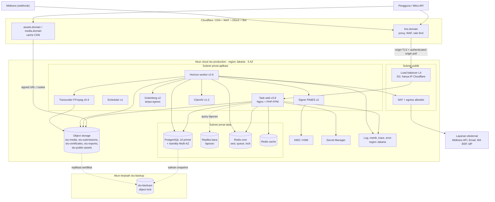
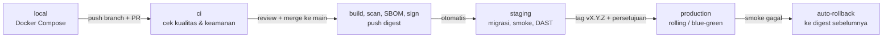

# 11 — DevOps, Infrastruktur & Deployment

> Status: **Disetujui untuk development** · Versi 1.0 · Pemilik: DevOps Lead
>
> Dokumen ini menjabarkan cara STU LMS dibangun, dirilis, dijalankan, dipantau, dan dipulihkan.
> Keputusan teknologi mengikuti [`04-arsitektur-sistem.md`](04-arsitektur-sistem.md) (§3, §5, §9,
> §11, §12, ADR-004). Kontrol keamanan yang mendalam **tidak** diulang di sini, tetapi dirujuk ke:
> [`keamanan/13-keamanan-infrastruktur.md`](keamanan/13-keamanan-infrastruktur.md),
> [`keamanan/14-secure-sdlc-dan-supply-chain.md`](keamanan/14-secure-sdlc-dan-supply-chain.md),
> [`keamanan/15-respons-insiden-dan-kontinuitas.md`](keamanan/15-respons-insiden-dan-kontinuitas.md),
> [`keamanan/11-logging-audit-dan-monitoring.md`](keamanan/11-logging-audit-dan-monitoring.md), dan
> [`keamanan/06-kriptografi-dan-manajemen-kunci.md`](keamanan/06-kriptografi-dan-manajemen-kunci.md).
> Bila ada perbedaan angka/aturan antara dokumen ini dan dokumen keamanan, **yang lebih ketat berlaku**.

## 0. Prinsip Operasional

1. **Semua infrastruktur adalah kode.** Tidak ada perubahan manual di konsol kecuali *break-glass*,
   dan wajib di-*backport* ke IaC dalam 1 hari kerja.
2. **Build sekali, promosikan digest yang sama.** Image yang lolos staging adalah image (digest
   `sha256`) yang sama persis yang naik ke produksi — tidak ada *rebuild* per lingkungan.
3. **Immutable & stateless.** Kontainer tidak diubah setelah berjalan; state hanya di PostgreSQL,
   Redis, dan object storage.
4. **Tanpa secret di repositori, image, log, atau artefak CI.** Secret disuntikkan saat runtime.
5. **Least privilege di semua lapisan:** IAM, jaringan, basis data (peran app ≠ pemilik tabel,
   ADR-003), GitHub Actions `permissions:`.
6. **Setiap perubahan dapat dibatalkan.** Migrasi *expand/contract*, feature flag, rollback ke
   digest sebelumnya ≤ 10 menit.
7. **Data produksi tidak pernah keluar dari batas produksi** (tidak disalin ke staging/local/CI).
8. **Diamati sebelum dirilis.** Fitur baru wajib punya log, metrik, dan (bila kritis) alert sebelum
   dinyatakan *done*.

---

## 1. Topologi Infrastruktur per Lingkungan

### 1.1 Implementasi referensi & padanan penyedia

Dokumen ini memakai **AWS region Jakarta (`ap-southeast-3`)** sebagai implementasi referensi.
Padanan di penyedia lain boleh dipakai selama memenuhi kontrol yang sama (keputusan akhir dicatat
sebagai ADR).

| Kebutuhan | AWS (referensi) | Google Cloud (`asia-southeast2`, Jakarta) | Generik / penyedia lokal |
|---|---|---|---|
| Orkestrasi kontainer | ECS on Fargate | GKE Autopilot | Kubernetes terkelola / Nomad / VM + Docker |
| PostgreSQL 16 terkelola (HA, PITR) | RDS for PostgreSQL Multi-AZ | Cloud SQL for PostgreSQL (HA) | DBaaS dengan WAL archiving + replika |
| Redis 7 terkelola | ElastiCache for Redis/Valkey | Memorystore for Redis/Valkey | Redis terkelola dengan replika |
| Object storage | S3 (+ Object Lock) | Cloud Storage (+ Bucket Lock) | S3-compatible dengan versioning & WORM |
| KMS / HSM | AWS KMS (+ CloudHSM bila diwajibkan) | Cloud KMS (+ Cloud HSM) | HSM/KMS penyedia atau Vault Transit + HSM |
| Secret manager | Secrets Manager | Secret Manager | HashiCorp Vault / Doppler |
| Registry kontainer | ECR (tag immutable, private) | Artifact Registry | GHCR private (deploy by digest) |
| Akses admin | SSM Session Manager | IAP TCP forwarding | Bastion + Tailscale/Teleport |
| CDN + WAF | Cloudflare (utama); alternatif CloudFront + AWS WAF | Cloudflare; alternatif Cloud CDN + Cloud Armor | Cloudflare |
| Identitas CI ke cloud | IAM OIDC provider untuk GitHub | Workload Identity Federation | OIDC |

### 1.2 Ringkasan lingkungan

Melengkapi tabel [`04-arsitektur-sistem.md` §11](04-arsitektur-sistem.md#11-lingkungan-environments).

| Aspek | `local` | `ci` | `staging` | `production` |
|---|---|---|---|---|
| Tujuan | Pengembangan | Uji otomatis per PR/commit | UAT, DAST, pentest, demo, latihan rilis | Layanan nyata |
| Platform | Docker Compose (Sail-like) | GitHub-hosted runner + *service containers* | Akun cloud **terpisah** `stu-staging`, 1 AZ, ukuran kecil, modul IaC sama | Akun cloud **terpisah** `stu-production`, 3 AZ |
| Basis data | `postgres:16` kontainer | `postgres:16` service, dibuat ulang tiap run | RDS single-AZ + PITR 7 hari | RDS Multi-AZ + replika baca + PITR |
| Redis | `redis:7` kontainer | `redis:7` service | ElastiCache 1 node | ElastiCache primer + replika, Multi-AZ |
| Object storage | MinIO | Fake/MinIO | Bucket `stu-stg-*` | Bucket `stu-*` (§1.6) |
| Email | Mailpit (tidak ada email keluar) | `array` driver | Sandbox penyedia; hanya ke domain internal | Penyedia transaksional (SPF/DKIM/DMARC) |
| Pembayaran | Midtrans **Sandbox** | Mock | Midtrans **Sandbox** | Midtrans **Production** |
| Penandatangan PDF | Kunci dev *self-signed* | Mock | Kunci uji di KMS staging; PDF diberi watermark **SPESIMEN** | Kunci produksi di KMS/HSM (ADR-005) |
| Data | Seeder sintetis | Factory sintetis | Sintetis/anonim (dilarang salinan mentah produksi) | Data nyata |
| Akses | Developer | Pipeline | Cloudflare Access (SSO + MFA) + IP allowlist; CI via *service token* | JIT, least privilege (§13) |
| Domain | `*.localhost` | — | `staging-lms.<domain>` (tidak diindeks, `X-Robots-Tag: noindex`) | `lms.<domain>`, `assets.<domain>`, `media.<domain>` |
| Deploy | Manual | Otomatis | Otomatis tiap merge ke `main` | Tag rilis + persetujuan manusia |

**Pemisahan wajib antar-lingkungan:** akun/proyek cloud berbeda, VPC berbeda (tanpa peering
staging↔production), kunci KMS berbeda, secret berbeda, `APP_KEY` berbeda, domain & cookie
berbeda, kredensial pihak ketiga berbeda (Midtrans sandbox vs production).

### 1.3 Lingkungan lokal (`local`)

`compose.yaml` di repositori menyediakan: `app` (PHP-FPM, image target `dev` dengan Xdebug),
`web` (Nginx), `horizon`, `scheduler`, `postgres:16`, `redis:7`, `minio`, `mailpit`, `gotenberg`,
`signer-mock`. Aturan:

- `.env` lokal dibuat dari `.env.example` (hanya nilai dummy); `.env` ada di `.gitignore` dan
  `.dockerignore`.
- Seeder `DevSeeder` membuat organisasi, pengguna tiap peran, program, kelas, dan sertifikat contoh
  — **tanpa data nyata**.
- Peran DB lokal meniru produksi: `stu_migrator` (pemilik skema) dan `stu_app` (non-owner, RLS
  aktif) agar bug RLS terdeteksi sejak lokal.

### 1.4 Topologi produksi



Alur promosi antar-lingkungan:



### 1.5 Jaringan

| Zona | Isi | Masuk (ingress) | Keluar (egress) |
|---|---|---|---|
| Publik | Load balancer L4, NAT | 443 hanya dari rentang IP Cloudflare (dikelola IaC, diperbarui otomatis) | — |
| Privat-aplikasi | Task web, worker, scheduler, transcoder, Gotenberg, signer, ClamAV | Web: hanya dari LB. Gotenberg/signer/ClamAV: hanya dari worker (SG-to-SG). | Lewat NAT + **egress allowlist** domain (Midtrans, email, WA, IdP, pembaruan signature ClamAV); layanan cloud via *VPC endpoint* (S3, KMS, Secrets Manager, ECR, logs) |
| Privat-data | RDS, ElastiCache | 5432/6379 hanya dari SG aplikasi & worker | Tidak ada |
| Gotenberg & transcoder | — | — | **Tanpa egress internet** (mencegah SSRF saat render HTML / memproses media) |

Tidak ada IP publik pada node aplikasi/data, tidak ada SSH terbuka; akses admin lewat SSM (§13).
Detail kontrol jaringan, *flow logs*, dan hardening ada di
[`keamanan/13-keamanan-infrastruktur.md`](keamanan/13-keamanan-infrastruktur.md).

### 1.6 Ukuran produksi MVP

Dihitung dari asumsi [`04` §12](04-arsitektur-sistem.md#12-kapasitas--skalabilitas-awal)
(5.000 DAU, puncak 1.000 peserta ujian serentak, 2 TB media). Validasi ulang dengan uji beban
(§12) sebelum *go-live*.

| Komponen | Spesifikasi awal | Jumlah (min–maks) | Autoscaling / catatan |
|---|---|---|---|
| **Web** (Nginx + PHP-FPM, 1 task = 2 kontainer) | 2 vCPU / 4 GB | 3–8 (tersebar di 3 AZ) | CPU > 60% atau p95 > 800 ms selama 5 menit. PHP-FPM `pm = static`, `pm.max_children = 40`, `pm.max_requests = 1000`. |
| **Worker umum** (Horizon: `notifications`, `payments`, `certificates`, `imports`, `reports`, `privacy`, `maintenance`, `security`) | 2 vCPU / 4 GB | 2–6 | Waktu tunggu antrian (`horizon` *wait time*) > 60 dtk. |
| **Transcoder** (Horizon pool `media` + FFmpeg) | 4 vCPU / 8 GB | 0–4 | Kedalaman antrian `media`; boleh kapasitas *spot*; *scale-in protection* selama job berjalan. |
| **Scheduler** (`php artisan schedule:work`) | 0,25 vCPU / 0,5 GB | **tepat 1** | Tidak diskalakan; `onOneServer()` sebagai pengaman ganda. |
| **Gotenberg** (render HTML→PDF) | 2 vCPU / 4 GB | 2 | Internal saja, tanpa egress. |
| **Signer PAdES** | 0,5 vCPU / 1 GB | 2 | Satu-satunya identitas yang boleh `kms:Sign` pada kunci penandatangan sertifikat. |
| **ClamAV** | 1 vCPU / 3 GB | 1–2 | Signature diperbarui via egress allowlist. |
| **PostgreSQL 16** | Primer 4 vCPU / 16 GB (kelas *memory-optimized*), gp3 200 GB auto-grow hingga 1 TB, enkripsi KMS | Primer + standby sinkron (Multi-AZ) + **1 replika baca** 2 vCPU / 8 GB | PITR 14 hari; `max_connections` ≈ 400; `pgaudit` aktif; *Performance Insights*/`pg_stat_statements`. Pooler (RDS Proxy/PgBouncer mode *transaction*) opsional — kompatibel dengan `SET LOCAL` per transaksi (ADR-003). |
| **Redis core** (sesi, antrian, lock, rate limit) | 2 vCPU / ~6 GB | Primer + replika, Multi-AZ, failover otomatis | `maxmemory-policy noeviction`; TLS in-transit + AUTH; enkripsi at-rest. |
| **Redis cache** | 2 vCPU / ~3 GB | 1 primer + 1 replika | `allkeys-lru`; boleh hilang tanpa dampak fungsional. |
| **Load balancer** | L4 (TCP passthrough) | 1 (multi-AZ) | TLS origin diterminasi di Nginx (§8). |
| **Observabilitas** | Stack log/metrik/trace di region Jakarta | — | Lihat §9. |

Pool Horizon (konfigurasi `config/horizon.php`, lingkungan `production`):

| Supervisor | Antrian | Proses (min–maks) | `timeout` | `tries` | Koneksi queue |
|---|---|---|---|---|---|
| `sv-critical` | `payments`, `certificates` | 2–6 | 120 dtk | 5 (backoff 10, 30, 60, 120 dtk) | `redis` (`retry_after` 180) |
| `sv-default` | `notifications`, `security`, `default` | 3–10 | 60 dtk | 3 | `redis` |
| `sv-bulk` | `imports`, `reports`, `privacy`, `maintenance` | 1–3 | 900 dtk | 1 (idempoten, dapat dilanjutkan) | `redis-long` (`retry_after` 960) |
| `sv-media` (task transcoder) | `media` | 1 per vCPU/2 | 3600 dtk | 2 | `redis-media` (`retry_after` 3700) |

> `retry_after` adalah properti **koneksi**, sehingga job panjang wajib memakai koneksi terpisah
> dengan `retry_after` > `timeout`; jika tidak, job akan dieksekusi ganda.

### 1.7 Bucket object storage

Semua bucket: *Block Public Access* aktif (kecuali `stu-public-assets`), enkripsi SSE-KMS dengan
kunci per bucket, TLS wajib (`aws:SecureTransport`), *access logging* ke bucket log, path diawali
`org/{organization_id}/` untuk data ber-tenant ([`07` §6.2](07-rbac-dan-multi-tenant.md#62-penegakan)).

| Bucket | Isi | Visibilitas | Versioning | Object Lock | Lifecycle | Replikasi |
|---|---|---|---|---|---|---|
| `stu-media` | Video sumber (karantina → bersih), segmen HLS terenkripsi AES-128, PDF materi | **Privat**; disajikan via CDN `media.<domain>` dengan *signed cookie/URL* | Ya | Tidak | Video sumber → kelas *infrequent access* 30 hari, dihapus 180 hari setelah transcode sukses; versi lama dihapus 30 hari; unggahan *multipart* gagal dibersihkan 7 hari; prefix `quarantine/` dihapus 7 hari | Tidak (dapat di-*transcode* ulang dari sumber; sumber dicadangkan ke `stu-backups` mingguan) |
| `stu-submissions` | Berkas tugas peserta | **Privat**; hanya *pre-signed URL* ≤ 5 menit setelah policy lolos | Ya | Tidak | Versi lama 90 hari; retensi data mengikuti kebijakan privasi | Ke `stu-backups` (harian) |
| `stu-certificates` | PDF sertifikat bertanda tangan | **Privat**; unduh via *pre-signed URL* | Ya | **Ya — mode *compliance*, retensi 10 tahun** (angka final mengikuti kebijakan retensi di [`keamanan/12`](keamanan/12-privasi-data-dan-kepatuhan-uu-pdp.md)) | Tidak ada penghapusan otomatis | **Ya**, replikasi ke lokasi kedua (lihat catatan) |
| `stu-exports` | Ekspor laporan CSV/XLSX, paket ekspor data pribadi | **Privat**; tautan bertanda tangan 15 menit | Tidak | Tidak | **Hapus otomatis 1 hari** | Tidak |
| `stu-backups` | Dump logis DB, salinan objek, *state* penting | **Privat**, di **akun/proyek terpisah** `stu-backup`; akun produksi hanya punya izin *write*, tanpa *delete* | Ya | **Ya — mode *compliance* 35 hari** (bulanan: 12 bulan) | Harian 35 hari, bulanan 12 bulan | Salinan *offsite* (lihat §10) |
| `stu-public-assets` | Aset build Vite (`/build/*` ber-*hash*), logo, gambar CMS publik | **Publik via CDN** `assets.<domain>` (origin hanya dapat dibaca CDN) | Ya | Tidak | Aset build lama dihapus 30 hari setelah tidak dirujuk (agar pengguna di tengah *rolling deploy* tetap mendapat aset versi lama) | Tidak |

Catatan replikasi lintas lokasi: penyedia *hyperscaler* umumnya hanya memiliki **satu region di
Indonesia**. Replikasi `stu-certificates` diutamakan ke **lokasi kedua di Indonesia** (penyedia
lain/penyedia lokal di kota berbeda). Replikasi ke luar negeri (mis. Singapura) hanya boleh setelah
kajian transfer data lintas batas UU PDP disetujui DPO — lihat
[`keamanan/12-privasi-data-dan-kepatuhan-uu-pdp.md`](keamanan/12-privasi-data-dan-kepatuhan-uu-pdp.md).

Unggahan besar (video, berkas tugas) dikirim **langsung dari browser ke object storage** memakai
*pre-signed POST* dengan kondisi `content-length-range` dan `Content-Type`; aplikasi hanya menerima
metadata lalu memicu job scan malware (`security`) sebelum berkas keluar dari prefix `quarantine/`.

### 1.8 Alternatif anggaran minimal

Untuk fase pilot (≤ 500 DAU, tanpa ujian serentak besar) bila anggaran belum memungkinkan topologi
§1.6. Tetap memenuhi ADR-004 (bukan shared hosting).

| Komponen | Spesifikasi |
|---|---|
| 1 VM di region Jakarta | 8 vCPU / 32 GB, disk SSD 200 GB terenkripsi, tanpa IP publik untuk SSH (akses via SSM/Tailscale) |
| Docker Compose di VM | `web` (Nginx + PHP-FPM), `horizon` (semua antrian kecuali `media`), `media` (`cpus: 2`, `mem_limit: 6g`), `scheduler`, `gotenberg` (network internal tanpa egress), `signer`, `clamav`, `redis` (AOF `everysec`, `requirepass`, hanya di network internal), agen log/metrik |
| PostgreSQL terkelola | Single-AZ, 2 vCPU / 8 GB, PITR 7 hari + snapshot harian; tanpa replika baca |
| Object storage | Bucket sama seperti §1.7 (tidak dikurangi) |
| CDN/WAF | Cloudflare (paket dengan WAF managed rules), origin hanya menerima IP Cloudflare (firewall VM) |
| KMS, Secret Manager, backup lintas akun | **Tidak dikurangi** — kontrol kunci & backup tidak dinegosiasikan |

| Trade-off | Dampak | Mitigasi |
|---|---|---|
| VM = *single point of failure* | Gangguan VM/AZ = seluruh aplikasi mati | Image & konfigurasi dari IaC; VM dapat dibangun ulang ≤ 2 jam; SLO diturunkan ke **99,0%** |
| Redis di VM | VM hilang → sesi pengguna & job di antrian hilang | State kritis selalu di DB (*outbox*/status transaksi); job rekonsiliasi pembayaran memulihkan status; pengguna login ulang |
| Deploy tanpa blue-green | *Downtime* singkat (±5–30 dtk) saat `docker compose up -d` | Deploy di jendela pemeliharaan; halaman maintenance statis di Cloudflare |
| Transcoding berebut CPU dengan web | Latensi naik saat unggah video | Batas cgroup (`cpus`, `mem_limit`), jadwalkan transcode massal di luar jam sibuk |
| DB single-AZ | Failover manual, RTO lebih lama | PITR + snapshot; RTO target 8 jam, RPO ≤ 15 menit |
| Kapasitas vertikal saja | Tidak siap ujian 1.000 peserta serentak | **Pemicu migrasi ke §1.6:** DAU > 1.000, ujian serentak > 200, CPU VM rata-rata > 60% selama 1 minggu, atau kontrak B2B yang mensyaratkan SLA ≥ 99,5% |

---

## 2. Infrastructure as Code (OpenTofu/Terraform)

### 2.1 Alat & repositori

- **OpenTofu ≥ 1.8** (kompatibel Terraform) — dipilih karena lisensi terbuka dan fitur **enkripsi
  state sisi klien**. Versi dikunci di `.opentofu-version` dan `required_version`.
- Repositori terpisah **`stu-lms-infra`** (akses lebih sempit daripada repo aplikasi; CODEOWNERS:
  DevOps Lead + Security Lead).
- Provider dikunci (`.terraform.lock.hcl` di-commit), modul pihak ketiga dikunci ke versi/commit.

```
stu-lms-infra/
├── modules/
│   ├── network/            # VPC, subnet, SG, NAT, VPC endpoints, flow logs, egress allowlist
│   ├── database/           # RDS PostgreSQL, parameter group, replika, pgaudit
│   ├── redis/              # ElastiCache core & cache
│   ├── storage/            # bucket + policy + lifecycle + object lock + replikasi
│   ├── kms/                # kunci per tujuan + key policy
│   ├── container-service/  # cluster, task definition, service, autoscaling, IAM task role
│   ├── edge-cloudflare/    # DNS, WAF rules, rate limit, Access (staging), origin cert, AOP
│   ├── observability/      # log group, collector, dashboard, alert rules
│   ├── backup/             # vault backup, salinan lintas akun, rencana restore-test
│   └── github-oidc/        # OIDC provider + role per repo/environment
├── envs/
│   ├── shared/             # registry, DNS zone, organisasi akun, guardrail (SCP/org policy)
│   ├── backup/             # akun stu-backup
│   ├── staging/            # main.tf, backend.tf, staging.tfvars
│   └── production/         # main.tf, backend.tf, production.tfvars
├── policies/               # aturan conftest/OPA (mis. larang bucket publik, wajib tag, wajib enkripsi)
└── .github/workflows/      # plan.yml, apply.yml, drift.yml
```

### 2.2 State

| Aturan | Implementasi |
|---|---|
| Remote & terpisah per lingkungan | Bucket `stu-tfstate-<env>` di akun masing-masing (production state tidak dapat dibaca dari staging). |
| Terenkripsi | SSE-KMS pada bucket **dan** enkripsi state sisi klien OpenTofu (`encryption { key_provider "aws_kms" ... }`). |
| Locking | S3 *native lockfile* (`use_lockfile = true`) atau tabel DynamoDB; GCS memiliki locking bawaan. |
| Versioning & proteksi | Versioning aktif, *Block Public Access*, hanya role `tofu-plan-<env>` (baca) dan `tofu-apply-<env>` (tulis) yang punya akses. |
| Minim secret di state | Password DB dibuat & dirotasi oleh layanan terkelola langsung ke Secret Manager (mis. `manage_master_user_password = true`); jangan menaruh secret di `*.tfvars`. |

### 2.3 Alur kerja

| Tahap | Pemicu | Identitas | Keterangan |
|---|---|---|---|
| `fmt`, `validate`, `tflint`, `trivy config`/`checkov`, `conftest` | Setiap PR | Tanpa kredensial cloud | Gagal = PR tidak dapat di-merge. |
| `tofu plan` | Setiap PR, per lingkungan yang terdampak | OIDC → role **read-only** `tofu-plan-<env>` | Ringkasan plan (jumlah add/change/destroy + daftar resource) dikomentarkan di PR; output lengkap sebagai artefak terenkripsi retensi 1 hari. Perubahan yang **menghapus/mengganti** resource data (DB, bucket, kunci KMS) diberi label `destructive` dan butuh persetujuan Security Lead. |
| `tofu apply` | Merge ke `main` | OIDC → role `tofu-apply-<env>`, GitHub Environment `infra-<env>` dengan *required reviewers* (production: 2 orang, salah satunya DevOps Lead) | Menerapkan **berkas plan yang sama** yang telah ditinjau; staging dulu, production setelahnya. |
| Deteksi drift | Terjadwal harian 01.00 WIB (`0 18 * * *` UTC) | Role read-only | `tofu plan -detailed-exitcode -lock=false`; *exit code* 2 → alert P3 + issue otomatis `drift/<env>`. |

Guardrail tingkat organisasi cloud (SCP/org policy): tolak region selain Jakarta (dan lokasi backup
yang disetujui), tolak bucket publik selain `stu-public-assets`, tolak penonaktifan audit trail
(CloudTrail/Cloud Audit Logs), tolak penghapusan kunci KMS tanpa masa tunggu 30 hari.

---

## 3. Image Kontainer

### 3.1 Daftar image

| Image | Basis | Dipakai oleh | Perintah |
|---|---|---|---|
| `stu-lms-app` | `php:8.4-fpm-alpine` (di-*pin* digest) | Task web (kontainer PHP-FPM), worker, scheduler, job migrasi | `php-fpm -F` / `php artisan horizon` / `php artisan schedule:work` / `php artisan migrate --force --isolated` |
| `stu-lms-web` | `nginxinc/nginx-unprivileged:1.26-alpine` (digest) | Task web (kontainer Nginx) | Hanya berisi `public/` + konfigurasi Nginx |
| `stu-lms-media` | `stu-lms-app` + FFmpeg | Task transcoder | `php artisan horizon` (hanya supervisor `sv-media`) |
| `stu-signer` | Minimal/distroless | Signer PAdES | Detail kriptografi di [`keamanan/06`](keamanan/06-kriptografi-dan-manajemen-kunci.md) |
| `gotenberg/gotenberg:8` | Upstream (digest) | Renderer PDF | Chromium; JavaScript & akses jaringan eksternal dinonaktifkan |
| `clamav/clamav` | Upstream (digest) | Scan malware | — |

Semua image dibangun dari **satu `Dockerfile` multi-stage** dengan beberapa *target*, satu tag
per commit: `sha-<git-sha>`; rilis menambah tag `vX.Y.Z` ke **digest yang sama**.

### 3.2 Aturan Dockerfile

| Aturan | Alasan / cara |
|---|---|
| Multi-stage: `php-base` → `vendor` → `assets` → `app` / `web` / `media` | Composer, Node, dan *toolchain* build tidak ikut ke image runtime. |
| Base image di-*pin* **digest** `@sha256:` | Build reproducible; Renovate/Dependabot membuka PR saat digest baru. |
| `composer install --no-dev --classmap-authoritative` | Tidak ada paket dev (Telescope, Debugbar, Ignition, Tinker, Pest) di produksi. |
| `npm ci --ignore-scripts` lalu `npm run build` | Blok *install script* berbahaya; hasil hanya `public/build`. |
| **Non-root** `USER 10001:10001` | Nginx memakai image *unprivileged* (port 8443). |
| **Read-only root filesystem** | Direktori tulis hanya `storage/`, `bootstrap/cache/`, `/tmp` sebagai *tmpfs/ephemeral volume*. Berkas aplikasi dimiliki `root` dan tidak dapat ditulis proses PHP. |
| Tanpa secret di layer | Tidak ada `.env` di image (`.dockerignore`), tidak ada `ARG`/`ENV` berisi secret; kredensial Composer privat via `RUN --mount=type=secret`. |
| `config:cache` **tidak** di waktu build | Config bergantung env runtime; `php artisan optimize` dijalankan di *entrypoint* ke direktori tmpfs. |
| OPcache produksi | `validate_timestamps=0` (kode immutable), memori cukup, JIT opsional setelah benchmark. |
| `php.ini-production` + hardening | `expose_php=Off`, `display_errors=Off`, `log_errors=On`; untuk **pool FPM web** saja: `disable_functions = exec,passthru,shell_exec,system,proc_open,popen` (worker CLI butuh `proc_open` untuk Horizon). |
| Metadata OCI | Label `org.opencontainers.image.source`, `.revision`, `.version`, `.created`. |
| Tanpa `HEALTHCHECK` di Dockerfile | Health check didefinisikan di orkestrator (§5.6). |

Cuplikan `docker/Dockerfile`:

```dockerfile
# syntax=docker/dockerfile:1.10
ARG PHP_IMAGE=php:8.4-fpm-alpine@sha256:<digest>
ARG NODE_IMAGE=node:22-alpine@sha256:<digest>
ARG COMPOSER_IMAGE=composer:2@sha256:<digest>
ARG NGINX_IMAGE=nginxinc/nginx-unprivileged:1.26-alpine@sha256:<digest>
ARG PHPEXT_IMAGE=mlocati/php-extension-installer:2@sha256:<digest>

FROM ${COMPOSER_IMAGE} AS composer-bin
FROM ${PHPEXT_IMAGE} AS phpext-bin

# ---------- basis runtime PHP ----------
FROM ${PHP_IMAGE} AS php-base
COPY --from=phpext-bin /usr/bin/install-php-extensions /usr/local/bin/
RUN install-php-extensions pdo_pgsql redis intl opcache pcntl zip bcmath gd \
 && rm /usr/local/bin/install-php-extensions \
 && mv "$PHP_INI_DIR/php.ini-production" "$PHP_INI_DIR/php.ini" \
 && addgroup -g 10001 -S app && adduser -S -u 10001 -G app -H -s /sbin/nologin app
COPY docker/php/zz-prod.ini docker/php/opcache.ini "$PHP_INI_DIR/conf.d/"
COPY docker/php/zz-www.conf /usr/local/etc/php-fpm.d/zz-www.conf

# ---------- dependensi Composer (tanpa dev) ----------
FROM php-base AS vendor
COPY --from=composer-bin /usr/bin/composer /usr/bin/composer
WORKDIR /app
COPY composer.json composer.lock ./
RUN --mount=type=secret,id=composer_auth,target=/root/.composer/auth.json \
    composer install --no-dev --no-scripts --no-autoloader --prefer-dist \
                     --no-interaction --no-progress
COPY . .
RUN composer dump-autoload --no-dev --optimize --classmap-authoritative \
 && composer check-platform-reqs --no-dev

# ---------- aset front-end ----------
FROM ${NODE_IMAGE} AS assets
WORKDIR /app
COPY package.json package-lock.json ./
RUN npm ci --ignore-scripts
COPY vite.config.js ./
COPY resources ./resources
COPY app ./app
RUN npm run build          # hasil: public/build/manifest.json + aset ber-hash

# ---------- image aplikasi (web FPM, worker, scheduler) ----------
FROM php-base AS app
WORKDIR /var/www/html
COPY --from=vendor --chown=root:root /app /var/www/html
COPY --from=assets --chown=root:root /app/public/build /var/www/html/public/build
COPY --chmod=0755 docker/php/entrypoint.sh /usr/local/bin/entrypoint
RUN mkdir -p storage/framework/cache storage/framework/views storage/framework/sessions \
             storage/logs bootstrap/cache \
 && chown -R 10001:10001 storage bootstrap/cache
USER 10001:10001
ENV APP_ENV=production APP_DEBUG=false LOG_CHANNEL=stderr
ENTRYPOINT ["entrypoint"]
CMD ["php-fpm", "-F"]

# ---------- transcoder ----------
FROM app AS media
USER root
RUN apk add --no-cache ffmpeg
USER 10001:10001
CMD ["php", "artisan", "horizon"]    # env khusus task ini memilih blok supervisor sv-media di config/horizon.php

# ---------- Nginx (hanya berkas publik) ----------
FROM ${NGINX_IMAGE} AS web
COPY --from=app /var/www/html/public /var/www/html/public
COPY docker/nginx/ /etc/nginx/
EXPOSE 8443
```

`docker/php/entrypoint.sh`:

```sh
#!/bin/sh
set -eu
# Cache dibuat saat start karena config bergantung pada secret runtime.
# Gagal di sini (mis. APP_DEBUG=true di produksi, lihat §6.4) → kontainer exit → deploy dibatalkan.
php artisan optimize --no-interaction
exec "$@"
```

`docker/php/opcache.ini`:

```ini
opcache.enable=1
opcache.enable_cli=0
opcache.memory_consumption=256
opcache.interned_strings_buffer=32
opcache.max_accelerated_files=30000
opcache.validate_timestamps=0
opcache.save_comments=1        ; dibutuhkan atribut/anotasi PHP
```

`.dockerignore` minimal: `.env*`, `!.env.example`, `.git`, `node_modules`, `vendor`, `tests`,
`storage/logs/*`, `storage/framework/*/*`, `docs`, `*.html` purwarupa, `assets/js` purwarupa.

### 3.3 Supply chain image

Kebijakan lengkap di
[`keamanan/14-secure-sdlc-dan-supply-chain.md`](keamanan/14-secure-sdlc-dan-supply-chain.md).
Ringkasan operasional:

| Langkah | Alat | Gerbang |
|---|---|---|
| Scan kerentanan image | **Trivy** (`trivy image --severity CRITICAL,HIGH --ignore-unfixed --exit-code 1`) | Gagal bila ada CRITICAL/HIGH yang sudah ada perbaikannya. Pengecualian di `.trivyignore.yaml` wajib alasan + tanggal kedaluwarsa ≤ 30 hari + persetujuan Security Lead. |
| Scan konfigurasi | `trivy config` pada Dockerfile, compose, IaC | Gagal pada misconfig HIGH (mis. root user). |
| SBOM | **Syft** → SPDX JSON | Dilampirkan sebagai *attestation* image dan artefak GitHub Release. |
| Tanda tangan | **cosign** dengan kunci di KMS (`awskms:///alias/stu-cosign`) — tidak memakai log transparansi publik agar metadata repo privat tidak terpublikasi | Deploy staging/production **menolak** image tanpa tanda tangan valid (`cosign verify`). |
| Registry | ECR privat region Jakarta, **tag immutable**, scan-on-push, lifecycle: simpan 50 digest terakhir + semua tag `v*` | Deploy selalu merujuk **digest**, bukan tag. |

---

## 4. Pipeline CI/CD (GitHub Actions)

### 4.1 Tahapan

| # | Tahap | Alat | Pemicu | Gerbang (gagal = berhenti) |
|---|---|---|---|---|
| 1 | Lint | **Laravel Pint** (`--test`), Prettier/ESLint untuk JS | PR, `main` | Ada perbedaan format |
| 2 | Analisis statis | **Larastan** (PHPStan) level ≥ 6 dengan baseline yang hanya boleh menyusut | PR, `main` | Error baru |
| 3 | Uji | **Pest** (unit, feature, arch, security) dengan service **PostgreSQL 16 + Redis 7**, peran DB `stu_app` non-owner (RLS aktif) | PR, `main` | Uji gagal, cakupan < ambang di [`10-strategi-pengujian.md`](10-strategi-pengujian.md) |
| 4 | Migrasi | `migrate:fresh` + `migrate:rollback --step=1` + `migrate` (uji reversibel lokal CI) | PR, `main` | Migrasi gagal |
| 5 | SAST | **Semgrep** (`p/php`, `p/owasp-top-ten`, aturan kustom `.semgrep/` mis. larang `DB::raw` dengan input, `{!! !!}`, `withoutGlobalScope`) | PR, `main` | Temuan severity ERROR |
| 6 | SCA | `composer audit --locked`, `npm audit --omit=dev --audit-level=high`, Dependabot | PR, `main`, harian | Advisory HIGH/CRITICAL |
| 7 | Secret scan | **gitleaks** (riwayat penuh di `main`, rentang commit di PR) + GitHub secret scanning & push protection | PR, `main` | Temuan apa pun |
| 8 | Build | Docker Buildx, cache layer, target `app`/`web`/`media` | PR (tanpa push), `main` (push) | Build gagal |
| 9 | Scan image | **Trivy** image + config | PR, `main` | §3.3 |
| 10 | SBOM | **Syft** | `main` | — |
| 11 | Sign & attest | **cosign** (KMS) | `main` | — |
| 12 | Deploy staging | Skrip `deploy/deploy.sh` via OIDC | `main` otomatis | Migrasi/health gagal → rollback staging |
| 13 | Smoke test staging | Pest `--group=smoke` terhadap URL staging | `main` | Gagal |
| 14 | DAST baseline | **OWASP ZAP** baseline (pasif) via Cloudflare Access service token; *full scan* mingguan | `main`, mingguan | Alert High |
| 15 | Persetujuan manual | GitHub Environment `production`, *required reviewers* (Tech Lead + DevOps Lead, tidak boleh penulis rilis sendiri) | Tag `vX.Y.Z` | Tidak disetujui |
| 16 | Deploy production | Rolling (default) atau blue-green (rilis MAJOR/berisiko) | Setelah persetujuan | Health check/circuit breaker gagal |
| 17 | Smoke test production | Pest `--group=smoke-prod` (hanya baca, akun sintetis) + cek synthetic | Setelah deploy | Gagal → **auto-rollback** |
| 18 | Auto-rollback | `deploy.sh rollback` ke digest *last known good* | Otomatis | — |

Semua tahap 1–9 adalah *required status checks* pada branch protection `main`.

### 4.2 Hardening GitHub Actions

| Aturan | Implementasi |
|---|---|
| Pin action dengan **SHA commit penuh** | `uses: owner/action@<sha40> # vX.Y.Z`; Dependabot `package-ecosystem: github-actions` memperbarui SHA. (Motivasi: insiden `tj-actions/changed-files` Maret 2025 — tag dipindahkan ke commit berbahaya.) |
| `permissions:` minimal | Level workflow `permissions: {}`; tiap job meminta izin spesifik (`contents: read`, `id-token: write` hanya untuk job deploy/sign). |
| **OIDC** ke cloud, tanpa kunci jangka panjang | Role cloud dengan trust policy yang membatasi `sub` ke `repo:<org>/stu-lms:environment:staging` / `:environment:production`. Tidak ada `AWS_ACCESS_KEY_ID` di GitHub Secrets. |
| Environments | `staging` (branch `main` saja), `production` (tag `v*` saja, *required reviewers* 2, *wait timer* opsional, *prevent self-review*). Secret environment hanya tersedia untuk job di environment itu. |
| PR dari fork | Workflow `pull_request` tidak mendapat secret; persetujuan wajib untuk menjalankan workflow kontributor luar. **`pull_request_target` dilarang**, begitu pula `workflow_run` yang mengeksekusi artefak dari PR. Diperiksa oleh aturan lint workflow (**actionlint** + **zizmor**) di CI. |
| Cegah injeksi skrip | Tidak menyisipkan `${{ github.event.* }}` langsung di `run:`; lewatkan melalui `env:`. |
| `actions/checkout` | `persist-credentials: false`. |
| Runner | GitHub-hosted untuk PR. Runner self-hosted (bila ada) hanya untuk job `main`/tag, ephemeral, di VPC terpisah dari produksi. |
| Perubahan workflow | CODEOWNERS `.github/workflows/` = DevOps Lead + Security Lead; review wajib 2 orang. |
| Cache | Kunci cache tidak dibagi antara PR dan `main` untuk job rilis (mitigasi *cache poisoning*): job build rilis tidak memakai cache dari PR. |

### 4.3 Kerangka workflow

`.github/workflows/ci.yml` (PR + `main`):

```yaml
name: ci
on:
  pull_request:
    branches: [main]
  push:
    branches: [main]

permissions: {}

concurrency:
  group: ci-${{ github.ref }}
  cancel-in-progress: ${{ github.event_name == 'pull_request' }}

env:
  REGISTRY: <akun>.dkr.ecr.ap-southeast-3.amazonaws.com
  PHP_VERSION: '8.4'

jobs:
  quality:
    runs-on: ubuntu-24.04
    permissions: { contents: read }
    steps:
      - uses: actions/checkout@<sha40> # v4
        with: { persist-credentials: false }
      - uses: shivammathur/setup-php@<sha40> # v2
        with: { php-version: '${{ env.PHP_VERSION }}', coverage: none, tools: composer:v2 }
      - run: composer install --no-interaction --prefer-dist --no-progress
      - run: vendor/bin/pint --test
      - run: vendor/bin/phpstan analyse --no-progress --memory-limit=1G
      - run: composer audit --locked
      - run: npm ci --ignore-scripts && npm audit --omit=dev --audit-level=high

  test:
    runs-on: ubuntu-24.04
    permissions: { contents: read }
    services:
      postgres:
        image: postgres:16-alpine@sha256:<digest>
        env: { POSTGRES_DB: stu_test, POSTGRES_USER: stu_migrator, POSTGRES_PASSWORD: ci-only-not-secret }
        ports: ['5432:5432']
        options: >-
          --health-cmd "pg_isready -U stu_migrator" --health-interval 5s
          --health-timeout 5s --health-retries 10
      redis:
        image: redis:7-alpine@sha256:<digest>
        ports: ['6379:6379']
        options: --health-cmd "redis-cli ping" --health-interval 5s --health-retries 10
    env:
      APP_ENV: testing
      DB_CONNECTION: pgsql
      DB_HOST: 127.0.0.1
      DB_DATABASE: stu_test
      REDIS_HOST: 127.0.0.1
    steps:
      - uses: actions/checkout@<sha40> # v4
        with: { persist-credentials: false }
      - uses: shivammathur/setup-php@<sha40> # v2
        with: { php-version: '${{ env.PHP_VERSION }}', coverage: pcov }
      - run: composer install --no-interaction --prefer-dist --no-progress
      - run: npm ci --ignore-scripts && npm run build
      - run: psql -h 127.0.0.1 -U stu_migrator -d stu_test -f database/ci/create-app-role.sql
        env: { PGPASSWORD: ci-only-not-secret }
      - run: php artisan key:generate --force
      - run: php artisan migrate --force && php artisan migrate:rollback --step=1 --force && php artisan migrate --force
      - run: vendor/bin/pest --parallel --coverage --min=80   # uji berjalan sebagai stu_app (RLS aktif)

  sast-secrets:
    runs-on: ubuntu-24.04
    permissions: { contents: read }
    steps:
      - uses: actions/checkout@<sha40> # v4
        with: { persist-credentials: false, fetch-depth: 0 }
      - name: Semgrep
        run: >
          docker run --rm -v "$PWD:/src" semgrep/semgrep@sha256:<digest>
          semgrep scan --config p/php --config p/owasp-top-ten --config .semgrep/ --error
      - name: gitleaks
        run: >
          docker run --rm -v "$PWD:/repo" zricethezav/gitleaks@sha256:<digest>
          git /repo --redact --no-banner
      - name: Lint workflow (actionlint + zizmor)
        run: |
          docker run --rm -v "$PWD:/repo" -w /repo rhysd/actionlint@sha256:<digest>
          pipx run zizmor==<versi> .github/workflows

  build:
    needs: [quality, test, sast-secrets]
    runs-on: ubuntu-24.04
    permissions:
      contents: read
      id-token: write          # OIDC: hanya untuk push & sign di main
    outputs:
      digest: ${{ steps.push.outputs.digest }}
    steps:
      - uses: actions/checkout@<sha40> # v4
        with: { persist-credentials: false }
      - uses: docker/setup-buildx-action@<sha40> # v3
      - name: Build (lokal untuk scan)
        run: docker buildx build --target app --load -t stu-lms-app:ci -f docker/Dockerfile .
      - name: Trivy image scan
        run: >
          docker run --rm -v /var/run/docker.sock:/var/run/docker.sock
          aquasec/trivy@sha256:<digest> image --severity CRITICAL,HIGH
          --ignore-unfixed --exit-code 1 stu-lms-app:ci
      - if: github.ref == 'refs/heads/main'
        uses: aws-actions/configure-aws-credentials@<sha40> # v4
        with:
          role-to-assume: arn:aws:iam::<akun-shared>:role/gha-build-push
          aws-region: ap-southeast-3
      - if: github.ref == 'refs/heads/main'
        id: push
        run: ./deploy/build-push.sh "sha-${GITHUB_SHA}"    # build app/web/media, push, tulis digest ke $GITHUB_OUTPUT
      - if: github.ref == 'refs/heads/main'
        run: ./deploy/sbom-sign.sh "${{ steps.push.outputs.digest }}"   # syft + cosign sign + cosign attest

  deploy-staging:
    if: github.ref == 'refs/heads/main'
    needs: build
    runs-on: ubuntu-24.04
    environment: staging
    permissions: { contents: read, id-token: write }
    steps:
      - uses: actions/checkout@<sha40> # v4
        with: { persist-credentials: false }
      - uses: aws-actions/configure-aws-credentials@<sha40> # v4
        with: { role-to-assume: 'arn:aws:iam::<akun-staging>:role/gha-deploy', aws-region: ap-southeast-3 }
      - run: ./deploy/deploy.sh staging "${{ needs.build.outputs.digest }}"   # verify → migrate → rollout → wait
      - run: ./deploy/smoke.sh https://staging-lms.<domain>

  dast-baseline:
    if: github.ref == 'refs/heads/main'
    needs: deploy-staging
    runs-on: ubuntu-24.04
    environment: staging
    permissions: { contents: read }
    steps:
      - uses: actions/checkout@<sha40> # v4
        with: { persist-credentials: false }
      - name: ZAP baseline
        env:
          CF_ID: ${{ secrets.CF_ACCESS_CLIENT_ID }}
          CF_SECRET: ${{ secrets.CF_ACCESS_CLIENT_SECRET }}
        run: ./deploy/zap-baseline.sh https://staging-lms.<domain>   # header CF-Access-* ditambahkan via replacer ZAP
```

`.github/workflows/release.yml` (tag → production, tanpa rebuild):

```yaml
name: release
on:
  push:
    tags: ['v[0-9]+.[0-9]+.[0-9]+']

permissions: {}

concurrency:
  group: deploy-production
  cancel-in-progress: false

jobs:
  promote:
    runs-on: ubuntu-24.04
    environment: production               # required reviewers: Tech Lead + DevOps Lead
    permissions: { contents: write, id-token: write }   # contents: write untuk GitHub Release
    steps:
      - uses: actions/checkout@<sha40> # v4
        with: { persist-credentials: false }
      - uses: aws-actions/configure-aws-credentials@<sha40> # v4
        with: { role-to-assume: 'arn:aws:iam::<akun-production>:role/gha-deploy', aws-region: ap-southeast-3 }
      - name: Resolve digest & pastikan sudah lolos staging
        id: resolve
        run: ./deploy/resolve-digest.sh "sha-${GITHUB_SHA}"   # gagal bila commit belum sukses di staging/DAST
      - run: ./deploy/deploy.sh production "${{ steps.resolve.outputs.digest }}"
      - name: Smoke test production
        id: smoke
        run: ./deploy/smoke.sh https://lms.<domain>
      - name: Auto-rollback
        if: failure() && steps.resolve.outcome == 'success'
        run: ./deploy/deploy.sh rollback production
      - name: Tag digest & GitHub Release
        if: success()
        run: ./deploy/release-notes.sh "${GITHUB_REF_NAME}" "${{ steps.resolve.outputs.digest }}"
```

`deploy/deploy.sh <env> <digest>` melakukan secara berurutan: `cosign verify` → catat digest aktif
sebagai *previous* → (production) pastikan snapshot/PITR sehat, snapshot manual bila rilis berlabel
`db-destructive` → jalankan **task migrasi sekali** → *rolling update* web, worker, scheduler →
tunggu *steady state* → simpan digest sebagai *last known good*.

---

## 5. Rilis, Versi, Migrasi & Rollback

### 5.1 Versi & rilis

- **SemVer** `MAJOR.MINOR.PATCH`: MAJOR = perubahan tidak kompatibel (API `/api/v1` → `/api/v2`,
  perubahan skema yang butuh downtime), MINOR = fitur, PATCH = perbaikan/keamanan.
- Commit mengikuti **Conventional Commits**; `CHANGELOG.md` dibuat otomatis (release-please atau
  git-cliff) dan ditinjau manusia.
- Tag rilis `vX.Y.Z` **bertanda tangan** (SSH/GPG/gitsign), dibuat dari `main` oleh Release Manager
  (bergilir di tim; bukan orang yang sama dengan penyetuju environment `production`).
- GitHub Release memuat: catatan rilis, digest image, SBOM, daftar migrasi, flag baru, langkah
  rollback khusus (bila ada).
- Versi aplikasi **tidak** ditampilkan di header/halaman publik; hanya di log, error tracker, dan
  endpoint internal.

Checklist rilis (ringkas — daftar lengkap di
[`keamanan/17-checklist-keamanan.md`](keamanan/17-checklist-keamanan.md)):

- [ ] Semua *required checks* hijau; tidak ada pengecualian Trivy/Semgrep kedaluwarsa.
- [ ] Deploy staging sukses, smoke & DAST baseline lolos, UAT ditandatangani PO (untuk MINOR/MAJOR).
- [ ] Migrasi ditinjau: *expand-only* atau *contract* yang aman (§5.2); label `db-destructive` bila perlu.
- [ ] Flag baru default **off** di production; rencana aktivasi tertulis.
- [ ] Dashboard/alert untuk fitur baru tersedia.
- [ ] Tidak berbenturan dengan kalender ujian besar / *change freeze* (§14.3).
- [ ] Rencana rollback & pemilik on-call selama 2 jam setelah rilis ditetapkan.

### 5.2 Migrasi basis data dalam deploy

| Aturan | Detail |
|---|---|
| Dijalankan **sekali** oleh task terpisah | `php artisan migrate --force --isolated` (lock atomik via cache Redis) sebelum *rollout* aplikasi; **tidak** di entrypoint web/worker. |
| Peran DB | Migrasi memakai kredensial `stu_migrator` (pemilik skema) yang **hanya** tersedia untuk task migrasi; aplikasi memakai `stu_app` (non-owner, RLS tidak dapat di-bypass — ADR-003). |
| Pola **expand → migrate → contract** | Rilis N: tambah kolom/tabel baru (nullable/default), kode menulis ke keduanya. Rilis N+1: *backfill* via job batch, kode membaca kolom baru. Rilis N+2 (≥ 1 minggu kemudian): hapus kolom lama. Dengan begitu rilis N−1 tetap kompatibel dengan skema rilis N (syarat rollback aplikasi). |
| Kunci & timeout | Setiap migrasi menyetel `SET lock_timeout = '5s'` dan `statement_timeout` yang wajar; indeks pada tabel besar dengan `CREATE INDEX CONCURRENTLY` (migrasi tanpa transaksi). Hindari `ALTER` yang me-*rewrite* tabel besar di jam kerja. |
| Backup sebelum destruktif | Migrasi berlabel `db-destructive` (drop kolom/tabel, ubah tipe, hapus data): snapshot manual + catat *timestamp* PITR sebelum eksekusi; dijalankan di jendela pemeliharaan (§14.3). |
| Backfill data besar | Bukan di migrasi; gunakan job antrian `maintenance` berbatch dan dapat dilanjutkan. |
| RLS | Setiap tabel ber-tenant baru wajib menyertakan `ENABLE ROW LEVEL SECURITY` + `FORCE ROW LEVEL SECURITY` + policy dalam migrasi yang sama (diuji di CI). |
| Kompatibilitas job | Payload job di antrian harus kompatibel mundur satu rilis (jangan mengganti nama kelas/parameter konstruktor job tanpa masa transisi). |

### 5.3 Feature flag

- Memakai **Laravel Pennant** (driver `database`), nama `modul.fitur` (mis. `payment.qris`,
  `certification.bulk_approve`).
- Default **off** di production; aktivasi bertahap (internal → satu organisasi → semua).
- Perubahan flag hanya oleh Super Admin/Release Manager, **tercatat di audit log**.
- **Kill switch** operasional wajib tersedia: `payment.checkout_enabled`,
  `certification.issuance_enabled`, `media.upload_enabled`, `registration.self_signup_enabled`,
  `integration.outbound_webhooks_enabled`.
- Flag yang sudah 100% aktif dihapus dari kode maksimal 2 rilis MINOR kemudian.

### 5.4 Mode pemeliharaan

- Karena multi-node, gunakan driver berbasis cache: `APP_MAINTENANCE_DRIVER=cache`,
  `APP_MAINTENANCE_STORE=redis` sehingga `php artisan down` berlaku di semua task.
- **Production: `--secret` (bypass berbasis cookie) tidak dipakai.** Bila QA perlu akses saat
  maintenance, gunakan aturan WAF Cloudflare yang mengizinkan hanya IP VPN kantor ke origin,
  sementara pengguna lain mendapat halaman maintenance statis dari edge.
- Halaman maintenance statis (tanpa PHP) juga disiapkan di Cloudflare untuk kasus origin mati total.
- Notifikasi maintenance terencana dikirim H-3 (email + banner + status page).

### 5.5 Strategi deploy

| Strategi | Kapan | Mekanisme |
|---|---|---|
| **Rolling** (default) | PATCH & MINOR | `minimumHealthyPercent=100`, `maximumPercent=200`; task baru harus lolos health check sebelum yang lama dihentikan; *deployment circuit breaker* dengan rollback otomatis. |
| **Blue-green** | MAJOR, perubahan runtime (versi PHP), perubahan konfigurasi Nginx signifikan | Dua *target group*; lalu lintas digeser 10% → 50% → 100% dengan jeda 10 menit dan pemantauan error rate/latensi; biru dipertahankan 1 jam untuk rollback instan. |
| Worker | Setiap deploy | SIGTERM → Horizon menyelesaikan job berjalan (`stopTimeout` ≥ `timeout` job terpanjang di pool itu, maks. 120 dtk di Fargate); job transcoding yang terputus diulang aman (idempoten). |
| Scheduler | Setiap deploy | Diganti setelah worker; `withoutOverlapping()` + `onOneServer()` mencegah eksekusi ganda saat transisi. |
| Aset front-end | Setiap deploy | Aset `public/build` diunggah ke `stu-public-assets` **sebelum** rollout; aset lama tidak dihapus (lifecycle 30 hari). |

### 5.6 Health check

| Endpoint | Jenis | Akses | Isi |
|---|---|---|---|
| `/up` | Liveness (bawaan Laravel) | Publik (tanpa data sensitif) | 200 bila aplikasi boot |
| `/internal/health/ready` | Readiness | Hanya dari LB/jaringan internal (ditolak di Nginx untuk IP non-privat) | Cek DB (`select 1`), Redis core, S3 `HeadBucket`; tanpa detail error di respons |
| Worker | Liveness | Orkestrator | `php artisan horizon:status` = running |
| Scheduler | Heartbeat | Metrik | Job terjadwal tiap menit menulis `scheduler_last_run_timestamp` |

### 5.7 Prosedur rollback

1. **Aplikasi (utama, ≤ 10 menit):** `deploy.sh rollback production` → mengaktifkan digest *last
   known good*. Aman karena migrasi bersifat *expand-only* (§5.2).
2. **Fitur bermasalah tanpa rollback:** matikan feature flag / kill switch terkait.
3. **Skema DB:** **tidak** menjalankan `migrate:rollback` di production sebagai default. Perbaiki
   maju (*fix forward*) dengan migrasi baru.
4. **Data rusak:** restore PITR ke instance baru (§10.5), rekonsiliasi selektif; keputusan oleh
   Incident Commander sesuai [`keamanan/15`](keamanan/15-respons-insiden-dan-kontinuitas.md).
5. Setelah rollback: buka insiden, bekukan rilis berikutnya sampai akar masalah dipahami.

---

## 6. Konfigurasi & Manajemen Secret

### 6.1 Prinsip

- Konfigurasi non-rahasia: variabel environment di *task definition* (dikelola IaC).
- Secret: disimpan di **Secret Manager** per lingkungan (`/stu/<env>/<nama>`), disuntikkan oleh
  orkestrator saat task start (`secrets: valueFrom`), **tidak** pernah di image, repositori, state
  IaC (sebisa mungkin), variabel GitHub, atau log.
- Tidak ada berkas `.env` di production. `config:cache` dibangun saat start dari env runtime.
- Role CI/deploy hanya boleh **merujuk** ARN secret di task definition; tidak punya izin
  `GetSecretValue`.
- Kunci kriptografi (DEK/KEK, kunci penandatangan) dikelola KMS/HSM — lihat
  [`keamanan/06`](keamanan/06-kriptografi-dan-manajemen-kunci.md).

### 6.2 Siapa yang dapat membaca secret

| Identitas | Secret yang dapat dibaca |
|---|---|
| Task role `web` | `APP_KEY`, `APP_PREVIOUS_KEYS`, DB `stu_app`, Redis AUTH, SMTP/API email, kunci klien OIDC/SAML, Midtrans *client key* |
| Task role `worker` | Seperti web + Midtrans *server key*, token WA BSP, secret webhook keluar |
| Task role `migrate` | DB `stu_migrator` saja (+ `APP_KEY` untuk boot) |
| Task role `signer` | Tidak ada secret aplikasi; hanya izin `kms:Sign` pada kunci penandatangan |
| Manusia (default) | **Tidak ada.** Akses baca via JIT *break-glass* (§13), tercatat & dialert |
| CI/CD | Tidak ada (kecuali token Cloudflare Access staging untuk DAST) |

### 6.3 Jadwal rotasi

| Secret | Rotasi terjadwal | Metode | Pemilik |
|---|---|---|---|
| Kredensial DB `stu_app` / `stu_migrator` | **90 hari** (otomatis) | Rotasi terkelola Secret Manager; strategi *alternating users* agar tanpa downtime; task di-*restart* bergilir. Pertimbangkan IAM DB auth (token 15 menit). | DevOps |
| Redis AUTH token | 90 hari | Token ganda selama transisi (mode `ROTATE`), lalu cabut token lama | DevOps |
| `APP_KEY` | 12 bulan atau saat dugaan bocor | Lihat §6.4 | Tech Lead + DevOps |
| Midtrans *server key* | 12 bulan (bila penyedia mendukung penggantian kunci) dan **segera** saat dugaan bocor/pergantian personel yang punya akses dashboard | Buat kunci baru di dashboard → perbarui secret → deploy → nonaktifkan lama | Finance Lead + DevOps |
| SMTP / API key email, token WA BSP | 180 hari | Buat kunci baru → deploy → cabut lama | DevOps |
| Client secret OIDC (Google/Entra) | 12 bulan (sebelum kedaluwarsa penyedia) | Dual secret di IdP selama transisi | DevOps |
| Secret penandatangan webhook keluar | 12 bulan | Periode dua secret valid 7 hari; mitra diberi tahu | Tech Lead |
| API key mitra (diterbitkan platform) | Kedaluwarsa maks. 12 bulan | Mitra membuat key baru; key lama dicabut | Super Admin |
| Token API Cloudflare (IaC) | 90 hari | Token ber-scope minimum per zona | DevOps |
| Kunci KMS simetris (DEK/KEK, bucket, DB) | **12 bulan** (rotasi otomatis KMS) | Versi lama tetap untuk dekripsi | Security Lead |
| Kunci & sertifikat penandatangan PDF | Sesuai masa berlaku sertifikat PSrE | Prosedur di [`keamanan/06`](keamanan/06-kriptografi-dan-manajemen-kunci.md) | Security Lead |
| Kunci cosign (KMS) | 12 bulan | Kunci publik lama disimpan untuk verifikasi image lama | DevOps + Security |
| Sertifikat origin (Cloudflare Origin CA) | 12 bulan | IaC menerbitkan ulang; alert 21 hari sebelum kedaluwarsa | DevOps |
| Kredensial *break-glass* | Setelah **setiap** pemakaian + 12 bulan | — | Security Lead |

Seluruh rotasi di luar jadwal (akibat insiden) mengikuti
[`keamanan/15`](keamanan/15-respons-insiden-dan-kontinuitas.md).

### 6.4 `APP_KEY` & pengaman saat boot

Rotasi `APP_KEY` (Laravel 11+ mendukung `APP_PREVIOUS_KEYS`, dipisah koma):

1. Buat kunci baru (`php artisan key:generate --show` di mesin terisolasi, bukan di production).
2. Set `APP_KEY=<baru>` dan `APP_PREVIOUS_KEYS=<lama>` di Secret Manager → deploy.
3. Data yang dienkripsi dengan cast `encrypted` Laravel (bila ada) dienkripsi ulang oleh job
   `maintenance`. Data pribadi sensitif memakai *envelope encryption* KMS, bukan `APP_KEY`, sehingga
   tidak terdampak ([`keamanan/06`](keamanan/06-kriptografi-dan-manajemen-kunci.md)).
4. Setelah masa sesi/URL bertanda tangan maksimum berlalu dan re-enkripsi selesai, hapus kunci
   lama dari `APP_PREVIOUS_KEYS`. Uji seluruh langkah di staging lebih dulu.

Pengaman konfigurasi saat boot (di `AppServiceProvider::boot()`), membuat kontainer gagal start
sehingga deploy otomatis dibatalkan:

```php
if ($this->app->isProduction()) {
    $violations = array_filter([
        config('app.debug') === true              ? 'APP_DEBUG harus false' : null,
        ! str_starts_with(config('app.url'), 'https://') ? 'APP_URL harus https' : null,
        config('session.secure') !== true         ? 'SESSION_SECURE_COOKIE harus true' : null,
        config('session.driver') !== 'redis'      ? 'SESSION_DRIVER harus redis' : null,
        class_exists(\Laravel\Telescope\Telescope::class) ? 'Telescope terpasang' : null,
        class_exists(\Barryvdh\Debugbar\ServiceProvider::class) ? 'Debugbar terpasang' : null,
    ]);

    if ($violations !== []) {
        throw new \RuntimeException('Konfigurasi produksi tidak aman: '.implode('; ', $violations));
    }
}
```

---

## 7. Checklist Konfigurasi Produksi Laravel

| # | Item | Nilai / tindakan |
|---|---|---|
| 1 | Environment | `APP_ENV=production`, `APP_DEBUG=false` (dipaksa §6.4), `APP_URL=https://lms.<domain>`, `ASSET_URL=https://assets.<domain>` |
| 2 | Cache bootstrap | `php artisan optimize` di entrypoint (config, route, view, event cache) |
| 3 | OPcache | Aktif, `validate_timestamps=0` (§3.2) |
| 4 | Paket dev | `laravel/telescope`, `barryvdh/laravel-debugbar`, `spatie/laravel-ignition`, `laravel/tinker`, `laravel/sail`, Pest hanya di `require-dev`; CI memeriksa `composer show --no-dev` tidak memuatnya |
| 5 | Queue worker | `php artisan horizon` sebagai proses utama kontainer (PID 1 via `tini`/init orkestrator), di-*restart* otomatis oleh orkestrator; `horizon:terminate` tidak diperlukan karena task diganti saat deploy |
| 6 | Scheduler | Satu task `schedule:work`; setiap event memakai `->onOneServer()->withoutOverlapping()`; heartbeat metrik (§5.6) |
| 7 | Horizon dashboard | Path `/admin/horizon`; gate `viewHorizon` = `super_admin` + MFA terverifikasi; aturan WAF hanya IP VPN kantor; tidak aktif di image worker |
| 8 | Trusted proxies | Resolusi IP klien dilakukan **Nginx** (modul realip, hanya percaya CIDR Cloudflare — §8). Nginx mengosongkan header `X-Forwarded-*` dan menyetel `HTTPS=on` ke PHP-FPM, sehingga Laravel **tidak** mempercayai proxy apa pun. Bila topologi berubah ke LB L7, set `trustProxies(at: [CIDR LB])` + header `X-Forwarded-For/Proto` — **tidak pernah** `'*'`. |
| 9 | Sesi | `SESSION_DRIVER=redis`, `SESSION_COOKIE=__Host-stu_session`, `SESSION_SECURE_COOKIE=true`, `SESSION_HTTP_ONLY=true`, `SESSION_SAME_SITE=lax`, `SESSION_DOMAIN=null` (syarat prefix `__Host-`), `SESSION_ENCRYPT=true`, `SESSION_LIFETIME` sesuai kebijakan autentikasi |
| 10 | Cache & Redis | `CACHE_STORE=redis` (koneksi ke Redis cache), `CACHE_PREFIX=stu_prod_`, `REDIS_PREFIX=stu_prod_`; koneksi `default` (antrian/lock) ke Redis core; TLS (`REDIS_SCHEME=tls`) |
| 11 | Log | `LOG_CHANNEL=stderr`, `LOG_STDERR_FORMATTER=Monolog\Formatter\JsonFormatter`, `LOG_LEVEL=info`; tidak ada log ke berkas |
| 12 | Maintenance | `APP_MAINTENANCE_DRIVER=cache`, `APP_MAINTENANCE_STORE=redis` (§5.4) |
| 13 | URL | `URL::forceScheme('https')` di production |
| 14 | Filesystem | Disk default `s3`; tidak ada penyimpanan permanen di disk lokal kontainer; `php artisan storage:link` tidak dipakai |
| 15 | Mail | Driver penyedia transaksional; `MAIL_FROM_ADDRESS` di domain dengan SPF/DKIM/DMARC `p=reject` (bertahap) |
| 16 | Error page | Halaman 4xx/5xx kustom tanpa *stack trace*; ID permintaan ditampilkan untuk dukungan |
| 17 | PHP-FPM | `pm=static`, `pm.max_children` sesuai memori, `request_terminate_timeout=65s`, `catch_workers_output=yes`, `decorate_workers_output=no`, `clear_env=no` (env dari orkestrator), `ping.path`/`pm.status_path` hanya dari localhost |
| 18 | Waktu | `APP_TIMEZONE=UTC` di server/DB; konversi ke WIB hanya di tampilan |
| 19 | Rate limiter | Store Redis core (bukan cache yang dapat di-*evict*) |

---

## 8. Konfigurasi Nginx

Arsitektur: Cloudflare (TLS edge, HSTS, brotli) → LB **L4 passthrough** → Nginx (TLS origin dengan
sertifikat *Cloudflare Origin CA* + verifikasi sertifikat klien Cloudflare / *Authenticated Origin
Pulls*) → PHP-FPM `127.0.0.1:9000` dalam task yang sama. Karena LB meneruskan IP sumber, *peer*
langsung Nginx adalah IP Cloudflare, sehingga `CF-Connecting-IP` hanya dipercaya dari rentang itu.

Kebijakan header keamanan lengkap ada di dokumen keamanan; **CSP diset oleh aplikasi** (middleware
nonce di `app/Support/Security`), bukan oleh Nginx.

`docker/nginx/conf.d/lms.conf` (cuplikan):

```nginx
# ---- konteks http ----
server_tokens off;
include /etc/nginx/cloudflare-realip.conf;   # daftar "set_real_ip_from <CIDR Cloudflare>;" dibuat IaC, diperbarui mingguan
real_ip_header CF-Connecting-IP;

limit_req_zone  $binary_remote_addr zone=req_ip:20m  rate=20r/s;
limit_req_zone  $binary_remote_addr zone=auth_ip:10m rate=10r/m;
limit_conn_zone $binary_remote_addr zone=conn_ip:10m;
limit_req_status 429;

log_format json escape=json '{"ts":"$time_iso8601","request_id":"$request_id",'
  '"client_ip":"$remote_addr","cf_ray":"$http_cf_ray","method":"$request_method",'
  '"uri":"$uri","status":$status,"bytes":$body_bytes_sent,"rt":$request_time,'
  '"upstream_rt":"$upstream_response_time","ua":"$http_user_agent"}';   # $uri: tanpa query string (token)
access_log /dev/stdout json;
error_log  /dev/stderr warn;

gzip on;
gzip_types text/css application/javascript application/json image/svg+xml text/plain;
gzip_min_length 1024;

server {
    listen 8443 ssl;
    http2 on;
    server_name lms.<domain>;

    ssl_certificate         /etc/nginx/tls/origin.pem;
    ssl_certificate_key     /etc/nginx/tls/origin.key;
    ssl_protocols           TLSv1.2 TLSv1.3;
    ssl_client_certificate  /etc/nginx/tls/cloudflare-aop-ca.pem;
    ssl_verify_client       on;                  # hanya Cloudflare yang dapat terhubung

    root  /var/www/html/public;                 # satu-satunya web root
    index index.php;
    charset utf-8;

    client_max_body_size        2m;              # default; unggahan besar langsung ke object storage
    client_body_timeout         15s;
    client_header_timeout       10s;
    keepalive_timeout           30s;
    send_timeout                30s;
    large_client_header_buffers 4 16k;
    limit_conn conn_ip 50;
    limit_req  zone=req_ip burst=40 nodelay;     # berlaku untuk semua lokasi tanpa limit_req sendiri

    include /etc/nginx/snippets/security-headers.conf;

    # berkas tersembunyi (.env, .git, .htaccess) & berkas sensitif — tidak ada di public/, tetap ditolak
    location ~ /\.(?!well-known/) { return 404; }
    location ~* \.(env|git|sql|bak|old|log|ini|sh|ya?ml|lock|dist|md)$ { return 404; }

    # hanya front controller yang dieksekusi; berkas .php lain → 404
    location ~ \.php$ { return 404; }

    location / {
        try_files $uri /index.php?$query_string;
    }

    location = /index.php {
        include /etc/nginx/snippets/php-front.conf;
    }

    # endpoint autentikasi: rate limit lebih ketat (lapis kedua setelah WAF & rate limiter aplikasi)
    location ~ ^/(masuk|daftar|lupa-kata-sandi|reset-kata-sandi) {
        limit_req zone=req_ip burst=40 nodelay;    # limit_req di location menimpa warisan server → ulangi
        limit_req zone=auth_ip burst=5 nodelay;
        include /etc/nginx/snippets/php-front.conf;
    }

    # unggahan sementara Livewire yang masih melalui aplikasi (mis. CSV bulk enroll ≤ 5.000 baris)
    location ^~ /livewire/upload-file {
        client_max_body_size 10m;
        client_body_timeout  60s;
        include /etc/nginx/snippets/php-front.conf;
    }

    # webhook pembayaran: badan kecil
    location ^~ /webhooks/ {
        client_max_body_size 256k;
        include /etc/nginx/snippets/php-front.conf;
    }

    # readiness hanya dari jaringan privat. Health check LB memakai TCP (L4) atau listener internal
    # terpisah (mis. :8081 tanpa mTLS, hanya di interface privat) karena listener 8443 mewajibkan sertifikat klien.
    location = /internal/health/ready {
        allow 10.0.0.0/8; deny all;
        include /etc/nginx/snippets/php-front.conf;
    }

    # aset Vite ber-hash (cadangan bila tidak lewat assets.<domain>)
    location ^~ /build/ {
        expires 1y;
        add_header Cache-Control "public, max-age=31536000, immutable";
        include /etc/nginx/snippets/security-headers.conf;   # add_header di location menimpa warisan server
        access_log off;
        try_files $uri =404;
    }
}
```

`snippets/php-front.conf` — setiap lokasi mem-*pass* langsung ke `index.php` sehingga
`client_max_body_size` per lokasi benar-benar berlaku (tidak ada *internal redirect*):

```nginx
fastcgi_pass 127.0.0.1:9000;
include fastcgi_params;
fastcgi_param SCRIPT_FILENAME $realpath_root/index.php;
fastcgi_param DOCUMENT_ROOT   $realpath_root;
fastcgi_param REMOTE_ADDR     $remote_addr;          # sudah IP klien asli (realip)
fastcgi_param HTTPS           on;
fastcgi_param HTTP_PROXY      "";                    # httpoxy
fastcgi_param HTTP_X_FORWARDED_FOR   "";             # cegah pemalsuan; Laravel tidak memercayai proxy
fastcgi_param HTTP_X_FORWARDED_HOST  "";
fastcgi_param HTTP_X_FORWARDED_PROTO "";
fastcgi_param HTTP_X_FORWARDED_PORT  "";
fastcgi_param HTTP_X_REQUEST_ID $request_id;         # request ID dibuat Nginx, ditimpa bila klien mengirimnya
fastcgi_hide_header X-Powered-By;
fastcgi_read_timeout 60s;
fastcgi_buffers 16 16k;
fastcgi_buffer_size 32k;
```

`snippets/security-headers.conf`:

```nginx
add_header Strict-Transport-Security "max-age=31536000; includeSubDomains" always;   # preload setelah disetujui
add_header X-Content-Type-Options "nosniff" always;
add_header Referrer-Policy "strict-origin-when-cross-origin" always;
add_header X-Frame-Options "DENY" always;                  # CSP frame-ancestors 'none' diset aplikasi
add_header Permissions-Policy "camera=(self), microphone=(), geolocation=(), payment=()" always;  # kamera: check-in QR
add_header Cross-Origin-Opener-Policy "same-origin" always;
```

Catatan:

- Kompresi **brotli** dilakukan di edge Cloudflare; origin cukup gzip.
- *Cache rule* Cloudflare: HTML & respons terautentikasi **tidak di-cache** (`Cache-Control:
  private, no-store` dari aplikasi); aset `assets.<domain>` dan HLS `media.<domain>` di-cache.
- Aturan WAF, rate limit edge, bot management, dan daftar IP Cloudflare dikelola IaC
  (`modules/edge-cloudflare`); detail di
  [`keamanan/13-keamanan-infrastruktur.md`](keamanan/13-keamanan-infrastruktur.md).

---

## 9. Observabilitas

Tumpukan (di region Jakarta): **OpenTelemetry Collector / Fluent Bit** sebagai agen → **Loki**
(atau OpenSearch) untuk log, **Prometheus** (atau layanan terkelola kompatibel) untuk metrik,
**Tempo** untuk trace (opsional), **Grafana** untuk dashboard & alert, **Sentry** (self-host atau
region yang disetujui) untuk error tracking, alat *on-call* (Grafana OnCall/PagerDuty/Opsgenie).
Layanan observabilitas SaaS di luar negeri hanya boleh menerima data **tanpa PII** dan setelah kajian
UU PDP. Ketentuan log keamanan & audit ada di
[`keamanan/11-logging-audit-dan-monitoring.md`](keamanan/11-logging-audit-dan-monitoring.md).

### 9.1 Log

| Aspek | Ketentuan |
|---|---|
| Format | JSON satu baris per event ke stdout/stderr (Nginx, PHP-FPM, Laravel, Horizon) |
| Korelasi | `request_id` dibuat Nginx (`$request_id`), diteruskan ke PHP, dimasukkan ke konteks log (`Log::withContext`), header respons `X-Request-Id`, dan payload job (diteruskan ke log worker); `cf_ray` dicatat untuk korelasi dengan Cloudflare |
| Field standar | `ts`, `level`, `env`, `app_version`, `request_id`, `user_id` (UUID, bukan email), `organization_id`, `route`, `status`, `duration_ms`, `queue`, `job` |
| Dilarang di log | Kata sandi, OTP, TOTP secret, token sesi/CSRF/reset, API key, `signature_key`, isi berkas, badan request mentah, NIK, nomor HP/email utuh (masking) — ditegakkan oleh *processor* Monolog + uji |
| Retensi | Log aplikasi & akses: **90 hari** hot; log keamanan & audit: **≥ 1 tahun** (sesuai [`04` §5](04-arsitektur-sistem.md#5-diagram-kontainer-c4-level-2)), detail di `keamanan/11` |
| Akses | Tim DevOps/on-call baca; ekspor log mentah hanya untuk investigasi insiden |

### 9.2 Metrik

| Kategori | Metrik |
|---|---|
| **RED** (HTTP, per rute kelompok) | Rate permintaan, rasio error 5xx/4xx, durasi p50/p95/p99 (dari Nginx + middleware aplikasi) |
| **USE** (sumber daya) | CPU, memori, *throttling*, disk, jaringan per task; PHP-FPM *active/idle processes*, *listen queue*, *max children reached* |
| Antrian | Panjang & *wait time* per antrian (Horizon), *throughput*, job gagal per antrian, job *retry*, runtime p95 per job |
| Basis data | Koneksi aktif vs `max_connections`, CPU, IOPS, *replication lag*, *deadlock*, query lambat (`pg_stat_statements`), ruang disk, umur transaksi terlama |
| Redis | Memori terpakai, *evictions*, *rejected connections*, latensi, *keyspace hits* |
| Bisnis & keamanan | Checkout dibuat/lunas/gagal, kegagalan verifikasi signature webhook, sertifikat diterbitkan & waktu approval→PDF, kegagalan login, MFA gagal, verifikasi publik per menit, WAF *blocks* |
| Heartbeat | Scheduler, rekonsiliasi pembayaran, verifikasi rantai hash audit, backup & uji restore |

### 9.3 Tracing (opsional, direkomendasikan setelah MVP)

OpenTelemetry PHP SDK (auto-instrumentation Laravel, PDO, Redis, Guzzle) dengan *sampling* 5–10%
(100% untuk error). Atribut span tidak boleh memuat PII atau parameter query SQL.

### 9.4 Dashboard minimal

1. **Ringkasan layanan** — SLI ketersediaan & latensi vs SLO, error budget tersisa.
2. **Web** — RED per rute, PHP-FPM saturation, status code dari edge vs origin.
3. **Antrian** — per antrian: depth, wait time, failed, runtime.
4. **Data** — PostgreSQL & Redis.
5. **Bisnis** — pembayaran, sertifikat, ujian aktif, verifikasi publik.
6. **Keamanan** — login gagal, WAF, webhook invalid, akses break-glass (bersama tim keamanan).
7. **Biaya** — tren biaya per layanan/tag (§12).

### 9.5 Aturan alert

Tingkat P1–P4 dipetakan ke tingkat insiden di
[`keamanan/15`](keamanan/15-respons-insiden-dan-kontinuitas.md).

| Alert | Kondisi | Durasi | Tingkat | Routing |
|---|---|---|---|---|
| Situs tidak dapat diakses | Synthetic halaman login gagal dari ≥ 2 lokasi | 2 menit | **P1** | Page on-call 24/7 |
| Error rate tinggi | 5xx (di edge) > 2% permintaan | 5 menit | **P1** | Page on-call |
| Error rate naik | 5xx > 0,5% | 10 menit | P2 | Chat on-call |
| Latensi | p95 > 1,5 dtk | 10 menit | P2 | Chat on-call |
| Latensi parah | p95 > 3 dtk | 5 menit | **P1** | Page on-call |
| PHP-FPM jenuh | `max children reached` naik atau listen queue > 0 | 5 menit | P2 | Chat on-call |
| Antrian kritis tertunda | Wait time `payments`/`certificates` > 5 menit | 5 menit | P2 | Chat on-call |
| Antrian notifikasi tertunda | Wait time `notifications` > 15 menit | 15 menit | P3 | Tiket |
| Job gagal | > 10 job gagal/15 menit (antrian mana pun) atau ≥ 1 di `payments`/`certificates` | — | P2 | Chat on-call |
| Horizon mati | Supervisor tidak aktif | 2 menit | **P1** | Page on-call |
| Scheduler berhenti | Heartbeat > 3 menit | 3 menit | P2 | Chat on-call |
| Rekonsiliasi pembayaran macet | Tidak berjalan > 30 menit | — | P2 | On-call + Finance |
| Webhook Midtrans senyap | Tidak ada webhook > 60 menit (07.00–22.00 WIB) padahal ada transaksi `pending` | — | P2 | On-call + Finance |
| Signature webhook invalid | > 10 dalam 5 menit | 5 menit | P2 | On-call + **Security** |
| Penandatanganan sertifikat gagal | Error `kms:Sign`/signer ≥ 1 | 5 menit | P2 | On-call + Security |
| Rantai hash audit putus | Job verifikasi gagal | — | **P1** | **Security** + on-call |
| Lonjakan login gagal | > 5× baseline | 10 menit | P2 | **Security** |
| DB CPU tinggi | > 80% | 15 menit | P2 | Chat on-call |
| DB koneksi | > 80% `max_connections` | 5 menit | P2 | Chat on-call |
| DB penyimpanan | Sisa < 20% (P2), < 10% (**P1**) | — | P2/P1 | On-call |
| Replication lag | > 60 dtk | 10 menit | P3 | Tiket |
| Redis core memori | > 80% atau *rejected writes* > 0 | 5 menit | P2 / **P1** | On-call |
| Disk task/VM | > 80% (P3), > 90% (P2) | 10 menit | P3/P2 | On-call |
| Sertifikat TLS origin | Kedaluwarsa < 21 hari | — | P3 | Tiket |
| Backup/uji restore gagal | Status job gagal | — | P2 | DevOps Lead |
| Drift IaC | `plan` terjadwal exit 2 | — | P3 | Tiket |
| Anomali biaya | > 20% di atas perkiraan harian | — | P4 | DevOps Lead + Finance |
| Error baru melonjak | Issue Sentry baru > 50 event/10 menit | — | P3 | Chat tim dev |

Routing: **P1** = page 24/7, *acknowledge* ≤ 15 menit; **P2** = kanal on-call, respons ≤ 1 jam
(07.00–22.00 WIB, di luar itu eskalasi ke page bila berlanjut 30 menit); **P3** = tiket hari kerja
berikutnya; **P4** = laporan mingguan. Setiap alert wajib menautkan runbook (§11). Rotasi on-call
mingguan, minimal 2 orang (primer & sekunder).

### 9.6 Uptime & synthetic check

| Cek | Frekuensi | Lokasi | Kriteria lolos |
|---|---|---|---|
| `GET /masuk` | 1 menit | ≥ 2 lokasi (Jakarta + satu lokasi lain) | 200, memuat token CSRF, < 2 dtk |
| `GET /verifikasi/<kode-kanari>` | 1 menit | ≥ 2 lokasi | 200, status sertifikat kanari "aktif" (sertifikat khusus pemantauan, ditandai internal, tanpa data pribadi nyata) |
| API verifikasi `/api/v1/...` dengan key pemantauan | 5 menit | 1 lokasi | 200, skema respons sesuai |
| `GET /up` origin (bypass cache) | 1 menit | 1 lokasi | 200 |
| Kesehatan webhook pembayaran | Kontinu | Metrik | Waktu sejak webhook terakhir valid + *lag* rekonsiliasi (§9.5); status page Midtrans dipantau |
| Alur login sintetis (browser, akun uji tanpa peran admin) | 15 menit | 1 lokasi | Login + dashboard peserta termuat |
| Kedaluwarsa domain & sertifikat | Harian | — | > 30 hari |

### 9.7 Error tracking

- Sentry dengan `send_default_pii=false`, *scrubber* sisi server & klien (field `password`,
  `token`, `otp`, `secret`, `authorization`, `cookie`, `nik`, `phone`, `email`), tanpa badan request.
- Tag `release` = versi SemVer, `environment`, `request_id`; *user context* hanya UUID.
- Retensi event 90 hari; akses tim dev dengan SSO + MFA.

---

## 10. Backup & Pemulihan Bencana (DR)

Rencana kontinuitas bisnis dan prosedur insiden ada di
[`keamanan/15-respons-insiden-dan-kontinuitas.md`](keamanan/15-respons-insiden-dan-kontinuitas.md).

### 10.1 Target RPO/RTO

| Skenario | RPO | RTO | Mekanisme |
|---|---|---|---|
| Kegagalan satu node/task | 0 | ≤ 5 menit (otomatis) | Orkestrator mengganti task |
| Kegagalan satu AZ | 0 (DB sinkron) | ≤ 15 menit (otomatis) | Multi-AZ RDS/ElastiCache, task tersebar 3 AZ |
| Data rusak / terhapus tidak sengaja / ransomware pada DB | **≤ 15 menit** (PITR; praktiknya ≤ 5 menit) | **≤ 4 jam** | Restore PITR ke instance baru + rekonsiliasi |
| Objek terhapus/tertimpa | 0 (versioning) | ≤ 4 jam | Versioning, object lock |
| Kompromi akun cloud produksi | ≤ 24 jam | ≤ 24 jam | Salinan di akun `stu-backup` (immutable) + rebuild dari IaC |
| Kehilangan region Jakarta total | ≤ 24 jam | ≤ 72 jam | Rebuild dari IaC di lokasi kedua yang disetujui + salinan offsite; dinyatakan eksplisit sebagai batas MVP |
| Opsi anggaran minimal (§1.8) | ≤ 15 menit | ≤ 8 jam | — |

### 10.2 Jadwal & retensi backup

| Objek | Metode | Frekuensi | Retensi | Lokasi |
|---|---|---|---|---|
| PostgreSQL | **PITR** (WAL kontinu) | Kontinu | 14 hari | Layanan terkelola, akun produksi |
| PostgreSQL | Snapshot otomatis | Harian 02.30 WIB | **35 hari** | Akun produksi + **salinan ke akun `stu-backup`** |
| PostgreSQL | Snapshot bulanan | Tanggal 1 | **12 bulan** | Akun `stu-backup` |
| PostgreSQL | Dump logis `pg_dump -Fc` terenkripsi (portabilitas/anti *lock-in*) | Mingguan | 12 minggu | `stu-backups` (object lock) |
| Object storage | Versioning | Kontinu | Sesuai §1.7 | Bucket asal |
| `stu-certificates` | Replikasi + object lock | Kontinu | 10 tahun | Lokasi kedua (§1.7) |
| `stu-submissions`, sumber `stu-media` | Salinan ke `stu-backups` | Harian / mingguan | 35 hari | Akun `stu-backup` |
| Redis | **Tidak** di-backup untuk pemulihan | — | — | State kritis di DB; sesi hilang = login ulang |
| Secret | Versioning Secret Manager + ekspor terenkripsi daftar secret (tanpa nilai) | Saat berubah | — | IaC |
| IaC state | Versioning bucket state | Kontinu | 90 versi | Akun masing-masing |
| Konfigurasi Cloudflare | Dikelola IaC | — | Riwayat Git | Repo `stu-lms-infra` |

### 10.3 Keamanan backup

- Backup **terenkripsi** dengan kunci KMS **terpisah** milik akun `stu-backup` (bukan kunci produksi).
- Akun `stu-backup` **terpisah**: kredensial produksi hanya dapat *menulis*, tidak dapat menghapus
  atau memperpendek retensi; object lock mode *compliance*; akses baca hanya role restore JIT.
- Minimal satu salinan **offsite** (lokasi/penyedia kedua) sesuai aturan 3-2-1 dan ketentuan UU PDP.
- Log akses & perubahan pada akun backup dialirkan ke SIEM; login ke akun backup memicu alert.

### 10.4 Pengujian

| Uji | Frekuensi | Isi | Bukti |
|---|---|---|---|
| **Uji restore otomatis** | **Bulanan** | Pipeline memulihkan snapshot terbaru + PITR ke titik acak ke VPC terisolasi **di akun produksi** (data nyata tidak keluar dari batas produksi), menjalankan cek: `migrate:status`, hitungan baris tabel kunci, verifikasi rantai hash audit, sampel `stu-certificates` hash cocok; lalu instance dihancurkan | Laporan otomatis + waktu restore aktual (RTO terukur) |
| Uji restore objek | Triwulanan | Pulihkan versi objek terhapus & sampel dari `stu-backups` | Tiket |
| **DR drill** | **Tahunan** | Bangun ulang lingkungan lengkap dari IaC di akun/VPC bersih, restore DB dari akun `stu-backup`, arahkan DNS staging uji, jalankan smoke test | Laporan drill + perbaikan runbook |
| *Tabletop* insiden | Semesteran | Bersama tim keamanan (lihat `keamanan/15`) | Notulen |

### 10.5 Runbook restore basis data (ringkas)

1. Incident Commander menyatakan kebutuhan restore dan titik waktu target (sebelum kerusakan).
2. Aktifkan maintenance (§5.4) bila penulisan harus dihentikan; matikan kill switch pembayaran &
   penerbitan sertifikat.
3. Restore PITR ke **instance baru** (`stu-prod-restore-<tanggal>`), jangan menimpa instance lama
   (disimpan untuk forensik).
4. Validasi: `migrate:status`, hitungan baris, verifikasi rantai hash audit, sampel data bisnis.
5. Pilih: (a) **alihkan** aplikasi ke instance baru (ubah secret endpoint → deploy), atau
   (b) **salin selektif** baris yang rusak dari instance restore ke produksi via skrip yang direview.
6. Rekonsiliasi data setelah titik restore: pembayaran (tarik status Midtrans untuk transaksi di
   rentang waktu tersebut), sertifikat yang diterbitkan (bandingkan dengan `stu-certificates`),
   notifikasi.
7. Matikan maintenance, pantau 2 jam, catat di laporan insiden; hapus instance lama setelah
   forensik selesai & disetujui.

---

## 11. Runbook Operasional

Setiap runbook tersimpan di repo `stu-lms-infra/runbooks/` (satu berkas per runbook) dan ditautkan
dari alert. Semua tindakan tercatat (tiket/insiden + audit trail cloud).

**RB-01 Deploy** — (1) Pastikan checklist rilis §5.1 lengkap. (2) Buat tag `vX.Y.Z` bertanda tangan
dari `main`. (3) Penyetuju meninjau GitHub Environment `production` dan menyetujui. (4) Pantau
dashboard layanan selama deploy & 30 menit sesudahnya. (5) Umumkan selesai di kanal rilis.

**RB-02 Rollback** — (1) Jalankan workflow `rollback` (input: environment) atau `deploy.sh rollback
production`. (2) Verifikasi digest aktif = *last known good* dan smoke test lolos. (3) Bila masalah
terkait fitur, matikan flag terkait. (4) Jangan `migrate:rollback`; buka insiden & rencanakan fix forward.

**RB-03 Scale up** — (1) Untuk lonjakan terencana (ujian serentak), naikkan `min` task web &
worker via PR IaC (`production.tfvars`) H-1. (2) Darurat: ubah *desired count* via workflow `scale`
(tercatat), lalu *backport* ke IaC ≤ 1 hari kerja. (3) Periksa DB koneksi tidak melewati 80%
(`web_tasks × pm.max_children + worker`). (4) DB vertikal hanya di jendela pemeliharaan (failover
Multi-AZ ± 1–2 menit).

**RB-04 Rotasi secret** — (1) Buat nilai baru (dual-valid bila didukung). (2) Perbarui Secret
Manager (versi baru). (3) *Force new deployment* task terkait. (4) Verifikasi fungsi (login, email
uji, transaksi sandbox bila relevan). (5) Cabut nilai lama. (6) Catat di log rotasi.
Rotasi karena kebocoran: cabut nilai lama **segera** setelah langkah 3, ikuti `keamanan/15`.

**RB-05 Restore DB** — Lihat §10.5.

**RB-06 Replay job gagal** — (1) Identifikasi di Horizon (`failed jobs`) atau `php artisan
queue:failed` via workflow *ops-command*. (2) Pastikan akar masalah sudah diperbaiki (dependensi
eksternal pulih, bug di-deploy). (3) Pastikan job **idempoten** (pembayaran/sertifikat: cek status
di DB). (4) `php artisan queue:retry <id>` atau `--queue=<nama>` untuk batch. (5) Job yang tidak
boleh diulang: `queue:forget <id>` dengan catatan alasan.

**RB-07 Antrian macet** — (1) Cek Horizon status & supervisor, metrik wait time, log worker.
(2) Bila worker mati/hang: *force new deployment* task worker. (3) Bila satu job "racun" berulang:
hentikan dengan `queue:forget`/perbaiki dan deploy. (4) Bila backlog besar: scale worker pool
terkait (RB-03). (5) `php artisan queue:clear` **hanya** dengan persetujuan Tech Lead dan setelah
ekspor daftar job — dapat menghilangkan notifikasi/penerbitan.

**RB-08 Gangguan Midtrans** — (1) Konfirmasi di status page Midtrans & metrik error API. (2) Aktifkan
banner "pembayaran sedang terganggu"; bila berkepanjangan (> 30 menit) matikan
`payment.checkout_enabled`. (3) Jangan memperpanjang/membatalkan transaksi `pending` secara manual;
job kedaluwarsa & rekonsiliasi berjalan normal. (4) Setelah pulih: jalankan rekonsiliasi manual
untuk rentang gangguan, periksa webhook yang tertunda, aktifkan kembali checkout. (5) Laporkan ke
Finance untuk transaksi yang perlu tindak lanjut.

**RB-09 Kunci penandatangan sertifikat tidak tersedia** — (1) Cek status KMS/HSM, izin IAM signer,
dan status sertifikat penandatangan (kedaluwarsa/dicabut). (2) Matikan
`certification.issuance_enabled`: approval tetap tercatat, job `certificates` ditahan (tidak
gagal permanen). (3) **Jangan** pernah menerbitkan PDF tanpa tanda tangan atau dengan kunci staging.
(4) Bila kunci dicurigai kompromi → eskalasi Security (P1), ikuti `keamanan/06` & `keamanan/15`.
(5) Setelah pulih: aktifkan flag, lepas job tertahan, verifikasi sampel tanda tangan PDF.

**RB-10 WAF false positive** — (1) Kumpulkan `cf_ray`, `request_id`, rute, aturan WAF yang memicu.
(2) Verifikasi bahwa permintaan memang sah (bukan serangan). (3) Buat pengecualian **sempit**
(rute + aturan + parameter tertentu) via PR IaC, disetujui Security; hindari menonaktifkan
ruleset. (4) Darurat: pengecualian sementara di dashboard dengan masa berlaku ≤ 24 jam lalu backport.

**RB-11 Disk penuh** — (1) Identifikasi: DB (auto-grow gagal/mencapai batas), task ephemeral
storage (tmp/log), atau VM (opsi §1.8). (2) DB: naikkan batas storage via IaC; cari tabel/indeks
membengkak, transaksi idle panjang yang menahan *vacuum*. (3) Task: pastikan tidak ada log ke berkas,
bersihkan `/tmp` (job transcoding), restart task. (4) VM: `docker system prune` untuk image lama
(sisakan 2 versi terakhir), rotasi log Docker (`max-size`). (5) Tindak lanjut: alert lebih awal.

**RB-12 Lockdown akun darurat** — (1) Untuk akun aplikasi yang diduga dibobol: Super Admin
menonaktifkan akun (mencabut semua sesi & token seketika, [`07` §7](07-rbac-dan-multi-tenant.md#7-siklus-hidup-akun)),
reset MFA dengan verifikasi identitas. (2) Untuk akun admin massal/serangan aktif: aktifkan mode
"admin lockdown" (flag) yang mewajibkan re-autentikasi MFA untuk semua peran admin dan membatasi
panel admin ke IP VPN via WAF. (3) Untuk identitas cloud/GitHub: cabut sesi SSO, nonaktifkan
pengguna IdP, rotasi secret yang dapat diakses (RB-04), tinjau CloudTrail/audit log GitHub.
(4) Ikuti proses insiden `keamanan/15`.

---

## 12. Kapasitas, Biaya & Manajemen Patch

### 12.1 Perencanaan kapasitas

- **Uji beban** (k6) sebelum *go-live* dan sebelum setiap periode ujian besar: skenario 1.000
  peserta ujian serentak (autosave tiap 30 dtk, submit serentak di akhir), 200 permintaan
  verifikasi publik/menit, checkout 50/menit. Kriteria: p95 < 800 ms, error < 0,1%.
- Target *headroom*: rata-rata CPU web ≤ 50% pada jam sibuk; DB CPU ≤ 60%; Redis memori ≤ 60%.
- Tinjauan kapasitas **bulanan** (tren DAU, storage, antrian) dan **sebelum kontrak B2B besar**.
- Kalender akademik/ujian dari Admin Akademik dimasukkan ke kalender operasi untuk *pre-scaling*.
- Proyeksi storage: media ± 2 TB/tahun pertama; tinjau lifecycle video sumber (§1.7).

### 12.2 Pemantauan biaya

- Semua resource wajib tag `env`, `service`, `owner`, `cost-center` (ditegakkan conftest).
- *Budget alert* per akun pada 50%, 80%, 100% anggaran bulanan + deteksi anomali biaya (§9.5).
- Tinjauan biaya bulanan DevOps Lead + Finance: *rightsizing*, kapasitas *spot* untuk transcoder,
  *savings plan/committed use* setelah 3 bulan pemakaian stabil, egress CDN vs origin, lifecycle
  storage.
- Staging dimatikan/diperkecil di luar jam kerja (kecuali saat UAT/pentest) melalui jadwal IaC.

### 12.3 Jadwal patch

SLA remediasi kerentanan resmi ada di
[`keamanan/14`](keamanan/14-secure-sdlc-dan-supply-chain.md); tabel ini jadwal operasionalnya.

| Komponen | Kadens | Keterangan |
|---|---|---|
| Base image & paket OS (Alpine, Nginx, PHP patch) | **Rebuild mingguan** (Senin, workflow terjadwal) meskipun tanpa perubahan kode | Masuk pipeline normal → staging otomatis → production pada rilis berikutnya/≤ 7 hari |
| Rilis keamanan PHP / Laravel / Livewire / paket Composer | **≤ 7 hari** sejak rilis | Dependabot/Renovate PR harian |
| **CVE kritis** (CVSS ≥ 9, atau tercantum CISA KEV, atau dieksploitasi aktif) pada komponen yang terekspos | **≤ 72 jam** | Mitigasi sementara via WAF/flag ≤ 24 jam bila patch belum tersedia |
| CVE HIGH | ≤ 14 hari | — |
| CVE MEDIUM/LOW | ≤ 30 hari / siklus berikutnya | — |
| PostgreSQL/Redis minor (terkelola) | Bulanan, di jendela pemeliharaan | Diuji di staging 1 minggu lebih dulu |
| PostgreSQL major (16 → berikutnya) | Terencana, jauh sebelum EOL | Uji di staging + restore test |
| Versi PHP minor (8.4 → berikutnya) | Terencana setiap tahun, sebelum akhir *security support* | Blue-green deploy |
| Gotenberg/Chromium, FFmpeg, ClamAV | Mengikuti rebuild mingguan (digest baru) | Chromium dianggap komponen berisiko tinggi |
| GitHub Actions (SHA) | Dependabot mingguan | Review perubahan sebelum merge |

---

## 13. Akses ke Produksi

Kebijakan identitas & akses lengkap di
[`keamanan/13-keamanan-infrastruktur.md`](keamanan/13-keamanan-infrastruktur.md). Peran aplikasi
(`super_admin`, dsb. — [`07`](07-rbac-dan-multi-tenant.md)) **terpisah** dari akses infrastruktur.

| Peran | Akses default | Elevasi JIT | Batasan |
|---|---|---|---|
| Developer | **Tidak ada** akses production; log & dashboard staging | Baca log production (tanpa PII mentah) selama insiden, 4 jam, disetujui on-call lead | — |
| DevOps / on-call | Baca-saja konsol, metrik, log production; menjalankan workflow runbook (scale, restart, rollback, *ops-command* allowlist) | `ops-admin` maks. 4 jam, disetujui DevOps Lead/Tech Lead (bukan diri sendiri) | Semua sesi melalui SSO + MFA (kunci keamanan/passkey) |
| Tech Lead | Seperti DevOps (baca) | `ops-admin`, `db-breakglass` (lihat bawah) | — |
| Security Lead | Baca SIEM, audit trail cloud, log keamanan | Investigasi forensik | — |
| Akun *root*/pemilik organisasi cloud | **Tidak dipakai** sehari-hari | Break-glass dengan kunci keamanan fisik di brankas, 2 orang | Pemakaian memicu alert P1 ke Security |

Ketentuan:

- **MFA wajib** (phishing-resistant: WebAuthn/security key) untuk konsol cloud, GitHub, Cloudflare,
  Sentry, Grafana, Secret Manager.
- **Tidak ada SSH**; akses shell/port-forward hanya via **SSM Session Manager** (atau bastion
  terkelola) dengan *session logging* ke bucket log dan SIEM.
- **Tidak ada akses langsung ke DB production**, kecuali **break-glass** `db-breakglass`: tiket
  insiden + persetujuan 2 orang, kredensial dinamis (IAM DB auth/Vault, berlaku ≤ 1 jam), default
  **baca-saja**, semua query tercatat `pgaudit`, sesi direkam, laporan pasca-akses dalam 1 hari
  kerja. Perubahan data dilakukan dengan migrasi/command artisan yang direview, bukan SQL ad-hoc.
- **Tidak ada `php artisan tinker`** di production (paket tidak terpasang); perintah artisan
  operasional hanya lewat workflow *ops-command* dengan daftar perintah yang diizinkan dan tercatat.
- **Data produksi tidak pernah disalin** ke staging, local, CI, atau laptop. Kebutuhan data
  realistis dipenuhi dengan generator data sintetis; anonimisasi hanya melalui pipeline yang
  disetujui DPO dan berjalan di dalam batas produksi.
- Tinjauan akses infrastruktur **bulanan** bersama tinjauan peran admin aplikasi
  ([`07` §8](07-rbac-dan-multi-tenant.md#8-tinjauan-akses-berkala)); akses dicabut di hari yang
  sama saat offboarding.

---

## 14. SLA/SLO, Jendela Pemeliharaan & Status Page

Target non-fungsional induk ada di [`03-kebutuhan-non-fungsional.md`](03-kebutuhan-non-fungsional.md);
tabel ini definisi operasionalnya.

### 14.1 SLI & SLO

| SLI | Definisi pengukuran | SLO MVP | SLO target (setelah 6–12 bulan stabil) |
|---|---|---|---|
| **Ketersediaan** | Persentase permintaan valid (non-4xx klien) ke `lms.<domain>` yang dilayani tanpa 5xx, diukur di edge Cloudflare, per bulan kalender | **99,5%** (≈ 3 jam 36 menit/bulan) | **99,9%** (≈ 43 menit/bulan) |
| Ketersediaan verifikasi sertifikat publik | Synthetic + edge untuk `/verifikasi/*` dan API verifikasi | 99,9% | 99,95% |
| Latensi halaman | p95 durasi respons HTML terautentikasi | < 800 ms | < 500 ms |
| Autosave ujian | Persentase autosave jawaban yang sukses | ≥ 99,9% | ≥ 99,95% |
| Penerbitan sertifikat | Approval → PDF bertanda tangan tersedia | 99% ≤ 15 menit | 99% ≤ 5 menit |
| Pemrosesan webhook pembayaran | Diterima → status transaksi diperbarui | 99% ≤ 1 menit | 99% ≤ 30 dtk |

Pemeliharaan terencana yang diumumkan ≥ 72 jam sebelumnya **dikecualikan** dari SLA kontraktual,
tetapi **tetap dihitung** dalam SLO internal agar mendorong deploy tanpa downtime.

### 14.2 Kebijakan error budget

| Konsumsi error budget bulan berjalan | Tindakan |
|---|---|
| < 50% | Rilis normal |
| 50–75% | Rilis fitur tetap jalan; tinjauan penyebab utama di rapat mingguan |
| 75–100% | Hanya rilis PATCH & perbaikan keandalan; wajib *post-mortem* untuk insiden penyumbang |
| > 100% (terlampaui) | **Pembekuan rilis fitur** hingga akhir bulan atau hingga aksi perbaikan disepakati Tech Lead + PO |

### 14.3 Jendela pemeliharaan & change freeze

- **Jendela pemeliharaan rutin: Minggu 00.00–04.00 WIB** (Sabtu 17.00–21.00 UTC). Pekerjaan yang
  berpotensi downtime (upgrade DB, migrasi `db-destructive`, perubahan jaringan) hanya di jendela ini.
- Deploy tanpa downtime (rolling) boleh Senin–Kamis 09.00–16.00 WIB; **tidak** pada Jumat sore,
  akhir pekan (di luar jendela), hari libur nasional, kecuali perbaikan darurat/keamanan.
- **Change freeze**: selama periode ujian besar/sertifikasi massal yang tercantum di kalender
  operasi, H-2 s.d. H+1 akhir ujian — hanya perbaikan P1/keamanan dengan persetujuan Tech Lead.
- Pemberitahuan pemeliharaan berdampak: H-3 via email ke Admin Organisasi, banner in-app, status page.

### 14.4 Status page

- Halaman status publik `status.<domain>` di-*host* **terpisah** dari infrastruktur utama (penyedia
  status page SaaS atau penyedia berbeda), sehingga tetap dapat diakses saat produksi mati.
- Komponen: Aplikasi web, Login & SSO, Pembelajaran (video/materi), Ujian, Pembayaran, Verifikasi
  sertifikat, API mitra, Notifikasi email/WA.
- Diperbarui oleh on-call: insiden P1 ≤ 15 menit sejak terkonfirmasi, pembaruan berkala tiap 30
  menit, ringkasan pasca-insiden ≤ 5 hari kerja (tanpa detail teknis yang membantu penyerang).
- Uptime dari synthetic check ditampilkan otomatis; pelanggan B2B dapat berlangganan notifikasi email.

---

## 15. Dokumen Terkait

| Dokumen | Relevansi |
|---|---|
| [`00-glosarium.md`](00-glosarium.md) | Istilah (RPO/RTO, SBOM, WAF, KMS, dll.) |
| [`04-arsitektur-sistem.md`](04-arsitektur-sistem.md) | Tech stack, diagram kontainer, job asinkron, lingkungan, kapasitas |
| [`07-rbac-dan-multi-tenant.md`](07-rbac-dan-multi-tenant.md) | Peran aplikasi, isolasi tenant, siklus akun |
| [`10-strategi-pengujian.md`](10-strategi-pengujian.md) | Uji di pipeline, cakupan, uji lintas tenant |
| [`keamanan/06-kriptografi-dan-manajemen-kunci.md`](keamanan/06-kriptografi-dan-manajemen-kunci.md) | KMS/HSM, kunci penandatangan, envelope encryption |
| [`keamanan/11-logging-audit-dan-monitoring.md`](keamanan/11-logging-audit-dan-monitoring.md) | Log keamanan, audit, SIEM, retensi |
| [`keamanan/13-keamanan-infrastruktur.md`](keamanan/13-keamanan-infrastruktur.md) | Hardening jaringan, WAF, IAM, header |
| [`keamanan/14-secure-sdlc-dan-supply-chain.md`](keamanan/14-secure-sdlc-dan-supply-chain.md) | SAST/SCA/DAST, SLA kerentanan, supply chain |
| [`keamanan/15-respons-insiden-dan-kontinuitas.md`](keamanan/15-respons-insiden-dan-kontinuitas.md) | Insiden, BCP/DR, komunikasi |
| [`keamanan/17-checklist-keamanan.md`](keamanan/17-checklist-keamanan.md) | Checklist rilis & go-live |

Dokumen ini ditinjau **setiap 6 bulan** atau setelah insiden P1, DR drill, atau perubahan
arsitektur (ADR baru) — oleh DevOps Lead bersama Tech Lead dan Security Lead.
