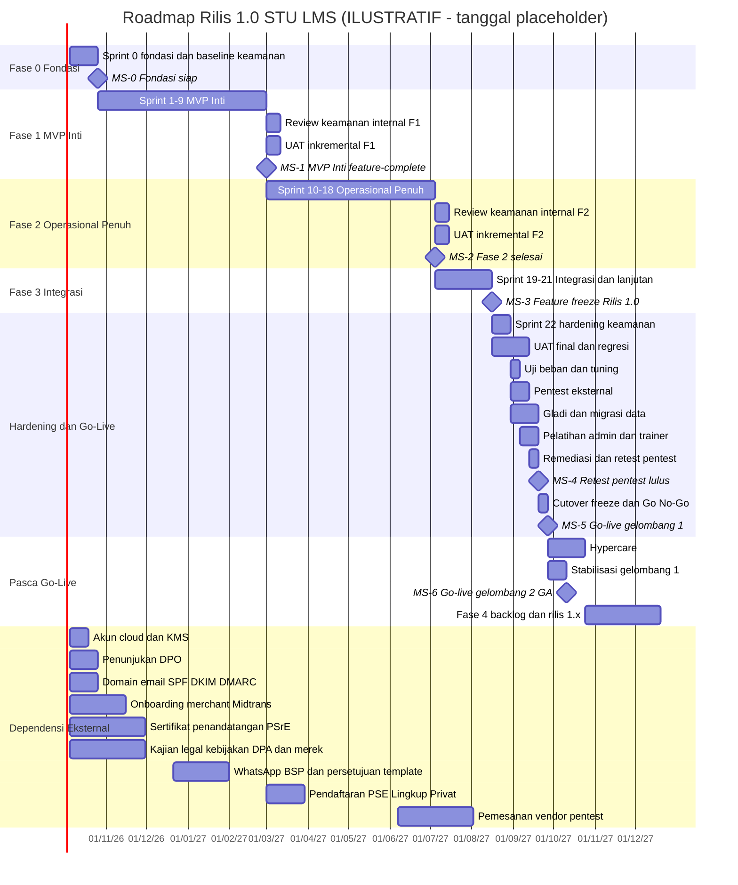
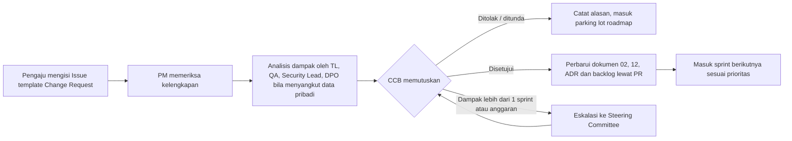

# 12 — Rencana Proyek, Roadmap & Manajemen Risiko

> Status: **Disetujui untuk development** · Versi 1.0 · Pemilik: Project Manager + Product Owner
>
> Dokumen ini menjelaskan *bagaimana* dan *kapan* STU LMS dibangun: metodologi, tim, fase &
> milestone, backlog epic, kapasitas, dependensi eksternal, register risiko, tata kelola
> perubahan, serta rencana go-live dan hypercare. Kolom **Fase** pada
> [`02-kebutuhan-fungsional.md`](02-kebutuhan-fungsional.md) merujuk fase di dokumen ini, dan
> keduanya **wajib konsisten** — perubahan fase suatu FR dilakukan lewat *Change Request* (§10.1)
> yang memperbarui kedua dokumen sekaligus.
>
> Seluruh durasi dinyatakan dalam **minggu relatif terhadap kick-off** (M1 = minggu pertama
> setelah kick-off). Tanggal kalender pada diagram Gantt hanya *placeholder* ilustratif.

---

## 1. Ringkasan Eksekutif

| Item | Nilai (baseline) |
|---|---|
| Metodologi | Scrum, sprint 2 minggu (10 hari kerja) |
| Total kebutuhan fungsional | 150 FR (Fase 1: 65 · Fase 2: 64 · Fase 3: 15 · Fase 4: 6) |
| Cakupan Rilis 1.0 | Semua FR **Must** Fase 1–3 (104 FR) + FR **Should** sesuai kapasitas (sisanya paling lambat Rilis 1.1) |
| Go-live gelombang 1 (pilot organisasi terpilih) | akhir **M51** (± 12 bulan setelah kick-off) |
| Go-live gelombang 2 (*general availability*) | akhir **M53** |
| Hypercare | M52–M55 (4 minggu) |
| Skenario dipercepat | M41 (pangkas *Should* ke 1.1) · M35 (pangkas + tambah kapasitas) — lihat §7.4 |
| Prinsip yang tidak dapat ditawar | Lingkup keamanan & privasi (security gates, pentest, checklist [`keamanan/17`](keamanan/17-checklist-keamanan.md)) **tidak pernah** dipangkas untuk mengejar jadwal |

### 1.1 Istilah Manajemen Proyek

Istilah berikut juga tercantum di [`00-glosarium.md`](00-glosarium.md) §5.

| Istilah | Definisi |
|---|---|
| Epic | Kumpulan fitur besar (≥ 1 sprint) yang dipecah menjadi *user story*; kode `EP-NN`. |
| Story | Unit kerja yang dapat diselesaikan dalam satu sprint; selalu merujuk ≥ 1 `FR-*`/`NFR-*`/`SEC-*`. |
| ow (orang-minggu) | Satuan estimasi: kerja bersih 1 developer selama 1 minggu. |
| DoR / DoD | *Definition of Ready* / *Definition of Done* (§10.3). |
| Security gate | Syarat keamanan otomatis/manual yang wajib lolos sebelum merge, rilis, atau penutupan fase (§5.1). |
| MS-n | Milestone bernomor (§4.1). |
| UAT | *User Acceptance Testing* oleh perwakilan pengguna bisnis. |
| Go/No-Go | Rapat keputusan rilis produksi berdasarkan checklist. |
| Cutover | Rangkaian langkah terjadwal memindahkan operasi ke sistem baru. |
| Hypercare | Periode dukungan intensif setelah go-live. |
| CCB | *Change Control Board* — forum pemutus *Change Request*. |
| RAG | Status Merah/Kuning/Hijau (*Red/Amber/Green*) dalam laporan. |
| RACI | *Responsible, Accountable, Consulted, Informed*. |

---

## 2. Metodologi

### 2.1 Kerangka Kerja

- **Scrum** dengan sprint **2 minggu** (Senin minggu ke-1 s.d. Jumat minggu ke-2).
- **Fase 0** dijalankan sebagai *Sprint 0* sepanjang 3 minggu (persiapan & fondasi).
- Setiap sprint menghasilkan *increment* yang **ter-deploy ke staging** melalui pipeline CI/CD
  (bukan deploy manual) dan didemokan pada Sprint Review.
- Pekerjaan keamanan bukan fase terpisah di akhir: *threat modelling* ringan dilakukan saat
  refinement, kontrol keamanan masuk DoD, dan security gate berjalan di setiap PR
  ([`keamanan/14-secure-sdlc-dan-supply-chain.md`](keamanan/14-secure-sdlc-dan-supply-chain.md)).
- Sprint *hardening* khusus hanya satu kali sebelum go-live, untuk verifikasi menyeluruh — bukan
  untuk "menambahkan keamanan" yang tertunda.

### 2.2 Ceremonies

| Ceremony | Kapan | Durasi | Peserta | Keluaran |
|---|---|---|---|---|
| Sprint Planning | Hari 1 sprint | ≤ 3 jam | Tim Scrum, PO | Sprint goal, sprint backlog, kapasitas terhitung (cuti, on-call) |
| Daily Scrum | Setiap hari kerja | 15 menit | Tim dev, SM/PM | Hambatan teridentifikasi; eskalasi hambatan > 1 hari |
| Backlog Refinement | Rabu minggu ke-1 & ke-2 | 60–90 menit | PO, TL, perwakilan dev, QA, Designer, Security Lead (untuk story berlabel `security`/`privacy`) | Story memenuhi DoR, estimasi, *abuse case* & kriteria penerimaan keamanan |
| Sprint Review / Demo | Hari 10 | 60–90 menit | Tim, PO, stakeholder (Tim Akademik, Keuangan, perwakilan mitra bila relevan) | Penerimaan story oleh PO, umpan balik → backlog |
| Retrospective | Hari 10 setelah Review | 60 menit | Tim Scrum | ≤ 3 aksi perbaikan dengan pemilik |
| Security Sync | Mingguan | 30 menit | Security Lead, TL, DevOps | Status temuan SAST/SCA/DAST, pengecualian, update model ancaman |
| Risk Review | Dua mingguan (bersama Review) | 15 menit | PM, PO, TL, Security Lead | Register risiko diperbarui (§9) |

### 2.3 Tools & Konvensi Kerja

| Kebutuhan | Tool | Konvensi |
|---|---|---|
| Backlog & papan sprint | **GitHub Projects** (tampilan *Board* + *Table* + *Roadmap*) | Kolom: `Backlog → Ready → In Progress → In Review → QA → Done`. Field kustom: `Epic`, `FR`, `Fase`, `Prio (M/S/C)`, `Size`, `Iteration`. |
| Item kerja | **GitHub Issues** dengan *issue template* | Template: *User Story*, *Bug*, *Tech Debt*, *Change Request*, *Spike*. Label: `module:AUTH`…`module:SET`, `epic:EP-NN`, `prio:M/S/C`, `security`, `privacy`, `size:S/M/L/XL`. |
| Temuan keamanan | **GitHub Security Advisories (privat)** / repositori privat terbatas | Temuan kerentanan **tidak** dicatat sebagai issue biasa; akses terbatas Security Lead, TL, pengembang yang ditugasi. |
| Milestone | GitHub Milestones | Satu milestone per fase (`Fase 1 — MVP Inti`, dst.) + field `Iteration` per sprint. |
| Kode & review | GitHub Pull Request + CODEOWNERS | Branch protection; aturan review di [`09-standar-pengembangan.md`](09-standar-pengembangan.md). |
| CI/CD | GitHub Actions | Pipeline & gate di [`11-devops-dan-deployment.md`](11-devops-dan-deployment.md). |
| Dokumentasi | Folder `docs/` di repositori (Markdown, PR-reviewed), ADR di [`04-arsitektur-sistem.md`](04-arsitektur-sistem.md) §10 | Perubahan dokumen yang disetujui wajib lewat PR. |
| Komunikasi | Kanal chat tim (satu kanal per tim + kanal `#insiden` terpisah), email untuk stakeholder eksternal | Keputusan penting dicatat di issue/ADR, bukan hanya di chat. |

**Keterlacakan (traceability):** `FR-*` → Issue (story) → PR (menyebut `Closes #n` + ID FR) →
test (nama test memuat ID FR/SEC, lihat [`10-strategi-pengujian.md`](10-strategi-pengujian.md))
→ catatan rilis. Laporan keterlacakan dihasilkan otomatis dari label per sprint.

---

## 3. Struktur Tim & Peran

### 3.1 Komposisi Tim

Mengikuti asumsi [`01-visi-dan-ruang-lingkup.md`](01-visi-dan-ruang-lingkup.md) §7, ditambah
peran tata kelola dari sisi STU:

| Peran | Jumlah / alokasi | Tanggung jawab utama |
|---|---|---|
| Sponsor (Manajemen STU) | 1 | Anggaran, keputusan Go/No-Go, ketua Steering Committee |
| Product Owner (PO) | 1 (STU, penuh waktu) | Visi, prioritas backlog, penerimaan story, pemilik UAT |
| Project Manager / Scrum Master (PM) | 1 | Fasilitasi Scrum, jadwal, dependensi eksternal, risiko, pelaporan |
| Tech Lead (TL) | 1 (± 50% coding) | Arsitektur, ADR, kualitas kode, keputusan teknis, review modul kritis |
| Backend / Full-stack Developer | 3 | Implementasi modul domain, Livewire, integrasi |
| Frontend Developer | 1 | Komponen Blade/Livewire/Alpine, aksesibilitas, design system |
| QA Engineer | 1 | Strategi uji, otomasi (Pest, browser test), regresi, fasilitasi UAT |
| DevOps Engineer | 0,5 | IaC, CI/CD, environment, observabilitas, backup/DR |
| Product Designer | 1 | UX, design system, uji kegunaan, panduan pengguna (bersama PO) |
| Security Lead | 0,5 (konsultan) | Model ancaman, security gate, review keamanan, koordinasi pentest, respons insiden |
| DPO (Pejabat Pelindungan Data Pribadi) | Ditunjuk STU (dapat paruh waktu) | RoPA, DPIA, permintaan subjek data, notifikasi pelanggaran |
| Legal | Internal/eksternal sesuai kebutuhan | Kebijakan Privasi, S&K, DPA, kontrak vendor, tinjauan merek |
| SME (*Subject Matter Expert*) | Perwakilan Tim Akademik, Tim Keuangan, 1–2 perwakilan mitra | Klarifikasi aturan bisnis, data uji, penguji UAT |

> **Bus factor:** setiap modul kritis (Identity/Access, Assessment, Certification, Payment,
> Audit) wajib memiliki **minimal dua orang** yang menguasainya (tercermin di CODEOWNERS).
> Lihat risiko R-14.

### 3.2 Matriks RACI Deliverable Kunci

Legenda: **R** = mengerjakan · **A** = akuntabel (tepat satu per baris) · **C** = dikonsultasikan ·
**I** = diinformasikan · `–` = tidak terlibat.
Kolom: SP = Sponsor, PO, PM, TL, DEV = tim developer, QA, OPS = DevOps, UX = Product Designer,
SEC = Security Lead, DPO, LGL = Legal, SME.

| Deliverable | SP | PO | PM | TL | DEV | QA | OPS | UX | SEC | DPO | LGL | SME |
|---|---|---|---|---|---|---|---|---|---|---|---|---|
| Prioritas backlog & penerimaan story | I | **A/R** | C | C | I | C | I | C | C | C | – | C |
| Arsitektur & ADR ([`04`](04-arsitektur-sistem.md)) | I | C | I | **A/R** | C | C | C | I | C | I | – | – |
| Desain basis data & isolasi tenant/RLS ([`05`](05-desain-database.md), [`07`](07-rbac-dan-multi-tenant.md)) | – | I | I | **A** | R | C | C | – | C | C | – | – |
| Model ancaman & arsitektur keamanan ([`keamanan/01`](keamanan/01-model-ancaman.md)) | I | I | I | R | C | C | C | – | **A/R** | C | – | – |
| Security gate CI & remediasi temuan | – | I | I | R | R | C | R | – | **A** | – | – | – |
| Infrastruktur, IaC & environment ([`11`](11-devops-dan-deployment.md)) | – | – | I | **A** | C | – | R | – | C | – | – | – |
| Strategi & otomasi pengujian ([`10`](10-strategi-pengujian.md)) | – | C | I | C | R | **A/R** | C | – | C | – | – | – |
| Rilis ke staging/produksi (per rilis) | I | C | I | **A** | C | C | R | – | C | – | – | I |
| UAT (rencana, eksekusi, sign-off) | I | **A** | R | C | C | R | – | C | I | I | – | R |
| Pentest eksternal (pengadaan, lingkup, remediasi, retest) | C | I | R | R | R | C | C | – | **A** | I | C | – |
| Keputusan Go/No-Go & go-live | **A** | R | R | R | I | C | R | I | C¹ | C¹ | C | C |
| RoPA, DPIA & kepatuhan UU PDP ([`keamanan/12`](keamanan/12-privasi-data-dan-kepatuhan-uu-pdp.md)) | I | C | I | C | I | – | – | – | C | **A/R** | C | – |
| Kebijakan Privasi, S&K, DPA mitra & subprosesor, tinjauan merek | I | C | I | – | – | – | – | – | C | R | **A/R** | – |
| Migrasi data dari spreadsheet | I | C | **A** | R | R | R | C | – | C | C | – | R |
| Pelatihan & dokumentasi pengguna | I | **A** | C | – | C | C | – | R | C | – | – | R |
| Respons insiden keamanan ([`keamanan/15`](keamanan/15-respons-insiden-dan-kontinuitas.md)) | I | I | I | R | R | – | R | – | **A** | R² | C | – |
| Dependensi eksternal & pengadaan (Midtrans, PSrE, WA BSP, PSE) | C | R | **A** | C | – | – | C | – | C | C | C | – |
| Register risiko | I | C | **A/R** | C | – | – | C | – | C | C | – | – |
| Change Request (CCB) | C³ | **A** | R | C | – | – | – | C | C | C | – | – |

¹ Security Lead dan DPO memegang **hak veto** Go/No-Go atas temuan Critical/High yang terbuka
atau kewajiban UU PDP yang belum terpenuhi.
² DPO bertanggung jawab atas penilaian dan notifikasi pelanggaran data pribadi.
³ Sponsor menjadi pemutus bila CR berdampak > 1 sprint atau mengubah anggaran/milestone.

---

## 4. Fase & Milestone

### 4.1 Ringkasan Fase & Milestone

| Fase | Minggu (relatif) | Durasi | Sprint | Milestone di akhir |
|---|---|---|---|---|
| Fase 0 — Persiapan & Fondasi | M1–M3 | 3 minggu | Sprint 0 | **MS-0** Fondasi siap |
| Fase 1 — MVP Inti | M4–M21 | 18 minggu | Sprint 1–9 | **MS-1** MVP Inti *feature-complete* di staging |
| Fase 2 — Operasional Penuh | M22–M39 | 18 minggu | Sprint 10–18 | **MS-2** Fase 2 selesai |
| Fase 3 — Integrasi & Fitur Lanjutan | M40–M45 | 6 minggu | Sprint 19–21 | **MS-3** *Feature freeze* Rilis 1.0 |
| Hardening & Go-Live | M46–M51 | 6 minggu | Sprint 22 (hardening) + jendela pentest/UAT/cutover | **MS-4** Retest pentest lulus (M50) · **MS-5** Go-live gelombang 1 (akhir M51) |
| Hypercare | M52–M55 | 4 minggu | — | **MS-6** GA / gelombang 2 (akhir M53) · **MS-7** Hypercare selesai → operasional rutin (akhir M55) |
| Fase 4 — Backlog *Could* (Rilis 1.x) | mulai M56 | berkelanjutan | Sprint 23+ | Sesuai rilis 1.1, 1.2, … |

Catatan penjadwalan:

- Tambahkan **buffer 1–2 minggu** bila rentang proyek mencakup libur nasional/cuti bersama
  panjang (mis. Idulfitri, akhir tahun). Buffer ditetapkan PM saat tanggal kick-off diketahui.
- Rilis 1.1 (sisa *Should* yang belum masuk 1.0) ditargetkan ≤ 3 bulan setelah GA.

### 4.2 Diagram Gantt (Ilustratif)

> **Penting:** tanggal di bawah hanyalah *placeholder* dengan asumsi kick-off pada Senin
> 2026-10-05, agar diagram dapat dirender. Yang mengikat adalah **durasi dan urutan** (minggu
> relatif pada §4.1), bukan tanggalnya.

### 4.3 Opsi Pilot MVP (Keputusan Steering Committee di MS-1)

Baseline **tidak** mengasumsikan rilis produksi sebelum Rilis 1.0. Namun karena Fase 1 sudah
mencakup siklus lengkap *program gratis/ditanggung institusi* (daftar → belajar → ujian →
sertifikat terverifikasi), SC dapat memutuskan **Pilot MVP** terbatas untuk 1–2 institusi mitra:

| Aspek | Ketentuan bila opsi dipilih |
|---|---|
| Lingkup | Hanya FR Fase 1; tanpa pembayaran (checkout dinonaktifkan via *feature flag*). |
| Syarat wajib | Semua FR Fase 1 lulus UAT; checklist [`keamanan/17`](keamanan/17-checklist-keamanan.md) untuk lingkup Fase 1 terpenuhi; **pentest eksternal berlingkup Fase 1** tanpa Critical/High terbuka; DPO ditunjuk; Kebijakan Privasi & S&K final; DPA dengan institusi pilot ditandatangani; sertifikat penandatangan produksi tersedia; backup/restore teruji; on-call aktif. |
| Biaya jadwal | ± 2 minggu mini-hardening + 2 minggu pentest berjalan paralel dengan awal Fase 2, mengurangi kapasitas Fase 2 ± 1 sprint → go-live 1.0 mundur ± 2 minggu. Biaya tambahan: satu pentest ekstra. |
| Manfaat | Umpan balik pengguna nyata lebih awal, validasi pipeline sertifikat & verifikasi, adopsi bertahap. |

Keputusan dan alasannya dicatat di notulen SC dan sebagai CR (§10.1).

---

## 5. Rincian per Fase

### 5.1 Security & Quality Gate Standar (berlaku di akhir setiap fase)

Setiap fase **tidak dapat ditutup** sebelum seluruh gate berikut hijau (ditambah kriteria khusus
fase di bawah):

| # | Gate | Bukti |
|---|---|---|
| G1 | Tidak ada temuan **Critical/High** terbuka dari SAST, SCA (dependensi), *secret scanning*, dan pemindaian image kontainer. Pengecualian hanya dengan *risk acceptance* tertulis Security Lead + PO, berbatas waktu ≤ 30 hari, dan **tidak berlaku** untuk Critical. | Laporan pipeline CI terakhir di `main` |
| G2 | **Uji matriks otorisasi** hijau: setiap endpoint/aksi Livewire baru memiliki uji izin per peran sesuai [`07`](07-rbac-dan-multi-tenant.md) §5, uji **404 lintas tenant** (§6.3), dan uji RLS di level SQL. | Laporan test suite `tests/Security` |
| G3 | **Model ancaman diperbarui** untuk modul yang dirilis pada fase tersebut ([`keamanan/01`](keamanan/01-model-ancaman.md)); mitigasi baru masuk backlog dengan prioritas. | PR ke dokumen keamanan disetujui Security Lead |
| G4 | DAST baseline (mis. OWASP ZAP) terhadap staging: tidak ada temuan High. | Laporan DAST |
| G5 | Item checklist ASVS L2 (dan L3 terpilih) yang relevan dengan modul fase tersebut terverifikasi ([`keamanan/17`](keamanan/17-checklist-keamanan.md)). | Checklist bertanda tangan Security Lead |
| G6 | Event audit untuk aksi penting modul fase tersebut tercatat & teruji ([`keamanan/11`](keamanan/11-logging-audit-dan-monitoring.md)). | Test + contoh log |
| G7 | RoPA diperbarui untuk pemrosesan data pribadi baru; DPIA untuk pemrosesan berisiko tinggi. | Persetujuan DPO |
| G8 | Arsitektur test (Pest Arch) hijau: batas modul & larangan pembaruan status langsung. | CI |
| G9 | Cakupan uji & kualitas sesuai ambang [`10-strategi-pengujian.md`](10-strategi-pengujian.md); tidak ada bug P1/P2 terbuka. | Laporan QA |
| G10 | SBOM dihasilkan untuk build rilis kandidat fase. | Artefak CI |
| G11 | Dokumen terkait diperbarui (API di [`06`](06-spesifikasi-api.md), UI di [`08`](08-spesifikasi-ui-dan-pemetaan-halaman.md), DB di [`05`](05-desain-database.md), runbook). | PR dokumen |

### 5.2 Fase 0 — Persiapan & Fondasi (M1–M3, Sprint 0)

**Tujuan:** menyiapkan fondasi teknis, keamanan, dan tata kelola sehingga Sprint 1 dapat langsung
membangun fitur di atas *walking skeleton* yang aman secara default.

**Epic:** EP-01 (Fondasi Platform & Baseline Keamanan) — mencakup kerangka aturan lintas modul
FR-GEN-001 s.d. FR-GEN-009.

**Deliverables:**

| Area | Deliverable |
|---|---|
| Dokumen | Finalisasi dokumen 00–12 & `keamanan/`; DoR/DoD disepakati; backlog Sprint 1–2 memenuhi DoR; daftar keputusan tertunda (§5.2.1) ditutup atau berpemilik. |
| Repositori & tata kelola | Repositori GitHub privat, branch protection `main`, CODEOWNERS (dua pemilik untuk modul kritis), template issue/PR, GitHub Projects dengan field kustom (§2.3), Dependabot aktif. |
| CI/CD | Pipeline GitHub Actions: lint (Pint), analisis statis (Larastan), Pest (unit/feature/arch), SAST, SCA (`composer audit`, `npm audit`/OSV), *secret scanning*, pemindaian image, SBOM, build image non-root, deploy otomatis ke staging, DAST baseline terjadwal. Action di-*pin* ke SHA; kredensial cloud via OIDC (tanpa secret statis). Rincian: [`11`](11-devops-dan-deployment.md), [`keamanan/14`](keamanan/14-secure-sdlc-dan-supply-chain.md). |
| IaC & environment | Terraform (atau setara) untuk jaringan privat, PostgreSQL terkelola, Redis, object storage privat (versioning), KMS, CDN/WAF, secret manager; environment `local` (Docker Compose), `ci`, `staging` aktif. Kerangka `production` di-*provision* dari IaC yang sama (diaktifkan penuh sebelum Fase Hardening). Pemindaian IaC (policy-as-code) di CI. |
| Skeleton aplikasi | Laravel + Livewire + Tailwind (build Vite, tanpa CDN) dengan struktur `app/Modules/*` sesuai [`04`](04-arsitektur-sistem.md) §7. |
| Baseline keamanan aplikasi | Scaffolding autentikasi (login/logout, hashing Argon2id, regenerasi sesi, cookie `__Host-` Secure/HttpOnly/SameSite, rate limiter), middleware **CSP berbasis nonce** + header keamanan (HSTS, `X-Content-Type-Options`, `Referrer-Policy`, `Permissions-Policy`, `frame-ancestors`), CSRF, *deny-by-default routing*. |
| Multi-tenant | Migrasi dasar (UUIDv7), peran DB aplikasi **non-owner**, kebijakan **RLS** + middleware `SET LOCAL app.*`, `OrganizationScope`, dan *test harness* lintas tenant yang dipakai ulang semua modul. |
| Audit & logging | Modul `Audit`: tabel append-only + penulis event (rantai hash disiapkan, verifikasi harian di Fase 2 sesuai FR-AUD-003); log JSON terstruktur dengan `request_id`; error tracking; metrik dasar & uptime check. |
| Design system | Komponen Blade dari purwarupa (layout, tombol, formulir, tabel, modal, badge status, notifikasi) dengan kepatuhan WCAG 2.1 AA; halaman contoh di staging. |
| Keamanan proses | Workshop tinjauan model ancaman ([`keamanan/01`](keamanan/01-model-ancaman.md)) & temuan purwarupa ([`keamanan/16`](keamanan/16-temuan-keamanan-purwarupa.md)) dipetakan ke backlog. |
| Dependensi eksternal | Semua item §8 dengan lead time panjang **sudah dimulai** (cloud & KMS, DPO, Midtrans, PSrE, legal, domain/email). |

#### 5.2.1 Keputusan yang harus ditutup di Fase 0

| Keputusan | Pemilik | Batas |
|---|---|---|
| Penyedia cloud & region Jakarta, akun organisasi, anggaran & *budget alert* | TL + Sponsor | M1 |
| Pilihan PSrE & arsitektur penandatanganan (kunci di KMS/HSM milik STU vs *remote signing* API PSrE) → ADR baru | TL + Security Lead + Legal | M3 |
| Penyedia email transaksional & WhatsApp BSP | TL + PO | M3 |
| Penyedia error tracking & log store (lokasi data sesuai UU PDP) | TL + DPO | M2 |
| Daftar calon vendor pentest (RFP disiapkan) | Security Lead + PM | M3 |

**Kriteria keluar (MS-0):**

1. *Walking skeleton* (halaman login + health check) ter-deploy ke staging **murni melalui
   pipeline**; seluruh gate CI berjalan dan memblokir merge bila gagal.
2. Uji contoh lintas tenant & RLS berjalan di CI dan terbukti gagal bila scope sengaja dirusak.
3. Header keamanan & CSP terverifikasi di staging (tanpa `unsafe-inline` untuk script).
4. Audit event `login_success/login_failed` tercatat.
5. Backlog Sprint 1–2 memenuhi DoR; kapasitas Sprint 1 dihitung.
6. Keputusan §5.2.1 ditutup atau dieskalasi ke SC dengan tanggal.

### 5.3 Fase 1 — MVP Inti (M4–M21, Sprint 1–9)

**Tujuan:** siklus belajar lengkap untuk program **gratis/ditanggung organisasi** — registrasi
aman, katalog, kelas, konten, kuis & ujian akhir, kelulusan, approval dan penerbitan sertifikat
bertanda tangan digital, verifikasi publik (web & API), notifikasi dasar, dashboard, audit,
pengaturan, dan consent. Mencakup **seluruh 65 FR Fase 1 (semua Must)**.

| Epic | FR |
|---|---|
| EP-02 Identitas & Autentikasi | FR-AUTH-001, 002, 003, 004, 005, 007, 008, 009, 010, 013, 014 |
| EP-03 Pengguna, Peran & Isolasi Tenant | FR-USER-001, 002, 003, 005, 006 |
| EP-04 Organisasi Dasar | FR-ORG-001 |
| EP-05 Katalog Program | FR-CAT-001, 002, 003, 004 |
| EP-06 Kelas & Jadwal | FR-CLS-001, 002 |
| EP-07 Konten Pembelajaran & Pipeline Media | FR-CNT-001, 002, 003, 004, 005 |
| EP-08 Asesmen | FR-ASM-001, 002, 003, 004, 005, 006, 007, 009 |
| EP-09 Enrollment & Kelulusan | FR-ENR-001, 002, 004, 005, 006, 008 |
| EP-10 Sertifikat & Verifikasi Publik | FR-CERT-001, 002, 004, 005, 006, 007, 009, 011, 012; FR-API-001 |
| EP-11 Notifikasi Dasar (in-app + email transaksional) | FR-NTF-001, 002, 005 |
| EP-12 Dashboard per Peran | FR-RPT-001, 002, 003 |
| EP-13 Jejak Audit & Pengaturan Sistem | FR-AUD-001, 002; FR-SET-001, 002, 005 |
| EP-14 Consent & Halaman Kebijakan | FR-PRV-001; FR-CMS-003 |

**Ketergantungan antar-fase yang disadari (perilaku sementara di Fase 1):**

| Kebutuhan Fase 1 | Bergantung pada | Perilaku sementara |
|---|---|---|
| FR-ENR-001 (program berbayar setelah `settled`) | PAY (Fase 2) | Checkout dinonaktifkan via *feature flag*; hanya program gratis/ditanggung organisasi yang dapat didaftari. |
| FR-AUTH-003 (keanggotaan *pending* disetujui Admin Organisasi) | FR-ORG-005 & FR-ORG-002 (Fase 2) | Persetujuan keanggotaan sementara dilakukan Admin Akademik melalui manajemen pengguna; tercatat di audit. |
| FR-ENR-005 / FR-ASM-004 (syarat presensi & tugas) | ATT, ASG (Fase 2) | Mesin syarat kelulusan sudah mendukung konfigurasi, tetapi syarat presensi/tugas baru dapat diaktifkan di Fase 2. |
| FR-RPT-003 (widget pendapatan) | PAY (Fase 2) | Widget disembunyikan hingga PAY aktif. |
| FR-API-001 (kuota lebih tinggi dengan API key) | FR-API-003 (Fase 3) | Hanya mode tanpa kunci dengan rate limit ketat. |
| FR-CERT-005 (tanda tangan PAdES) | Sertifikat penandatangan PSrE (§8) | Staging memakai *test CA*; implementasi di balik antarmuka `Signer` agar penyedia produksi dapat dipasang tanpa perubahan domain. |

**Urutan sprint indikatif:**

| Sprint | Sasaran utama |
|---|---|
| 1 | Registrasi + OTP email, login, sesi (EP-02); peran & penetapan peran dasar (EP-03); organisasi (EP-04) |
| 2 | MFA TOTP + kode pemulihan, lupa/ganti kata sandi, sesi & perangkat, re-autentikasi (EP-02); undangan pengguna, reset MFA terverifikasi (EP-03); penulis audit per modul (EP-13) |
| 3 | Katalog + lifecycle review (EP-05); kelas & kuota atomik (EP-06); struktur konten (EP-07) |
| 4 | Pipeline unggah media: validasi *magic bytes*, pemindaian malware, karantina, transcoding HLS, URL bertanda tangan (EP-07); bank soal (EP-08) |
| 5 | Mesin attempt: timer server, autosave, satu attempt aktif, penilaian server (EP-08); progres lesson (EP-07); enrollment (EP-09) |
| 6 | Kuis/ujian akhir & pengaturan, reset attempt (EP-08); syarat kelulusan & mesin status (EP-09); template sertifikat (EP-10) |
| 7 | Antrean approval + SoD, penomoran atomik, render & tanda tangan PDF, unduh (EP-10); notifikasi in-app & email (EP-11) |
| 8 | Verifikasi publik web & API, pencabutan maker–checker, basis data sertifikat, kedaluwarsa (EP-10); dashboard (EP-12); pengaturan & tampilan audit (EP-13); consent & kebijakan (EP-14) |
| 9 | Stabilisasi: uji end-to-end, *smoke test* performa ujian, perbaikan bug, persiapan review keamanan & UAT inkremental |

**Deliverables:** increment Fase 1 di staging; test suite (unit, feature, security/authz, arch,
browser) hijau; model ancaman modul Identity/Access/Learning/Assessment/Certification diperbarui;
panduan draf untuk peserta & trainer; laporan review keamanan internal F1 (review kode terarah +
DAST oleh Security Lead).

**Kriteria keluar (MS-1):**

1. 65 FR Fase 1 memenuhi DoD dan diterima PO; UAT inkremental F1 oleh SME lulus (cacat mayor
   ditutup, minor terjadwal).
2. Gate standar G1–G11 hijau.
3. Khusus Fase 1: skenario *abuse case* kritis teruji otomatis — manipulasi peran saat login
   (FR-AUTH-004), kunci jawaban tidak pernah terkirim ke klien (FR-ASM-005), timer server tidak
   dapat dimanipulasi (FR-ASM-006), kuota tidak terlampaui pada pendaftaran bersamaan (FR-CLS-002),
   penomoran sertifikat atomik & kode verifikasi tidak dapat ditebak (FR-CERT-004), SoD approval
   sertifikat (FR-CERT-002), verifikasi publik ter-*rate limit*.
4. *Smoke test* beban: 200 attempt ujian bersamaan di staging tanpa error (uji penuh 1.000
   konkuren di Fase Hardening, lihat [`03`](03-kebutuhan-non-fungsional.md)).
5. Keputusan SC atas opsi Pilot MVP (§4.3).

### 5.4 Fase 2 — Operasional Penuh (M22–M39, Sprint 10–18)

**Tujuan:** melengkapi operasi bisnis — pembayaran, tugas, presensi, live class, diskusi,
notifikasi multikanal, laporan & ekspor, hak subjek data & retensi, integritas audit, CMS,
portal Admin Organisasi dan enrollment massal. Mencakup **64 FR (37 Must, 27 Should)**.

| Epic | FR (M = Must, S = Should) |
|---|---|
| EP-15 Pembayaran, Kupon, Invoice & Refund | M: FR-PAY-001, 002, 003, 004, 005, 006, 008; FR-ENR-007 |
| EP-16 Tugas & Pengumpulan | M: FR-ASG-001, 002, 003, 004, 005 |
| EP-17 Presensi QR Dinamis | M: FR-ATT-001, 002, 004, 005 |
| EP-18 Live Class | M: FR-LIVE-001, 002 · S: FR-LIVE-003, 005 |
| EP-19 Diskusi Kelas | S: FR-DSC-001, 002, 003, 004, 005 |
| EP-20 Notifikasi Multikanal & Preferensi | M: FR-NTF-003 · S: FR-NTF-004, FR-SET-003 |
| EP-21 Laporan, Ekspor & Laporan Keuangan | M: FR-RPT-004, 006, 007 · S: FR-RPT-005 |
| EP-22 Hak Subjek Data & Retensi | M: FR-PRV-002, 003, 004, 005, 006 |
| EP-23 Integritas Audit & Pengaturan Integrasi | M: FR-AUD-003, FR-SET-004 |
| EP-24 CMS Beranda | M: FR-CMS-001, 004 · S: FR-CMS-002 |
| EP-25 Portal Admin Organisasi & Enrollment Massal | M: FR-ORG-004, 005; FR-ENR-003; FR-USER-004 · S: FR-ORG-002, 003, 007; FR-USER-007; FR-CAT-005 |
| EP-26 Penyempurnaan Kelas, Konten & Asesmen | S: FR-CLS-003, 004, 005; FR-CNT-006, 008, 009; FR-ASM-008, 011 |
| EP-27 Sertifikat Lanjutan & Keamanan Akun | M: FR-AUTH-015 · S: FR-CERT-003, 010, 014 |

**Urutan sprint indikatif:** 10–11 EP-15 (bergantung sandbox Midtrans) + EP-16 · 12 EP-17,
EP-18 · 13 EP-25 · 14 EP-20 (butuh BSP & template WA disetujui) + EP-21 · 15 EP-22, EP-23 ·
16 EP-24, EP-19 · 17 EP-26, EP-27 · 18 stabilisasi, review keamanan & UAT inkremental F2.
Epic dengan hanya FR *Should* (EP-19, EP-26) sengaja dijadwalkan akhir agar dapat dipangkas
tanpa mengganggu *Must* (§7.3).

**Deliverables:** increment Fase 2 di staging; integrasi Midtrans (sandbox) end-to-end termasuk
rekonsiliasi; pipeline impor/ekspor aman (anti *formula/CSV injection*); runbook permintaan
subjek data; DPIA untuk pemrosesan WhatsApp & pembayaran; model ancaman modul Payment, Assignment,
Attendance, Engagement, Reporting, Privacy diperbarui.

**Kriteria keluar (MS-2):**

1. 37 FR *Must* Fase 2 selesai dan diterima; FR *Should* yang tidak selesai dipindahkan ke
   backlog Rilis 1.1 lewat keputusan PO (tercatat).
2. Gate standar G1–G11 hijau.
3. Khusus Fase 2: verifikasi tanda tangan webhook + konfirmasi status server-to-server teruji,
   termasuk replay & manipulasi `gross_amount` (FR-PAY-003); kupon atomik pada konkurensi
   (FR-PAY-002); maker–checker refund (FR-PAY-005); QR presensi tidak dapat di-*replay* di luar
   jendela (FR-ATT-002); ekspor ber-scope tenant & tercatat di audit (FR-RPT-006); alur
   penghapusan/anonimisasi teruji dan disetujui DPO (FR-PRV-004); verifikasi rantai hash audit
   harian berjalan (FR-AUD-003); berkas unggahan tugas terkarantina hingga lolos pindai
   (FR-ASG-002).
4. Uji rekonsiliasi pembayaran selama ≥ 5 hari berturut-turut di sandbox tanpa selisih tak
   terjelaskan.

### 5.5 Fase 3 — Integrasi & Fitur Lanjutan (M40–M45, Sprint 19–21)

**Tujuan:** membuka integrasi mitra (API ber-scope), memperkuat autentikasi (SSO OIDC,
WebAuthn), proteksi konten & integritas ujian, gamifikasi, serta fitur B2B. Mencakup **15 FR
(2 Must, 12 Should, 1 Could)**.

| Epic | FR |
|---|---|
| EP-28 API Mitra & Manajemen API Key | M: FR-API-003, 005 · S: FR-API-002 |
| EP-29 SSO OIDC & WebAuthn/Passkey | S: FR-AUTH-006, 011 |
| EP-30 Gamifikasi | S: FR-GAM-001, 002, 003, 004 |
| EP-31 Proteksi Konten & Integritas Ujian (watermark, indikator kecurangan) | S: FR-CNT-007, FR-ASM-010 |
| EP-32 Verifikasi PDF, Tagihan B2B & Access Review | S: FR-CERT-008, FR-PAY-007, FR-ORG-006 · C: FR-CERT-013 |

**Urutan sprint indikatif:** 19 EP-28 · 20 EP-29, EP-31 · 21 EP-30, EP-32, stabilisasi.
FR-CERT-013 (*Could*) hanya dikerjakan bila kapasitas tersisa; bila tidak, pindah ke Fase 4.

**Deliverables:** API mitra + dokumentasi OpenAPI 3.1 publik ([`06`](06-spesifikasi-api.md));
integrasi IdP Google/Microsoft (pendaftaran aplikasi & verifikasi merek di IdP); DPIA untuk
indikator kecurangan (FR-ASM-010: pencatatan perilaku, indikator bukan sanksi otomatis) dan
leaderboard (FR-GAM-003); rilis kandidat 1.0 ditandai (*tag*) di akhir fase.

**Kriteria keluar (MS-3 — Feature Freeze):**

1. FR *Must* Fase 3 selesai; *Should* yang tidak selesai → Rilis 1.1 (keputusan PO).
2. Gate standar G1–G11 hijau.
3. Khusus Fase 3: API key tersimpan sebagai hash & ditampilkan sekali, scope & IP allowlist
   ditegakkan, uji akses lintas organisasi via API mengembalikan 404, rate limit per kunci
   (FR-API-002/003); pencocokan akun SSO hanya berdasarkan email terverifikasi IdP + domain
   organisasi (FR-AUTH-011); maker–checker pembuatan API key.
4. Setelah MS-3 **tidak ada fitur baru** masuk Rilis 1.0; hanya perbaikan bug & temuan keamanan.

### 5.6 Hardening & Go-Live (M46–M51)

**Tujuan:** membuktikan bahwa Rilis 1.0 memenuhi kriteria go-live [`01`](01-visi-dan-ruang-lingkup.md)
§10, lalu memindahkan operasi secara terkendali.

| Kegiatan | Minggu | Keluaran |
|---|---|---|
| Sprint 22 — hardening keamanan (EP-34) | M46–M47 | Verifikasi checklist [`keamanan/17`](keamanan/17-checklist-keamanan.md) 100%; review konfigurasi produksi (WAF, header, TLS, IAM, bucket, jaringan, egress); rotasi seluruh secret non-produksi; uji DR (restore PITR ke lingkungan terpisah, ukur RPO/RTO); alert & dashboard on-call; *tabletop exercise* insiden ([`keamanan/15`](keamanan/15-respons-insiden-dan-kontinuitas.md)). |
| UAT final & regresi | M46–M49 | Skenario UAT lintas peran (peserta, trainer, admin org, admin akademik, admin keuangan, super admin, verifikator publik); sign-off PO + SME. |
| Uji beban & tuning | M48 | Uji 1.000 peserta ujian serentak + beban verifikasi publik & katalog sesuai NFR [`03`](03-kebutuhan-non-fungsional.md); laporan kapasitas & tuning. |
| Pentest eksternal | M48–M49 | Lingkup: aplikasi web, API, alur pembayaran, sertifikat, multi-tenant, infrastruktur eksternal; metodologi OWASP WSTG/ASVS; akun uji per peran & per tenant. |
| Gladi & migrasi data (EP-35) | M48–M50 | Dua kali gladi migrasi + rekonsiliasi (§11.3). |
| Pelatihan admin & trainer (EP-35) | M49–M50 | Sesi pelatihan & materi panduan (§11.5). |
| Remediasi & retest pentest | M50 | Seluruh Critical/High ditutup & diverifikasi vendor (**MS-4**). |
| Cutover freeze & Go/No-Go | M51 | *Change freeze*, rapat Go/No-Go, cutover, go-live gelombang 1 (**MS-5**). |

**Kriteria keluar (MS-5 = kriteria Go-Live Rilis 1.0):** lihat checklist Go/No-Go §11.1 —
merupakan penjabaran [`01`](01-visi-dan-ruang-lingkup.md) §10.

### 5.7 Fase 4 — Backlog *Could* (Rilis 1.x, mulai M56)

**Tujuan:** menambah kemampuan bernilai tambah setelah platform stabil. Diprioritaskan ulang oleh
PO berdasarkan data penggunaan dan permintaan mitra.

| Epic | FR |
|---|---|
| EP-33 Backlog Rilis 1.x | FR-AUTH-012 (SAML 2.0), FR-CAT-006 (prasyarat program), FR-ASG-006 (deteksi berkas identik), FR-ATT-003 (geofence dengan persetujuan — butuh DPIA), FR-LIVE-004 (integrasi API Zoom/Teams), FR-API-004 (webhook keluar ber-HMAC) |

Ditambah sisa FR *Should* yang dipindahkan ke Rilis 1.1 (didahulukan di atas item *Could*).
Setiap item Fase 4 tetap melewati gate standar §5.1 sebelum dirilis.

---

## 6. Product Backlog — Daftar Epic

Ukuran T-shirt (estimasi bersih, lihat §7): **S** ≤ 1,5 ow · **M** > 1,5–3 ow · **L** > 3–6 ow ·
**XL** > 6 ow (wajib dipecah menjadi fitur/story sebelum masuk sprint).

| Epic | Nama | Modul domain ([`04`](04-arsitektur-sistem.md) §6) | FR | Fase | Ukuran | Estimasi (ow) |
|---|---|---|---|---|---|---|
| EP-01 | Fondasi Platform & Baseline Keamanan | Semua (kerangka), `Audit`, `Support/Security`, `Support/Tenancy` | FR-GEN-001…009 (kerangka), NFR & SEC baseline | 0 | XL | 8 |
| EP-02 | Identitas & Autentikasi | `Identity` (AUTH) | FR-AUTH-001, 002, 003, 004, 005, 007, 008, 009, 010, 013, 014 | 1 | L | 5 |
| EP-03 | Pengguna, Peran & Isolasi Tenant | `Access`, `Identity` (USER) | FR-USER-001, 002, 003, 005, 006 | 1 | L | 4,5 |
| EP-04 | Organisasi Dasar | `Organization` (ORG) | FR-ORG-001 | 1 | S | 1 |
| EP-05 | Katalog Program | `Catalog` (CAT) | FR-CAT-001…004 | 1 | M | 2,5 |
| EP-06 | Kelas & Jadwal | `Learning` (CLS) | FR-CLS-001, 002 | 1 | S | 1,5 |
| EP-07 | Konten Pembelajaran & Pipeline Media | `Learning` (CNT) | FR-CNT-001…005 | 1 | XL | 7 |
| EP-08 | Asesmen: Bank Soal, Kuis & Ujian Akhir | `Assessment` (ASM) | FR-ASM-001…007, 009 | 1 | XL | 6,5 |
| EP-09 | Enrollment & Kelulusan | `Enrollment` (ENR) | FR-ENR-001, 002, 004, 005, 006, 008 | 1 | M | 3 |
| EP-10 | Sertifikat & Verifikasi Publik | `Certification`, `Integration` (CERT, API) | FR-CERT-001, 002, 004, 005, 006, 007, 009, 011, 012; FR-API-001 | 1 | XL | 6,5 |
| EP-11 | Notifikasi Dasar | `Notification` (NTF) | FR-NTF-001, 002, 005 | 1 | M | 2 |
| EP-12 | Dashboard per Peran | `Reporting` (RPT) | FR-RPT-001…003 | 1 | M | 2,5 |
| EP-13 | Jejak Audit & Pengaturan Sistem | `Audit` (AUD, SET) | FR-AUD-001, 002; FR-SET-001, 002, 005 | 1 | L | 3,5 |
| EP-14 | Consent & Halaman Kebijakan | `Privacy`, `Cms` (PRV, CMS) | FR-PRV-001; FR-CMS-003 | 1 | S | 1,5 |
| EP-15 | Pembayaran, Kupon, Invoice & Refund | `Payment`, `Enrollment` (PAY, ENR) | FR-PAY-001…006, 008; FR-ENR-007 | 2 | XL | 8 |
| EP-16 | Tugas & Pengumpulan | `Assignment` (ASG) | FR-ASG-001…005 | 2 | L | 3,5 |
| EP-17 | Presensi QR Dinamis | `Attendance` (ATT) | FR-ATT-001, 002, 004, 005 | 2 | M | 3 |
| EP-18 | Live Class | `LiveClass` (LIVE) | FR-LIVE-001, 002, 003, 005 | 2 | M | 2 |
| EP-19 | Diskusi Kelas | `Engagement` (DSC) | FR-DSC-001…005 | 2 | M | 3 |
| EP-20 | Notifikasi Multikanal & Preferensi | `Notification` (NTF, SET) | FR-NTF-003, 004; FR-SET-003 | 2 | M | 3 |
| EP-21 | Laporan, Ekspor & Laporan Keuangan | `Reporting` (RPT) | FR-RPT-004…007 | 2 | L | 4,5 |
| EP-22 | Hak Subjek Data & Retensi | `Privacy` (PRV) | FR-PRV-002…006 | 2 | L | 4,5 |
| EP-23 | Integritas Audit & Pengaturan Integrasi | `Audit`, `Integration` (AUD, SET) | FR-AUD-003; FR-SET-004 | 2 | M | 2,5 |
| EP-24 | CMS Beranda | `Cms` (CMS) | FR-CMS-001, 002, 004 | 2 | M | 2,5 |
| EP-25 | Portal Admin Organisasi & Enrollment Massal | `Organization`, `Enrollment`, `Access`, `Catalog` (ORG, ENR, USER, CAT) | FR-ORG-002, 003, 004, 005, 007; FR-ENR-003; FR-USER-004, 007; FR-CAT-005 | 2 | XL | 6,5 |
| EP-26 | Penyempurnaan Kelas, Konten & Asesmen | `Learning`, `Assessment` (CLS, CNT, ASM) | FR-CLS-003, 004, 005; FR-CNT-006, 008, 009; FR-ASM-008, 011 | 2 | L | 5,5 |
| EP-27 | Sertifikat Lanjutan & Keamanan Akun | `Certification`, `Identity` (CERT, AUTH) | FR-CERT-003, 010, 014; FR-AUTH-015 | 2 | M | 3 |
| EP-28 | API Mitra & Manajemen API Key | `Integration` (API) | FR-API-002, 003, 005 | 3 | L | 5 |
| EP-29 | SSO OIDC & WebAuthn/Passkey | `Identity` (AUTH) | FR-AUTH-006, 011 | 3 | M | 3 |
| EP-30 | Gamifikasi | `Engagement` (GAM) | FR-GAM-001…004 | 3 | M | 3 |
| EP-31 | Proteksi Konten & Integritas Ujian | `Learning`, `Assessment` (CNT, ASM) | FR-CNT-007; FR-ASM-010 | 3 | L | 3,5 |
| EP-32 | Verifikasi PDF, Tagihan B2B & Access Review | `Certification`, `Payment`, `Organization` (CERT, PAY, ORG) | FR-CERT-008, 013; FR-PAY-007; FR-ORG-006 | 3 | L | 3,5 |
| EP-33 | Backlog Rilis 1.x (*Could*) | `Identity`, `Catalog`, `Assignment`, `Attendance`, `LiveClass`, `Integration` | FR-AUTH-012; FR-CAT-006; FR-ASG-006; FR-ATT-003; FR-LIVE-004; FR-API-004 | 4 | XL | ± 9 |
| EP-34 | Hardening Keamanan, Performa & Kesiapan Operasional | Lintas modul, infrastruktur | NFR ([`03`](03-kebutuhan-non-fungsional.md)), checklist [`keamanan/17`](keamanan/17-checklist-keamanan.md) | Hardening | L | tim penuh 2 minggu |
| EP-35 | Migrasi Data, Pelatihan & Cutover | Lintas modul | — (operasional) | Hardening | M | ± 3 + SME |

**Rekap cakupan:** Fase 1 = 65 FR (EP-02…EP-14) · Fase 2 = 64 FR (EP-15…EP-27) · Fase 3 = 15 FR
(EP-28…EP-32) · Fase 4 = 6 FR (EP-33) · total **150 FR**, setiap FR terpetakan ke tepat satu
epic. Pemeriksaan konsistensi Fase ↔ dokumen 02 dijalankan setiap kali salah satu dokumen berubah.

---

## 7. Estimasi Kapasitas & Asumsi

### 7.1 Asumsi Kapasitas

| Parameter | Nilai | Keterangan |
|---|---|---|
| Kapasitas developer kotor | 4,5 FTE (3 backend/full-stack + 1 frontend + 0,5 TL) × 10 hari = 45 orang-hari/sprint | QA, DevOps, Designer, Security Lead tidak dihitung sebagai kapasitas fitur, tetapi terlibat di setiap story. |
| Faktor fokus | 0,65 | Ceremonies (± 10%), code review, dukungan QA, perbaikan bug, remediasi temuan keamanan, *tech debt*. |
| **Velocity bersih asumsi** | **± 6 ow/sprint** (≈ 30 SP bila 1 SP ≈ 1 orang-hari ideal) | Naik ke ± 6,3 ow setelah Sprint 6 (tim matang). |
| Ramp-up | Sprint 1–2 pada 70% (± 4,2 ow) | Onboarding, penyesuaian dengan fondasi. |
| Anggaran keamanan & kualitas | ≥ 15% kapasitas setiap sprint | Sudah termasuk dalam faktor fokus; **tidak boleh** dipinjam untuk fitur. |
| Cuti & libur | Dikurangkan saat Sprint Planning | Ditambah buffer kalender §4.1. |
| Kalibrasi ulang | Setelah Sprint 3, lalu setiap akhir fase | Memakai rata-rata velocity 3 sprint terakhir. |

### 7.2 Kapasitas vs Beban per Fase

| Fase | Sprint | Kapasitas bersih (ow) | Beban estimasi (ow) | Buffer |
|---|---|---|---|---|
| 0 | Sprint 0 (3 minggu) | ± 8,5 (+ DevOps & Security Lead) | 8 (EP-01) | ± 5% |
| 1 | 1–9 | 2 × 4,2 + 7 × 6 = **50,4** | **47** (EP-02…EP-14) | ± 7% |
| 2 | 10–18 | 9 × 6,3 = **56,7** | **52** (EP-15…EP-27) | ± 8% |
| 3 | 19–21 | 3 × 6,3 = **18,9** | **18** (EP-28…EP-32) | ± 5% |
| Hardening | 22 + jendela | Tim penuh | EP-34, EP-35 | — |

> Estimasi di atas adalah **estimasi indikatif tingkat epic** (± 30%). Estimasi story dilakukan
> saat refinement dan menggantikan angka ini secara progresif. Buffer tipis di Fase 1 dan 3
> berarti rencana pemangkasan (§7.3) harus siap sejak awal.

### 7.3 Rencana Bila Terlambat (Urutan Pemangkasan)

Pemicu: velocity rata-rata < 85% asumsi selama 2 sprint berturut-turut, atau proyeksi burn-up
melewati milestone > 2 minggu. PM mengajukan opsi ke CCB dengan urutan berikut:

1. **Pindahkan FR *Could*** di fase berjalan ke Fase 4 (mis. FR-CERT-013).
2. **Pindahkan FR *Should*** ke Rilis 1.1, mulai dari yang paling mandiri: EP-30 Gamifikasi,
   EP-19 Diskusi, EP-26 (sebagian: FR-CLS-003/004/005, FR-CNT-008/009, FR-ASM-008/011),
   FR-CERT-008/013/014, FR-ORG-003/006/007, FR-CAT-005, FR-USER-007, FR-CMS-002,
   FR-NTF-004, FR-SET-003, FR-LIVE-003/005, FR-RPT-005, FR-AUTH-011, FR-PAY-007.
3. **Sederhanakan implementasi** tanpa mengurangi kontrol (mis. laporan hanya CSV dulu bila XLSX
   terlambat — tetap dengan proteksi *formula injection*).
4. **Tambah kapasitas** (developer tambahan atau kontraktor terkurasi) — efektif hanya bila
   diputuskan ≥ 2 fase sebelum go-live (onboarding ± 2 sprint).
5. **Geser milestone** — keputusan Sponsor melalui SC.

**Yang TIDAK BOLEH dipangkas (non-negotiable):**

- Security gate §5.1 dan item checklist [`keamanan/17`](keamanan/17-checklist-keamanan.md).
- Pentest eksternal + retest, uji beban, uji backup/restore, runbook insiden & on-call.
- Kontrol keamanan yang melekat pada FR *Must*: MFA wajib non-peserta (FR-AUTH-005),
  re-autentikasi aksi sensitif (FR-AUTH-014), isolasi tenant + RLS, SoD & maker–checker,
  jejak audit & integritasnya (FR-AUD-001…003), kunci jawaban di server (FR-ASM-005),
  tanda tangan PDF & kode verifikasi acak (FR-CERT-004/005), verifikasi webhook pembayaran
  (FR-PAY-003), pemindaian malware unggahan (FR-CNT-003, FR-ASG-002), hak subjek data &
  retensi (FR-PRV-*).
- Anggaran ≥ 15% kapasitas per sprint untuk remediasi keamanan & kualitas.

### 7.4 Skenario Jadwal

| Skenario | Asumsi | Go-live gelombang 1 (perkiraan) |
|---|---|---|
| A — Baseline | Tim sesuai §3.1, seluruh *Must* + *Should* Fase 1–3 | akhir M51 |
| B — Tambah kapasitas | +2 developer mulai Sprint 3 (velocity ± 8,5 ow setelah onboarding) | ± M43 |
| C — Pangkas *Should* ke 1.1 | Fase 2 = 6 sprint (hanya *Must*), Fase 3 = 1 sprint (FR-API-003, 005) | ± M41 |
| B + C | Gabungan | ± M35 |

Semua skenario mempertahankan Fase Hardening 6 minggu utuh. Skenario dipilih SC pada MS-1
berdasarkan velocity aktual.

---

## 8. Dependensi Eksternal & Lead Time

Lead time adalah perkiraan umum dan harus dikonfirmasi ke masing-masing penyedia saat kick-off.

| # | Dependensi | Lead time (indikatif) | Mulai paling lambat | Dibutuhkan untuk | Pemilik | Rencana cadangan |
|---|---|---|---|---|---|---|
| D-01 | **Akun cloud** (organisasi, billing, region Jakarta), **KMS/HSM**, kuota compute transcoding | 1–2 minggu | M1 | Fase 0 (IaC, staging) | TL + Sponsor | Region terdekat sementara hanya untuk staging tanpa data pribadi nyata. |
| D-02 | **Domain & email**: DNS, domain pengirim terpisah (mis. subdomain notifikasi), SPF, DKIM, DMARC (bertahap `p=none` → `quarantine` → `reject`), keluar dari *sandbox* penyedia email, *warm-up* | 1–3 minggu (+ 4–8 minggu ramp DMARC) | M1 | Fase 1 (OTP email, FR-AUTH-002) | DevOps | OTP via kanal alternatif bila deliverability bermasalah (FR-AUTH-002 mengizinkan WA/SMS). |
| D-03 | **Onboarding merchant Midtrans** (dokumen badan usaha: akta, NIB, NPWP, rekening perusahaan; situs dengan S&K, kebijakan refund, kontak) | 2–6 minggu | M1 | Sandbox: Fase 2 (langsung tersedia). Produksi: sebelum UAT final (M46) | PO + Tim Keuangan | Alternatif Xendit ([`04`](04-arsitektur-sistem.md) §3) di balik antarmuka gateway; go-live tanpa program berbayar bila terpaksa (keputusan SC). |
| D-04 | **Sertifikat penandatangan dokumen** dari PSrE berinduk Komdigi (atau sertifikat organisasi sesuai ADR-005) + integrasi dengan KMS/HSM atau layanan *remote signing* PSrE; layanan *timestamp* (TSA) | 4–8 minggu (termasuk verifikasi identitas badan usaha & kontrak) | M1 | Penerbitan sertifikat **produksi** (go-live); integrasi teknis diuji di staging paling lambat Fase 2 | PO + TL + Legal | *Test CA* untuk dev/staging; bila terlambat, go-live ditunda untuk modul sertifikat (tidak menerbitkan sertifikat tanpa tanda tangan sah). |
| D-05 | **Kajian legal**: Kebijakan Privasi, S&K, kebijakan refund, template **DPA** dengan organisasi mitra, perjanjian dengan subprosesor (cloud, email, WA BSP, payment, error tracking), **tinjauan penggunaan merek** pada template sertifikat (AWS, Microsoft, Cisco, PMI, BNSP — lihat [`01`](01-visi-dan-ruang-lingkup.md) §6.2) | 4–8 minggu | M1 | Draf: akhir Fase 1 (FR-CMS-003, FR-PRV-001, template sertifikat); final: sebelum Go/No-Go | Legal + DPO | Template sertifikat default netral "Sertifikat Pelatihan STU" tanpa logo pihak ketiga. |
| D-06 | **Penunjukan DPO** (SK penunjukan, uraian tugas, kanal kontak publik) | 2–3 minggu | M1 | Fase 0 (RoPA/DPIA) & kriteria go-live [`01`](01-visi-dan-ruang-lingkup.md) §10 | Sponsor | DPO konsultan eksternal sementara. |
| D-07 | **WhatsApp Business Platform via BSP**: verifikasi bisnis Meta, kontrak BSP, persetujuan nama tampilan, persetujuan tiap *message template* (kategori *utility*/*authentication*) | 2–6 minggu (template: hari–minggu, dapat ditolak) | M12 | Fase 2 (FR-NTF-003, Sprint 14) | PO + TL | Email sebagai kanal utama; WA diaktifkan per kategori saat template disetujui. |
| D-08 | **Pendaftaran PSE Lingkup Privat** (Komdigi, melalui sistem OSS/perizinan berusaha) — memerlukan NIB dengan KBLI yang sesuai dan data sistem elektronik | 2–4 minggu | M22 | Sebelum layanan dibuka untuk publik (go-live) | Legal + PO | Tidak ada — **syarat mutlak** go-live. |
| D-09 | **Vendor pentest eksternal**: RFP, pemilihan, SOW, *rules of engagement*, jadwal, retest termasuk dalam kontrak | Pemesanan 6–8 minggu sebelum pelaksanaan | M36 | Pentest M48–M49, retest M50 | Security Lead + PM | Daftar ≥ 2 vendor cadangan; jadwal dikunci segera setelah MS-2. |
| D-10 | **Aplikasi OIDC** di Google Cloud & Microsoft Entra (pendaftaran, verifikasi merek/consent screen) | 1–4 minggu | M34 | Fase 3 (FR-AUTH-011) | TL | FR-AUTH-011 bersifat *Should* → dapat pindah ke 1.1. |
| D-11 | **Data migrasi dari mitra/tim internal** (spreadsheet peserta, kelas berjalan, sertifikat historis bila ada) + DPA sebelum transfer | 2–4 minggu | M40 | Gladi migrasi M48 | PM + PO + DPO | Go-live tanpa data historis; peserta mendaftar ulang/diundang (FR-USER-003). |
| D-12 | **Akun layanan pendukung** (Zoom/Meet/Teams untuk tautan live class, CAPTCHA adaptif, uptime monitor) | ≤ 2 minggu | M20 | Fase 2 | DevOps | — |

Status setiap dependensi dilaporkan di laporan mingguan (§10.2) dengan status RAG. Dependensi
berstatus Merah > 2 minggu dieskalasi ke SC.

---

## 9. Register Risiko

**Skala:** Kemungkinan (K) dan Dampak (D) 1–5. **Skor = K × D**:
**15–25 Tinggi** (dilaporkan ke SC setiap bulan, rencana mitigasi aktif wajib) ·
**8–14 Sedang** (dipantau dua mingguan) · **1–7 Rendah** (dipantau bulanan).
Register ini hidup: ditinjau di Risk Review dua mingguan dan disalin sebagai issue berlabel
`risk` di GitHub Projects. Risiko keamanan dirinci teknisnya di
[`keamanan/01-model-ancaman.md`](keamanan/01-model-ancaman.md).

| ID | Risiko | Kategori | K | D | Skor | Mitigasi | Pemilik | Pemicu / indikator |
|---|---|---|---|---|---|---|---|---|
| R-01 | **Pengambilalihan akun admin** (phishing, *credential stuffing*, pencurian sesi) → penerbitan sertifikat palsu, kebocoran massal | Keamanan | 3 | 5 | **15** | MFA wajib non-peserta (FR-AUTH-005), WebAuthn untuk Super Admin (FR-AUTH-006), re-autentikasi aksi sensitif (FR-AUTH-014), maks. 3 Super Admin + four-eyes, maker–checker, IP allowlist admin opsional (FR-SET-002), alert login anomali (FR-AUTH-010), tinjauan akses bulanan, pelatihan kesadaran phishing untuk admin | Security Lead | Lonjakan login gagal akun admin; login dari negara/perangkat baru; perubahan MFA admin; penerbitan sertifikat di luar jam kerja |
| R-02 | **Kebocoran data lintas tenant** (bug scope, RLS salah konfigurasi, cache key tanpa org, ekspor tanpa scope) | Keamanan / Legal | 3 | 5 | **15** | Scope aplikasi + RLS dengan peran DB non-owner (ADR-003), uji 404 lintas tenant wajib untuk setiap endpoint (gate G2), uji RLS SQL, cache key memuat `organization_id`, review CODEOWNERS untuk query laporan | Tech Lead | Uji lintas tenant gagal/terlewat; PR menyentuh query mentah; laporan Admin Organisasi melihat data asing |
| R-03 | **Kebocoran soal ujian** (orang dalam, tangkapan layar, kunci jawaban bocor via API) | Keamanan / Bisnis | 4 | 4 | **16** | FR-ASM-005 (kunci tidak ke klien), bank soal besar + pengacakan per attempt, izin `assessment.view_answer_key` minimal, audit akses bank soal, watermark (FR-CNT-007) & indikator kecurangan (FR-ASM-010), rotasi soal tiap batch | PO + Tim Akademik | Rata-rata skor batch naik tak wajar; waktu pengerjaan sangat singkat; soal ditemukan di media sosial/grup chat |
| R-04 | **Pemalsuan sertifikat** (PDF diedit, situs verifikasi tiruan, penebakan nomor) | Keamanan / Bisnis | 3 | 5 | **15** | Tanda tangan PAdES + hash tersimpan (FR-CERT-005), kode verifikasi 60-bit acak (FR-CERT-004), verifikasi publik & API (FR-CERT-007, FR-API-001), verifikasi unggah PDF (FR-CERT-008), edukasi verifikator (URL resmi), pemantauan domain mirip | PO + Security Lead | Laporan verifikator; pola verifikasi "tidak ditemukan" berulang; domain tiruan terdeteksi |
| R-05 | **Kompromi kunci penandatangan sertifikat** | Keamanan | 2 | 5 | 10 | Kunci *non-exportable* di KMS/HSM atau layanan PSrE, IAM hanya izin *sign* untuk layanan penandatangan, log KMS dipantau, prosedur pencabutan & rotasi kunci + penerbitan ulang massal di runbook [`keamanan/15`](keamanan/15-respons-insiden-dan-kontinuitas.md), *timestamp* TSA | Security Lead + DevOps | Panggilan *sign* di luar job sertifikat; perubahan IAM KMS; peringatan dari PSrE |
| R-06 | **Fraud pembayaran** (manipulasi harga, webhook palsu/replay, penyalahgunaan kupon, refund fiktif) | Keamanan / Bisnis | 3 | 4 | 12 | Harga dihitung server, verifikasi signature + konfirmasi status server-to-server (FR-PAY-003), idempotensi, reservasi kupon atomik (FR-PAY-002), maker–checker refund (FR-PAY-005), rekonsiliasi harian (FR-PAY-006) | Tech Lead + Tim Keuangan | Selisih rekonsiliasi; pemakaian kupon melonjak; refund berulang dari akun sama |
| R-07 | **Kompromi rantai pasok** (paket Composer/npm berbahaya, GitHub Action tercemar, base image rentan) | Keamanan | 3 | 5 | **15** | Lockfile + SCA di CI, Action di-*pin* SHA, review PR Dependabot, SBOM per rilis, image minimal & dipindai, token CI *least privilege* + OIDC, penandatanganan image ([`keamanan/14`](keamanan/14-secure-sdlc-dan-supply-chain.md)) | DevOps + Security Lead | Advisori kritis untuk dependensi terpakai; pergantian maintainer paket; perubahan tak terduga di lockfile |
| R-08 | **Ransomware / kegagalan backup** → data tidak dapat dipulihkan | Keamanan / Operasional | 2 | 5 | 10 | PITR DB, backup *immutable* (object lock) di akun/lokasi terpisah, uji restore bulanan terdokumentasi, akses backup terpisah dari admin produksi, RPO/RTO sesuai [`03`](03-kebutuhan-non-fungsional.md) | DevOps | Job backup gagal; uji restore gagal/melampaui RTO; aktivitas penghapusan massal di storage |
| R-09 | **Ancaman orang dalam** (ekspor massal tidak sah, ubah nilai, akses produksi di luar tugas) | Keamanan | 2 | 5 | 10 | Least privilege + akses produksi JIT bertiket, SoD, audit tamper-evident (FR-AUD-003), alert ekspor massal, penyamaran data (FR-USER-007), NDA & offboarding checklist ([`07`](07-rbac-dan-multi-tenant.md) §7), tinjauan akses berkala | Security Lead + DPO | Ekspor di luar pola; akses produksi tanpa tiket; perubahan nilai setelah kelas ditutup |
| R-10 | **DDoS / lonjakan beban saat ujian serentak** → ujian gagal massal | Teknis / Keamanan | 3 | 4 | 12 | CDN/WAF + proteksi DDoS, rate limit, skala horizontal, uji beban 1.000 konkuren, timer server + autosave (FR-ASM-006), prosedur perpanjangan jendela ujian, koordinasi jadwal ujian besar | DevOps + Tech Lead | p95 latensi naik; error 5xx > ambang; peringatan serangan WAF |
| R-11 | **Gangguan vendor pihak ketiga** (Midtrans, email, WA BSP, region cloud, penyedia konferensi video) | Operasional | 3 | 3 | 9 | Integrasi asinkron + retry + *circuit breaker*, fallback kanal (email bila WA gagal), rekonsiliasi terjadwal, pemantauan status vendor, alternatif teridentifikasi (Xendit, penyedia email kedua), SLA di kontrak | Tech Lead | Error rate integrasi naik; antrean notifikasi menumpuk; status page vendor |
| R-12 | **Ketidakpatuhan UU PDP** (dasar pemrosesan tidak jelas, DPA belum ada, retensi berlebih, notifikasi pelanggaran melewati 3×24 jam) | Legal | 3 | 5 | **15** | DPO ditunjuk di Fase 0, RoPA & DPIA (gate G7), consent berversi (FR-PRV-001), DPA mitra & subprosesor sebelum data mengalir, retensi otomatis (FR-PRV-005), runbook pelanggaran data ([`keamanan/12`](keamanan/12-privasi-data-dan-kepatuhan-uu-pdp.md), [`keamanan/15`](keamanan/15-respons-insiden-dan-kontinuitas.md)) | DPO | Mitra di-onboard tanpa DPA; fitur baru tanpa entri RoPA; permintaan subjek data melewati SLA |
| R-13 | **Scope creep** (permintaan fitur baru dari mitra/manajemen di tengah fase) | Bisnis | 4 | 3 | 12 | Proses CR & CCB (§10.1), aturan *swap* (item masuk = item setara keluar), MoSCoW, *parking lot* roadmap 2.0, feature freeze di MS-3 | PO + PM | > 10% item sprint tidak terencana; CR menumpuk; sprint goal gagal 2× berturut |
| R-14 | **Ketergantungan orang kunci** (TL, DevOps paruh waktu, Security Lead konsultan) | Operasional | 3 | 4 | 12 | Minimal dua pemilik per modul kritis (CODEOWNERS), pair programming, ADR & runbook, semua infrastruktur sebagai kode, sesi berbagi pengetahuan per sprint, kontrak konsultan dengan klausul pengganti | PM | Pemberitahuan resign/cuti panjang; satu orang me-review > 70% PR suatu modul |
| R-15 | **Kesalahan migrasi data spreadsheet** (duplikasi, salah organisasi, format tidak valid, PII bocor saat transfer) | Operasional / Legal | 3 | 4 | 12 | Profiling & pemetaan data, validasi per baris dengan laporan kesalahan, dua kali gladi, rekonsiliasi jumlah & checksum, sign-off pemilik data, transfer terenkripsi + penghapusan berkas sementara, DPA sebelum transfer (§11.3) | PM + Tech Lead | Selisih rekonsiliasi > 0; tingkat baris ditolak > 5%; data dikirim via kanal tidak aman |
| R-16 | **Keterlambatan sertifikat penandatangan PSrE** atau ketidakcocokan model integrasi (kunci di KMS vs *remote signing*) | Legal / Teknis | 3 | 4 | 12 | Pengadaan sejak M1, ADR di Fase 0, antarmuka `Signer` yang dapat ditukar, *test CA* untuk staging, uji integrasi paling lambat Fase 2 | PO + Tech Lead | Kontrak PSrE belum ada di akhir Fase 1; API PSrE belum teruji di akhir Fase 2 |
| R-17 | **Keterlambatan/penolakan onboarding merchant Midtrans** | Bisnis | 2 | 4 | 8 | Mulai M1, siapkan dokumen & halaman kebijakan lebih awal, sandbox untuk pengembangan, alternatif Xendit | PO + Tim Keuangan | Belum disetujui pada akhir Fase 1 |
| R-18 | **Persetujuan WhatsApp BSP/template tertunda atau ditolak** | Operasional | 3 | 2 | 6 | Email sebagai kanal utama, pengajuan template lebih awal dengan kategori tepat, WA opsional per kategori | PO | Template ditolak; verifikasi bisnis Meta belum selesai di Sprint 13 |
| R-19 | **Estimasi terlalu optimistis / velocity di bawah asumsi** | Bisnis | 4 | 3 | 12 | Buffer per fase, kalibrasi ulang setelah Sprint 3, rencana pemangkasan siap (§7.3), skenario jadwal (§7.4) | PM | Velocity < 85% asumsi 2 sprint berturut; burn-up menyimpang > 2 minggu |
| R-20 | **Temuan pentest Critical/High dalam jumlah besar di akhir** → go-live mundur | Keamanan / Bisnis | 3 | 4 | 12 | *Shift-left*: gate per PR & per fase, review keamanan internal tiap akhir fase, DAST terjadwal, 1 minggu remediasi + retest dalam jadwal | Security Lead | Review internal/DAST menemukan High; backlog temuan terbuka bertambah |
| R-21 | **Adopsi rendah** oleh peserta non-teknis & trainer | Bisnis | 3 | 3 | 9 | UX sederhana & uji kegunaan dengan persona ([`01`](01-visi-dan-ruang-lingkup.md) §5), pelatihan, panduan video singkat, dukungan WhatsApp/helpdesk, go-live bergelombang | PO + Product Designer | Completion rate rendah; tiket "bagaimana cara…" tinggi; CSAT < 4,0 |
| R-22 | **Pelanggaran merek / klaim menyesatkan** pada template sertifikat (logo AWS/BNSP, kesan sertifikat resmi) | Legal | 3 | 4 | 12 | Tinjauan legal wajib sebelum template aktif, template default netral, izin tertulis sebelum pemakaian merek pihak ketiga | Legal + PO | Template memuat logo/nama pihak ketiga tanpa izin tercatat |
| R-23 | **Biaya/performa pipeline video** (transcoding, 2 TB storage, egress CDN) melampaui anggaran | Teknis / Bisnis | 3 | 3 | 9 | Batas ukuran & durasi unggahan, profil encoding hemat, worker transcoding terpisah dengan kuota, *budget alert* cloud, tinjauan biaya bulanan | DevOps | Biaya bulanan > 120% anggaran; antrean transcoding > 1 jam |
| R-24 | **Deliverability email rendah** (OTP/undangan masuk spam) → registrasi gagal | Operasional | 3 | 3 | 9 | SPF/DKIM/DMARC, domain pengirim terpisah, *warm-up*, pemantauan bounce/complaint, kanal OTP alternatif | DevOps | Bounce > 2%; keluhan OTP tidak diterima meningkat |
| R-25 | **Salah konfigurasi cloud** (bucket publik, port DB terbuka, IAM berlebih) | Keamanan | 2 | 5 | 10 | Semua infrastruktur via IaC + pemindaian policy-as-code di CI, tidak ada perubahan manual di produksi, review konfigurasi di sprint hardening | DevOps + Security Lead | Temuan pemindai IaC/CSPM; *drift* terdeteksi |
| R-26 | **Pendaftaran PSE belum selesai saat go-live** → sanksi administratif hingga pemutusan akses | Legal | 2 | 4 | 8 | Mulai M22, dokumen perizinan disiapkan sejak Fase 1, masuk checklist Go/No-Go | Legal + PO | Belum terdaftar 6 minggu sebelum go-live |
| R-27 | **Ketidaksiapan operasional** (on-call, runbook, monitoring belum matang) saat go-live | Operasional | 2 | 4 | 8 | Runbook & alert diuji di sprint hardening, *tabletop exercise*, jadwal on-call ditetapkan sebelum Go/No-Go, go-live bergelombang | DevOps + PM | Alert tanpa runbook; latihan insiden gagal memenuhi target waktu |

---

## 10. Tata Kelola Proyek

### 10.1 Manajemen Perubahan (Change Request)

Berlaku untuk: penambahan/perubahan FR, perubahan prioritas MoSCoW, perpindahan fase suatu FR,
perubahan milestone, perubahan arsitektur besar, dan perubahan yang berdampak keamanan/privasi.

| Aspek | Ketentuan |
|---|---|
| Isi wajib CR | Latar belakang & nilai bisnis, FR terdampak, estimasi, dampak jadwal, **dampak keamanan & privasi** (apakah perlu update model ancaman/DPIA), item yang diusulkan keluar (aturan *swap*). |
| CCB | PO (akuntabel), PM, TL, Security Lead; DPO bila menyangkut data pribadi; Sponsor bila dampak > 1 sprint atau mengubah anggaran/milestone. Bersidang dua mingguan (bersama refinement) atau ad hoc untuk hal mendesak. |
| Batas waktu analisis | ≤ 5 hari kerja sejak CR lengkap. |
| Selama sprint berjalan | Sprint backlog tidak diubah kecuali perbaikan keamanan mendesak/insiden (keputusan PO + TL). |
| Perubahan berdampak keamanan | Wajib persetujuan Security Lead; tidak boleh menurunkan kontrol *Must* tanpa *risk acceptance* tertulis Sponsor. |
| Setelah MS-3 (feature freeze) | Hanya perbaikan bug & keamanan untuk Rilis 1.0; CR fitur otomatis diarahkan ke 1.1/Fase 4. |
| Jejak | Semua CR berlabel `change-request` di GitHub; keputusan & versi dokumen yang berubah dicatat di issue. |

### 10.2 Komunikasi & Pelaporan

| Forum / artefak | Frekuensi | Audiens | Isi | Pemilik |
|---|---|---|---|---|
| Daily Scrum | Harian | Tim dev | Kemajuan, hambatan | SM/PM |
| **Laporan status mingguan** | Setiap Jumat | PO, Sponsor, TL, Security Lead, DPO | Status RAG (jadwal, lingkup, kualitas, keamanan, dependensi), burn-up fase, pencapaian & rencana minggu depan, **metrik keamanan** (temuan terbuka per tingkat & umur, status gate), status dependensi eksternal (§8), 5 risiko teratas, keputusan yang dibutuhkan | PM |
| **Sprint Review / demo** | Setiap 2 minggu | Stakeholder bisnis & perwakilan mitra | Demo increment di staging, penerimaan story, umpan balik | PO |
| **Steering Committee (SC)** | Bulanan (+ ad hoc di setiap milestone) | Sponsor (ketua), PO, PM, TL, Security Lead, DPO | Kemajuan vs milestone, anggaran, risiko skor ≥ 15, CR besar, keputusan (opsi pilot, skenario jadwal, Go/No-Go) | PM |
| Security sync | Mingguan | Security Lead, TL, DevOps | Temuan, pengecualian, model ancaman | Security Lead |
| Catatan rilis | Setiap rilis ke staging/produksi | Tim, PO, tim dukungan | Fitur, perbaikan, FR tercakup, perubahan konfigurasi | TL |
| Kanal insiden | Saat insiden | Tim tanggap insiden | Sesuai [`keamanan/15`](keamanan/15-respons-insiden-dan-kontinuitas.md) | Security Lead |

**Jalur eskalasi:** anggota tim → TL/PM (≤ 1 hari) → PO (≤ 2 hari) → Sponsor/SC (≤ 1 minggu
atau segera untuk isu keamanan/hukum).

### 10.3 Manajemen Kualitas

Strategi pengujian rinci ada di [`10-strategi-pengujian.md`](10-strategi-pengujian.md); standar
kode, review, dan branching ada di [`09-standar-pengembangan.md`](09-standar-pengembangan.md).
Ringkasan kontrol kualitas di level proyek:

**Definition of Ready (story):**
kriteria penerimaan (Given/When/Then) termasuk skenario negatif/*abuse case*; ID FR/NFR/SEC
terkait; izin & scope tenant yang berlaku jelas (merujuk [`07`](07-rbac-dan-multi-tenant.md));
desain UI tersedia bila ada tampilan; data pribadi yang diproses teridentifikasi; estimasi ≤ 1/2
kapasitas sprint.

**Definition of Done (story):**

1. Kode di-*merge* ke `main` lewat PR dengan review sesuai CODEOWNERS (modul kritis: 2 reviewer,
   salah satunya pemilik modul).
2. Uji otomatis ditulis & hijau: unit/feature, **uji otorisasi per peran + lintas tenant**,
   uji *abuse case*; cakupan sesuai ambang dokumen 10.
3. Seluruh gate CI hijau (lint, analisis statis, SAST, SCA, secret scan, arch test).
4. Event audit & log keamanan yang relevan tercatat.
5. Validasi server untuk semua input; tidak ada data sensitif di log/URL.
6. Aksesibilitas dasar (keyboard, label, kontras) dicek untuk halaman baru.
7. Ter-deploy ke staging melalui pipeline dan diverifikasi QA.
8. Dokumentasi terkait (API, UI, DB, runbook) diperbarui.
9. Diterima PO pada Sprint Review.

**Metrik kualitas yang dipantau:** tingkat lolos pipeline, *escaped defects* per sprint, umur rata-
rata temuan keamanan per tingkat, cakupan uji otorisasi (endpoint teruji / total endpoint),
*flaky test rate*, lead time PR.

---

## 11. Rencana Go-Live & Hypercare

### 11.1 Checklist Go/No-Go (Rapat akhir M51)

Keputusan **Go** hanya bila semua butir berikut terpenuhi (penjabaran
[`01`](01-visi-dan-ruang-lingkup.md) §10):

| # | Butir | Bukti | Penanggung jawab |
|---|---|---|---|
| 1 | Seluruh FR *Must* (104 FR, Fase 1–3) lulus UAT; sign-off PO & SME | Berita acara UAT | PO |
| 2 | Checklist [`keamanan/17`](keamanan/17-checklist-keamanan.md) terpenuhi 100% | Checklist bertanda tangan | Security Lead |
| 3 | Pentest eksternal selesai; **0 temuan Critical/High terbuka** (retest lulus) | Laporan pentest & retest | Security Lead |
| 4 | NFR performa & ketersediaan tercapai pada uji beban staging | Laporan uji beban | TL + DevOps |
| 5 | Backup & restore teruji (PITR + restore penuh) dalam RPO/RTO | Laporan uji DR | DevOps |
| 6 | Runbook insiden, on-call terjadwal (min. 4 minggu ke depan), alert teruji | Jadwal on-call, hasil tabletop | DevOps + Security Lead |
| 7 | Kebijakan Privasi & S&K final disetujui legal dan terbit via FR-CMS-003; DPO ditunjuk & kontak DPO dipublikasikan | Dokumen & halaman | Legal + DPO |
| 8 | DPA dengan organisasi mitra gelombang 1 & subprosesor ditandatangani | Arsip perjanjian | Legal |
| 9 | Pendaftaran PSE Lingkup Privat selesai | Bukti pendaftaran | Legal |
| 10 | Merchant Midtrans produksi aktif & transaksi uji nominal kecil berhasil + direkonsiliasi | Bukti transaksi & rekonsiliasi | Tim Keuangan |
| 11 | Sertifikat penandatangan produksi terpasang; sertifikat uji di produksi tervalidasi di pembaca PDF umum lalu dicabut | Bukti validasi | TL |
| 12 | Template sertifikat lolos tinjauan merek/legal | Persetujuan legal | Legal + PO |
| 13 | Migrasi data final lulus rekonsiliasi & disetujui pemilik data | Laporan rekonsiliasi | PM |
| 14 | Admin & trainer gelombang 1 terlatih; panduan pengguna terbit | Daftar hadir, tautan panduan | PO |
| 15 | Tim dukungan L1/L2 siap, kanal dukungan aktif | Jadwal & SOP | PO + PM |
| 16 | Rencana rollback disetujui & diuji di staging | Hasil uji rollback | TL |

### 11.2 Strategi Go-Live Bergelombang

| Gelombang | Waktu | Cakupan |
|---|---|---|
| Gelombang 1 (pilot produksi) | Akhir M51 | 1–2 institusi + 1 korporat mitra terpilih, program berjalan terpilih, peserta mandiri terbatas (katalog publik dapat dibuka dengan kuota). Pemantauan intensif. |
| Gelombang 2 (GA) | Akhir M53 | Seluruh organisasi mitra & pendaftaran publik; didahului evaluasi gelombang 1 (tidak ada P1/P2 terbuka, metrik stabil). |

### 11.3 Migrasi Data dari Spreadsheet

Berlaku bila terdapat data berjalan (daftar peserta, kelas/batch aktif, riwayat kelulusan,
daftar sertifikat manual).

1. **Inventaris & dasar hukum** (M40–M43): daftar sumber, pemilik data, kategori data pribadi,
   dasar pemrosesan & DPA; DPO menyetujui cakupan. Data yang tidak diperlukan **tidak** dimigrasi
   (minimisasi).
2. **Pemetaan & aturan transformasi**: kolom sumber → tabel/kolom [`05`](05-desain-database.md);
   normalisasi email/HP; pemetaan organisasi (kode singkatan); penanganan duplikat.
3. **Alat impor**: memakai jalur impor aplikasi yang sama (FR-USER-004, FR-ENR-003) atau skrip
   Artisan teruji — melewati validasi, scope tenant, dan audit; bukan *insert* SQL langsung.
4. **Transfer aman**: berkas diterima melalui kanal terenkripsi (bukan email/chat), disimpan di
   lokasi terbatas, dihapus setelah rekonsiliasi final (bukti penghapusan dicatat).
5. **Gladi** (2×, M48–M50): dijalankan di lingkungan terisolasi berkontrol setara produksi (bukan
   staging, sesuai larangan data produksi di staging — [`04`](04-arsitektur-sistem.md) §11), lalu
   dihapus.
6. **Rekonsiliasi**: jumlah baris per entitas, checksum kolom kunci, sampel acak 5% diverifikasi
   manual oleh pemilik data, laporan baris ditolak beserta alasan.
7. **Sign-off** pemilik data sebelum migrasi final saat cutover.
8. **Sertifikat historis** (diterbitkan manual sebelum platform): **tidak** diterbitkan ulang
   otomatis sebagai sertifikat bertanda tangan platform. Bila bisnis ingin sertifikat historis
   dapat diverifikasi, diajukan sebagai CR tersendiri (status/label khusus, validasi keabsahan,
   persetujuan PO + Legal).
9. Akun pengguna hasil migrasi menerima **undangan set kata sandi** (FR-USER-003); tidak ada
   kata sandi yang dimigrasi atau dibuat admin.

### 11.4 Rencana Cutover (Gelombang 1)

| Waktu (relatif T = hari go-live) | Kegiatan | Pemilik |
|---|---|---|
| T-14 | Konfirmasi Go/No-Go awal; pengumuman ke pengguna gelombang 1 (jadwal, cara aktivasi akun, kanal dukungan) | PO + PM |
| T-7 | *Change freeze* (hanya perbaikan kritis); tag rilis kandidat final; verifikasi konfigurasi produksi & secret; DNS TTL diturunkan | TL + DevOps |
| T-5 | Rapat **Go/No-Go** final (checklist §11.1) | Sponsor |
| T-3 | Migrasi data final + rekonsiliasi; seed data master (program, template sertifikat aktif, pengaturan keamanan) | TL + PM |
| T-1 | Deploy rilis ke produksi (mode tertutup: hanya IP allowlist tim); *smoke test* seluruh alur kritis; transaksi uji & sertifikat uji lalu dibersihkan/dicabut | DevOps + QA |
| T0 | Buka akses gelombang 1; kirim undangan secara bertahap (batch) untuk memantau deliverability & beban; *war room* aktif | PM + DevOps |
| T+1 s.d. T+7 | Pemantauan intensif; rapat triase harian; laporan harian ke Sponsor | PM |

### 11.5 Rencana Rollback

| Aspek | Ketentuan |
|---|---|
| Pemicu | Insiden P1 tidak dapat dipulihkan/diatasi dalam **4 jam**; indikasi korupsi/kebocoran data; insiden keamanan Critical yang tidak dapat dimitigasi cepat; kegagalan pembayaran/penerbitan sertifikat sistemik. |
| Pengambil keputusan | Sponsor atas rekomendasi TL + Security Lead (+ DPO bila menyangkut data pribadi). |
| Rollback aplikasi | Deploy ulang image rilis sebelumnya (immutable, tertandai) via pipeline; migrasi DB bersifat *backward-compatible* (pola *expand–contract*, [`11`](11-devops-dan-deployment.md)) sehingga rollback aplikasi tidak memerlukan rollback skema. |
| Rollback data | *Roll-forward* diutamakan. Restore PITR hanya untuk korupsi data, dengan persetujuan Sponsor + DPO, karena dapat menghapus transaksi/attempt sah (harus direkonsiliasi manual setelahnya). |
| Rollback operasional (sebelum GA) | Organisasi gelombang 1 kembali ke proses manual/spreadsheet sementara; data yang terbentuk di platform tetap dipertahankan & diekspor bila perlu. |
| Yang tetap berjalan | Halaman & API **verifikasi sertifikat** tetap tersedia (baca-saja) untuk sertifikat yang sudah terbit; webhook pembayaran tetap diterima dan direkonsiliasi. |
| Komunikasi | Template pengumuman disiapkan sebelumnya (in-app banner, email, WhatsApp grup PIC mitra); status diperbarui minimal tiap 2 jam selama insiden. |
| Uji | Prosedur rollback diuji di staging pada Sprint 22. |

### 11.6 Pelatihan Pengguna & Dokumentasi Pengguna

| Audiens | Materi | Format | Waktu |
|---|---|---|---|
| Admin Akademik, Admin Keuangan, Super Admin | Panduan Admin Platform: program & kelas, approval & pencabutan sertifikat (SoD), transaksi & refund, laporan, permintaan privasi, **praktik keamanan admin** (MFA, phishing, re-autentikasi, penanganan data pribadi) | Sesi langsung 2 × 3 jam + lab di staging + panduan PDF/halaman bantuan | M49–M50 |
| Admin Organisasi | Panduan Admin Organisasi: persetujuan anggota, enrollment massal, laporan organisasi, *access review* | Sesi daring 2 jam per organisasi gelombang + video singkat | M49–M50 dan sebelum gelombang 2 |
| Trainer | Panduan Trainer: konten & media, bank soal & ujian, tugas, presensi QR, live class, moderasi diskusi | Sesi *train-the-trainer* 2 × 2 jam + video tutorial | M49–M50 |
| Peserta | Panduan Peserta: aktivasi akun & MFA opsional, belajar, ujian (apa yang terjadi bila koneksi putus), pembayaran & refund, unduh sertifikat, hak privasi | Halaman bantuan/FAQ (via CMS), video 1–3 menit, panduan cetak sederhana untuk persona non-teknis | Terbit sebelum T0 |
| Tim Dukungan (L1/L2) | SOP dukungan, verifikasi identitas sebelum reset MFA (FR-USER-006), eskalasi, batasan akses data | Sesi 3 jam + SOP tertulis | M50 |

Materi panduan disusun Product Designer bersama PO & SME sejak Fase 2, disimpan berversi di
repositori, dan diperbarui setiap rilis yang mengubah alur pengguna.

### 11.7 Model Dukungan & SLA Respons

| Tingkat | Siapa | Cakupan |
|---|---|---|
| L0 — Swalayan | Pengguna | FAQ, panduan, video, status layanan |
| L1 — Helpdesk | Tim Layanan STU (`support_admin`) | Kanal email/formulir tiket/WhatsApp resmi; pertanyaan penggunaan, akun, verifikasi identitas; triase |
| L2 — Dukungan aplikasi | Developer on-call bergilir + QA | Bug, anomali data, konfigurasi, analisis log |
| L3 — Engineering & vendor | TL, DevOps, Security Lead, vendor (Midtrans, cloud, PSrE, BSP) | Perbaikan kode, infrastruktur, insiden keamanan, eskalasi vendor |

| Prioritas | Definisi | Respons awal | Target pemulihan / *workaround* | Jam layanan |
|---|---|---|---|---|
| **P1 — Kritis** | Layanan tidak tersedia; ujian serentak terganggu massal; dugaan insiden keamanan/kebocoran data; pembayaran/penerbitan sertifikat gagal sistemik | ≤ 15 menit | ≤ 4 jam | 24×7 (on-call) |
| **P2 — Tinggi** | Fitur utama terganggu untuk banyak pengguna/satu organisasi, ada *workaround* terbatas | ≤ 1 jam (jam kerja) / ≤ 2 jam (di luar jam kerja saat hypercare) | ≤ 1 hari kerja | Jam kerja diperluas (07.00–21.00 WIB) selama hypercare |
| **P3 — Sedang** | Gangguan fitur sekunder atau pengguna individual | ≤ 4 jam kerja | ≤ 5 hari kerja | Jam kerja |
| **P4 — Rendah** | Pertanyaan, permintaan perubahan kecil, kosmetik | ≤ 1 hari kerja | Rilis terjadwal berikutnya | Jam kerja |

Insiden keamanan dan pelanggaran data pribadi selalu P1 dan mengikuti
[`keamanan/15-respons-insiden-dan-kontinuitas.md`](keamanan/15-respons-insiden-dan-kontinuitas.md),
termasuk kewajiban notifikasi UU PDP (paling lambat 3×24 jam) yang dikoordinasikan DPO.
Target ketersediaan & metrik layanan mengacu [`03-kebutuhan-non-fungsional.md`](03-kebutuhan-non-fungsional.md).

### 11.8 Hypercare (M52–M55)

| Aspek | Ketentuan |
|---|---|
| Tim | Tim inti tetap penuh; developer on-call bergilir; Security Lead siaga; *war room* harian 30 menit (triase tiket, metrik, keputusan perbaikan). |
| Pemantauan | Dashboard: error rate, p95 latensi, antrean (Horizon), keberhasilan email/WA, transaksi & rekonsiliasi, penerbitan sertifikat, login gagal & security events, biaya cloud. |
| Perubahan | Hanya perbaikan bug/keamanan & penyesuaian konfigurasi, melalui pipeline standar; rilis perbaikan terjadwal maks. 2× seminggu (kecuali hotfix P1). |
| Pelaporan | Laporan hypercare mingguan ke SC: tiket per prioritas & tren, insiden, metrik adopsi (aktivasi akun, lesson selesai), umpan balik pengguna. |
| Kriteria keluar (MS-7) | Tidak ada P1 dalam 2 minggu terakhir & tidak ada P2 terbuka; tren tiket menurun; NFR terpenuhi 2 minggu berturut; runbook diperbarui dari pelajaran hypercare; serah terima ke operasional rutin (BAU) disetujui PO & TL. |

---

## 12. Pasca Go-Live — Roadmap Rilis 1.1 dan 2.0

### 12.1 Rilis 1.x

- **1.1** (≤ 3 bulan setelah GA): sisa FR *Should* yang dipindahkan (§7.3), perbaikan dari umpan
  balik hypercare.
- **1.2+**: item Fase 4 (EP-33) sesuai prioritas PO.

### 12.2 Kandidat Rilis 2.0

Setiap item di bawah memerlukan *discovery*, CR, pembaruan model ancaman, dan (bila memproses
data pribadi baru) DPIA sebelum masuk backlog.

| Item | Deskripsi | Prasyarat / catatan |
|---|---|---|
| Aplikasi mobile (Android/iOS) | Aplikasi native/lintas platform untuk peserta (belajar, notifikasi push, unduh materi offline terbatas, QR presensi) | API `/api/v1` diperluas dengan autentikasi OAuth2 + PKCE; *certificate pinning*; penyimpanan aman di perangkat; pentest mobile. |
| SCORM / xAPI / LTI 1.3 | Impor paket konten SCORM, pelacakan xAPI (LRS), integrasi LTI dengan LMS kampus | Sandbox pemutar konten pihak ketiga (iframe terisolasi, CSP), validasi paket, pemetaan progres ke FR-CNT-005. |
| Proctoring (kamera/AI) | Pengawasan ujian jarak jauh | **DPIA wajib** — data biometrik adalah data pribadi spesifik (UU PDP); persetujuan eksplisit, alternatif non-proctoring, retensi minimal, evaluasi vendor & lokasi data, keputusan manusia (bukan sanksi otomatis). |
| Integrasi BNSP/LSP & vendor sertifikasi | Pendaftaran uji kompetensi, sinkronisasi hasil asesmen, penerbitan bersama | Bergantung perjanjian kerja sama resmi & izin merek; sampai ada perjanjian, platform hanya menerbitkan sertifikat pelatihan STU. |
| Internasionalisasi (EN) | UI & konten Bahasa Inggris | Struktur i18n sudah disiapkan sejak Rilis 1.0; perlu terjemahan kebijakan & template sertifikat bilingual (tinjauan legal). |
| Kredensial digital terbuka (kandidat) | Sertifikat sebagai *Open Badges*/*Verifiable Credentials* | Evaluasi setelah verifikasi PDF & API stabil; tetap mempertahankan kode verifikasi yang ada. |
| Marketplace trainer eksternal | Trainer mitra & bagi hasil | Menunggu model bisnis final ([`01`](01-visi-dan-ruang-lingkup.md) §6.2). |

Roadmap 2.0 ditinjau SC setiap triwulan setelah GA berdasarkan KPI [`01`](01-visi-dan-ruang-lingkup.md)
§3 (completion rate, jumlah organisasi korporat aktif, CSAT) dan kapasitas tim.

---

## 13. Dokumen Terkait

| Dokumen | Relevansi |
|---|---|
| [`01-visi-dan-ruang-lingkup.md`](01-visi-dan-ruang-lingkup.md) | Tujuan, asumsi tim, kriteria go-live |
| [`02-kebutuhan-fungsional.md`](02-kebutuhan-fungsional.md) | FR beserta Prio & Fase (sumber pemetaan epic) |
| [`03-kebutuhan-non-fungsional.md`](03-kebutuhan-non-fungsional.md) | Target performa, ketersediaan, RPO/RTO |
| [`04-arsitektur-sistem.md`](04-arsitektur-sistem.md) | Tech stack, modul domain, ADR |
| [`05-desain-database.md`](05-desain-database.md) | Skema, RLS, migrasi data |
| [`06-spesifikasi-api.md`](06-spesifikasi-api.md) | API verifikasi & mitra |
| [`07-rbac-dan-multi-tenant.md`](07-rbac-dan-multi-tenant.md) | Matriks izin (dasar uji gate G2) |
| [`08-spesifikasi-ui-dan-pemetaan-halaman.md`](08-spesifikasi-ui-dan-pemetaan-halaman.md) | Halaman & komponen UI |
| [`09-standar-pengembangan.md`](09-standar-pengembangan.md) | Standar kode, branching, review |
| [`10-strategi-pengujian.md`](10-strategi-pengujian.md) | Strategi & ambang pengujian |
| [`11-devops-dan-deployment.md`](11-devops-dan-deployment.md) | CI/CD, environment, backup/DR, rilis |
| [`keamanan/README.md`](keamanan/README.md) | Indeks dokumen keamanan |
| [`keamanan/01-model-ancaman.md`](keamanan/01-model-ancaman.md) | Model ancaman (gate G3) |
| [`keamanan/14-secure-sdlc-dan-supply-chain.md`](keamanan/14-secure-sdlc-dan-supply-chain.md) | Security gate CI & rantai pasok |
| [`keamanan/15-respons-insiden-dan-kontinuitas.md`](keamanan/15-respons-insiden-dan-kontinuitas.md) | Respons insiden & kontinuitas |
| [`keamanan/16-temuan-keamanan-purwarupa.md`](keamanan/16-temuan-keamanan-purwarupa.md) | Temuan purwarupa yang wajib ditangani |
| [`keamanan/17-checklist-keamanan.md`](keamanan/17-checklist-keamanan.md) | Checklist rilis (kriteria go-live) |
