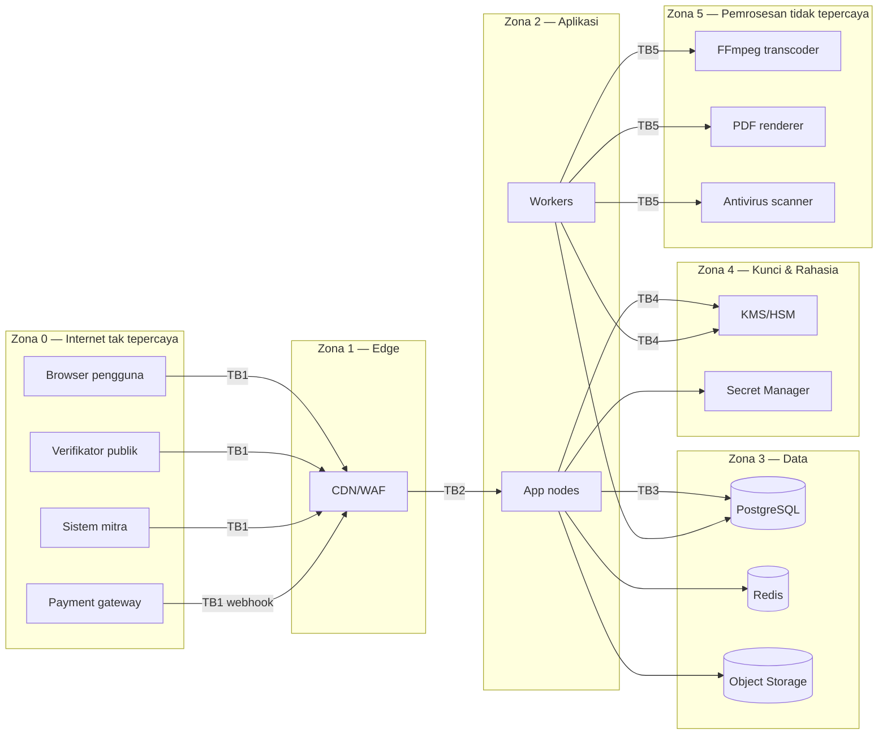

# 01 — Model Ancaman (Threat Model)

> Status: **Disetujui untuk development** · Versi 1.0 · Pemilik: Security Lead
>
> Metodologi: **STRIDE** per komponen + *abuse case* + penilaian risiko **Kemungkinan × Dampak**
> (1–5). Model ancaman ini **wajib diperbarui** setiap kali ada fitur yang menambah permukaan
> serangan baru (endpoint publik, integrasi, jenis berkas, peran baru) — bagian dari Definition of
> Done.

## 1. Aset yang Dilindungi

| ID | Aset | Kelas data | Properti keamanan utama |
|---|---|---|---|
| A1 | Kredensial & faktor autentikasi (hash kata sandi, secret TOTP, kode pemulihan, sesi) | K4 | Kerahasiaan, integritas |
| A2 | Data pribadi peserta (identitas, kontak, afiliasi, nomor induk) | K3 | Kerahasiaan (UU PDP) |
| A3 | Bank soal & kunci jawaban | K4 | Kerahasiaan |
| A4 | Jawaban, nilai, status kelulusan | K3 | Integritas |
| A5 | Sertifikat (nomor, PDF, status, kunci penandatangan) | K3/K4 | Integritas, keaslian, ketersediaan verifikasi |
| A6 | Transaksi & kupon | K3 | Integritas, non-repudiation |
| A7 | Materi pembelajaran berbayar (video/PDF) | K2 | Kerahasiaan (hak cipta) |
| A8 | Berkas tugas peserta | K3 | Kerahasiaan, integritas |
| A9 | Jejak audit | K3 | Integritas, ketersediaan |
| A10 | Kredensial integrasi (Midtrans server key, SMTP, WA, API key mitra, KMS) | K4 | Kerahasiaan |
| A11 | Ketersediaan layanan saat ujian & verifikasi | — | Ketersediaan |
| A12 | Reputasi & merek (beranda, email yang dikirim atas nama STU) | — | Integritas |

## 2. Aktor Ancaman

| ID | Aktor | Motivasi | Kemampuan |
|---|---|---|---|
| T1 | Peserta curang | Lulus tanpa kompetensi, dapat sertifikat | Rendah–sedang: DevTools, manipulasi request, berbagi akun, joki |
| T2 | Pemalsu sertifikat | Menjual/menggunakan sertifikat palsu | Sedang: edit PDF, situs tiruan |
| T3 | Penyerang eksternal oportunistik | Data pribadi untuk dijual, ransomware, kripto-mining | Sedang–tinggi: bot, credential stuffing, eksploit CVE |
| T4 | Pesaing / pengikis data | Mengambil katalog, materi, daftar peserta | Sedang: scraping, enumerasi |
| T5 | Insider jahat (admin, trainer, developer, vendor) | Uang, dendam, "titip" kelulusan | Tinggi: akses sah |
| T6 | Insider lalai | — | Salah konfigurasi, kebocoran tak sengaja |
| T7 | Penipu pembayaran | Akses program berbayar tanpa bayar, kupon | Sedang: manipulasi request, replay webhook |
| T8 | Organisasi mitra A yang ingin tahu data organisasi B | Intelijen bisnis | Rendah–sedang: akses sah ke tenant sendiri |
| T9 | Penyerang rantai pasok | Menanam backdoor lewat dependensi/CI | Tinggi |
| T10 | Pelaku DDoS / hacktivist | Gangguan saat ujian/pengumuman | Sedang–tinggi |
| T11 | Phisher | Mencuri kredensial admin via email/halaman palsu | Sedang |

## 3. Batas Kepercayaan (Trust Boundaries)

| Batas | Keterangan | Kontrol utama |
|---|---|---|
| TB1 | Internet → edge | TLS, WAF, rate limit, bot management, DDoS |
| TB2 | Edge → aplikasi | Origin hanya menerima dari CDN (allowlist + authenticated origin pull); validasi seluruh input |
| TB3 | Aplikasi → data | Peran DB least-privilege, RLS, jaringan privat, TLS internal |
| TB4 | Aplikasi → kunci | IAM per workload, kunci tidak pernah diekspor, audit KMS |
| TB5 | Worker → pemroses berkas tak tepercaya | Sandbox kontainer (tanpa jaringan, read-only, limit CPU/mem/waktu, non-root, seccomp) |

## 4. Analisis STRIDE per Komponen

Skor risiko = Kemungkinan (K) × Dampak (D), 1–25. **≥ 15 Kritis, 10–14 Tinggi, 5–9 Sedang, ≤ 4 Rendah** (risiko inheren, sebelum mitigasi).

### 4.1 Autentikasi & Sesi

| ID | STRIDE | Ancaman | K | D | Skor | Mitigasi (ID kebutuhan) |
|---|---|---|---|---|---|---|
| TM-AUTH-01 | S | Credential stuffing terhadap peserta & admin | 5 | 4 | 20 | Rate limit berlapis, deteksi kata sandi bocor, MFA wajib admin, CAPTCHA adaptif (SEC-AUTH-03..08) |
| TM-AUTH-02 | S | Phishing kredensial admin + bypass MFA TOTP (real-time relay) | 3 | 5 | 15 | WebAuthn untuk Super Admin, notifikasi login baru, IP allowlist opsional, sesi admin pendek (SEC-AUTH-10..12) |
| TM-AUTH-03 | S | Pembajakan sesi via XSS / pencurian cookie | 3 | 5 | 15 | Cookie `HttpOnly`/`Secure`/`__Host-`, CSP ketat, rotasi ID sesi (SEC-AUTH-15..19) |
| TM-AUTH-04 | I | Enumerasi akun via login/registrasi/lupa kata sandi | 4 | 2 | 8 | Respons & waktu seragam (SEC-AUTH-06) |
| TM-AUTH-05 | E | Takeover via alur reset kata sandi (token dapat ditebak, host header injection pada tautan) | 3 | 5 | 15 | Token 256-bit, hash, sekali pakai, 60 menit; URL dari konfigurasi `APP_URL`, bukan header Host (SEC-AUTH-21..24) |
| TM-AUTH-06 | E | Rekayasa sosial ke dukungan untuk reset MFA | 3 | 5 | 15 | Prosedur verifikasi identitas, dua orang, notifikasi (SEC-AUTH-26) |
| TM-AUTH-07 | S | Registrasi mengaku anggota organisasi mitra (akses gratis/ data organisasi) | 4 | 3 | 12 | Verifikasi domain email / persetujuan admin organisasi (FR-AUTH-003) |
| TM-AUTH-08 | D | Bom OTP/email/WA (biaya & spam) | 4 | 2 | 8 | Rate limit per tujuan & IP, CAPTCHA (SEC-AUTH-09) |

### 4.2 Otorisasi & Multi-Tenant

| ID | STRIDE | Ancaman | K | D | Skor | Mitigasi |
|---|---|---|---|---|---|---|
| TM-AZ-01 | I | IDOR/BOLA: mengganti ID enrollment/submission/sertifikat untuk melihat milik orang lain | 5 | 4 | 20 | Policy per objek, scope tenant, RLS, UUIDv7, uji otomatis (SEC-AUTHZ-01..08) |
| TM-AZ-02 | E | Eskalasi hak via *mass assignment* (`role`, `status`, `organization_id`) | 4 | 5 | 20 | `validated()` + `$fillable` eksplisit, arch test (SEC-INPUT-10) |
| TM-AZ-03 | E | Manipulasi properti Livewire (mis. `enrollmentId`) | 4 | 4 | 16 | `#[Locked]`, re-authorize di tiap aksi (SEC-AUTHZ-09) |
| TM-AZ-04 | I | Kebocoran lintas tenant pada laporan/ekspor/pencarian/cache | 3 | 5 | 15 | Repositori laporan ber-scope, kunci cache ber-tenant, RLS (SEC-AUTHZ-10..13) |
| TM-AZ-05 | E | Trainer menyetujui sertifikat kelasnya sendiri / admin "menitip" kelulusan | 3 | 5 | 15 | SoD, maker–checker, audit, laporan anomali (SEC-AUTHZ-14..17) |
| TM-AZ-06 | E | Akses fungsi admin dengan menebak URL (forced browsing) | 4 | 4 | 16 | Middleware peran + policy di setiap rute, deny by default (SEC-AUTHZ-01) |

### 4.3 Asesmen

| ID | STRIDE | Ancaman | K | D | Skor | Mitigasi |
|---|---|---|---|---|---|---|
| TM-EX-01 | I | Kunci jawaban terekspos ke klien | 5 | 5 | 25 | Tidak ada kunci di payload; penilaian server (SEC-EXAM-01..03) |
| TM-EX-02 | T | Mengirim skor/status lulus sendiri | 5 | 5 | 25 | Skor dihitung server; state machine (SEC-EXAM-04) |
| TM-EX-03 | T | Mengakali waktu ujian (ubah jam klien, submit terlambat, attempt paralel) | 4 | 4 | 16 | `deadline_at` server, indeks unik attempt aktif (SEC-EXAM-05..08) |
| TM-EX-04 | I | Kebocoran bank soal oleh trainer/insider atau scraping soal antar attempt | 4 | 4 | 16 | Bank soal besar & rotasi, izin `view_answer_key`, watermark, audit akses (SEC-EXAM-10..13) |
| TM-EX-05 | S | Joki/berbagi akun saat ujian | 3 | 4 | 12 | Satu sesi aktif saat ujian, indikator perangkat/IP, (opsional) verifikasi identitas; indikator ditinjau manusia (SEC-EXAM-14..16) |
| TM-EX-06 | T | Memalsukan progres (menandai video selesai tanpa menonton) | 5 | 2 | 10 | Validasi kewajaran waktu di server; progres bukan satu-satunya syarat (SEC-EXAM-17) |

### 4.4 Sertifikat

| ID | STRIDE | Ancaman | K | D | Skor | Mitigasi |
|---|---|---|---|---|---|---|
| TM-CE-01 | S/T | PDF sertifikat palsu/diedit | 5 | 5 | 25 | Tanda tangan PAdES, hash di DB, verifikasi publik (SEC-CERT-01..06) |
| TM-CE-02 | I | Harvesting nama peserta via enumerasi nomor | 4 | 3 | 12 | Kode verifikasi acak, nama tersamar via nomor, rate limit (SEC-CERT-10..13) |
| TM-CE-03 | S | Situs verifikasi tiruan (phishing domain) | 3 | 4 | 12 | Domain tunggal tercetak di sertifikat, edukasi verifikator, pemantauan domain mirip, tanda tangan PDF tetap dapat dicek (SEC-CERT-14) |
| TM-CE-04 | E | Kompromi kunci penandatangan | 2 | 5 | 10 | Kunci di KMS/HSM non-exportable, IAM sempit, rotasi, rencana pencabutan (SEC-CERT-07..09) |
| TM-CE-05 | T | Penerbitan liar oleh admin yang dibobol | 3 | 5 | 15 | MFA, re-auth, SoD, alert volume penerbitan abnormal (SEC-CERT-15) |
| TM-CE-06 | T | Injeksi konten ke template/renderer (SSRF/LFI via HTML→PDF) | 3 | 4 | 12 | Renderer tanpa jaringan, data di-escape, template hanya oleh admin berizin (SEC-CERT-16) |

### 4.5 Pembayaran

| ID | STRIDE | Ancaman | K | D | Skor | Mitigasi |
|---|---|---|---|---|---|---|
| TM-PAY-01 | T | Manipulasi harga/jumlah di request checkout | 5 | 4 | 20 | Harga dari DB; `gross_amount` dicocokkan (SEC-PAY-01..03) |
| TM-PAY-02 | S | Webhook palsu/replay menandai lunas | 4 | 5 | 20 | Verifikasi tanda tangan + konfirmasi status API + idempotensi (SEC-PAY-04..08) |
| TM-PAY-03 | T | *Race condition* kupon (kuota terlampaui, dipakai berkali-kali) | 4 | 3 | 12 | Transaksi DB + `FOR UPDATE` + constraint (SEC-PAY-09..11) |
| TM-PAY-04 | R | Sengketa: pengguna mengklaim tidak pernah membayar/menerima | 3 | 3 | 9 | `payment_events` append-only, rekonsiliasi (SEC-PAY-12) |
| TM-PAY-05 | E | Insider menandai lunas/refund fiktif | 2 | 4 | 8 | Maker–checker, SoD, audit, rekonsiliasi harian (SEC-PAY-13..15) |

### 4.6 Konten, Berkas & Media

| ID | STRIDE | Ancaman | K | D | Skor | Mitigasi |
|---|---|---|---|---|---|---|
| TM-FI-01 | T/E | Unggahan berbahaya (web shell, polyglot, malware) | 4 | 5 | 20 | Tidak disimpan di web root, validasi magic bytes, AV scan, nama acak, Content-Disposition (SEC-FILE-01..10) |
| TM-FI-02 | E | Eksploit parser media (FFmpeg/ImageMagick/PDF) | 3 | 5 | 15 | Sandbox tanpa jaringan, image terbaru, batas sumber daya (SEC-FILE-11..13) |
| TM-FI-03 | I | Akses langsung ke object storage (URL permanen/bucket publik) | 4 | 4 | 16 | Bucket privat, URL bertanda tangan pendek, *block public access* (SEC-FILE-14..17) |
| TM-FI-04 | I | Pembajakan materi berbayar | 4 | 2 | 8 | HLS terenkripsi + token pendek + watermark (SEC-FILE-18..20) |
| TM-FI-05 | T | Stored XSS via diskusi/CMS/profil/nama berkas | 5 | 4 | 20 | Escape output, sanitizer, CSP (SEC-INPUT-01..06) |

### 4.7 API, Integrasi & Infrastruktur

| ID | STRIDE | Ancaman | K | D | Skor | Mitigasi |
|---|---|---|---|---|---|---|
| TM-API-01 | I | Kebocoran API key mitra (dikomit ke repo mitra, log) | 3 | 4 | 12 | Kunci ber-scope, IP allowlist, kedaluwarsa, hash, deteksi prefiks via secret scanning (SEC-API-01..07) |
| TM-API-02 | E | SSRF via URL webhook/tautan live class/tautan eksternal lesson | 3 | 5 | 15 | Validasi URL + resolve IP + egress allowlist (SEC-INPUT-15..17) |
| TM-INF-01 | D | DDoS saat ujian serentak | 3 | 4 | 12 | CDN/WAF, autoscaling, perpanjangan deadline (NFR-AVL-08) |
| TM-INF-02 | I/T | Salah konfigurasi (debug aktif, `.env` terekspos, bucket publik) | 3 | 5 | 15 | Pemeriksaan boot, IaC + policy-as-code, uji header (SEC-INFRA-*) |
| TM-INF-03 | E | Kompromi pipeline CI/CD / dependensi berbahaya | 2 | 5 | 10 | Pin SHA action, OIDC, SCA, review dependensi, signing image (SEC-SDLC-*) |
| TM-INF-04 | D | Ransomware / penghapusan data oleh akun cloud yang dibobol | 2 | 5 | 10 | Backup immutable di akun terpisah, MFA cloud, least privilege (SEC-INFRA-*) |
| TM-LOG-01 | R | Penghapusan/perubahan jejak audit untuk menutupi aksi | 2 | 5 | 10 | Append-only + rantai hash + salinan eksternal (SEC-LOG-10..13) |
| TM-LOG-02 | I | PII/rahasia bocor lewat log/error tracking | 4 | 3 | 12 | Redaksi otomatis, allowlist field, scrubbing Sentry (SEC-LOG-05..07) |

## 5. Abuse Case Utama (Wajib Diuji)

| ID | Sebagai … | Saya ingin … | Hasil yang diharapkan |
|---|---|---|---|
| AB-01 | Peserta | membaca kunci jawaban dari response network | Payload soal tidak memuat `is_correct`/jawaban |
| AB-02 | Peserta | mengirim `score=100` atau `status=passed` | Field diabaikan (tidak ada di FormRequest), tercatat sebagai security event |
| AB-03 | Peserta | membuka `/peserta/sertifikat/{id}` milik orang lain | 404 |
| AB-04 | Peserta | mengirim jawaban setelah waktu habis | Ditolak (409), attempt auto-submitted |
| AB-05 | Peserta | membuka dua tab ujian untuk dua attempt | Attempt kedua tidak dibuat; tab kedua melihat attempt yang sama |
| AB-06 | Admin Org A | mengekspor laporan dengan `organization_id` milik Org B | 404/tidak ada baris; RLS menolak |
| AB-07 | Trainer | menyetujui sertifikat peserta kelasnya | Tombol tidak ada; request langsung → 403; audit |
| AB-08 | Siapa pun | mem-POST webhook Midtrans palsu `settlement` | 401 (tanda tangan) atau tidak berubah (konfirmasi status gagal) |
| AB-09 | Peserta | memakai kupon kuota 1 secara paralel 20 request | Tepat 1 berhasil |
| AB-10 | Penyerang | mengiterasi nomor sertifikat 00001–99999 | Rate limit + nama tersamar; alert |
| AB-11 | Penyerang | mengunggah `tugas.php.zip` / `.svg` berisi script / EICAR | Ditolak atau dikarantina; tidak pernah dieksekusi/disajikan inline |
| AB-12 | Penyerang | menyimpan `<script>` di komentar diskusi & judul CMS | Dirender sebagai teks; CSP memblokir |
| AB-13 | Penyerang | set URL webhook ke `http://169.254.169.254/` | Ditolak saat simpan & kirim |
| AB-14 | Penyerang | meminta reset kata sandi dengan header `Host: evil.com` | Tautan tetap memakai domain resmi |
| AB-15 | Admin | mencabut sertifikat sendirian | Butuh persetujuan kedua |
| AB-16 | Insider | mengubah baris `audit_logs` langsung di DB | Ditolak trigger; bila lewat superuser → rantai hash putus → alert |
| AB-17 | Peserta | mengirim `role=admin` saat registrasi/profil | Diabaikan; security event |
| AB-18 | Penyerang | memuat halaman LMS di iframe situs lain (clickjacking) | Diblokir `frame-ancestors 'none'` |

## 6. Risiko Residual & Penerimaan

Setelah mitigasi, target risiko residual semua ancaman ≤ **Sedang**. Ancaman dengan residual
**Tinggi** yang diterima sementara:

| ID | Risiko residual | Alasan | Rencana |
|---|---|---|---|
| TM-EX-05 | Joki ujian tetap mungkin tanpa proctoring | Proctoring kamera di luar scope 1.0 (privasi) | Evaluasi proctoring + DPIA di rilis 2.0; untuk skema berisiko tinggi, ujian akhir dapat dilakukan tatap muka |
| TM-FI-04 | Materi video dapat direkam layar | Tidak ada DRM penuh | Watermark dinamis (FR-CNT-007) untuk pelacakan |

## 7. Pemeliharaan Model Ancaman

- Review penuh: setiap akhir fase dan sebelum go-live.
- Review inkremental: setiap PR berlabel `security-impact` wajib menyertakan perubahan pada dokumen ini atau pernyataan "tidak ada ancaman baru" beserta alasan.
- Hasil pentest dan insiden dimasukkan kembali sebagai ancaman/abuse case baru.
