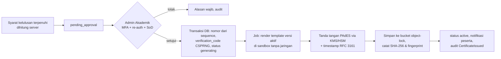

# 07 — Integritas, Keaslian & Verifikasi Sertifikat

> Status: **Disetujui untuk development** · Versi 1.0 · Pemilik: Security Lead + Admin Akademik
>
> Sertifikat adalah **produk utama** platform. Tujuan kontrol: (1) hanya peserta yang benar-benar
> lulus yang mendapat sertifikat, (2) sertifikat tidak dapat dipalsukan atau diubah tanpa
> terdeteksi, (3) siapa pun dapat memverifikasi dengan cepat, (4) verifikasi tidak membocorkan data
> pribadi berlebih.

## 1. Alur Penerbitan Aman

## 2. Kebutuhan

### 2.1 Pembuatan & Tanda Tangan

| ID | Kebutuhan |
|---|---|
| SEC-CERT-01 | PDF sertifikat **hanya** dibuat di server oleh job `GenerateCertificatePdf` berdasarkan data DB (nama snapshot, program, nomor, tanggal) — tidak ada endpoint yang menerima konten sertifikat dari klien. |
| SEC-CERT-02 | Setiap PDF ditandatangani digital format **PAdES** (baseline B-LT, disarankan B-LTA) dengan sertifikat penandatangan organisasi STU, termasuk **timestamp RFC 3161** dari TSA tepercaya, sehingga validitas tanda tangan dapat dicek di Adobe Acrobat/Reader & validator lain dan perubahan sekecil apa pun terdeteksi. PDF dikunci (*certification signature*, DocMDP level 1 — tidak ada perubahan diizinkan). |
| SEC-CERT-03 | Hash **SHA-256** PDF final, fingerprint sertifikat penandatangan, dan waktu tanda tangan disimpan di `certificates`. Unduhan berikutnya menyajikan berkas yang sama (tidak dibuat ulang), sehingga hash konsisten. |
| SEC-CERT-04 | Template sertifikat berversi & **immutable** setelah dipakai menerbitkan sertifikat (perubahan = versi baru). Perubahan/aktivasi template memerlukan izin `certificate_template.activate` + persetujuan kedua & tercatat di audit. Template menggunakan placeholder terbatas (SEC-INPUT-24) — data pengguna di-escape. |
| SEC-CERT-05 | Isi visual wajib: nama pemegang, nama program, kategori, penyelenggara (dengan pernyataan jelas bahwa ini **sertifikat pelatihan STU**, bukan sertifikat resmi vendor/BNSP kecuali ada izin), nomor sertifikat, tanggal terbit & berlaku, **QR** ke URL verifikasi berisi `verification_code`, URL verifikasi tercetak (teks) untuk verifikasi manual, dan nama penandatangan berwenang. Metadata PDF (`Title`, `Subject`, `Author`) diisi; metadata lain (path server, versi software) dihapus. |
| SEC-CERT-16 | Renderer HTML→PDF (Chromium headless/Gotenberg) berjalan di sandbox **tanpa akses jaringan**, tanpa akses sistem berkas selain direktori kerja sementara; semua aset (font, logo, latar) disediakan lokal; JavaScript di renderer dinonaktifkan; request ke `file://` & URL eksternal diblokir (mencegah SSRF/LFI via template). |
| SEC-CERT-20 | Job pembuatan **idempoten** per `certificate_id` (lock + cek status); retry ≤ 5 dengan backoff; kegagalan permanen → `generation_failed` + alert; tidak pernah menerbitkan dua PDF berbeda untuk satu sertifikat. |
| SEC-CERT-21 | PDF disimpan di bucket `stu-certificates` dengan **versioning + object lock (compliance mode)** selama masa retensi sertifikat, direplikasi ke lokasi kedua di Indonesia; akses baca hanya melalui URL bertanda tangan setelah policy. |

### 2.2 Kunci Penandatangan

| ID | Kebutuhan |
|---|---|
| SEC-CERT-07 | Kunci privat penandatangan dibuat dan disimpan di **KMS/Cloud HSM** (non-exportable, FIPS 140-2/3 Level 3 bila memakai HSM). Operasi tanda tangan dilakukan dengan memanggil KMS (hash dokumen dikirim, bukan kunci diambil). Hanya service account worker `certificates` yang punya izin `Sign`; semua pemakaian tercatat di log audit KMS dan dicocokkan harian dengan jumlah sertifikat terbit (selisih → alert kritis). |
| SEC-CERT-08 | Sertifikat penandatangan (X.509) diperoleh dari **Penyelenggara Sertifikasi Elektronik (PSrE) Indonesia** yang terdaftar/berinduk pada Kominfo/Komdigi, atau CA yang terpercaya di Adobe Approved Trust List (AATL) agar tanda tangan tampil "valid" otomatis di pembaca PDF. Keputusan akhir dicatat sebagai ADR (dependensi eksternal di roadmap). |
| SEC-CERT-09 | **Rencana kompromi kunci**: cabut sertifikat penandatangan di CA, buat kunci baru, tandai rentang waktu terdampak, verifikasi publik tetap mengandalkan status di DB (sumber kebenaran), tanda tangan ulang sertifikat aktif dengan kunci baru (batch terkontrol), komunikasi ke pemegang & verifikator. Runbook di [15](15-respons-insiden-dan-kontinuitas.md). |

### 2.3 Penomoran & Kode Verifikasi

| ID | Kebutuhan |
|---|---|
| SEC-CERT-19 | Nomor sertifikat dari tabel `certificate_sequences` dengan `UPDATE ... SET last_value = last_value + 1 RETURNING last_value` dalam **transaksi yang sama** dengan pembuatan baris sertifikat → atomik, tanpa duplikat, tanpa celah (rollback mengembalikan sequence). `UNIQUE(number)` sebagai jaring pengaman. |
| SEC-CERT-10 | `verification_code`: 60 bit dari CSPRNG dikodekan Crockford Base32 (12 karakter, tanpa huruf ambigu), `UNIQUE`; ditampilkan berkelompok (`7KQ2-M9XD-4TRA`); pencocokan tidak peka huruf & tanda hubung. Kode **tidak** diturunkan dari nomor/ID. |

### 2.4 Verifikasi Publik

| ID | Kebutuhan |
|---|---|
| SEC-CERT-11 | **Minimisasi data**: lookup via `verification_code` (QR) menampilkan nama lengkap, program, penyelenggara, tanggal terbit/berlaku, status. Lookup via **nomor sertifikat** saja menampilkan nama **tersamar** (`R*** P*******`) kecuali pengguna memasukkan nama lengkap yang cocok. Tidak pernah menampilkan email, HP, nomor induk, skor, atau foto. Organisasi pemegang hanya ditampilkan bila organisasi mengizinkan (default: institusi ya, korporat tidak). |
| SEC-CERT-12 | **Anti-enumerasi**: rate limit (10/menit, 100/hari per IP tanpa API key), CAPTCHA adaptif setelah 5 pencarian gagal, respons & waktu seragam untuk tidak ditemukan, alert bila pola iterasi nomor berurutan terdeteksi. Hasil `not_found` tidak mengungkap apakah nomor pernah ada. |
| SEC-CERT-13 | Halaman verifikasi: `noindex, nofollow` (mencegah mesin pencari mengindeks nama pemegang), `Cache-Control: private, max-age=60`, `Referrer-Policy: no-referrer`; tidak ada "contoh nomor" nyata di halaman (PROTO-12). Log verifikasi menyimpan IP sebagai hash ber-salt harian. |
| SEC-CERT-14 | **Anti-phishing**: satu domain verifikasi resmi (dicetak di sertifikat & dipublikasikan), HSTS preload, pemantauan domain mirip (*typosquatting*) & sertifikat TLS yang diterbitkan untuk domain mirip (Certificate Transparency monitoring). Halaman verifikasi menampilkan panduan "cara memastikan Anda berada di situs resmi". |
| SEC-CERT-06 | **Verifikasi dokumen** (FR-CERT-008): unggahan PDF divalidasi tanda tangan (rantai ke CA penandatangan, integritas, timestamp) & dicocokkan SHA-256 dengan DB; hasil: "Asli & tidak diubah" / "Tanda tangan tidak valid atau dokumen telah diubah" / "Tidak dikenal". Berkas unggahan dihapus ≤ 1 jam. |

### 2.5 Kendali Penerbitan & Pencabutan

| ID | Kebutuhan |
|---|---|
| SEC-CERT-15 | Approval hanya oleh izin `certificate.approve` + MFA + re-auth (≤ 15 menit) + SoD ([03](03-otorisasi-dan-isolasi-tenant.md) SEC-AUTHZ-14). Bulk approve maks. 100/aksi. **Alert** bila: > 50 approval/jam per admin, approval di luar jam kerja (22.00–06.00 WIB), approval untuk enrollment dengan indikator integritas ujian, atau jumlah tanda tangan KMS ≠ jumlah sertifikat terbit. |
| SEC-CERT-17 | **Pencabutan** memerlukan alasan terstruktur + maker–checker; efektif seketika di verifikasi (tanpa cache > 60 detik); PDF tetap tersimpan (bukti) tetapi unduhan oleh pemegang menampilkan status dicabut; pemegang dinotifikasi dengan alasan & jalur keberatan. Pencabutan tidak dapat dibatalkan — penerbitan kembali membuat sertifikat baru. |
| SEC-CERT-18 | **Penerbitan ulang** (koreksi data) membuat sertifikat baru (nomor baru atau sufiks revisi sesuai kebijakan), sertifikat lama `superseded` dengan tautan ke pengganti; perubahan nama pemegang memerlukan bukti & persetujuan Admin Akademik. |
| SEC-CERT-22 | Snapshot data yang menjadi dasar kelulusan (skor attempt, progres, presensi, status tugas, versi soal) disimpan bersama keputusan approval untuk audit & sengketa. |

## 3. Verifikasi oleh Pihak Ketiga (Panduan Publik)

Halaman verifikasi dan dokumen API ([`../06-spesifikasi-api.md`](../06-spesifikasi-api.md) §4.1)
menjelaskan tiga cara verifikasi, dari yang terkuat:

1. **Pindai QR** atau buka URL verifikasi tercetak → pastikan domain resmi → cocokkan nama & program.
2. **Periksa tanda tangan digital** di pembaca PDF (panel tanda tangan: valid, ditandatangani STU, dokumen tidak diubah) atau unggah di halaman verifikasi dokumen.
3. **Cari nomor sertifikat** + masukkan nama lengkap pemegang.

Salinan cetak/pindaian/gambar tidak dapat diverifikasi tanda tangannya → verifikator diarahkan
ke metode 1.

## 4. Indikator Keberhasilan Kontrol

- 0 sertifikat terbit tanpa jejak approval yang sah.
- 100% sertifikat aktif memiliki `pdf_sha256` & tanda tangan valid (verifikasi otomatis mingguan atas sampel 5% + seluruh yang terbit minggu itu).
- Rekonsiliasi harian log KMS vs sertifikat terbit: selisih 0.
