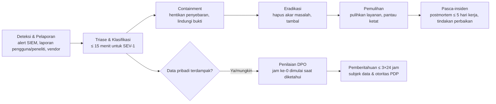

# 15 — Respons Insiden, Notifikasi Kegagalan PDP & Kontinuitas Bisnis

> Status: **Disetujui untuk development** · Versi 1.0 · Pemilik: Security Lead + DPO + DevOps Lead
>
> Acuan: NIST SP 800-61 Rev. 3, ISO/IEC 27035, UU PDP (kewajiban pemberitahuan 3×24 jam).
> Rencana ini **wajib siap dan diuji (tabletop) sebelum go-live**.

## 1. Definisi & Klasifikasi

**Insiden keamanan**: kejadian yang mengancam kerahasiaan, integritas, atau ketersediaan sistem
atau data STU LMS — termasuk dugaan yang belum terkonfirmasi.

| Severity | Kriteria (salah satu) | Contoh | Waktu respons awal | Eskalasi |
|---|---|---|---|---|
| **SEV-1 Kritis** | Kebocoran data pribadi terkonfirmasi/sangat mungkin; kompromi akun admin/infra; sertifikat palsu diterbitkan sistem; kunci penandatangan/`APP_KEY` bocor; layanan inti mati saat ujian | Dump DB beredar, RLS dilanggar, ransomware | ≤ 15 menit, 24/7 | Security Lead, DPO, CTO/Manajemen, Legal |
| **SEV-2 Tinggi** | Kerentanan kritis tereksploitasi terbatas; kompromi akun non-admin massal; fraud pembayaran; kebocoran soal ujian akhir | Credential stuffing sukses ke 50 akun | ≤ 1 jam | Security Lead, Tech Lead, DPO (bila data pribadi) |
| **SEV-3 Sedang** | Upaya serangan terdeteksi tanpa dampak; malware diunggah & terkarantina; satu akun peserta diambil alih | Malware di tugas | ≤ 1 hari kerja | Security Champion |
| **SEV-4 Rendah** | Anomali/pelanggaran kebijakan kecil | Scan port, pelanggaran CSP terisolasi | ≤ 3 hari kerja | Tiket |

## 2. Tim & Peran

| Peran | Tanggung jawab | Primer / cadangan |
|---|---|---|
| **Incident Commander (IC)** | Memimpin respons, keputusan, timeline | Security Lead / Tech Lead |
| **Tech Lead Insiden** | Investigasi teknis, containment, eradikasi | Engineer on-call / DevOps Lead |
| **DPO** | Penilaian dampak data pribadi, keputusan & isi pemberitahuan PDP | DPO / Legal |
| **Komunikasi** | Pesan internal, ke pengguna, organisasi mitra, publik/media | Product Owner / Humas |
| **Legal** | Kewajiban hukum, pelaporan ke aparat/otoritas, kontrak mitra | Legal |
| **Pencatat** | Log keputusan & tindakan bertimestamp | Anggota tim yang ditunjuk |

Daftar kontak (telepon/Signal/WhatsApp) & jadwal on-call disimpan di runbook internal (bukan
repositori), ditinjau bulanan. Kanal insiden terpisah dibuat per insiden (`#inc-YYYYMMDD-slug`).

## 3. Siklus Respons

### 3.1 Prinsip

1. **Keselamatan data > ketersediaan > kenyamanan** — bila ragu, lakukan containment.
2. **Pertahankan bukti** sebelum mengubah sistem: snapshot disk/DB, ekspor log, salinan audit (hash & simpan ke lokasi WORM). Catat rantai penguasaan bukti (*chain of custody*).
3. **Jangan** menghubungi atau membalas penyerang; **jangan** membayar tebusan tanpa keputusan manajemen & legal.
4. Komunikasi keluar hanya melalui peran Komunikasi setelah disetujui IC + DPO + Legal.
5. Semua tindakan dicatat dengan waktu (WIB & UTC).

## 4. Pemberitahuan Kegagalan Pelindungan Data Pribadi

| Langkah | Waktu (sejak diketahui) | Pelaksana |
|---|---|---|
| Penilaian awal: data apa, berapa subjek, organisasi mana, apakah terenkripsi, risiko bagi subjek | ≤ 12 jam | DPO + IC |
| Keputusan pemberitahuan (default: **beri tahu** bila ragu) | ≤ 24 jam | DPO + Legal + Manajemen |
| Pemberitahuan tertulis ke **subjek data** & **lembaga/otoritas PDP** yang berwenang | **≤ 3×24 jam** | DPO |
| Pemberitahuan ke **organisasi mitra** terdampak (sesuai DPA) | ≤ 3×24 jam (atau lebih cepat sesuai DPA) | DPO + Account manager |
| Pemberitahuan ke **masyarakat** bila berdampak serius pada kepentingan publik | Sesuai arahan Legal | Komunikasi |
| Laporan susulan (perkembangan, hasil investigasi) | Berkala sampai selesai | DPO |

Isi minimum pemberitahuan (UU PDP): **data pribadi yang terungkap**, **kapan dan bagaimana data
terungkap**, dan **upaya penanganan & pemulihan** — ditambah: langkah yang disarankan bagi subjek
(ganti kata sandi, waspada phishing), kontak DPO.

**Template pemberitahuan ke pengguna (ringkas):**

> Subjek: Pemberitahuan Insiden Keamanan Data — STU LMS
>
> Yth. {nama}, pada {tanggal/jam} kami mengetahui adanya {deskripsi singkat insiden}. Data yang
> terdampak: {daftar kategori data}. Data berikut **tidak** terdampak: {mis. kata sandi (tersimpan
> ter-hash), data pembayaran kartu}. Langkah yang telah kami ambil: {containment & perbaikan}.
> Kami menyarankan Anda: {langkah}. Kami tidak akan pernah meminta kata sandi/OTP Anda melalui
> email/telepon. Pertanyaan: {kontak DPO}. Nomor referensi: {INC-...}.

Semua pemberitahuan diarsipkan sebagai bukti kepatuhan.

## 5. Playbook Spesifik

| ID | Skenario | Containment segera | Langkah lanjutan |
|---|---|---|---|
| PB-01 | **Akun admin diambil alih** | Nonaktifkan akun, cabut semua sesi/token, blokir IP terkait di WAF, bekukan approval & API key yang dibuat akun itu | Tinjau audit log aktor 30 hari (sertifikat terbit, peran diubah, ekspor), batalkan tindakan tidak sah (cabut sertifikat via maker–checker oleh admin lain), reset MFA dengan verifikasi, cari akar (phishing?) |
| PB-02 | **Kebocoran lintas tenant / IDOR** (termasuk alert RLS) | Nonaktifkan fitur/endpoint terdampak (feature flag), deploy hotfix | Tentukan cakupan dari log (siapa mengakses apa), penilaian PDP, pemberitahuan organisasi & subjek, uji regresi |
| PB-03 | **Dump/ekfiltrasi DB** | Isolasi komponen terkompromi, rotasi semua kredensial DB & `APP_KEY` & pepper, cabut akses terkait | Forensik vektor masuk, penilaian data (kolom K4 terenkripsi?), pemberitahuan PDP, paksa reset kata sandi bila hash terpapar (meski Argon2id), pantau dark web |
| PB-04 | **Kunci penandatangan sertifikat/`APP_KEY` bocor** | Nonaktifkan kunci di KMS / rotasi `APP_KEY` (sesi & URL bertanda tangan jadi tidak valid), minta pencabutan sertifikat penandatangan ke CA | Tentukan rentang waktu kompromi, identifikasi sertifikat diterbitkan di luar alur (bandingkan log KMS vs DB), tanda tangan ulang sertifikat sah dengan kunci baru, umumkan panduan verifikasi |
| PB-05 | **Sertifikat palsu beredar** (dilaporkan verifikator) | Pastikan status di DB; bila bukan dari sistem → catat; bila dari sistem → PB-01/PB-04 | Tanggapi pelapor, bantu proses hukum, publikasikan cara verifikasi, pantau domain tiruan (takedown) |
| PB-06 | **Soal ujian akhir bocor** | Tutup/ tunda jendela ujian terdampak, nonaktifkan soal bocor | Ganti soal, identifikasi sumber (audit akses bank soal, watermark), tinjau attempt terdampak (void bila perlu, dengan keputusan akademik), komunikasi ke peserta |
| PB-07 | **Fraud pembayaran / webhook palsu** | Nonaktifkan checkout (feature flag) bila masif, tahan enrollment dari transaksi mencurigakan | Rekonsiliasi dengan gateway, rotasi server key bila perlu, perbaiki validasi, koordinasi gateway |
| PB-08 | **Ransomware / penghapusan infra** | Isolasi jaringan & akun cloud, cabut kredensial, jangan hapus bukti | Restore dari backup immutable ke akun bersih, verifikasi integritas (rantai audit, hash sertifikat), laporan ke aparat |
| PB-09 | **DDoS saat ujian serentak** | Aktifkan mode "Under Attack"/challenge di CDN, rate limit ketat rute non-ujian, scale out | Perpanjang deadline attempt terdampak (bulk, tercatat), komunikasi ke peserta & trainer |
| PB-10 | **Rahasia terkomit ke repositori** | Rotasi rahasia **segera** (≤ 4 jam) — menghapus commit tidak cukup | Periksa log pemakaian rahasia sejak terkomit, hapus dari riwayat bila perlu, tambah aturan gitleaks |
| PB-11 | **Malware di unggahan** | Karantina otomatis, blokir unduhan | Tinjau akun pengunggah, cek apakah ada pengguna yang sudah mengunduh (log), perbarui definisi |
| PB-12 | **Insiden di vendor** (email, WA, gateway, cloud) | Ikuti notifikasi vendor, rotasi kredensial integrasi | Nilai dampak ke data STU, pemberitahuan PDP bila perlu, tinjau vendor |
| PB-13 | **Laporan kerentanan dari peneliti** | Konfirmasi penerimaan ≤ 2 hari kerja (SECURITY.md) | Validasi, klasifikasi, perbaiki sesuai SLA, koordinasi pengungkapan, ucapan terima kasih |

Setiap playbook memiliki runbook teknis langkah-demi-langkah di dokumentasi operasional internal
dan diuji minimal sekali setahun (tabletop).

## 6. Pasca-Insiden

- **Postmortem tanpa menyalahkan** (*blameless*) ≤ 5 hari kerja untuk SEV-1/SEV-2: kronologi, akar masalah (5 Whys), apa yang berjalan baik/buruk, tindakan perbaikan (pemilik & tenggat), pembaruan model ancaman & playbook.
- Tindakan perbaikan dilacak sebagai tiket prioritas sampai selesai.
- Ringkasan ke manajemen; metrik: MTTD, MTTR, jumlah insiden per severity.

## 7. Kontinuitas Bisnis & Pemulihan Bencana (BCP/DR)

### 7.1 Target

Target per layanan untuk gangguan **di dalam region** (skenario umum). Target per skenario bencana (kompromi akun cloud, kehilangan region) mengikuti [`../11-devops-dan-deployment.md`](../11-devops-dan-deployment.md) §10.1.

| Layanan | Kekritisan | RTO | RPO |
|---|---|---|---|
| Verifikasi sertifikat publik | Tinggi | 4 jam (mode baca dari replika/cadangan statis) | 15 menit |
| Login, belajar, ujian | Tinggi | 4 jam | 15 menit |
| Penerbitan sertifikat | Sedang | 24 jam (antrean tertunda aman) | 15 menit |
| Pembayaran | Sedang | 8 jam (gateway menyimpan status; rekonsiliasi setelah pulih) | 15 menit + rekonsiliasi |
| Laporan & ekspor | Rendah | 72 jam | 24 jam |

### 7.2 Skenario

| Skenario | Strategi |
|---|---|
| Kegagalan node aplikasi/worker | Auto-healing, ≥ 2 node di zona berbeda (RTO menit) |
| Kegagalan DB primer | Failover HA terkelola (multi-AZ) — RTO ≤ 15 menit |
| Korupsi data / penghapusan tidak sengaja | PITR ke titik sebelum kejadian, rekonsiliasi selisih (pembayaran via gateway) |
| Kehilangan region cloud | Restore dari backup lintas lokasi ke lokasi/penyedia alternatif di Indonesia menggunakan IaC — RPO ≤ 24 jam, RTO ≤ 72 jam (batas MVP; diuji tahunan) |
| Kompromi akun cloud | Backup immutable di akun terpisah + IaC → bangun ulang di akun bersih — RPO/RTO ≤ 24 jam |
| Vendor kritis tidak tersedia (email/WA/gateway) | Antrean & retry; penyedia email cadangan; tampilkan status pembayaran "tertunda" |
| Personel kunci tidak tersedia | Minimal 2 orang terlatih untuk tiap peran kritis (deploy, restore, KMS, DPO cadangan) |

### 7.3 Latihan

| Latihan | Frekuensi |
|---|---|
| Uji restore DB & object storage | Bulanan |
| Tabletop insiden (bergilir: PB-01, PB-03, PB-04, PB-09) | Triwulanan |
| DR drill penuh (pemulihan di lingkungan terpisah dari backup) | Tahunan |
| Uji rotasi darurat rahasia | Semesteran |
| Simulasi pemberitahuan PDP (dokumen & alur persetujuan) | Tahunan |

Hasil latihan dicatat (waktu aktual vs target, kendala) dan menjadi tindakan perbaikan.
